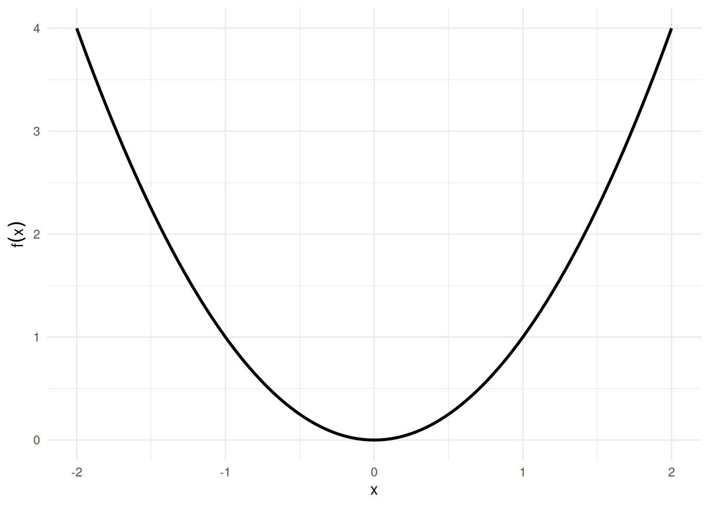
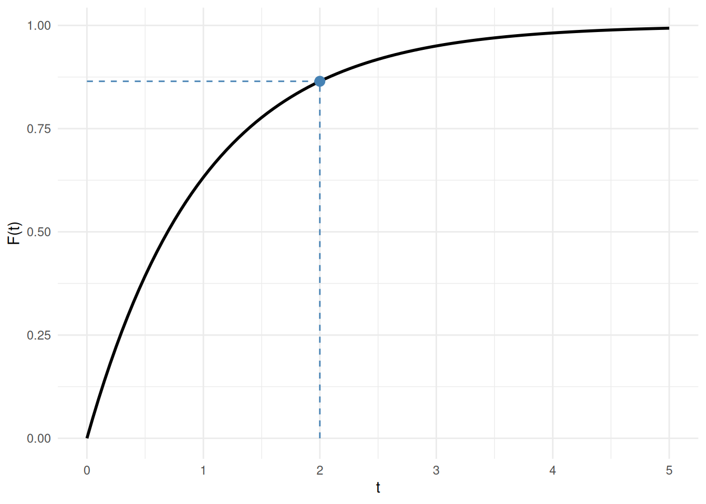

# Integrals and the Fundamental Theorem of Calculus

Code

Published

Last modified: 2026-10-10 11:17:20 (PDT)

## 1 Integration

Integration is the inverse operation of differentiation: it recovers a function from its derivative and accumulates quantities such as areas, totals, and probabilities. We begin with antiderivatives, then state basic integration rules, and conclude with the Fundamental Theorem of Calculus and a worked example from probability.

> **TIP:**
>
> Jon Krohn’s “Calculus for Machine Learning” YouTube playlist introduces integral calculus:
>
> - [Intro to Integral Calculus](https://www.youtube.com/watch?v=PNdKPsiaPhU&list=PLRDl2inPrWQVu2OvnTvtkRpJ-wz-URMJx)
> - [What Integral Calculus Is](https://www.youtube.com/watch?v=O7TuAb_jHTs&list=PLRDl2inPrWQVu2OvnTvtkRpJ-wz-URMJx)

### 1.1 Antiderivatives

> **NOTE:**
>
> **Definition 1 (Antiderivative)** A function \\F\\ is an **antiderivative** of \\f\\ on an interval \\I\\ if:
>
> \\\frac{\partial}{\partial x} F(x) = f(x), \quad \forall x \in I\\
>
> Finding an antiderivative of \\f\\ is called **antidifferentiation**, or **antidifferentiating** \\f\\.
>
> ([Larson and Edwards 2018, sec. 4.1](#ref-larsonCalc11e), pp. 248–249)

> **NOTE:**
>
> **Definition 2 (Indefinite integral)** The **indefinite integral** of \\f\\ is the family of all antiderivatives ([Definition 1](#def-antiderivative)) of \\f\\:
>
> \\\int f(x)\\dx = F(x) + C\\
>
> where \\F\\ is any one antiderivative of \\f\\ and \\C\\ is an arbitrary constant of integration.
>
> ([Larson and Edwards 2018, sec. 4.1](#ref-larsonCalc11e), pp. 248–249)

> **NOTE:**
>
> **Example 1 (Antiderivative of \\x^2\\)** For \\f(x) = x^2\\, an antiderivative is \\F(x) = \frac{x^3}{3}\\, since
>
> \\ \begin{aligned} \frac{\partial}{\partial x}\frac{x^3}{3} &= x^2 \\ &= f(x). \end{aligned} \\
>
> Adding any constant \\C\\ gives another antiderivative; for example, with \\C = 7\\, \\F(x) = \frac{x^3}{3} + 7\\ also satisfies \\F'(x) = x^2\\, since adding a constant does not change the derivative. \\G(x) = x^3\\ is not an antiderivative of \\x^2\\: \\G'(x) = 3x^2 \ne x^2\\ for \\x \ne 0\\.
>
> See [Figure 1](#fig-antiderivatives).
>
> Show R code
>
> ``` downlit
> ggplot2::ggplot() +
>   ggplot2::geom_function(fun = \(x) x^2, xlim = x_lim, linewidth = 1) +
>   ggplot2::labs(x = "x", y = expression(f(x))) +
>   ggplot2::theme_minimal()
> ```
>
> [](calculus-integration_files/figure-html/antiderivatives-f-code-1.png "Figure 1 (a): The function f(x) = x^2.")
>
> \(a\) The function \\f(x) = x^2\\.
>
> Show R code
>
> ``` downlit
> x_seq <- seq(x_lim[1], x_lim[2], length.out = 200)
> df <- C_vals |>
>   lapply(\(C) {
>     tibble::tibble(
>       x = x_seq,
>       y = x_seq^3 / 3 + C,
>       C = factor(C)
>     )
>   }) |>
>   dplyr::bind_rows()
>
> ggplot2::ggplot(df, ggplot2::aes(x = x, y = y, color = C)) +
>   ggplot2::geom_line(linewidth = 0.8) +
>   ggplot2::labs(x = "x", y = expression(F(x)), color = "C") +
>   ggplot2::theme_minimal()
> ```
>
> [](calculus-integration_files/figure-html/antiderivatives-F-code-1.png "Figure 1 (b): Family of antiderivatives F(x) = x^3/3 + C.")
>
> \(b\) Family of antiderivatives \\F(x) = x^3/3 + C\\.
>
> Figure 1: The function \\f(x) = x^2\\ and five antiderivatives \\F(x) = x^3/3 + C\\ for \\C \in \\-2, -1, 0, 1, 2\\\\. Each antiderivative has the same derivative \\f\\; they differ only by a vertical shift.

> **NOTE:**
>
> **Theorem 1 (Basic integration rules)** Each antiderivative in the table is defined only up to an arbitrary constant \\C\\ (see [Definition 1](#def-antiderivative)); the table omits \\+ C\\ from every row for brevity.
>
> | Function \\f(x)\\ | Antiderivative \\F(x)\\ | Condition |
> |:--:|:--:|:---|
> | \\c\\ | \\cx\\ | — |
> | \\x^n\\ | \\\dfrac{x^{n+1}}{n+1}\\ | \\n \ne -1\\ |
> | \\\dfrac{1}{x}\\ | \\\operatorname{log}\mathopen{}\left\\\mathopen{}\left\|x\right\|\mathclose{}\right\\\mathclose{}\\ | \\x \ne 0\\ |
> | \\\text{e}^{x}\\ | \\\text{e}^{x}\\ | (self-antiderivative) |
> | \\\text{e}^{cx}\\ | \\\dfrac{1}{c}\text{e}^{cx}\\ | \\c \ne 0\\ |
> | \\\sin x\\ | \\-\cos x\\ | — |
> | \\\cos x\\ | \\\sin x\\ | — |
> | \\c \cdot f(x)\\ | \\c \cdot F(x)\\ | — |
> | \\f(x) + g(x)\\ | \\F(x) + G(x)\\ | — |
>
> The first two rows, the trigonometric rows (\\\sin x\\, \\\cos x\\), and the bottom two rows (linearity) are from ([Larson and Edwards 2018, sec. 4.1](#ref-larsonCalc11e), p. 250 “Basic Integration Rules”); \\1/x\\ is from ([Larson and Edwards 2018, sec. 5.2](#ref-larsonCalc11e), Theorem 5.5, p. 324); \\\text{e}^{x}\\ and \\\text{e}^{cx}\\ are from ([Larson and Edwards 2018, sec. 5.4](#ref-larsonCalc11e), Theorem 5.12, p. 346).

> **NOTE:**
>
> **Example 2 (Antiderivative of \\3x^2 - 1\\)** By the power rule (\\n = 2\\) and linearity from [Theorem 1](#thm-integral-rules):
>
> \\ \begin{aligned} \int \mathopen{}\left(3x^2 - 1\right)\mathclose{}\\dx &= 3 \cdot\frac{x^3}{3} - x + C \\ &= x^3 - x + C. \end{aligned} \\
>
> Verify by differentiating:
>
> \\ \begin{aligned} \frac{\partial}{\partial x}\mathopen{}\left(x^3 - x + C\right)\mathclose{} &= 3x^2 - 1 \\ &= f(x), \end{aligned} \\
>
> as required.

> **TIP:**
>
> Jon Krohn’s “Calculus for Machine Learning” YouTube playlist has videos on these rules:
>
> - [The Integral Calculus Rules](https://www.youtube.com/watch?v=d-pyobAQ0iI&list=PLRDl2inPrWQVu2OvnTvtkRpJ-wz-URMJx)
> - [Indefinite Integral Exercises](https://www.youtube.com/watch?v=PoTWa8X_EpI&list=PLRDl2inPrWQVu2OvnTvtkRpJ-wz-URMJx)

### 1.2 Regularity Conditions

> **NOTE:**
>
> **Definition 3 (Differentiable on an interval)** A function \\f\\ is **differentiable on** an interval if it is differentiable ([Definition 4 in Derivatives and Taylor Series](calculus-derivatives.llms.md#def-differentiable)) at every point of the interval other than its [endpoints](sets-functions.llms.md#def-interval), and, at each endpoint that belongs to the interval, it has the one-sided derivative ([Definition 6 in Derivatives and Taylor Series](calculus-derivatives.llms.md#def-one-sided-derivative)) from inside the interval: the right-hand derivative at the left endpoint and the left-hand derivative at the right endpoint.
>
> ([Larson and Edwards 2018, sec. 2.1](#ref-larsonCalc11e), p. 100)

> **NOTE:**
>
> **Example 3 (Differentiable on one interval but not another)**  
>
> - \\f(x) = x^2\\ is differentiable on \\\[0, 1\]\\: the computation of [Example 4 in Derivatives and Taylor Series](calculus-derivatives.llms.md#exm-differentiable) with \\3\\ replaced by any \\c\\ gives \\\tfrac{f(c + h) - f(c)}{h} = 2c + h\\, which tends to \\2c\\, including the one-sided limits at the endpoints \\0\\ and \\1\\.
> - \\g(x) = \sqrt\[3\]{x}\\ is differentiable on \\\[1, 2\]\\, but not on \\\[-1, 1\]\\: the point \\0\\ is in \\\[-1, 1\]\\ and is not an endpoint, and [Example 4 in Derivatives and Taylor Series](calculus-derivatives.llms.md#exm-differentiable) shows \\g\\ is not differentiable there.

> **NOTE:**
>
> **Definition 4 (Continuous function)** A function \\f\\ is **continuous at** \\x = c\\ if all three conditions hold:
>
> 1.  \\f(c)\\ is defined,
> 2.  \\\lim\_{x \to c} f(x)\\ exists, and
> 3.  \\\lim\_{x \to c} f(x) = f(c)\\.
>
> If any of the three conditions fails, \\f\\ is **discontinuous** at \\c\\.
>
> ([Larson and Edwards 2018, sec. 1.4](#ref-larsonCalc11e), p. 73)

> **NOTE:**
>
> **Example 4 (A continuous function, and one failure of each condition)**  
>
> - \\f(x) = x^2\\ is continuous at \\c = 1\\: \\f(1) = 1\\ is defined, and
>
>   \\ \begin{aligned} \lim\_{x \to 1} x^2 &= 1 \\ &= f(1). \end{aligned} \\
>
> - \\g(x) = \tfrac{x^2 - 1}{x - 1}\\ fails condition 1 at \\c = 1\\: \\g(1)\\ is not defined (it would divide by zero), even though
>
>   \\ \begin{aligned} \lim\_{x \to 1} g(x) &= \lim\_{x \to 1} (x + 1) \\ &= 2 \end{aligned} \\
>
>   exists (\\x^2 - 1 = (x - 1)(x + 1)\\, and the factor \\x - 1\\ cancels for \\x \ne 1\\).
>
> - The step function \\H(x) = 1\\ for \\x \ge 0\\ and \\H(x) = 0\\ for \\x \< 0\\ fails condition 2 at \\c = 0\\: values to the left are all \\0\\ and values to the right are all \\1\\, so \\\lim\_{x \to 0} H(x)\\ does not exist.
>
> - \\k(x) = x^2\\ for \\x \ne 1\\, with \\k(1) = 5\\, fails condition 3 at \\c = 1\\: \\\lim\_{x \to 1} k(x) = 1\\ exists but differs from \\k(1) = 5\\.

> **NOTE:**
>
> **Definition 5 (Jump discontinuity)** A function \\f\\ has a **jump discontinuity** at \\c\\ if both one-sided limits ([Definition 2 in Derivatives and Taylor Series](calculus-derivatives.llms.md#def-one-sided-limit)) \\\lim\_{x \to c^-} f(x)\\ and \\\lim\_{x \to c^+} f(x)\\ exist but are not equal. Then \\\lim\_{x \to c} f(x)\\ does not exist, so \\f\\ is discontinuous at \\c\\ ([Definition 4](#def-continuous)).

> **NOTE:**
>
> **Example 5 (A jump discontinuity, and a discontinuity that is not a jump)**  
>
> - The step function \\H\\ of [Example 2 in Derivatives and Taylor Series](calculus-derivatives.llms.md#exm-one-sided-limit) has a jump discontinuity at \\0\\: \\\lim\_{x \to 0^-} H(x) = 0\\ and \\\lim\_{x \to 0^+} H(x) = 1\\ both exist, and \\0 \ne 1\\. The size of the jump is \\1 - 0 = 1\\.
> - \\g(x) = \tfrac{x^2 - 1}{x - 1}\\ of [Example 4](#exm-continuous) is discontinuous at \\1\\, because \\g(1)\\ is not defined, but it does not have a jump discontinuity there: for \\x \ne 1\\, \\g(x) = x + 1\\, so both one-sided limits at \\1\\ equal \\1 + 1 = 2\\.

> **NOTE:**
>
> **Definition 6 (Continuous on a closed interval)** A function \\f\\ is **continuous on** a closed interval \\\[a, b\]\\ if all three conditions hold:
>
> 1.  \\f\\ is continuous ([Definition 4](#def-continuous)) at every point of the open interval \\(a, b)\\,
> 2.  \\\lim\_{x \to a^+} f(x) = f(a)\\, and
> 3.  \\\lim\_{x \to b^-} f(x) = f(b)\\.
>
> ([Larson and Edwards 2018, sec. 1.4](#ref-larsonCalc11e), p. 73)

> **NOTE:**
>
> **Example 6 (Continuity on \\\lbrack 0, 1\rbrack\\ uses one-sided limits at the endpoints)** Let \\f(x) = \sqrt{x}\\, the [square root](algebra.llms.md#def-square-root), defined for \\x \ge 0\\. Because \\f\\ is undefined for \\x \< 0\\, only the right-hand limit of \\f\\ at \\0\\ makes sense, and [Definition 6](#def-continuous-on) asks only for that one-sided limit at the endpoint \\0\\. Here \\f\\ is continuous at every point of \\(0, 1)\\,
>
> \\ \begin{aligned} \lim\_{x \to 0^+} \sqrt{x} &= 0 \\ &= f(0), \end{aligned} \\
>
> and
>
> \\ \begin{aligned} \lim\_{x \to 1^-} \sqrt{x} &= 1 \\ &= f(1), \end{aligned} \\
>
> so \\f\\ is continuous on \\\[0, 1\]\\ ([Definition 6](#def-continuous-on)).

> **NOTE:**
>
> **Example 7 (A function not continuous on \\\lbrack 0, 1\rbrack\\)** Let \\f(x) = 0\\ for \\0 \le x \< 1\\ and \\f(1) = 2\\. Conditions 1 and 2 of [Definition 6](#def-continuous-on) hold, but
>
> \\ \begin{aligned} \lim\_{x \to 1^-} f(x) &= 0 \\ &\ne 2 \\ &= f(1), \end{aligned} \\
>
> so condition 3 fails and \\f\\ is not continuous on \\\[0, 1\]\\.

> **NOTE:**
>
> **Definition 7 (Partition of an interval)** A **partition** \\\mathcal{P}\\ of a closed interval \\\[a, b\]\\ is a finite list of points
>
> \\ \begin{aligned} a &= x_0 \\ &\< x_1 \\ &\< \cdots \\ &\< x_n \\ &= b. \end{aligned} \\
>
> It splits \\\[a, b\]\\ into the \\n\\ subintervals \\\[x\_{i-1}, x_i\]\\, of widths \\\Delta x_i \stackrel{\text{def}}{=}x_i - x\_{i-1}\\.
>
> ([Larson and Edwards 2018, sec. 4.3](#ref-larsonCalc11e))

> **NOTE:**
>
> **Example 8 (A partition of \\\lbrack 0, 1\rbrack\\)** The points \\0 \< 0.25 \< 0.5 \< 1\\ form a partition of \\\[0, 1\]\\ with \\n = 3\\ subintervals, of widths \\\Delta x_1 = 0.25\\, \\\Delta x_2 = 0.25\\, and \\\Delta x_3 = 0.5\\.

> **NOTE:**
>
> **Example 9 (Lists that are not partitions of \\\lbrack 0, 1\rbrack\\)**  
>
> - \\0, 0.5, 0.25, 1\\ is not a partition: the points are not increasing, since \\0.5 \> 0.25\\.
> - \\0 \< 0.5\\ is not a partition of \\\[0, 1\]\\: its last point is \\0.5\\, not \\b = 1\\.

> **NOTE:**
>
> **Definition 8 (Mesh of a partition)** The **mesh** of a partition \\\mathcal{P}\\ ([Definition 7](#def-partition)) is its largest subinterval width,
>
> \\\mathopen{}\left\lVert\mathcal{P}\right\rVert\mathclose{} \stackrel{\text{def}}{=}\max\_{i \in \mathopen{}\left\\1, \ldots, n\right\\\mathclose{}} \Delta x_i,\\
>
> where \\n\\ is the number of subintervals of \\\mathcal{P}\\.
>
> ([Larson and Edwards 2018, sec. 4.3](#ref-larsonCalc11e))

> **NOTE:**
>
> **Example 10 (The mesh of a partition of \\\lbrack 0, 1\rbrack\\)** For the partition of \\\[0, 1\]\\ in [Example 8](#exm-partition), with widths \\\Delta x_1 = 0.25\\, \\\Delta x_2 = 0.25\\, and \\\Delta x_3 = 0.5\\, the mesh is the largest of these widths, \\\mathopen{}\left\lVert\mathcal{P}\right\rVert\mathclose{} = 0.5\\.

> **NOTE:**
>
> **Definition 9 (Riemann sum)** Let \\f\\ be a function on \\\[a, b\]\\, let \\\mathcal{P}\\ be a partition
>
> \\ \begin{aligned} a &= x_0 \\ &\< x_1 \\ &\< \cdots \\ &\< x_n \\ &= b \end{aligned} \\
>
> of \\\[a, b\]\\ ([Definition 7](#def-partition)), and choose a **sample point** \\x_i^\*\\ in each subinterval \\\[x\_{i-1}, x_i\]\\. The **Riemann sum** of \\f\\ for \\\mathcal{P}\\ and these sample points is
>
> \\\sum\_{i=1}^nf(x_i^\*)\\\Delta x_i,\\
>
> where \\\Delta x_i = x_i - x\_{i-1}\\.
>
> ([Larson and Edwards 2018, sec. 4.3](#ref-larsonCalc11e))

> **NOTE:**
>
> **Example 11 (A Riemann sum for \\x^2\\ on \\\lbrack 0, 1\rbrack\\)** Let \\f(x) = x^2\\, take the partition \\0 \< 0.25 \< 0.5 \< 1\\ of [Example 8](#exm-partition), with widths \\\Delta x_1 = 0.25\\, \\\Delta x_2 = 0.25\\, and \\\Delta x_3 = 0.5\\, and take each sample point at the right end of its subinterval: \\x_1^\* = 0.25\\, \\x_2^\* = 0.5\\, and \\x_3^\* = 1\\. Then
>
> \\ \begin{aligned} \sum\_{i=1}^{3} f(x_i^\*)\\\Delta x_i &= f(0.25) \cdot 0.25 + f(0.5) \cdot 0.25 + f(1) \cdot 0.5 && \text{(write out the three terms)} \\ &= 0.0625 \cdot 0.25 + 0.25 \cdot 0.25 + 1 \cdot 0.5 && \text{(evaluate } f(x) = x^2 \text{)} \\ &= 0.015625 + 0.0625 + 0.5 && \text{(multiply)} \\ &= 0.578125 && \text{(add)} \end{aligned} \\

> **NOTE:**
>
> **Definition 10 (Riemann integral (definite integral))** Let \\f\\ be a [bounded](algebra.llms.md#def-bounded) function on \\\[a, b\]\\. For each partition \\\mathcal{P}\\ of \\\[a, b\]\\ ([Definition 7](#def-partition)), choose a sample point \\x_i^\*\\ in each subinterval \\\[x\_{i-1}, x_i\]\\. The **Riemann integral** of \\f\\ over \\\[a, b\]\\ (also called the **definite integral** of \\f\\ from \\a\\ to \\b\\) is the limit of the Riemann sums ([Definition 9](#def-riemann-sum)) as the mesh ([Definition 8](#def-mesh)) shrinks to zero:
>
> \\\int_a^b f(x)\\dx \stackrel{\text{def}}{=}\lim\_{\mathopen{}\left\lVert\mathcal{P}\right\rVert\mathclose{} \to 0} \sum\_{i=1}^nf(x_i^\*)\\\Delta x_i,\\
>
> when that limit exists and has the same value for every choice of the partitions and of the sample points \\x_i^\*\\.
>
> ([Larson and Edwards 2018, sec. 4.3](#ref-larsonCalc11e), p. 272)

> **NOTE:**
>
> **Definition 11 (Riemann integrable)** A bounded function \\f\\ is **Riemann integrable on** \\\[a, b\]\\ if the Riemann sums ([Definition 9](#def-riemann-sum)) \\\sum\_{i=1}^nf(x_i^\*)\\\Delta x_i\\, over partitions \\\mathcal{P}\\ of \\\[a, b\]\\ ([Definition 7](#def-partition)) with a sample point \\x_i^\*\\ in each subinterval \\\[x\_{i-1}, x_i\]\\, approach a real-number limit as the mesh \\\mathopen{}\left\lVert\mathcal{P}\right\rVert\mathclose{}\\ ([Definition 8](#def-mesh)) shrinks to zero, and that limit is the same for every choice of the partitions and of the sample points.
>
> ([Larson and Edwards 2018, sec. 4.3](#ref-larsonCalc11e), p. 272)

> **NOTE:**
>
> **Example 12 (A constant function is integrable)** Let \\f(x) = 2\\ on \\\[0, 3\]\\. For every partition and every choice of sample points,
>
> \\ \begin{aligned} \sum\_{i=1}^nf(x_i^\*)\\\Delta x_i &= \sum\_{i=1}^n2\\\Delta x_i && \text{(} f \text{ is } 2 \text{ everywhere)} \\ &= 2 \sum\_{i=1}^n\Delta x_i && \text{(factor out the constant)} \\ &= 2 \cdot(3 - 0) && \text{(the widths add up to the length of } \[0, 3\] \text{)} \\ &= 6, && \text{(multiply)} \end{aligned} \\
>
> so the sums have the same limit, \\6\\, for every choice: \\f\\ is Riemann integrable on \\\[0, 3\]\\ ([Definition 11](#def-integrable)), and \\\int_0^3 2\\dx = 6\\ ([Definition 10](#def-riemann-integral)).

> **NOTE:**
>
> **Definition 12 (Integrand)** In an integral such as \\\int_a^b f(x)\\dx\\ ([Definition 10](#def-riemann-integral)) or \\\int f(x)\\dx\\ ([Definition 2](#def-indefinite-integral)), the function \\f\\ being integrated is the **integrand**.

> **NOTE:**
>
> **Example 13 (Integrands)**  
>
> - In \\\int_0^3 2\\dx = 6\\ ([Example 12](#exm-integrable-constant)), the integrand is the [constant function](algebra.llms.md#def-constant-function) \\f(x) = 2\\, and the [limits of integration](notation.llms.md#def-lower-upper-limits) are \\0\\ and \\3\\.
> - In \\\int \mathopen{}\left(3x^2 - 1\right)\mathclose{}\\dx = x^3 - x + C\\ ([Example 2](#exm-integral-rules-quadratic)), the integrand is \\f(x) = 3x^2 - 1\\; its value at \\x = 2\\ is \\3 \cdot 4 - 1 = 11\\.

> **NOTE:**
>
> *Remark 1* (Riemann integrable functions and Riemann integrals). A bounded function \\f\\ is Riemann integrable on \\\[a, b\]\\ exactly when its Riemann integral \\\int_a^b f(x)\\dx\\ ([Definition 10](#def-riemann-integral)) exists; the integral is the common limit of the sums. For example, let \\g(x) = 1\\ when \\x\\ is [rational](notation.llms.md#def-rational-numbers) and \\g(x) = 0\\ when \\x\\ is [irrational](notation.llms.md#def-irrational-numbers), on \\\[0, 1\]\\. Every subinterval contains both rational and irrational points. Choosing every sample point rational gives \\\sum\_{i=1}^n1 \cdot\Delta x_i = 1\\ for every partition, because the widths \\\Delta x_i\\ add up to the length \\1 - 0 = 1\\ of \\\[0, 1\]\\, and choosing every sample point irrational gives \\\sum\_{i=1}^n0 \cdot\Delta x_i = 0\\. The two limits differ, so \\g\\ is not Riemann integrable on \\\[0, 1\]\\, and \\\int_0^1 g(x)\\dx\\ does not exist.

> **NOTE:**
>
> **Definition 13 (Equal-width Riemann sum)** For a bounded function \\f\\ on \\\[a, b\]\\ and a positive integer \\n\\, split \\\[a, b\]\\ into \\n\\ subintervals of equal width \\\Delta x \stackrel{\text{def}}{=}(b - a)/n\\, and let \\x_i^\*\\ be any point in the \\i\\-th subinterval. The **equal-width Riemann sum** is
>
> \\S_n \stackrel{\text{def}}{=}\sum\_{i=1}^nf(x_i^\*)\\\Delta x.\\

> **NOTE:**
>
> **Example 14 (An equal-width Riemann sum)** Let \\f(x) = x^2\\ on \\\[0, 1\]\\, with \\n = 2\\, so \\\Delta x = 1/2\\, and take each sample point at the right end of its subinterval: \\x_1^\* = \frac{1}{2}\\ and \\x_2^\* = 1\\. Then
>
> \\ \begin{aligned} S_2 &= f\mathopen{}\left(\tfrac{1}{2}\right)\mathclose{} \cdot\tfrac{1}{2} + f(1) \cdot\tfrac{1}{2} && \text{(equal-width Riemann sum with } n = 2 \text{)} \\ &= \tfrac{1}{4} \cdot\tfrac{1}{2} + 1 \cdot\tfrac{1}{2} && \text{(evaluate } f(x) = x^2 \text{)} \\ &= \tfrac{5}{8} && \text{(add)} \end{aligned} \\

> **TIP:**
>
> Jon Krohn’s “Calculus for Machine Learning” YouTube playlist has videos on approximating an area by a sum of simple pieces, as a Riemann sum does, and on computing such sums in Python:
>
> - [The Method of Exhaustion](https://www.youtube.com/watch?v=h0gPomI3h8o&list=PLRDl2inPrWQVu2OvnTvtkRpJ-wz-URMJx)
> - [Numeric Integration with Python](https://www.youtube.com/watch?v=f4nfLIkNv0A&list=PLRDl2inPrWQVu2OvnTvtkRpJ-wz-URMJx)

Before stating the Fundamental Theorem of Calculus, we record two prerequisite results. The usual statement of the Fundamental Theorem of Calculus assumes that the integrand \\f\\ is continuous on \\\[a, b\]\\; continuity is [sufficient](notation.llms.md#def-necessary-sufficient) there, though not necessary. The two results are “differentiability implies continuity”, which says where continuity comes from, and “continuity implies integrability”, which says what continuity buys us.

> **NOTE:**
>
> **Theorem 2 (Differentiability implies continuity)** If \\f\\ is differentiable at \\x = c\\, then \\f\\ is continuous at \\x = c\\.
>
> ([Larson and Edwards 2018](#ref-larsonCalc11e), Theorem 2.1, p. 106)

> **NOTE:**
>
> *Proof*. Because \\f'(c)\\ exists, \\f(c)\\ is defined, and:
>
> \\ \begin{aligned} \lim\_{h \to 0} \mathopen{}\left(f(c + h) - f(c)\right)\mathclose{} &= \lim\_{h \to 0} \mathopen{}\left(\frac{f(c + h) - f(c)}{h} \cdot h\right)\mathclose{} && \text{(multiply and divide by } h \neq 0 \text{)} \\ &= \mathopen{}\left(\lim\_{h \to 0} \frac{f(c + h) - f(c)}{h}\right)\mathclose{} \cdot\mathopen{}\left(\lim\_{h \to 0} h\right)\mathclose{} && \text{(limit of a product, both limits exist)} \\ &= f'(c) \cdot 0 && \text{(definition of } f'(c) \text{)} \\ &= 0 && \text{(multiply)} \end{aligned} \\
>
> So \\\lim\_{h \to 0} f(c + h) = f(c)\\, which is \\\lim\_{x \to c} f(x) = f(c)\\ with \\x = c + h\\; all three conditions of [Definition 4](#def-continuous) hold.

> **NOTE:**
>
> **Example 15 (Differentiable, hence continuous: \\x^3 - x\\)** \\f(x) = x^3 - x\\ is differentiable everywhere (with derivative \\f'(x) = 3x^2 - 1\\), so by [Theorem 2](#thm-diff-implies-cont) it is continuous everywhere.

> **NOTE:**
>
> **Example 16 (Continuous but not differentiable: \\\mathopen{}\left\|x\right\|\mathclose{}\\)** The absolute-value function \\f(x) = \mathopen{}\left\|x\right\|\mathclose{}\\ is continuous at \\x = 0\\, since
>
> \\ \begin{aligned} \lim\_{x \to 0}\mathopen{}\left\|x\right\|\mathclose{} &= 0 \\ &= \mathopen{}\left\|0\right\|\mathclose{}, \end{aligned} \\
>
> but it is not differentiable at \\x = 0\\: its left-hand derivative there is \\-1\\ and its right-hand derivative is \\+1\\ ([Example 6 in Derivatives and Taylor Series](calculus-derivatives.llms.md#exm-one-sided-derivative)).
>
> This [counterexample](notation.llms.md#def-counterexample) shows that the [converse](notation.llms.md#def-converse) of [Theorem 2](#thm-diff-implies-cont) fails: continuity does not imply differentiability. See [Figure 2](#fig-abs-value).
>
> Show R code
>
> ``` downlit
> ggplot2::ggplot() +
>   ggplot2::geom_function(fun = abs, xlim = c(-2, 2), linewidth = 1) +
>   ggplot2::geom_point(ggplot2::aes(x = 0, y = 0), size = 3) +
>   ggplot2::labs(x = "x", y = expression(f(x) == abs(x))) +
>   ggplot2::theme_minimal()
> ```
>
> [](calculus-integration_files/figure-html/abs-value-code-1.png "Figure 2: f(x) = \mathopen{}\left|x\right|\mathclose{} has a sharp corner at x = 0 (not differentiable there) but is continuous everywhere: no gaps or jumps.")
>
> Figure 2: \\f(x) = \mathopen{}\left\|x\right\|\mathclose{}\\ has a sharp corner at \\x = 0\\ (not differentiable there) but is continuous everywhere: no gaps or jumps.

> **NOTE:**
>
> **Theorem 3 (Continuity implies integrability)** If \\f\\ is continuous on the closed interval \\\[a, b\]\\, then \\f\\ is integrable on \\\[a, b\]\\ (i.e., the Riemann integral \\\int_a^b f(x)\\dx\\ exists and is finite).
>
> ([Larson and Edwards 2018](#ref-larsonCalc11e), Theorem 4.4, p. 272)

> **NOTE:**
>
> **Example 17 (Continuous, hence integrable: polynomials)** Every [polynomial](algebra.llms.md#def-polynomial) is continuous on \\\mathbb{R}\\, so by [Theorem 3](#thm-cont-implies-int) every polynomial is integrable on every closed interval \\\[a, b\]\\.

> **NOTE:**
>
> **Example 18 (Integrable but not continuous: a step function)** Let \\f(x) = 0\\ for \\x \< \tfrac{1}{2}\\ and \\f(x) = 1\\ for \\x \ge \tfrac{1}{2}\\. Then \\f\\ has a jump discontinuity ([Definition 5](#def-jump-discontinuity)) at \\x = \tfrac{1}{2}\\, but it is integrable on \\\[0, 1\]\\:
>
> \\ \begin{aligned} \int_0^1 f(x)\\dx &= \int_0^{1/2} 0\\dx + \int\_{1/2}^1 1\\dx \\ &= 0 + \tfrac{1}{2} \\ &= \tfrac{1}{2}. \end{aligned} \\
>
> This counterexample shows that the converse of [Theorem 3](#thm-cont-implies-int) fails: integrability does not imply continuity. See [Figure 3](#fig-step).
>
> Show R code
>
> ``` downlit
> step_df <- tibble::tibble(
>   x = c(0, 0.5, 0.5, 1),
>   y = c(0, 0, 1, 1),
>   segment = c("left", "left", "right", "right")
> )
>
> ggplot2::ggplot() +
>   ggplot2::geom_rect(
>     ggplot2::aes(xmin = 0.5, xmax = 1, ymin = 0, ymax = 1),
>     fill = "steelblue", alpha = 0.3
>   ) +
>   ggplot2::geom_line(
>     data = step_df,
>     ggplot2::aes(x = x, y = y, group = segment),
>     linewidth = 1
>   ) +
>   ggplot2::geom_point(ggplot2::aes(x = 0.5, y = 0), shape = 1, size = 3) +
>   ggplot2::geom_point(ggplot2::aes(x = 0.5, y = 1), shape = 16, size = 3) +
>   ggplot2::scale_x_continuous(
>     breaks = c(0, 0.5, 1),
>     labels = c("0", "1/2", "1")
>   ) +
>   ggplot2::scale_y_continuous(limits = c(-0.1, 1.2)) +
>   ggplot2::labs(x = "x", y = "f(x)") +
>   ggplot2::theme_minimal()
> ```
>
> [](calculus-integration_files/figure-html/step-code-1.png "Figure 3: Step function: f(x) = 0 on [0, \tfrac{1}{2}) (open circle at the jump) and f(x) = 1 on [\tfrac{1}{2}, 1] (filled circle). The shaded rectangle has area \tfrac{1}{2}, matching the integral computed in Example 18.")
>
> Figure 3: Step function: \\f(x) = 0\\ on \\\[0, \tfrac{1}{2})\\ (open circle at the jump) and \\f(x) = 1\\ on \\\[\tfrac{1}{2}, 1\]\\ (filled circle). The shaded rectangle has area \\\tfrac{1}{2}\\, matching the integral computed in [Example 18](#exm-int-not-cont).

Together, [Theorem 2](#thm-diff-implies-cont) and [Theorem 3](#thm-cont-implies-int) establish the chain:

\\\text{differentiable on } \[a, b\] \\\Rightarrow\\ \text{continuous on } \[a, b\] \\\Rightarrow\\ \text{integrable on } \[a, b\]\\

[Example 16](#exm-cont-not-diff) and [Example 18](#exm-int-not-cont) show that neither implication reverses in general.

> **NOTE:**
>
> **Theorem 4 (Equal-width Riemann sums converge to the integral)** If \\f\\ is Riemann integrable on \\\[a, b\]\\ ([Definition 11](#def-integrable)), then for every choice of the sample points \\x_i^\*\\, the equal-width Riemann sums ([Definition 13](#def-riemann-sum-equal-width)) converge to the integral:
>
> \\\lim\_{n \to \infty} S_n = \int_a^b f(x)\\dx.\\

> **NOTE:**
>
> *Proof*. The \\n\\ equal-width subintervals form a partition of \\\[a, b\]\\ whose mesh ([Definition 8](#def-mesh)) is \\(b - a)/n\\, which goes to \\0\\ as \\n \to \infty\\. So \\S_n\\ is one of the sums in the limit that defines the integral ([Definition 10](#def-riemann-integral)), along a sequence of partitions whose mesh goes to \\0\\, and a limit that has the same value for every choice of partitions has that value along this sequence too.

> **NOTE:**
>
> **Example 19 (Equal-width sums for \\\int_0^1 x\\dx\\)** Let \\f(x) = x\\ on \\\[0, 1\]\\, which is continuous and so Riemann integrable ([Theorem 3](#thm-cont-implies-int)), and take each sample point at the right end of its subinterval, \\x_i^\* = i/n\\. With \\\Delta x = 1/n\\:
>
> \\ \begin{aligned} S_n &= \sum\_{i=1}^n\frac{i}{n} \cdot\frac{1}{n} && \text{(equal-width Riemann sum with } x_i^\* = i/n \text{)} \\ &= \frac{1}{n^2} \sum\_{i=1}^ni && \text{(factor out } 1/n^2 \text{)} \\ &= \frac{1}{n^2} \cdot\frac{n(n+1)}{2} && \text{(sum of the first } n \text{ integers)} \\ &= \frac{n+1}{2n} && \text{(cancel one factor of } n \text{)} \end{aligned} \\
>
> So \\S\_{10} = 0.55\\, \\S\_{100} = 0.505\\, \\S\_{1000} = 0.5005\\, and \\S_n \to \frac{1}{2}\\ as \\n \to \infty\\. By [Theorem 4](#thm-riemann-general), \\\int_0^1 x\\dx = \frac{1}{2}\\.

### 1.3 Fundamental Theorem of Calculus

> **NOTE:**
>
> **Definition 14 (Accumulation function)** Let \\f\\ be Riemann integrable on \\\[a, b\]\\ ([Definition 11](#def-integrable)). The **accumulation function** of \\f\\ from \\a\\ is the function \\F\\ on \\\[a, b\]\\ with \\F(a) \stackrel{\text{def}}{=}0\\ and
>
> \\F(x) \stackrel{\text{def}}{=}\int_a^x f(t)\\dt \quad \text{for } a \< x \le b.\\
>
> So \\F(x)\\ is the integral of \\f\\ accumulated from \\a\\ up to \\x\\. The letter \\t\\ inside the integral is a placeholder, renamed from \\x\\ so that \\x\\ can serve as the [upper limit](notation.llms.md#def-lower-upper-limits).

> **NOTE:**
>
> **Example 20 (The accumulation function of a constant)** Let \\f(t) = 2\\ on \\\[0, 3\]\\, which is Riemann integrable ([Example 12](#exm-integrable-constant)). For \\0 \< x \le 3\\, the computation of [Example 12](#exm-integrable-constant), with the interval \\\[0, 3\]\\ replaced by \\\[0, x\]\\, gives
>
> \\ \begin{aligned} F(x) &= \int_0^x 2\\dt && \text{(definition of the accumulation function)} \\ &= 2 \cdot(x - 0) && \text{(every Riemann sum is } 2 \text{ times the total width } x - 0 \text{)} \\ &= 2x && \text{(subtract)} \end{aligned} \\
>
> and
>
> \\ \begin{aligned} F(0) &= 0 \\ &= 2 \cdot 0 \end{aligned} \\
>
> too. For example,
>
> \\ \begin{aligned} F(1.5) &= 2 \cdot 1.5 \\ &= 3, \end{aligned} \\
>
> the area of a rectangle of height \\2\\ and width \\1.5\\.

> **NOTE:**
>
> **Theorem 5 (Fundamental Theorem of Calculus)** Let \\f\\ be a continuous function on a closed interval \\\[a, b\]\\.
>
> **Part 1 (Derivative of an integral).** Let \\F(x) = \int_a^x f(t)\\dt\\ for \\x \in \[a, b\]\\ be the accumulation function of \\f\\ from \\a\\ ([Definition 14](#def-accumulation-function)). Then \\F\\ is differentiable and:
>
> \\\frac{\partial}{\partial x}\int_a^x f(t)\\dt = f(x) \tag{1}\\
>
> > **NOTE:**
> >
> > Continuity on all of \\\[a, b\]\\ is a sufficient condition. More generally, Part 1 holds at any individual point \\x\\ where \\f\\ is integrable on \\\[a, b\]\\ (see [Definition 11](#def-integrable)) and continuous at \\x\\ (see [Definition 4](#def-continuous)), even if \\f\\ has jump discontinuities ([Definition 5](#def-jump-discontinuity)) elsewhere ([Rudin 1976](#ref-rudin1976principles), Theorem 6.20, p. 133).
>
> ([Larson and Edwards 2018](#ref-larsonCalc11e), Theorem 4.11, p. 288)
>
> **Part 2 (Evaluation theorem).** The \\F\\ here may be *any* antiderivative of \\f\\ — not just the accumulation function from Part 1. If \\F\\ is an antiderivative of \\f\\ on \\\[a, b\]\\ (i.e., \\\frac{\partial}{\partial x} F(x) = f(x)\\ for all \\x \in \[a, b\]\\), then:
>
> \\\int_a^b f(x)\\dx = F(b) - F(a) \tag{2}\\
>
> Equivalently, with \\b\\ replaced by a variable upper limit \\x\\, integrating the derivative of \\F\\ recovers the net change in \\F\\:
>
> \\\int_a^x F'(t)\\dt = F(x) - F(a) \tag{3}\\
>
> or equivalently in Leibniz notation:
>
> \\\int_a^x \frac{d F}{d t}\\dt = F(x) - F(a)\\
>
> ([Banner 2007, chap. 18](#ref-calclifesaver); [Larson and Edwards 2018](#ref-larsonCalc11e), Theorem 4.9, p. 282)

The two parts of the FTC together express that **differentiation and integration are inverse operations**:

- Part 1: differentiating the integral of \\f\\ recovers \\f\\ ([Equation 1](#eq-ftc-deriv-of-integral)).
- Part 2: the integral of \\f\\ over \\\[a, b\]\\ equals the difference of any antiderivative’s values at the endpoints ([Equation 2](#eq-ftc-part2)), which rearranges to “integrating the derivative of \\F\\ recovers the net change in \\F\\” ([Equation 3](#eq-ftc-integral-of-deriv)).

The standard form of the FTC assumes \\f\\ is continuous on \\\[a, b\]\\; continuity is *sufficient* but not strictly necessary (see the callout note inside [Theorem 5](#thm-ftc) for the more general statement). Since differentiability implies continuity ([Theorem 2](#thm-diff-implies-cont)), the FTC applies in particular whenever \\f\\ is differentiable — a common situation in applied statistics.

> **NOTE:**
>
> **Definition 15 (Evaluation bracket)** For a function \\F\\ and numbers \\a\\ and \\b\\ where \\F\\ is defined, the **evaluation bracket** is the difference
>
> \\\mathopen{}\left\[F(t)\right\]\mathclose{}\_{t=a}^{t=b} \stackrel{\text{def}}{=}F(b) - F(a).\\
>
> When the variable is clear from the context, it is written \\\mathopen{}\left\[F(t)\right\]\mathclose{}\_a^b\\. With FTC Part 2 ([Theorem 5](#thm-ftc)), \\\int_a^b f(t)\\dt = \mathopen{}\left\[F(t)\right\]\mathclose{}\_{t=a}^{t=b}\\ for any antiderivative \\F\\ of a continuous \\f\\, and computing \\F(b) - F(a)\\ from the bracket is called **evaluating at the limits** (the [limits of integration](notation.llms.md#def-lower-upper-limits) \\a\\ and \\b\\).

> **NOTE:**
>
> **Example 21 (Evaluating \\\int_1^3 2t\\dt\\ with a bracket)** \\F(t) = t^2\\ is an antiderivative of \\f(t) = 2t\\, since \\\frac{\partial}{\partial t} t^2 = 2t\\, so
>
> \\ \begin{aligned} \int_1^3 2t\\dt &= \mathopen{}\left\[t^2\right\]\mathclose{}\_{t=1}^{t=3} && \text{(FTC Part 2)} \\ &= 3^2 - 1^2 && \text{(definition of the evaluation bracket)} \\ &= 9 - 1 && \text{(square)} \\ &= 8 && \text{(subtract)} \end{aligned} \\

> **NOTE:**
>
> **Exercise 1 (Definite integral of a polynomial)** Adapted from Miller ([2016](#ref-problifesavercalc)), Question 1.1.31.
>
> Evaluate the integral:
>
> \\\int_0^1 (x^4 + x^2 + 1)\\dx\\

> **NOTE:**
>
> *Solution 1*. Integrate term by term using the power rule for integration:
>
> \\\begin{aligned} \int_0^1 (x^4 + x^2 + 1)\\dx &= \mathopen{}\left\[\frac{x^5}{5} + \frac{x^3}{3} + x\right\]\mathclose{}\_0^1 \\ &= \mathopen{}\left(\frac{1}{5} + \frac{1}{3} + 1\right)\mathclose{} - 0 \\ &= \frac{3 + 5 + 15}{15} \\ &= \frac{23}{15} \end{aligned}\\

> **NOTE:**
>
> **Exercise 2 (Integral of a perfect square)** Adapted from Miller ([2016](#ref-problifesavercalc)), Question 1.1.32.
>
> Evaluate the integral:
>
> \\\int_0^1 (x^2 + 2x + 1)\\dx\\

> **NOTE:**
>
> *Solution 2*. Notice that the integrand is a perfect square: \\x^2 + 2x + 1 = (x + 1)^2\\.
>
> With substitution \\u = x + 1\\ (where \\du = dx\\):
>
> \\ \begin{aligned} \int_0^1 (x + 1)^2\\dx &= \mathopen{}\left\[\frac{(x + 1)^3}{3}\right\]\mathclose{}\_0^1 \\ &= \frac{2^3}{3} - \frac{1^3}{3} \\ &= \frac{8 - 1}{3} \\ &= \frac{7}{3} \end{aligned} \\
>
> *Alternative (term by term):*
>
> \\ \begin{aligned} \mathopen{}\left\[\frac{x^3}{3} + x^2 + x\right\]\mathclose{}\_0^1 &= \frac{1}{3} + 1 + 1 \\ &= \frac{7}{3} \end{aligned} \\

> **NOTE:**
>
> **Exercise 3 (Integral of a composite power)** Adapted from Miller ([2016](#ref-problifesavercalc)), Question 1.1.33.
>
> Evaluate the integral:
>
> \\\int_0^1 (x^2 + 2x + 1)^2\\dx\\

> **NOTE:**
>
> *Solution 3*. Recognize that \\x^2 + 2x + 1 = (x + 1)^2\\, so the integrand is:
>
> \\ \begin{aligned} (x^2 + 2x + 1)^2 &= \mathopen{}\left\[(x + 1)^2\right\]\mathclose{}^2 \\ &= (x + 1)^4 \end{aligned} \\
>
> Using the substitution \\u = x + 1\\ with \\du = dx\\:
>
> \\ \begin{aligned} \int_0^1 (x + 1)^4\\dx &= \mathopen{}\left\[\frac{(x + 1)^5}{5}\right\]\mathclose{}\_0^1 \\ &= \frac{2^5 - 1^5}{5} \\ &= \frac{32 - 1}{5} \\ &= \frac{31}{5} \end{aligned} \\
>
> *Remark:* Do not mistakenly write \\\int (x^2 + 2x + 1)^2\\dx = \frac{(x^2 + 2x + 1)^3}{3}\\; that formula requires the derivative of the inside function (\\2x + 2\\) to be present as a factor in the integrand.

> **NOTE:**
>
> **Exercise 4 (Integral of odd trigonometric functions)** Adapted from Miller ([2016](#ref-problifesavercalc)), Question 1.1.34.
>
> Evaluate the integral:
>
> \\\int\_{-\pi/2}^{\pi/2} (\sin^3 x \cos x + \sin x \cos x)\\dx\\

> **NOTE:**
>
> *Solution 4*. Because \\\sin(-x) = -\sin x\\ and \\\cos(-x) = \cos x\\:
>
> \\\sin^3(-x)\cos(-x) + \sin(-x)\cos(-x) = -\sin^3 x \cos x - \sin x \cos x\\
>
> The integrand is an odd function. The integral of any continuous odd function over a symmetric interval \\\[-a, a\]\\ is zero:
>
> \\\int\_{-\pi/2}^{\pi/2} (\sin^3 x \cos x + \sin x \cos x)\\dx = 0\\
>
> *Alternative (by substitution):* Set \\u = \sin x\\, so \\du = \cos x\\dx\\. As \\x\\ ranges from \\-\pi/2\\ to \\\pi/2\\, \\u\\ ranges from \\-1\\ to \\1\\:
>
> \\ \begin{aligned} \int\_{-1}^1 (u^3 + u)\\du &= \mathopen{}\left\[\frac{u^4}{4} + \frac{u^2}{2}\right\]\mathclose{}\_{-1}^1 \\ &= \mathopen{}\left(\frac{1}{4} + \frac{1}{2}\right)\mathclose{} - \mathopen{}\left(\frac{1}{4} + \frac{1}{2}\right)\mathclose{} \\ &= 0 \end{aligned} \\

> **NOTE:**
>
> **Exercise 5 (Separating even and odd parts of a polynomial)** Adapted from Miller ([2016](#ref-problifesavercalc)), Question 1.1.35.
>
> Evaluate the integral:
>
> \\\int\_{-4}^4 (x^3 + 6x^2 - 2x - 3)\\dx\\

> **NOTE:**
>
> *Solution 5*. Split the integrand into its odd part \\x^3 - 2x\\ and its even part \\6x^2 - 3\\:
>
> \\\int\_{-4}^4 (x^3 - 2x)\\dx = 0\\
>
> The even part doubles over the half-interval \\\[0, 4\]\\:
>
> \\ \begin{aligned} \int\_{-4}^4 (6x^2 - 3)\\dx &= 2\int_0^4 (6x^2 - 3)\\dx \\ &= 2\mathopen{}\left\[2x^3 - 3x\right\]\mathclose{}\_0^4 \\ &= 2\mathopen{}\left\[2(64) - 3(4)\right\]\mathclose{} \\ &= 2(128 - 12) \\ &= 232 \end{aligned} \\

> **NOTE:**
>
> **Exercise 6 (Substitution leading to a natural logarithm)** Adapted from Miller ([2016](#ref-problifesavercalc)), Question 1.1.36.
>
> Evaluate the integral:
>
> \\\int_0^1 \frac{x}{1 + x^2}\\dx\\

> **NOTE:**
>
> *Solution 6*. Let \\u = 1 + x^2\\. Then \\du = 2x\\dx\\, so \\x\\dx = \frac{1}{2}du\\.
>
> Transform the limits of integration:
>
> - When \\x = 0\\:
>
>   \\ \begin{aligned} u &= 1 + 0^2 \\ &= 1. \end{aligned} \\
>
> - When \\x = 1\\:
>
>   \\ \begin{aligned} u &= 1 + 1^2 \\ &= 2. \end{aligned} \\
>
> Applying the substitution:
>
> \\ \begin{aligned} \int_0^1 \frac{x}{1 + x^2}\\dx &= \frac{1}{2}\int_1^2 \frac{du}{u} \\ &= \frac{1}{2}\mathopen{}\left\[\log u\right\]\mathclose{}\_1^2 \\ &= \frac{1}{2}(\log 2 - \log 1) \\ &= \frac{\log 2}{2} \end{aligned} \\
>
> *Remark:* When using \\u\\-substitution with definite integrals, the transformation \\x \mapsto u(x)\\ must be one-to-one on the domain of integration.

> **NOTE:**
>
> **Exercise 7 (Substitution with a polynomial power)** Adapted from Miller ([2016](#ref-problifesavercalc)), Question 1.1.37.
>
> Evaluate the integral:
>
> \\\int_0^3 (x^3 + 3x)^8 (x^2 + 1)\\dx\\

> **NOTE:**
>
> *Solution 7*. Let \\u = x^3 + 3x\\. Then:
>
> \\ \begin{aligned} du &= (3x^2 + 3)\\dx \\ &= 3(x^2 + 1)\\dx \\ \implies (x^2 + 1)\\dx &= \frac{du}{3} \end{aligned} \\
>
> Limits:
>
> - When \\x = 0\\: \\u = 0\\.
>
> - When \\x = 3\\:
>
>   \\ \begin{aligned} u &= 3^3 + 3(3) \\ &= 27 + 9 \\ &= 36. \end{aligned} \\
>
> Substitute:
>
> \\ \begin{aligned} \int_0^3 (x^3 + 3x)^8 (x^2 + 1)\\dx &= \frac{1}{3}\int_0^{36} u^8\\du \\ &= \frac{1}{3}\mathopen{}\left\[\frac{u^9}{9}\right\]\mathclose{}\_0^{36} \\ &= \frac{36^9}{27} \end{aligned} \\

> **NOTE:**
>
> **Exercise 8 (Substitution with a trigonometric integrand)** Adapted from Miller ([2016](#ref-problifesavercalc)), Question 1.1.38.
>
> Evaluate the integral:
>
> \\\int_0^2 x\cos(3x^2)\\dx\\

> **NOTE:**
>
> *Solution 8*. Let \\u = 3x^2\\. Then \\du = 6x\\dx\\, meaning \\x\\dx = \frac{du}{6}\\.
>
> Limits:
>
> - When \\x = 0\\: \\u = 0\\.
>
> - When \\x = 2\\:
>
>   \\ \begin{aligned} u &= 3(2^2) \\ &= 12. \end{aligned} \\
>
> Substitute:
>
> \\ \begin{aligned} \int_0^2 x\cos(3x^2)\\dx &= \frac{1}{6}\int_0^{12} \cos u\\du \\ &= \frac{1}{6}\mathopen{}\left\[\sin u\right\]\mathclose{}\_0^{12} \\ &= \frac{\sin 12}{6} \end{aligned} \\

> **NOTE:**
>
> **Exercise 9 (Integration by parts with an exponential factor)** Adapted from Miller ([2016](#ref-problifesavercalc)), Question 1.1.40.
>
> Evaluate the integral:
>
> \\\int_a^b x^3 \operatorname{exp}\mathopen{}\left\\-\frac{x^2}{2}\right\\\mathclose{}\\dx\\

> **NOTE:**
>
> *Solution 9*. Factor the integrand as \\x^2 \cdot\mathopen{}\left(x \operatorname{exp}\mathopen{}\left\\-x^2/2\right\\\mathclose{}\right)\mathclose{}\\. Set:
>
> \\u = x^2, \qquad dv = x\operatorname{exp}\mathopen{}\left\\-\frac{x^2}{2}\right\\\mathclose{}\\dx\\
>
> Then \\du = 2x\\dx\\ and \\v = -\operatorname{exp}\mathopen{}\left\\-x^2/2\right\\\mathclose{}\\.
>
> Using integration by parts (\\\int u\\dv = uv - \int v\\du\\):
>
> \\\begin{aligned} \int_a^b x^3 \operatorname{exp}\mathopen{}\left\\-\frac{x^2}{2}\right\\\mathclose{}\\dx &= \mathopen{}\left\[-x^2 \operatorname{exp}\mathopen{}\left\\-\frac{x^2}{2}\right\\\mathclose{}\right\]\mathclose{}\_a^b - \int_a^b \mathopen{}\left\[-\operatorname{exp}\mathopen{}\left\\-\frac{x^2}{2}\right\\\mathclose{}\right\]\mathclose{}(2x\\dx) \\ &= \mathopen{}\left\[-x^2 \operatorname{exp}\mathopen{}\left\\-\frac{x^2}{2}\right\\\mathclose{}\right\]\mathclose{}\_a^b + 2\int_a^b x\operatorname{exp}\mathopen{}\left\\-\frac{x^2}{2}\right\\\mathclose{}\\dx \\ &= \mathopen{}\left\[-x^2 \operatorname{exp}\mathopen{}\left\\-\frac{x^2}{2}\right\\\mathclose{}\right\]\mathclose{}\_a^b + 2\mathopen{}\left\[-\operatorname{exp}\mathopen{}\left\\-\frac{x^2}{2}\right\\\mathclose{}\right\]\mathclose{}\_a^b \\ &= \mathopen{}\left\[-(x^2 + 2)\operatorname{exp}\mathopen{}\left\\-\frac{x^2}{2}\right\\\mathclose{}\right\]\mathclose{}\_a^b \\ &= (a^2 + 2)\operatorname{exp}\mathopen{}\left\\-\frac{a^2}{2}\right\\\mathclose{} - (b^2 + 2)\operatorname{exp}\mathopen{}\left\\-\frac{b^2}{2}\right\\\mathclose{} \end{aligned}\\

> **NOTE:**
>
> **Example 22 (FTC Part 1 visualized: accumulation function for \\f(t) = 2t\\)** Take \\f(t) = 2t\\ on \\\[0, 2\]\\. The accumulation function from \\0\\ is
>
> \\ \begin{aligned} F(x) \\ &\stackrel{\text{def}}{=}\\ \int_0^x 2t\\dt \\ \\ &=\\ \mathopen{}\left\[t^2\right\]\mathclose{}\_{t=0}^{t=x} \\ \\ &=\\ x^2 - 0^2 \\ \\ &=\\ x^2, \end{aligned} \\
>
> so \\F(x) = x^2\\, and indeed
>
> \\ \begin{aligned} F'(x) &= 2x \\ &= f(x), \end{aligned} \\
>
> as [Theorem 5](#thm-ftc) Part 1 predicts. [Figure 4](#fig-ftc-part1) shows the integrand on the left (shaded area equals \\F(x)\\ at each \\x\\) and the accumulation function \\F(x) = x^2\\ on the right (its slope at \\x\\ equals \\f(x) = 2x\\).
>
> Show R code
>
> ``` downlit
> ggplot2::ggplot() +
>   ggplot2::geom_area(
>     data = tibble::tibble(t = seq(0, x_focus, length.out = 200)),
>     ggplot2::aes(x = t, y = 2 * t),
>     fill = "steelblue", alpha = 0.4
>   ) +
>   ggplot2::geom_function(fun = \(t) 2 * t, xlim = c(0, 2.2), linewidth = 1) +
>   ggplot2::geom_vline(
>     data = tibble::tibble(x = x_marks),
>     ggplot2::aes(xintercept = x, color = factor(x)),
>     linetype = "dashed", linewidth = 0.6
>   ) +
>   ggplot2::labs(x = "t", y = "f(t) = 2t", color = "x") +
>   ggplot2::theme_minimal() +
>   ggplot2::theme(legend.position = "bottom")
> ```
>
> [](calculus-integration_files/figure-html/ftc-part1-left-code-1.png "Figure 4 (a): f(t) = 2t; shaded area equals F(1.5) = 2.25; vertical lines mark x \in \{1, 1.5, 2\}.")
>
> \(a\) \\f(t) = 2t\\; shaded area equals \\F(1.5) = 2.25\\; vertical lines mark \\x \in \\1, 1.5, 2\\\\.
>
> Show R code
>
> ``` downlit
> slope_df <- tibble::tibble(
>   x = x_marks,
>   Fx = x_marks^2,
>   slope = 2 * x_marks
> )
>
> ggplot2::ggplot() +
>   ggplot2::geom_function(fun = \(x) x^2, xlim = c(0, 2.2), linewidth = 1) +
>   ggplot2::geom_point(
>     data = slope_df,
>     ggplot2::aes(x = x, y = Fx, color = factor(x)),
>     size = 3
>   ) +
>   ggplot2::geom_segment(
>     data = slope_df,
>     ggplot2::aes(
>       x = x - 0.3, xend = x + 0.3,
>       y = Fx - 0.3 * slope, yend = Fx + 0.3 * slope,
>       color = factor(x)
>     ),
>     linewidth = 0.8
>   ) +
>   ggplot2::labs(x = "x", y = expression(F(x) == x^2), color = "x") +
>   ggplot2::theme_minimal() +
>   ggplot2::theme(legend.position = "bottom")
> ```
>
> [](calculus-integration_files/figure-html/ftc-part1-right-code-1.png "Figure 4 (b): F(x) = x^2; tangent slope at each marked x equals f(x) = 2x.")
>
> \(b\) \\F(x) = x^2\\; tangent slope at each marked \\x\\ equals \\f(x) = 2x\\.
>
> Left: \\f(t) = 2t\\; the shaded area
>
> \\ \begin{aligned} \int_0^{1.5} 2t\\dt &= F(1.5) \\ &= 2.25; \end{aligned} \\
>
> Figure 4: vertical lines mark \\x \in \\1, 1.5, 2\\\\. Right: \\F(x) = x^2\\; for each marked \\x\\, the tangent slope equals \\f(x) = 2x\\.

> **NOTE:**
>
> **Example 23 (CDF and PDF of the exponential distribution)** In what follows, \\f\\ denotes the PDF and \\F\\ the CDF — the same letters as the antiderivative pair in [Definition 1](#def-antiderivative), because the FTC will show \\F\\ is exactly an antiderivative of \\f\\.
>
> Let \\T\\ be a [random variable](https://morrison-lab.github.io/pds/random-variables.html#def-random-variable) with the [exponential distribution](https://morrison-lab.github.io/pds/random-variables.html#def-exponential) with rate \\{\lambda}\> 0\\. Its [probability density function (PDF)](https://morrison-lab.github.io/pds/random-variables.html#def-pdf) is ([Kleinbaum and Klein 2012, sec. II](#ref-kleinbaum2012survival), p. 295, “Survival and Hazard Functions for Selected Distributions”):
>
> \\f(t) = {\lambda}\text{e}^{-{\lambda}t}, \quad t \ge 0\\
>
> **FTC Part 2** gives the [cumulative distribution function (CDF)](https://morrison-lab.github.io/pds/random-variables.html#def-cdf), \\F(t) = P(T \le t)\\, from the PDF. Apply the \\\text{e}^{cx}\\ rule from [Theorem 1](#thm-integral-rules) with \\c = -{\lambda}\\ to antidifferentiate the integrand:
>
> \\ \begin{aligned} F(t) &= \int_0^t {\lambda}\text{e}^{-{\lambda}u}\\du && \text{(the CDF integrates the PDF)} \\ &= \mathopen{}\left\[{\lambda}\cdot\frac{1}{-{\lambda}}\text{e}^{-{\lambda}u}\right\]\mathclose{}\_{u=0}^{u=t} && \text{(FTC Part 2, with the } \text{e}^{cx} \text{ rule)} \\ &= \mathopen{}\left\[(-1)\text{e}^{-{\lambda}u}\right\]\mathclose{}\_{u=0}^{u=t} && \text{(} {\lambda}/ (-{\lambda}) = -1 \text{)} \\ &= \mathopen{}\left\[-\text{e}^{-{\lambda}u}\right\]\mathclose{}\_{u=0}^{u=t} && \text{(multiply by } -1 \text{)} \\ &= -\text{e}^{-{\lambda}t} - \mathopen{}\left(-\text{e}^{0}\right)\mathclose{} && \text{(evaluate at the limits)} \\ &= -\text{e}^{-{\lambda}t} - (-1) && \text{(} \text{e}^{0} = 1 \text{)} \\ &= 1 - \text{e}^{-{\lambda}t} && \text{(rearrange)} \end{aligned} \\
>
> **FTC Part 1** recovers the PDF from the CDF:
>
> \\ \begin{aligned} \frac{\partial}{\partial t} F(t) &= \frac{\partial}{\partial t}\mathopen{}\left(1 - \text{e}^{-{\lambda}t}\right)\mathclose{} && \text{(substitute } F \text{)} \\ &= \frac{\partial}{\partial t} 1 - \frac{\partial}{\partial t} \text{e}^{-{\lambda}t} && \text{(derivative of a difference)} \\ &= 0 - \frac{\partial}{\partial t} \text{e}^{-{\lambda}t} && \text{(constant rule)} \\ &= 0 - \text{e}^{-{\lambda}t} \cdot\frac{\partial}{\partial t}(-{\lambda}t) && \text{(chain rule, with inner function } -{\lambda}t \text{)} \\ &= 0 - \text{e}^{-{\lambda}t} \cdot(-{\lambda}) && \text{(constant multiple rule)} \\ &= {\lambda}\text{e}^{-{\lambda}t} && \text{(simplify)} \\ &= f(t) && \text{(definition of } f \text{)} \end{aligned} \\
>
> For a concrete instance: with \\{\lambda}= 1\\, the probability that \\T \le 2\\ is:
>
> \\ \begin{aligned} F(2) &= 1 - \text{e}^{-1 \cdot 2} \\ &= 1 - \text{e}^{-2} \\ &\approx 1 - 0.135 \\ &= 0.865 \end{aligned} \\
>
> See [Figure 5](#fig-exp-pdf-cdf).
>
> Show R code
>
> ``` downlit
> ggplot2::ggplot() +
>   ggplot2::geom_area(
>     data = tibble::tibble(t = seq(0, t_focus, length.out = 300)),
>     ggplot2::aes(x = t, y = lambda * exp(-lambda * t)),
>     fill = "steelblue", alpha = 0.4
>   ) +
>   ggplot2::geom_function(
>     fun = \(t) lambda * exp(-lambda * t),
>     xlim = c(0, t_max), linewidth = 1
>   ) +
>   ggplot2::labs(x = "t", y = "f(t)") +
>   ggplot2::theme_minimal()
> ```
>
> [](calculus-integration_files/figure-html/exp-pdf-cdf-pdf-code-1.png "Figure 5 (a): PDF with {\lambda}= 1; shaded area equals F(2) \approx 0.865.")
>
> \(a\) PDF with \\{\lambda}= 1\\; shaded area equals \\F(2) \approx 0.865\\.
>
> Show R code
>
> ``` downlit
> ggplot2::ggplot() +
>   ggplot2::geom_function(
>     fun = \(t) 1 - exp(-lambda * t),
>     xlim = c(0, t_max), linewidth = 1
>   ) +
>   ggplot2::geom_point(
>     ggplot2::aes(x = t_focus, y = F_at_focus),
>     size = 3, color = "steelblue"
>   ) +
>   ggplot2::geom_segment(
>     ggplot2::aes(x = t_focus, xend = t_focus, y = 0, yend = F_at_focus),
>     linetype = "dashed", color = "steelblue"
>   ) +
>   ggplot2::geom_segment(
>     ggplot2::aes(x = 0, xend = t_focus, y = F_at_focus, yend = F_at_focus),
>     linetype = "dashed", color = "steelblue"
>   ) +
>   ggplot2::labs(x = "t", y = "F(t)") +
>   ggplot2::theme_minimal()
> ```
>
> [](calculus-integration_files/figure-html/exp-pdf-cdf-cdf-code-1.png "Figure 5 (b): CDF with {\lambda}= 1; point marks F(2) \approx 0.865.")
>
> \(b\) CDF with \\{\lambda}= 1\\; point marks \\F(2) \approx 0.865\\.
>
> Figure 5: Exponential distribution with \\{\lambda}= 1\\. Left: the PDF \\f(t) = {\lambda}\text{e}^{-{\lambda}t}\\; the shaded area under the curve from \\0\\ to \\2\\ equals \\F(2) \approx 0.865\\. Right: the CDF \\F(t) = 1 - \text{e}^{-{\lambda}t}\\; the dashed lines mark the value \\F(2)\\ computed via FTC Part 2.

> **NOTE:**
>
> **Exercise 10 (Improper Gaussian-kernel integral)** Adapted from Miller ([2016](#ref-problifesavercalc)), Question 1.1.39.
>
> Evaluate the improper integral:
>
> \\\int_0^\infty x\operatorname{exp}\mathopen{}\left\\-\frac{x^2}{4}\right\\\mathclose{}\\dx\\

> **NOTE:**
>
> *Solution 10*. Let \\u = x^2/4\\. Then \\du = \frac{x}{2}\\dx\\, so \\x\\dx = 2\\du\\.
>
> Limits:
>
> - As \\x \to 0\\: \\u \to 0\\.
> - As \\x \to \infty\\: \\u \to \infty\\.
>
> Substitute:
>
> \\ \begin{aligned} \int_0^\infty x\operatorname{exp}\mathopen{}\left\\-\frac{x^2}{4}\right\\\mathclose{}\\dx &= 2\int_0^\infty e^{-u}\\du \\ &= 2\mathopen{}\left\[-e^{-u}\right\]\mathclose{}\_0^\infty \\ &= 2\mathopen{}\left(0 - (-1)\right)\mathclose{} \\ &= 2 \end{aligned} \\
>
> *Remark:* Integrals of this structure arise directly in calculating moments and normalization constants for Gaussian and Rayleigh probability distributions.

> **NOTE:**
>
> **Exercise 11 (Convolution of two uniform densities)** Adapted from Miller ([2016](#ref-problifesavercalc)), Question 1.1.41.
>
> Let \\f(x) = \mathbf{1}\_{\[0, 1\]}(x)\\ be the indicator of the unit interval:
>
> \\f(x) = \begin{cases} 1 & \text{if } x \in \[0, 1\] \\ 0 & \text{otherwise} \end{cases}\\
>
> Evaluate the convolution:
>
> \\(f \* f)(x) = \int\_{-\infty}^\infty f(t)f(x - t)\\dt\\
>
> for all \\x \in \mathbb{R}\\.

> **NOTE:**
>
> *Solution 11*. The integrand \\f(t)f(x - t)\\ equals \\1\\ when both \\t \in \[0, 1\]\\ and \\x - t \in \[0, 1\]\\, and equals \\0\\ otherwise.
>
> The condition \\0 \le x - t \le 1\\ rearranges to:
>
> \\x - 1 \le t \le x\\
>
> For this interval to overlap with \\t \in \[0, 1\]\\, we must have \\x \ge 0\\ and \\x - 1 \le 1\\, meaning \\0 \le x \le 2\\. Outside \\\[0, 2\]\\, \\(f \* f)(x) = 0\\.
>
> For \\x \in \[0, 2\]\\, we distinguish two cases:
>
> - **Case 1: \\0 \le x \le 1\\.** The overlapping bounds for \\t\\ are \\\[0, x\]\\:
>
>   \\ \begin{aligned} (f \* f)(x) &= \int_0^x 1\\dt \\ &= x \end{aligned} \\
>
> - **Case 2: \\1 \le x \le 2\\.** The overlapping bounds for \\t\\ are \\\[x - 1, 1\]\\:
>
>   \\ \begin{aligned} (f \* f)(x) &= \int\_{x-1}^1 1\\dt \\ &= 1 - (x - 1) \\ &= 2 - x \end{aligned} \\
>
> Combining the cases:
>
> \\(f \* f)(x) = \begin{cases} x & \text{if } 0 \le x \le 1 \\ 2 - x & \text{if } 1 \< x \le 2 \\ 0 & \text{otherwise} \end{cases}\\
>
> *Remark:* In probability theory, if \\X_1, X_2 \sim \text{Uniform}(0, 1)\\ independently, the probability density function of their sum \\S = X_1 + X_2\\ is the convolution of their individual densities, producing this symmetric triangular distribution on \\\[0, 2\]\\.

> **TIP:**
>
> Jon Krohn’s “Calculus for Machine Learning” YouTube playlist has videos on evaluating definite integrals:
>
> - [Definite Integrals](https://www.youtube.com/watch?v=lhtoBu51N7k&list=PLRDl2inPrWQVu2OvnTvtkRpJ-wz-URMJx)
> - [Definite Integral Exercise](https://www.youtube.com/watch?v=kSZWX3j2u2U&list=PLRDl2inPrWQVu2OvnTvtkRpJ-wz-URMJx)

Back to top

## References

Banner, Adrian D. 2007. *The Calculus Lifesaver : All the Tools You Need to Excel at Calculus*. A Princeton Lifesaver Study Guide. Princeton University Press. <https://press.princeton.edu/books/paperback/9780691130880/the-calculus-lifesaver>.

Kleinbaum, David G, and Mitchel Klein. 2012. *Survival Analysis: A Self-Learning Text*. 3rd ed. Springer. <https://doi.org/10.1007/978-1-4419-6646-9>.

Larson, Ron, and Bruce H. Edwards. 2018. *Calculus*. 11th ed. Cengage Learning. <https://www.cengage.com/c/calculus-11e-larson/>.

Miller, Steven J. 2016. *The Probability Lifesaver: Calculus Review Problems*. <https://web.williams.edu/Mathematics/sjmiller/public_html/probabilitylifesaver/index.htm#:~:text=http%3A//web.williams.edu/Mathematics/sjmiller/public_html/probabilitylifesaver/supplementalchap_calcreview.pdf>.

Rudin, Walter. 1976. *Principles of Mathematical Analysis*. 3rd ed. International Series in Pure and Applied Mathematics. McGraw-Hill.
