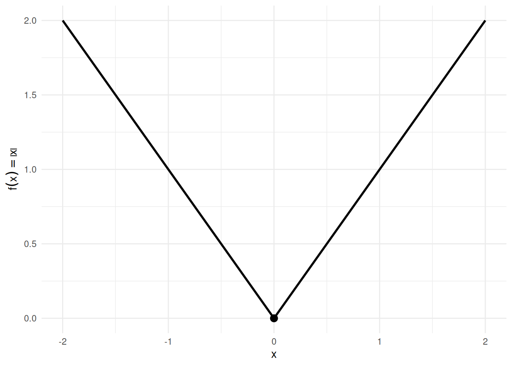
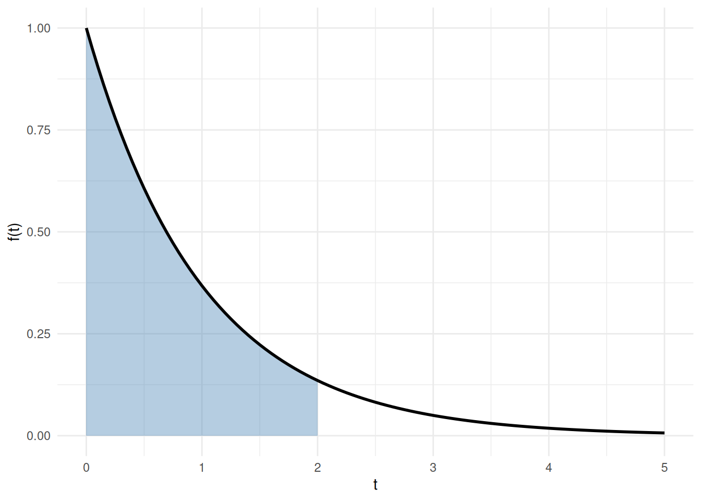
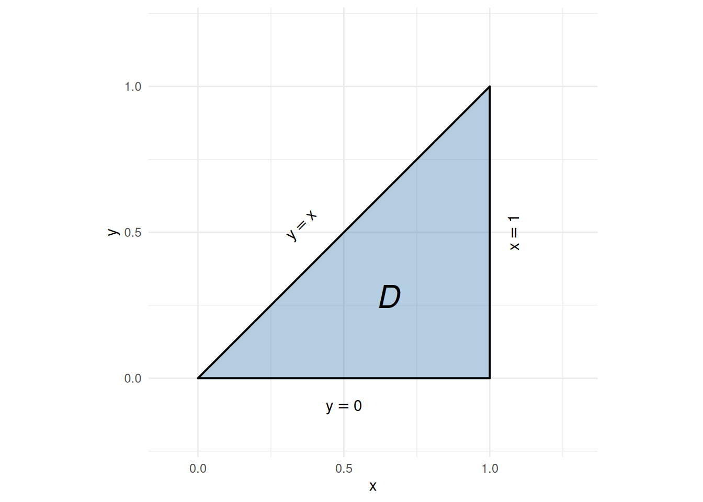
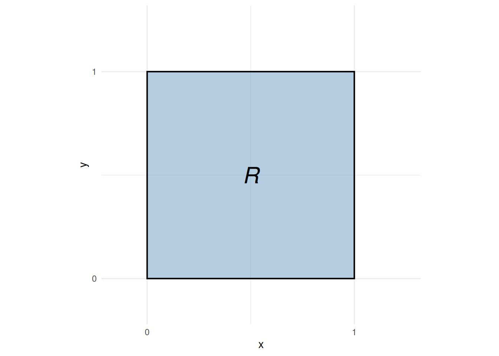

# Math prerequisites

Code

Published

Last modified: 2026-09-26 13:00:23 (PDT)

------------------------------------------------------------------------

> Math is not just a way of calculating numerical answers; it is a way of thinking, using clear definitions for concepts and rigorous logic to organize our thoughts and back up our assertions.

Cheng ([2025](#ref-cheng2025math))

------------------------------------------------------------------------

These lecture notes use:

- mathematical notation
- algebra
- precalculus
- univariate calculus
- linear algebra
- vector calculus

Some key results are listed here.

# 1 Notation

Mathematical notation is not standardized. This section states the conventions these notes use, and the alternatives you may meet in other sources.

## 1.1 Natural numbers

> **NOTE:**
>
> **Exercise 1 (Which numbers are natural?)** List the elements of the set \\\mathopen{}\left\\n \in \mathbb{N} : n \< 3\right\\\mathclose{}\\. Is your answer the same in every textbook?

> **NOTE:**
>
> *Solution 1*. The answer depends on whether the source counts \\0\\ as a natural number:
>
> - if \\\mathbb{N}\\ starts at \\0\\, the set is \\\mathopen{}\left\\0, 1, 2\right\\\mathclose{}\\;
> - if \\\mathbb{N}\\ starts at \\1\\, the set is \\\mathopen{}\left\\1, 2\right\\\mathclose{}\\.
>
> Both conventions are in common use, so the answer is not the same in every textbook.

> **NOTE:**
>
> **Definition 1 (Natural numbers (our convention))** In these notes, the **natural numbers** are the positive integers:
>
> \\\mathbb{N} \stackrel{\text{def}}{=}\mathopen{}\left\\1, 2, 3, \ldots\right\\\mathclose{}\\

> **NOTE:**
>
> **Definition 2 (Non-negative integers)** The **non-negative integers** are the natural numbers ([Definition 1](#def-natural-numbers)) together with \\0\\:
>
> \\\mathbb{N}\_0 \stackrel{\text{def}}{=}\mathopen{}\left\\0, 1, 2, 3, \ldots\right\\\mathclose{} = \mathbb{N} \cup \mathopen{}\left\\0\right\\\mathclose{}\\

> **NOTE:**
>
> **Example 1 (Natural numbers in a data analysis)**  
>
> - Observation indices start at \\1\\, so we write \\i \in \mathopen{}\left\\1, \ldots, n\right\\\mathclose{}\\ with \\n \in \mathbb{N}\\.
> - A count outcome, such as the number of hospital visits in a year, can be \\0\\, so its support is \\\mathbb{N}\_0\\, not \\\mathbb{N}\\.

> **NOTE:**
>
> Other sources may define \\\mathbb{N}\\ differently, so check each source’s definition before reading its formulas:
>
> - Many sources include \\0\\ in \\\mathbb{N}\\. The international standard ISO 80000-2 defines \\\mathbb{N}\\ to include \\0\\, continuing the earlier standard ISO 31-11 (1978).
> - Other sources start \\\mathbb{N}\\ at \\1\\, as these notes do.
> - To remove the ambiguity, some sources write \\\mathbb{N}\_1\\ or \\\mathbb{Z}^+\\ for \\\mathopen{}\left\\1, 2, 3, \ldots\right\\\mathclose{}\\, and \\\mathbb{N}\_0\\ or \\\mathbb{Z}^{0+}\\ for \\\mathopen{}\left\\0, 1, 2, \ldots\right\\\mathclose{}\\.
> - The words vary too. “Positive integers” (\\\mathopen{}\left\\1, 2, 3, \ldots\right\\\mathclose{}\\) and “non-negative integers” (\\\mathopen{}\left\\0, 1, 2, \ldots\right\\\mathclose{}\\) are unambiguous. “Whole numbers” usually includes \\0\\, but can also mean all of the integers, negative ones included. “Counting numbers” usually starts at \\1\\, but some sources include \\0\\.
> - Some older texts write \\J\\ for the natural numbers.
>
> When a formula’s meaning depends on whether \\0\\ is included, we write the set out explicitly, for example \\\mathopen{}\left\\0, 1, 2, \ldots\right\\\mathclose{}\\ or \\\mathopen{}\left\\1, \ldots, n\right\\\mathclose{}\\.
>
> Source: [Wikipedia, “Natural number”, “Terminology and notation” and “Zero as natural number”](https://en.wikipedia.org/w/index.php?title=Natural_number&oldid=1375965996), which cites ISO 80000-2:2019 and the textbooks using each notation.

# 2 Algebra

## 2.1 Elementary Algebra

Mastery of [Elementary Algebra](https://en.wikipedia.org/wiki/Elementary_algebra) (a.k.a. “College Algebra”) is a prerequisite for calculus, which is in turn a prerequisite for most statistics and data science courses. Nevertheless, each year, some students are still uncomfortable with algebraic manipulations of mathematical formulas. Therefore, I include this section as a quick reference.

### 2.1.1 Equalities

> **NOTE:**
>
> **Theorem 1 (Equalities are transitive)** If \\a=b\\ and \\b=c\\, then \\a=c\\

------------------------------------------------------------------------

> **NOTE:**
>
> **Theorem 2 (Substituting equivalent expressions)** If \\a = b\\, then for any function \\f(x)\\, \\f(a) = f(b)\\

------------------------------------------------------------------------

### 2.1.2 Inequalities

> **NOTE:**
>
> **Theorem 3 (Adding to both sides of an inequality)** If \\a\<b\\, then \\a+c \< b+c\\

------------------------------------------------------------------------

> **NOTE:**
>
> **Theorem 4 (negating both sides of an inequality)** If \\a \< b\\, then: \\-a \> -b\\

------------------------------------------------------------------------

> **NOTE:**
>
> **Theorem 5 (Multiplying both sides of an inequality by a nonnegative number)** If \\a \< b\\ and \\c \geq 0\\, then \\ca \< cb\\.

------------------------------------------------------------------------

> **NOTE:**
>
> **Theorem 6 (Negation is multiplication by \\-1\\)** \\-a = (-1)\*a\\

------------------------------------------------------------------------

### 2.1.3 Infimum and supremum

> **NOTE:**
>
> **Definition 3 (Infimum (greatest lower bound))** The **infimum** of a nonempty set \\A \subseteq \mathbb{R}\\, written \\\inf A\\, is the greatest real number \\m\\ satisfying \\m \le a\\ for all \\a \in A\\:
>
> \\\inf A \stackrel{\text{def}}{=}\max\_{t \in \mathbb{R}}\mathopen{}\left\\t : \forall a \in A, a \ge t\right\\\mathclose{}\\
>
> If the infimum belongs to \\A\\, it equals the minimum: \\\inf A = \min A\\.

> **NOTE:**
>
> **Example 2 (Numerical examples of infimum)**  
>
> - \\\inf\\1, 2, 3\\ = 1\\, since \\1\\ is the smallest element.
> - \\\inf(0.5, 1\] = 0.5 = \min\[0.5, 1\]\\: for intervals open below, the infimum equals the minimum of the corresponding closed-below interval, even though \\0.5 \notin (0.5, 1\]\\. More generally, \\\inf(c, b\] = \min\[c, b\] = c\\ for any \\c \< b\\.
> - \\\inf\\t \ge 0 : t \> 0.5\\ = 0.5\\, even though \\0.5\\ itself is not in the set.

> **NOTE:**
>
> **Definition 4 (Supremum (least upper bound))** The **supremum** of a nonempty set \\A \subseteq \mathbb{R}\\, written \\\sup A\\, is the smallest real number \\M\\ satisfying \\M \ge a\\ for all \\a \in A\\:
>
> \\\sup A \stackrel{\text{def}}{=}\min\_{t \in \mathbb{R}}\mathopen{}\left\\t : \forall a \in A, a \le t\right\\\mathclose{}\\
>
> If the supremum belongs to \\A\\, it equals the maximum: \\\sup A = \max A\\.

> **NOTE:**
>
> **Example 3 (Numerical examples of supremum)**  
>
> - \\\sup\\1, 2, 3\\ = 3\\, since \\3\\ is the largest element.
> - \\\sup\\t \ge 0 : t \< 0.5\\ = 0.5\\, even though \\0.5\\ itself is not in the set.

### 2.1.4 Sums

> **NOTE:**
>
> **Theorem 7 (adding zero changes nothing)** \\a+0=a\\

------------------------------------------------------------------------

> **NOTE:**
>
> **Theorem 8 (Sums are symmetric)** \\a+b = b+a\\

------------------------------------------------------------------------

> **NOTE:**
>
> **Theorem 9 (Sums are associative)**  
>
> When summing three or more terms, the order in which you sum them does not matter:
>
> \\(a + b) + c = a + (b + c)\\

------------------------------------------------------------------------

### 2.1.5 Products

------------------------------------------------------------------------

> **NOTE:**
>
> **Theorem 10 (Multiplying by 1 changes nothing)** \\a \times 1 = a\\

------------------------------------------------------------------------

> **NOTE:**
>
> **Theorem 11 (Products are symmetric)** \\a \times b = b \times a\\

------------------------------------------------------------------------

> **NOTE:**
>
> **Theorem 12 (Products are associative)** \\(a \times b) \times c = a \times (b \times c)\\

### 2.1.6 Division

> **NOTE:**
>
> **Theorem 13 (Division can be written as a product)** \\\frac {a}{b} = a \times \frac{1}{b}\\

### 2.1.7 Sums and products together

------------------------------------------------------------------------

> **NOTE:**
>
> **Theorem 14 (Multiplication is distributive)** \\a(b+c) = ab + ac\\

------------------------------------------------------------------------

### 2.1.8 Quotients

> **NOTE:**
>
> **Definition 5 (Quotients, fractions, rates)**  
>
> A **quotient** (also called a *fraction* or *rate*) is a division of one quantity by another:
>
> \\\frac{a}{b}\\
>
> In epidemiology, rates typically have a quantity involving time or population in the denominator.
>
> c.f. <https://en.wikipedia.org/wiki/Rate_(mathematics)>

> **NOTE:**
>
> **Definition 6 (Ratios)** A **ratio** is a quotient in which the numerator and denominator are measured using the same unit scales.
>
> c.f. <https://en.wikipedia.org/wiki/Ratio>

------------------------------------------------------------------------

> **NOTE:**
>
> **Definition 7 (Proportion)** In statistics, a **proportion** typically means a ratio where the numerator represents a subset of the denominator.
>
> See <https://en.wikipedia.org/wiki/Population_proportion>.
>
> See also <https://en.wikipedia.org/wiki/Proportion_(mathematics)> for other meanings.

------------------------------------------------------------------------

> **NOTE:**
>
> **Definition 8 (Proportional)** Two functions \\f(x)\\ and \\g(x)\\ are **proportional** if their ratio \\\frac{f(x)}{g(x)}\\ does not depend on \\x\\. (c.f. <https://en.wikipedia.org/wiki/Proportionality_(mathematics)>)

------------------------------------------------------------------------

Additional reference for elementary algebra: <https://en.wikipedia.org/wiki/Population_proportion#Mathematical_definition>

------------------------------------------------------------------------

### 2.1.9 Exponentials and Logarithms

> **NOTE:**
>
> **Theorem 15 (logarithm of a product is the sum of the logs of the factors)** \\ \log{a\cdot b} = \log{a} + \log{b} \\

> **NOTE:**
>
> **Corollary 1 (logarithm of a quotient)**  
>
> The logarithm of a quotient is equal to the difference of the logs of the factors:
>
> \\\log{\frac{a}{b}} = \log{a} - \log{b}\\

> **NOTE:**
>
> **Theorem 16 (logarithm of an exponential function)** \\ \operatorname{log}\mathopen{}\left\\a^b\right\\\mathclose{} = b \cdot\operatorname{log}\mathopen{}\left\\a\right\\\mathclose{} \\

> **NOTE:**
>
> **Theorem 17 (exponential of a sum)**  
>
> The exponential of a sum is equal to the product of the exponentials of the addends:
>
> \\\operatorname{exp}\mathopen{}\left\\a+b\right\\\mathclose{} = \operatorname{exp}\mathopen{}\left\\a\right\\\mathclose{} \cdot\operatorname{exp}\mathopen{}\left\\b\right\\\mathclose{}\\

> **NOTE:**
>
> **Corollary 2 (exponential of a difference)**  
>
> The exponential of a difference is equal to the quotient of the exponentials of the addends:
>
> \\\operatorname{exp}\mathopen{}\left\\a-b\right\\\mathclose{} = \frac{\operatorname{exp}\mathopen{}\left\\a\right\\\mathclose{}}{\operatorname{exp}\mathopen{}\left\\b\right\\\mathclose{}}\\

------------------------------------------------------------------------

> **NOTE:**
>
> **Theorem 18 (exponential of a product)** \\a^{bc} = \mathopen{}\left(a^b\right)\mathclose{}^c = \mathopen{}\left(a^c\right)\mathclose{}^b\\

------------------------------------------------------------------------

> **NOTE:**
>
> **Corollary 3 (natural exponential of a product)** \\\operatorname{exp}\mathopen{}\left\\ab\right\\\mathclose{} = (\operatorname{exp}\mathopen{}\left\\a\right\\\mathclose{})^b = (\operatorname{exp}\mathopen{}\left\\b\right\\\mathclose{})^a\\

------------------------------------------------------------------------

> **NOTE:**
>
> **Exercise 2** For \\a \ge 0,~b,c \in \mathbb{R}\\, When does \\(a^b)^c = a^{(b^c)}\\?

------------------------------------------------------------------------

> **NOTE:**
>
> *Solution 2*. Short answer: rarely (that’s all you need to know for this course).
>
> Long answer:
>
> If \\(a^b)^c = a^{(b^c)}\\, then since \\(a^b)^c = a^{bc}\\, we have: \\a^{bc} = a^{(b^c)}\\ \\\operatorname{log}\mathopen{}\left\\a^{bc}\right\\\mathclose{} = \operatorname{log}\mathopen{}\left\\a^{(b^c)}\right\\\mathclose{}\\ \\bc \cdot \operatorname{log}\mathopen{}\left\\a\right\\\mathclose{} = b^c\cdot \operatorname{log}\mathopen{}\left\\a\right\\\mathclose{} \tag{1}\\
>
> [Equation 1](#eq-double-exp-log-scale) holds in each of the following cases:
>
> 1.  \\bc = b^c\\ (see [Exercise 3](#exr-exp-vs-mult)).
> 2.  \\a=1\\ (i.e., \\\operatorname{log}\mathopen{}\left\\a\right\\\mathclose{} = 0\\).
> 3.  \\a=0\\ (i.e., \\\operatorname{log}\mathopen{}\left\\a\right\\\mathclose{}= -\infty\\) *and* \\\operatorname{sign}\mathopen{}\left\\bc\right\\\mathclose{}=\operatorname{sign}\mathopen{}\left\\b^c\right\\\mathclose{}\\.
>
> In particular, when \\a=0\\ and \\c=0\\, \\bc = 0\\ and \\b^c = 1\\ (for any \\b \in \mathbb{R}\\), so \\\operatorname{sign}\mathopen{}\left\\bc\right\\\mathclose{}\neq \operatorname{sign}\mathopen{}\left\\b^c\right\\\mathclose{}\\, and \\(a^b)^c \neq a^{(b^c)}\\:
>
> \\ \begin{aligned} (a^b)^c &= (0^b)^0 \\ &= 1 \end{aligned} \\
>
> \\ \begin{aligned} a^{(b^c)} &= 0^{(b^0)} \\ &= 0^1 \\ &= 0 \end{aligned} \\

------------------------------------------------------------------------

> **NOTE:**
>
> **Exercise 3** For \\b,c \in \mathbb{R}\\, when does \\b^c = bc\\?

------------------------------------------------------------------------

> **NOTE:**
>
> *Solution 3*. \\bc = b^c\\ in each of the following cases:
>
> 1.  \\c = 1\\.
> 2.  \\b=0\\ and \\c \> 0\\.
> 3.  \\b = \operatorname{exp}\mathopen{}\left\\\frac{\log{c}}{c-1}\right\\\mathclose{}\\ (for \\c \ge 0\\).
>
> See the red contours in [Figure 2](#fig-double-exponential2) for a visualization.
>
> ``` downlit
> mult_f <- function(b, c) b * c
> pow_f <- function(b, c) b^c
> values_b <- seq(0, 5, by = .01)
> values_c <- seq(-.5, 3, by = .01)
>
> mult_mat <- outer(values_b, values_c, mult_f)
> pow_mat <- outer(values_b, values_c, pow_f)
> pow_mat[is.infinite(pow_mat)] <- NA
>
> opacity <- .3
> z_min <- min(mult_mat, pow_mat, na.rm = TRUE)
> z_max <- 5
> plotly::plot_ly(
>   x = ~values_b,
>   y = ~values_c
> ) |>
>   plotly::add_surface(
>     z = ~ t(mult_mat),
>     contours = list(
>       z = list(
>         show = TRUE,
>         start = -1,
>         end = 1,
>         size = .1
>       )
>     ),
>     name = "b*c",
>     showscale = FALSE,
>     opacity = opacity,
>     colorscale = list(c(0, 1), c("green", "green"))
>   ) |>
>   plotly::add_surface(
>     opacity = opacity,
>     colorscale = list(c(0, 1), c("red", "red")),
>     z = ~ t(pow_mat),
>     contours = list(
>       z = list(
>         show = TRUE,
>         start = z_min,
>         end = z_max,
>         size = .2
>       )
>     ),
>     showscale = FALSE,
>     name = "b^c"
>   ) |>
>   plotly::layout(
>     scene = list(
>       xaxis = list(
>         # type = "log",
>         title = "b"
>       ),
>       yaxis = list(
>         # type = "log",
>         title = "c"
>       ),
>       zaxis = list(
>         # type = "log",
>         range = c(z_min, z_max),
>         title = "outcome"
>       ),
>       camera = list(eye = list(x = -1.25, y = -1.25, z = 0.5)),
>       aspectratio = list(x = .9, y = .8, z = 0.7)
>     )
>   )
> ```
>
> Figure 1: Graph of \\b\*c\\ and \\b^c\\
>
> ``` downlit
> pow_minus_mult_f <- function(b, c) pow_f(b, c) - mult_f(b, c)
>
> mat1 <- outer(values_b, values_c, pow_minus_mult_f)
> mat1[is.infinite(mat1)] <- NA
>
> opacity <- .3
> plotly::plot_ly(
>   x = ~values_b,
>   y = ~values_c
> ) |>
>   plotly::add_surface(
>     z = ~ t(mat1),
>     contours = list(
>       z = list(
>         show = TRUE,
>         start = 0,
>         end = 1,
>         size = 1,
>         color = "red"
>       )
>     ),
>     name = "b^c - b*c",
>     showscale = TRUE,
>     opacity = opacity
>   ) |>
>   plotly::layout(
>     scene = list(
>       xaxis = list(
>         # type = "log",
>         title = "b"
>       ),
>       yaxis = list(
>         # type = "log",
>         title = "c"
>       ),
>       zaxis = list(
>         title = "outcome"
>       ),
>       camera = list(eye = list(x = -1.25, y = -1.25, z = 0.5)),
>       aspectratio = list(x = .9, y = .8, z = 0.7)
>     )
>   )
> ```
>
> Figure 2: **Graph of \\b^c - b\*c\\**. Red contour lines show where \\b^c = b\*c\\.

------------------------------------------------------------------------

> **NOTE:**
>
> **Theorem 19 (\\\operatorname{exp}\mathopen{}\left\\\right\\\mathclose{}\\ and \\\operatorname{log}\mathopen{}\left\\\right\\\mathclose{}\\ are mutual inverses)** \\\operatorname{exp}\mathopen{}\left\\\operatorname{log}\mathopen{}\left\\a\right\\\mathclose{}\right\\\mathclose{} = \operatorname{log}\mathopen{}\left\\\operatorname{exp}\mathopen{}\left\\a\right\\\mathclose{}\right\\\mathclose{} = a\\

# 3 Derivatives

> **NOTE:**
>
> **Theorem 20 (Constant rule)** \\\frac{\partial}{\partial x}c = 0\\

> **NOTE:**
>
> **Theorem 21 (Power rule)** If \\a\\ is constant with respect to \\x\\, then: \\\frac{\partial}{\partial x}ay = a \frac{\partial x}{\partial y}\\

> **NOTE:**
>
> **Theorem 22 (Power rule)** \\\frac{\partial}{\partial x}x^q = qx^{q-1}\\

> **NOTE:**
>
> **Theorem 23 (Derivative of natural logarithm)** \\\operatorname{log}'\mathopen{}\left\\x\right\\\mathclose{} = \frac{1}{x} = x^{-1}\\

> **NOTE:**
>
> **Theorem 24 (derivative of exponential)** \\\operatorname{exp}'\mathopen{}\left\\x\right\\\mathclose{} = \operatorname{exp}\mathopen{}\left\\x\right\\\mathclose{}\\

> **NOTE:**
>
> **Theorem 25 (Product rule)** \\(ab)' = ab' + ba'\\

> **NOTE:**
>
> **Theorem 26 (Quotient rule)** \\(a/b)' = a'/b - (a/b^2)b'\\

> **NOTE:**
>
> **Theorem 27 (Chain rule)** \\\begin{aligned} \frac{\partial a}{\partial c} &= \frac{\partial a}{\partial b} \frac{\partial b}{\partial c} \\ &= \frac{\partial b}{\partial c} \frac{\partial a}{\partial b} \end{aligned} \\
>
> or in [Euler/Lagrange notation](https://en.wikipedia.org/wiki/Notation_for_differentiation#Lagrange's_notation):
>
> \\(f(g(x)))' = g'(x) f'(g(x))\\

> **NOTE:**
>
> **Corollary 4 (Chain rule for logarithms)** \\ \frac{\partial}{\partial x}\log{f(x)} = \frac{f'(x)}{f(x)} \\

> **NOTE:**
>
> *Proof*. Apply [Theorem 27](#thm-chain-rule) and [Theorem 23](#thm-deriv-log).

------------------------------------------------------------------------

# 4 Integration

Integration is the inverse operation of differentiation: it recovers a function from its derivative and accumulates quantities such as areas, totals, and probabilities. We begin with antiderivatives, then state basic integration rules, and conclude with the Fundamental Theorem of Calculus and a worked example from probability.

## 4.1 Antiderivatives

> **NOTE:**
>
> **Definition 9 (Antiderivative)** A function \\F\\ is an **antiderivative** of \\f\\ on an interval \\I\\ if:
>
> \\\frac{\partial}{\partial x} F(x) = f(x), \quad \forall x \in I\\
>
> ([Larson and Edwards 2018, sec. 4.1](#ref-larsonCalc11e), pp. 248–249)

> **NOTE:**
>
> **Definition 10 (Indefinite integral)** The **indefinite integral** of \\f\\ is the family of all antiderivatives ([Definition 9](#def-antiderivative)) of \\f\\:
>
> \\\int f(x)\\dx = F(x) + C\\
>
> where \\F\\ is any one antiderivative of \\f\\ and \\C\\ is an arbitrary constant of integration.
>
> ([Larson and Edwards 2018, sec. 4.1](#ref-larsonCalc11e), pp. 248–249)

> **NOTE:**
>
> **Example 4 (Antiderivative of a power function)** For \\f(x) = x^2\\, an antiderivative is \\F(x) = \frac{x^3}{3}\\, since \\\frac{\partial}{\partial x}\frac{x^3}{3} = x^2 = f(x)\\.
>
> Adding any constant \\C\\ gives another antiderivative; for example, with \\C = 7\\, \\F(x) = \frac{x^3}{3} + 7\\ also satisfies \\F'(x) = x^2\\, since adding a constant does not change the derivative. See [Figure 3](#fig-antiderivatives).
>
> Code
>
> ``` downlit
> ggplot2::ggplot() +
>   ggplot2::geom_function(fun = \(x) x^2, xlim = x_lim, linewidth = 1) +
>   ggplot2::labs(x = "x", y = expression(f(x))) +
>   ggplot2::theme_minimal()
> ```
>
> [](math-prereqs_files/figure-html/fig-antiderivatives-f-code-1.png "Figure 3 (b): The function f(x) = x^2.")
>
> \(a\)
>
> \(b\) The function \\f(x) = x^2\\.
>
> Code
>
> ``` downlit
> x_seq <- seq(x_lim[1], x_lim[2], length.out = 200)
> df <- do.call(rbind, lapply(C_vals, \(C) {
>   data.frame(
>     x = x_seq,
>     y = x_seq^3 / 3 + C,
>     C = factor(C)
>   )
> }))
>
> ggplot2::ggplot(df, ggplot2::aes(x = x, y = y, color = C)) +
>   ggplot2::geom_line(linewidth = 0.8) +
>   ggplot2::labs(x = "x", y = expression(F(x)), color = "C") +
>   ggplot2::theme_minimal()
> ```
>
> [](math-prereqs_files/figure-html/fig-antiderivatives-F-code-1.png "Figure 3 (d): Family of antiderivatives F(x) = x^3/3 + C.")
>
> \(c\)
>
> \(d\) Family of antiderivatives \\F(x) = x^3/3 + C\\.
>
> Figure 3: The function \\f(x) = x^2\\ and five antiderivatives \\F(x) = x^3/3 + C\\ for \\C \in \\-2, -1, 0, 1, 2\\\\. Each antiderivative has the same derivative \\f\\; they differ only by a vertical shift.

> **NOTE:**
>
> **Theorem 28 (Basic integration rules)** Each antiderivative in the table is defined only up to an arbitrary constant \\C\\ (see [Definition 9](#def-antiderivative)); the table omits \\+ C\\ from every row for brevity.
>
> | Function \\f(x)\\ | Antiderivative \\F(x)\\ | Condition |
> |:--:|:--:|:---|
> | \\c\\ | \\cx\\ | — |
> | \\x^n\\ | \\\dfrac{x^{n+1}}{n+1}\\ | \\n \ne -1\\ |
> | \\\dfrac{1}{x}\\ | \\\ln\mathopen{}\left\|x\right\|\mathclose{}\\ | \\x \ne 0\\ |
> | \\\text{e}^{x}\\ | \\\text{e}^{x}\\ | (self-antiderivative) |
> | \\\text{e}^{cx}\\ | \\\dfrac{1}{c}\text{e}^{cx}\\ | \\c \ne 0\\ |
> | \\c \cdot f(x)\\ | \\c \cdot F(x)\\ | — |
> | \\f(x) + g(x)\\ | \\F(x) + G(x)\\ | — |
>
> The first two rows and the bottom two rows (linearity) are from ([Larson and Edwards 2018, sec. 4.1](#ref-larsonCalc11e), p. 250 “Basic Integration Rules”); \\1/x\\ is from ([Larson and Edwards 2018, sec. 5.2](#ref-larsonCalc11e), Theorem 5.5, p. 324); \\\text{e}^{x}\\ and \\\text{e}^{cx}\\ are from ([Larson and Edwards 2018, sec. 5.4](#ref-larsonCalc11e), Theorem 5.12, p. 346).

> **NOTE:**
>
> **Example 5 (Antiderivative of \\3x^2 - 1\\)** By the power rule (\\n = 2\\) and linearity from [Theorem 28](#thm-integral-rules):
>
> \\ \int \mathopen{}\left(3x^2 - 1\right)\mathclose{}\\dx = 3 \cdot\frac{x^3}{3} - x + C = x^3 - x + C. \\
>
> Verify by differentiating: \\\frac{\partial}{\partial x}\mathopen{}\left(x^3 - x + C\right)\mathclose{} = 3x^2 - 1 = f(x)\\, as required.

## 4.2 Regularity Conditions

> **NOTE:**
>
> **Definition 11 (Differentiable function)** A function \\f\\ is **differentiable at** \\x = c\\ if the limit
>
> \\f'(c) \stackrel{\text{def}}{=}\lim\_{h \to 0} \frac{f(c + h) - f(c)}{h}\\
>
> exists and is finite.
>
> ([Larson and Edwards 2018, sec. 2.1](#ref-larsonCalc11e), p. 100)

> **NOTE:**
>
> **Definition 12 (Differentiable on an interval)** A function \\f\\ is **differentiable on** an interval if it is differentiable ([Definition 11](#def-differentiable)) at every interior point of the interval; at a closed endpoint, the appropriate one-sided derivative is used.
>
> ([Larson and Edwards 2018, sec. 2.1](#ref-larsonCalc11e), p. 100)

> **NOTE:**
>
> **Definition 13 (Continuous function)** A function \\f\\ is **continuous at** \\x = c\\ if all three conditions hold:
>
> 1.  \\f(c)\\ is defined,
> 2.  \\\lim\_{x \to c} f(x)\\ exists, and
> 3.  \\\lim\_{x \to c} f(x) = f(c)\\.
>
> ([Larson and Edwards 2018, sec. 1.4](#ref-larsonCalc11e), p. 73)

> **NOTE:**
>
> **Definition 14 (Continuous on a closed interval)** A function \\f\\ is **continuous on** a closed interval \\\[a, b\]\\ if it is continuous ([Definition 13](#def-continuous)) at every point of \\\[a, b\]\\.
>
> ([Larson and Edwards 2018, sec. 1.4](#ref-larsonCalc11e), p. 73)

> **NOTE:**
>
> **Definition 15 (Riemann integral)** For a bounded function \\f\\ on \\\[a, b\]\\, split \\\[a, b\]\\ into \\n\\ equal-width subintervals of width \\\Delta x \stackrel{\text{def}}{=}(b - a)/n\\, and let \\x_i^\*\\ be any point in the \\i\\-th subinterval. The **Riemann integral** of \\f\\ over \\\[a, b\]\\ is the limit
>
> \\\int_a^b f(x)\\dx \stackrel{\text{def}}{=}\lim\_{n \to \infty} \sum\_{i=1}^n f(x_i^\*)\\\Delta x,\\
>
> when that limit exists.
>
> ([Larson and Edwards 2018, sec. 4.3](#ref-larsonCalc11e), p. 272)

> **NOTE:**
>
> **Definition 16 (Riemann integrable)** A bounded function \\f\\ is **Riemann integrable on** \\\[a, b\]\\ if its Riemann integral ([Definition 15](#def-riemann-integral)) over \\\[a, b\]\\ exists and is finite.
>
> ([Larson and Edwards 2018, sec. 4.3](#ref-larsonCalc11e), p. 272)

> **NOTE:**
>
> **Definition 17 (General Riemann integrability)** More generally, using partitions \\\mathcal{P}\\ of arbitrary mesh — subintervals of varying widths \\\Delta x_i\\ — a bounded function \\f\\ is **Riemann integrable in the general sense** on \\\[a, b\]\\ if
>
> \\\int_a^b f(x)\\dx \stackrel{\text{def}}{=}\lim\_{\\\mathcal{P}\\ \to 0} \sum\_{i=1}^n f(x_i^\*)\\\Delta x_i\\
>
> exists and is finite, where \\\\\mathcal{P}\\ = \max_i \Delta x_i\\ is the mesh of the partition.

> **NOTE:**
>
> **Theorem 29 (Equivalence of Riemann sum formulations)** For continuous \\f\\ on a closed interval \\\[a, b\]\\, the equal-width Riemann sum ([Definition 16](#def-integrable)) and the arbitrary-mesh Riemann sum ([Definition 17](#def-integrable-general)) give the same value ([Rudin 1976, chap. 6](#ref-rudin1976principles)). Applied statistics courses mostly use the equal-width form in [Definition 16](#def-integrable).

Before stating the Fundamental Theorem of Calculus, we record two prerequisite results. The FTC requires the integrand \\f\\ to be continuous, and the following two theorems establish where continuity comes from (differentiability \\\Rightarrow\\ continuity) and what it buys us (continuity \\\Rightarrow\\ integrability).

> **NOTE:**
>
> **Theorem 30 (Differentiability implies continuity)** If \\f\\ is differentiable at \\x = c\\, then \\f\\ is continuous at \\x = c\\.
>
> ([Larson and Edwards 2018](#ref-larsonCalc11e), Theorem 2.1, p. 106)

> **NOTE:**
>
> **Example 6 (Differentiable, hence continuous: \\x^3 - x\\)** \\f(x) = x^3 - x\\ is differentiable everywhere (with derivative \\f'(x) = 3x^2 - 1\\), so by [Theorem 30](#thm-diff-implies-cont) it is continuous everywhere.

> **NOTE:**
>
> **Example 7 (Continuous but not differentiable: \\\mathopen{}\left\|x\right\|\mathclose{}\\)** The absolute-value function \\f(x) = \mathopen{}\left\|x\right\|\mathclose{}\\ is continuous at \\x = 0\\ (\\\lim\_{x \to 0}\mathopen{}\left\|x\right\|\mathclose{} = 0 = \mathopen{}\left\|0\right\|\mathclose{}\\), but it is not differentiable at \\x = 0\\: the left-derivative is \\-1\\ and the right-derivative is \\+1\\.
>
> This counterexample shows that the converse of [Theorem 30](#thm-diff-implies-cont) fails: continuity does not imply differentiability. See [Figure 4](#fig-abs-value).
>
> Code
>
> ``` downlit
> ggplot2::ggplot() +
>   ggplot2::geom_function(fun = abs, xlim = c(-2, 2), linewidth = 1) +
>   ggplot2::geom_point(ggplot2::aes(x = 0, y = 0), size = 3) +
>   ggplot2::labs(x = "x", y = expression(f(x) == abs(x))) +
>   ggplot2::theme_minimal()
> ```
>
> [](math-prereqs_files/figure-html/fig-abs-value-code-1.png "Figure 4 (a): ")
>
> \(a\)
>
> Figure 4: \\f(x) = \mathopen{}\left\|x\right\|\mathclose{}\\ has a sharp corner at \\x = 0\\ (not differentiable there) but is continuous everywhere: no gaps or jumps.

> **NOTE:**
>
> **Theorem 31 (Continuity implies integrability)** If \\f\\ is continuous on the closed interval \\\[a, b\]\\, then \\f\\ is integrable on \\\[a, b\]\\ (i.e., the Riemann integral \\\int_a^b f(x)\\dx\\ exists and is finite).
>
> ([Larson and Edwards 2018](#ref-larsonCalc11e), Theorem 4.4, p. 272)

> **NOTE:**
>
> **Example 8 (Continuous, hence integrable: polynomials)** Every polynomial is continuous on \\\mathbb{R}\\, so by [Theorem 31](#thm-cont-implies-int) every polynomial is integrable on every closed interval \\\[a, b\]\\.

> **NOTE:**
>
> **Example 9 (Integrable but not continuous: a step function)** Let \\f(x) = 0\\ for \\x \< \tfrac{1}{2}\\ and \\f(x) = 1\\ for \\x \ge \tfrac{1}{2}\\. Then \\f\\ is discontinuous at \\x = \tfrac{1}{2}\\, but it is integrable on \\\[0, 1\]\\:
>
> \\ \int_0^1 f(x)\\dx = \int_0^{1/2} 0\\dx + \int\_{1/2}^1 1\\dx = 0 + \tfrac{1}{2} = \tfrac{1}{2}. \\
>
> This counterexample shows that the converse of [Theorem 31](#thm-cont-implies-int) fails: integrability does not imply continuity. See [Figure 5](#fig-step).
>
> Code
>
> ``` downlit
> step_df <- data.frame(
>   x = c(0, 0.5, 0.5, 1),
>   y = c(0, 0, 1, 1),
>   segment = c("left", "left", "right", "right")
> )
>
> ggplot2::ggplot() +
>   ggplot2::geom_rect(
>     ggplot2::aes(xmin = 0.5, xmax = 1, ymin = 0, ymax = 1),
>     fill = "steelblue", alpha = 0.3
>   ) +
>   ggplot2::geom_line(
>     data = step_df,
>     ggplot2::aes(x = x, y = y, group = segment),
>     linewidth = 1
>   ) +
>   ggplot2::geom_point(ggplot2::aes(x = 0.5, y = 0), shape = 1, size = 3) +
>   ggplot2::geom_point(ggplot2::aes(x = 0.5, y = 1), shape = 16, size = 3) +
>   ggplot2::scale_x_continuous(
>     breaks = c(0, 0.5, 1),
>     labels = c("0", "1/2", "1")
>   ) +
>   ggplot2::scale_y_continuous(limits = c(-0.1, 1.2)) +
>   ggplot2::labs(x = "x", y = "f(x)") +
>   ggplot2::theme_minimal()
> ```
>
> [](math-prereqs_files/figure-html/fig-step-code-1.png "Figure 5 (a): ")
>
> \(a\)
>
> Figure 5: Step function: \\f(x) = 0\\ on \\\[0, \tfrac{1}{2})\\ (open circle at the jump) and \\f(x) = 1\\ on \\\[\tfrac{1}{2}, 1\]\\ (filled circle). The shaded rectangle has area \\\tfrac{1}{2}\\, matching the integral computed in [Example 9](#exm-int-not-cont).

Together, [Theorem 30](#thm-diff-implies-cont) and [Theorem 31](#thm-cont-implies-int) establish the chain:

\\\text{differentiable} \\\Rightarrow\\ \text{continuous} \\\Rightarrow\\ \text{integrable}\\

[Example 7](#exm-cont-not-diff) and [Example 9](#exm-int-not-cont) show that neither implication reverses in general.

## 4.3 Fundamental Theorem of Calculus

> **NOTE:**
>
> **Theorem 32 (Fundamental Theorem of Calculus)** Let \\f\\ be a continuous function on a closed interval \\\[a, b\]\\.
>
> **Part 1 (Derivative of an integral).** Define \\F(x) = \int_a^x f(t)\\dt\\ for \\x \in \[a, b\]\\. Then \\F\\ is differentiable and:
>
> \\\frac{\partial}{\partial x}\int_a^x f(t)\\dt = f(x) \tag{2}\\
>
> > **NOTE:**
> >
> > Continuity on all of \\\[a, b\]\\ is a sufficient condition. More generally, Part 1 holds at any individual point \\x\\ where \\f\\ is integrable on \\\[a, b\]\\ (see [Definition 16](#def-integrable)) and continuous at \\x\\ (see [Definition 13](#def-continuous)), even if \\f\\ has jump discontinuities elsewhere ([Rudin 1976](#ref-rudin1976principles), Theorem 6.20, p. 133).
>
> ([Larson and Edwards 2018](#ref-larsonCalc11e), Theorem 4.11, p. 288)
>
> **Part 2 (Evaluation theorem).** The \\F\\ here may be *any* antiderivative of \\f\\ — not just the accumulation function from Part 1. If \\F\\ is an antiderivative of \\f\\ on \\\[a, b\]\\ (i.e., \\\frac{\partial}{\partial x} F(x) = f(x)\\ for all \\x \in \[a, b\]\\), then:
>
> \\\int_a^b f(x)\\dx = F(b) - F(a) \tag{3}\\
>
> Equivalently, with \\b\\ replaced by a variable upper limit \\x\\, integrating the derivative of \\F\\ recovers the net change in \\F\\:
>
> \\\int_a^x F'(t)\\dt = F(x) - F(a) \tag{4}\\
>
> or equivalently in Leibniz notation:
>
> \\\int_a^x \frac{d F}{d t}\\dt = F(x) - F(a)\\
>
> ([Banner 2007, chap. 18](#ref-calclifesaver); [Larson and Edwards 2018](#ref-larsonCalc11e), Theorem 4.9, p. 282)

The two parts of the FTC together express that **differentiation and integration are inverse operations**:

- Part 1: differentiating the integral of \\f\\ recovers \\f\\ ([Equation 2](#eq-ftc-deriv-of-integral)).
- Part 2: the integral of \\f\\ over \\\[a, b\]\\ equals the difference of any antiderivative’s values at the endpoints ([Equation 3](#eq-ftc-part2)), which rearranges to “integrating the derivative of \\F\\ recovers the net change in \\F\\” ([Equation 4](#eq-ftc-integral-of-deriv)).

The standard form of the FTC assumes \\f\\ is continuous on \\\[a, b\]\\; continuity is *sufficient* but not strictly necessary (see the callout note inside [Theorem 32](#thm-ftc) for the more general statement). Since differentiability implies continuity ([Theorem 30](#thm-diff-implies-cont)), the FTC applies in particular whenever \\f\\ is differentiable — a common situation in applied statistics.

> **NOTE:**
>
> **Example 10 (FTC Part 1 visualized: accumulation function for \\f(t) = 2t\\)** Take \\f(t) = 2t\\ on \\\[0, 2\]\\. The accumulation function from \\0\\ is
>
> \\F(x) \\\stackrel{\text{def}}{=}\\ \int_0^x 2t\\dt \\=\\ \mathopen{}\left\[t^2\right\]\mathclose{}\_{t=0}^{t=x} \\=\\ x^2 - 0^2 \\=\\ x^2,\\
>
> so \\F(x) = x^2\\, and indeed \\F'(x) = 2x = f(x)\\, as [Theorem 32](#thm-ftc) Part 1 predicts. [Figure 6](#fig-ftc-part1) shows the integrand on the left (shaded area equals \\F(x)\\ at each \\x\\) and the accumulation function \\F(x) = x^2\\ on the right (its slope at \\x\\ equals \\f(x) = 2x\\).
>
> Code
>
> ``` downlit
> ggplot2::ggplot() +
>   ggplot2::geom_area(
>     data = data.frame(t = seq(0, x_focus, length.out = 200)),
>     ggplot2::aes(x = t, y = 2 * t),
>     fill = "steelblue", alpha = 0.4
>   ) +
>   ggplot2::geom_function(fun = \(t) 2 * t, xlim = c(0, 2.2), linewidth = 1) +
>   ggplot2::geom_vline(
>     data = data.frame(x = x_marks),
>     ggplot2::aes(xintercept = x, color = factor(x)),
>     linetype = "dashed", linewidth = 0.6
>   ) +
>   ggplot2::labs(x = "t", y = "f(t) = 2t", color = "x") +
>   ggplot2::theme_minimal() +
>   ggplot2::theme(legend.position = "bottom")
> ```
>
> [](math-prereqs_files/figure-html/fig-ftc-part1-left-code-1.png "Figure 6 (b): f(t) = 2t; shaded area equals F(1.5) = 2.25; vertical lines mark x \in \{1, 1.5, 2\}.")
>
> \(a\)
>
> \(b\) \\f(t) = 2t\\; shaded area equals \\F(1.5) = 2.25\\; vertical lines mark \\x \in \\1, 1.5, 2\\\\.
>
> Code
>
> ``` downlit
> slope_df <- data.frame(
>   x = x_marks,
>   Fx = x_marks^2,
>   slope = 2 * x_marks
> )
>
> ggplot2::ggplot() +
>   ggplot2::geom_function(fun = \(x) x^2, xlim = c(0, 2.2), linewidth = 1) +
>   ggplot2::geom_point(
>     data = slope_df,
>     ggplot2::aes(x = x, y = Fx, color = factor(x)),
>     size = 3
>   ) +
>   ggplot2::geom_segment(
>     data = slope_df,
>     ggplot2::aes(
>       x = x - 0.3, xend = x + 0.3,
>       y = Fx - 0.3 * slope, yend = Fx + 0.3 * slope,
>       color = factor(x)
>     ),
>     linewidth = 0.8
>   ) +
>   ggplot2::labs(x = "x", y = expression(F(x) == x^2), color = "x") +
>   ggplot2::theme_minimal() +
>   ggplot2::theme(legend.position = "bottom")
> ```
>
> [](math-prereqs_files/figure-html/fig-ftc-part1-right-code-1.png "Figure 6 (d): F(x) = x^2; tangent slope at each marked x equals f(x) = 2x.")
>
> \(c\)
>
> \(d\) \\F(x) = x^2\\; tangent slope at each marked \\x\\ equals \\f(x) = 2x\\.
>
> Figure 6: Left: \\f(t) = 2t\\; the shaded area \\\int_0^{1.5} 2t\\dt = F(1.5) = 2.25\\; vertical lines mark \\x \in \\1, 1.5, 2\\\\. Right: \\F(x) = x^2\\; for each marked \\x\\, the tangent slope equals \\f(x) = 2x\\.

> **NOTE:**
>
> **Example 11 (CDF and PDF of the exponential distribution)** In what follows, \\f\\ denotes the PDF and \\F\\ the CDF — the same letters as the antiderivative pair in [Definition 9](#def-antiderivative), because the FTC will show \\F\\ is exactly an antiderivative of \\f\\.
>
> For the exponential distribution with rate parameter \\\lambda \> 0\\, the probability density function (PDF) is ([Kleinbaum and Klein 2012, sec. II](#ref-kleinbaum2012survival), p. 295, “Survival and Hazard Functions for Selected Distributions”):
>
> \\f(t) = \lambda \text{e}^{-\lambda t}, \quad t \ge 0\\
>
> **FTC Part 2** gives the cumulative distribution function (CDF) from the PDF. Apply the \\\text{e}^{cx}\\ rule from [Theorem 28](#thm-integral-rules) with \\c = -\lambda\\ to antidifferentiate the integrand:
>
> \\ \begin{aligned} F(t) &= \int_0^t \lambda \text{e}^{-\lambda u}\\du \\ &= \mathopen{}\left\[\lambda \cdot\frac{1}{-\lambda}\text{e}^{-\lambda u}\right\]\mathclose{}\_{u=0}^{u=t} \\ &= \mathopen{}\left\[(-1)\text{e}^{-\lambda u}\right\]\mathclose{}\_{u=0}^{u=t} \\ &= \mathopen{}\left\[-\text{e}^{-\lambda u}\right\]\mathclose{}\_{u=0}^{u=t} \\ &= -\text{e}^{-\lambda t} - \mathopen{}\left(-\text{e}^{0}\right)\mathclose{} \\ &= -\text{e}^{-\lambda t} - (-1) \\ &= 1 - \text{e}^{-\lambda t} \end{aligned} \\
>
> **FTC Part 1** recovers the PDF from the CDF:
>
> \\ \begin{aligned} \frac{\partial}{\partial t} F(t) &= \frac{\partial}{\partial t}\mathopen{}\left(1 - \text{e}^{-\lambda t}\right)\mathclose{} \\ &= 0 - (-\lambda)\text{e}^{-\lambda t} \\ &= \lambda\text{e}^{-\lambda t} \\ &= f(t) \end{aligned} \\
>
> For a concrete instance: with \\\lambda = 1\\ (standard exponential), the probability that \\T \le 2\\ is:
>
> \\ F(2) = 1 - \text{e}^{-1 \cdot 2} = 1 - \text{e}^{-2} \approx 1 - 0.135 = 0.865 \\
>
> See [Figure 7](#fig-exp-pdf-cdf).
>
> Code
>
> ``` downlit
> ggplot2::ggplot() +
>   ggplot2::geom_area(
>     data = data.frame(t = seq(0, t_focus, length.out = 300)),
>     ggplot2::aes(x = t, y = lambda * exp(-lambda * t)),
>     fill = "steelblue", alpha = 0.4
>   ) +
>   ggplot2::geom_function(
>     fun = \(t) lambda * exp(-lambda * t),
>     xlim = c(0, t_max), linewidth = 1
>   ) +
>   ggplot2::labs(x = "t", y = "f(t)") +
>   ggplot2::theme_minimal()
> ```
>
> [](math-prereqs_files/figure-html/fig-exp-pdf-cdf-pdf-code-1.png "Figure 7 (b): PDF with \lambda = 1; shaded area equals F(2) \approx 0.865.")
>
> \(a\)
>
> \(b\) PDF with \\\lambda = 1\\; shaded area equals \\F(2) \approx 0.865\\.
>
> Code
>
> ``` downlit
> ggplot2::ggplot() +
>   ggplot2::geom_function(
>     fun = \(t) 1 - exp(-lambda * t),
>     xlim = c(0, t_max), linewidth = 1
>   ) +
>   ggplot2::geom_point(
>     ggplot2::aes(x = t_focus, y = F_at_focus),
>     size = 3, color = "steelblue"
>   ) +
>   ggplot2::geom_segment(
>     ggplot2::aes(x = t_focus, xend = t_focus, y = 0, yend = F_at_focus),
>     linetype = "dashed", color = "steelblue"
>   ) +
>   ggplot2::geom_segment(
>     ggplot2::aes(x = 0, xend = t_focus, y = F_at_focus, yend = F_at_focus),
>     linetype = "dashed", color = "steelblue"
>   ) +
>   ggplot2::labs(x = "t", y = "F(t)") +
>   ggplot2::theme_minimal()
> ```
>
> [](math-prereqs_files/figure-html/fig-exp-pdf-cdf-cdf-code-1.png "Figure 7 (d): CDF with \lambda = 1; point marks F(2) \approx 0.865.")
>
> \(c\)
>
> \(d\) CDF with \\\lambda = 1\\; point marks \\F(2) \approx 0.865\\.
>
> Figure 7: Exponential distribution with \\\lambda = 1\\. Left: the PDF \\f(t) = \lambda \text{e}^{-\lambda t}\\; the shaded area under the curve from \\0\\ to \\2\\ equals \\F(2) \approx 0.865\\. Right: the CDF \\F(t) = 1 - \text{e}^{-\lambda t}\\; the dashed lines mark the value \\F(2)\\ computed via FTC Part 2.

# 5 Double Integrals

The **Fubini–Tonelli theorem** states conditions under which the order of integration in a double integral can be exchanged. We state two versions: the Riemann version ([Theorem 33](#thm-fubini)) is what applied courses usually use for double integrals of continuous functions on simple regions; the σ-finite measure-theoretic version ([Theorem 34](#thm-fubini-tonelli)) is included to make the [joint-distribution form](https://morrison-lab.github.io/rme/chapters/probability.html#cor-fubini-joint) corollary in the probability chapter of *Regression Models for Epidemiology* follow from a stated theorem rather than from an aside.

> **NOTE:**
>
> **Theorem 33 (Fubini’s theorem (Riemann version))** Let \\f\\ be **continuous** on a plane region \\R \subseteq \mathbb{R}^2\\.
>
> 1.  **Vertically simple region.** If \\R\\ is defined by \\a \le x \le b\\ and \\g_1(x) \le y \le g_2(x)\\, where \\g_1\\ and \\g_2\\ are continuous on \\\[a, b\]\\, then
>
>     \\ \begin{aligned} \iint_R f(x, y)\\dA &= \int_a^b \int\_{g_1(x)}^{g_2(x)} f(x, y)\\dy\\dx. \end{aligned} \\
>
> 2.  **Horizontally simple region.** If \\R\\ is defined by \\c \le y \le d\\ and \\h_1(y) \le x \le h_2(y)\\, where \\h_1\\ and \\h_2\\ are continuous on \\\[c, d\]\\, then
>
>     \\ \begin{aligned} \iint_R f(x, y)\\dA &= \int_c^d \int\_{h_1(y)}^{h_2(y)} f(x, y)\\dx\\dy. \end{aligned} \\
>
> When \\R\\ can be described both ways, the two iterated integrals are equal — so the order of integration can be exchanged.
>
> ([Larson and Edwards 2018](#ref-larsonCalc11e), Theorem 14.2, p. 982)

> **NOTE:**
>
> **Example 12 (Changing the order of integration for a non-rectangular region)** Adapted from ([Larson and Edwards 2018, sec. 14.2](#ref-larsonCalc11e), Example 4, pp. 984–985).
>
> Let \\X\\ and \\Y\\ be independent \\\operatorname{Uniform}(0, 1)\\ random variables, with joint density \\f(x, y) = 1\\ on the unit square \\\[0, 1\]^2\\. Define the function \\g(x, y) = \text{e}^{-x^2}\\\mathbb{1}\mathopen{}\left(y \le x\right)\mathclose{}\\, and compute its expectation \\\operatorname{E}\mathopen{}\left\[g(X, Y)\right\]\mathclose{}\\.
>
> Because the joint density equals \\1\\ on \\\[0, 1\]^2\\, this expectation is the double integral of \\g\\ over the unit square:
>
> \\\operatorname{E}\mathopen{}\left\[g(X, Y)\right\]\mathclose{} = \iint\_{\[0, 1\]^2} g(x, y)\\dA.\\
>
> The indicator factor \\\mathbb{1}\mathopen{}\left(y \le x\right)\mathclose{}\\ equals \\1\\ on the triangular region where \\y \le x\\ and \\0\\ elsewhere, so only that region, namely \\D = \\(x, y) : x \in \[0, 1\],\\ y \in \[0, x\]\\\\ ([Figure 8](#fig-fubini-nonrect-region)), contributes, and there \\g(x, y) = \text{e}^{-x^2}\\:
>
> \\\operatorname{E}\mathopen{}\left\[g(X, Y)\right\]\mathclose{} = \iint_D \text{e}^{-x^2}\\dA.\\
>
> Code
>
> ``` downlit
> region <- data.frame(x = c(0, 1, 1), y = c(0, 0, 1))
> ggplot2::ggplot(region, ggplot2::aes(x = x, y = y)) +
>   ggplot2::geom_polygon(
>     fill = "steelblue", alpha = 0.4, color = "black", linewidth = 0.7
>   ) +
>   ggplot2::annotate(
>     "text", x = 0.65, y = 0.28, label = "D", size = 8, fontface = "italic"
>   ) +
>   ggplot2::annotate(
>     "text", x = 0.36, y = 0.52, label = "y == x",
>     parse = TRUE, angle = 45
>   ) +
>   ggplot2::annotate(
>     "text", x = 1.08, y = 0.5, label = "x == 1",
>     parse = TRUE, angle = 90, hjust = 0.5
>   ) +
>   ggplot2::annotate(
>     "text", x = 0.5, y = -0.1, label = "y == 0", parse = TRUE
>   ) +
>   ggplot2::scale_x_continuous(breaks = c(0, 0.5, 1), limits = c(-0.1, 1.3)) +
>   ggplot2::scale_y_continuous(breaks = c(0, 0.5, 1), limits = c(-0.2, 1.2)) +
>   ggplot2::coord_equal() +
>   ggplot2::labs(x = "x", y = "y") +
>   ggplot2::theme_minimal()
> ```
>
> [](math-prereqs_files/figure-html/unnamed-chunk-3-1.png "Figure 8: Triangular integration region D = \{(x, y) : x \in [0, 1],\; y \in [0, x]\}, bounded below by y = 0, above-left by y = x, and on the right by x = 1.")
>
> Figure 8: Triangular integration region \\D = \\(x, y) : x \in \[0, 1\],\\ y \in \[0, x\]\\\\, bounded below by \\y = 0\\, above-left by \\y = x\\, and on the right by \\x = 1\\.
>
> **Order \\dx\\dy\\ is intractable.** Re-describing \\D\\ as \\D = \\(x, y) : y \in \[0, 1\],\\ x \in \[y, 1\]\\\\, the inner integral is
>
> \\\int_y^1 \text{e}^{-x^2}\\dx,\\
>
> which has no elementary antiderivative.
>
> **Order \\dy\\dx\\ works.** Applying [Theorem 33](#thm-fubini) Part 1 (\\\text{e}^{-x^2}\\ is continuous and \\D\\ is the vertically simple region \\x \in \[0, 1\]\\, \\y \in \[0, x\]\\):
>
> \\ \begin{aligned} \iint_D \text{e}^{-x^2}\\dA &= \int_0^1\\\int_0^x \text{e}^{-x^2}\\dy\\dx \\&= \int_0^1 \text{e}^{-x^2}\mathopen{}\left(\int_0^x dy\right)\mathclose{}\\dx \\&= \int_0^1 x\\\text{e}^{-x^2}\\dx \\&= \mathopen{}\left\[-\frac{1}{2}\\\text{e}^{-x^2}\right\]\mathclose{}\_0^1 \\&= -\frac{1}{2}\mathopen{}\left(\text{e}^{-1} - 1\right)\mathclose{} \\&= \frac{e - 1}{2e} \\&\approx 0.316 \end{aligned} \\
>
> The solid whose volume equals this integral is shown in [Figure 9](#fig-fubini-nonrect).
>
> Code
>
> ``` downlit
> n_grid <- 51
> x_seq <- seq(0, 1, length.out = n_grid)
> y_seq <- seq(0, 1, length.out = n_grid)
>
> z_mat <- outer(x_seq, y_seq, function(x, y) {
>   z <- exp(-x^2)
>   z[y > x] <- NA
>   z
> })
>
> plotly::plot_ly(x = ~x_seq, y = ~y_seq, z = ~t(z_mat)) |>
>   plotly::add_surface(showscale = FALSE) |>
>   plotly::layout(scene = list(
>     xaxis = list(title = "x"),
>     yaxis = list(title = "y"),
>     zaxis = list(title = "z = exp(-x^2)"),
>     camera = list(eye = list(x = 1.6, y = -1.6, z = 0.8))
>   ))
> ```
>
> Figure 9: Surface \\z = e^{-x^2}\\ over the region \\D = \\(x, y) : x \in \[0, 1\],\\ y \in \[0, x\]\\\\. The surface depends only on \\x\\ (constant in \\y\\), so for each \\x\\ the inner integral over \\y \in \[0, x\]\\ contributes \\x \cdot e^{-x^2}\\.

> **NOTE:**
>
> **Example 13 (When conditions fail: a counterexample)** The conditions in [Theorem 33](#thm-fubini) are not merely technical — when they fail, iterated integrals can exist yet disagree.
>
> Let \\f(x, y) = \frac{x^2 - y^2}{(x^2 + y^2)^2}\\ on the unit square \\R = \[0, 1\] \times \[0, 1\]\\. Strictly, \\f\\ is defined on \\R \setminus \\(0, 0)\\\\: the denominator vanishes at the origin, so \\f\\ is undefined there (we return to this point in the condition check).
>
> **Integrating \\y\\ first, then \\x\\:**
>
> Using \\\displaystyle\frac{\partial}{\partial y}\frac{y}{x^2 + y^2} = \frac{x^2 - y^2}{(x^2 + y^2)^2}\\:
>
> \\ \begin{aligned} \int_0^1\\\int_0^1 f(x, y)\\dy\\dx &= \int_0^1 \mathopen{}\left\[\frac{y}{x^2 + y^2}\right\]\mathclose{}\_{y=0}^{y=1}\\dx \\&= \int_0^1 \frac{1}{x^2 + 1}\\dx \\&= \mathopen{}\left\[\arctan(x)\right\]\mathclose{}\_0^1 \\&= \frac{\pi}{4} \end{aligned} \\
>
> **Integrating \\x\\ first, then \\y\\:**
>
> Using \\\displaystyle\frac{\partial}{\partial x}\mathopen{}\left(-\frac{x}{x^2 + y^2}\right)\mathclose{} = \frac{x^2 - y^2}{(x^2 + y^2)^2}\\:
>
> \\ \begin{aligned} \int_0^1\\\int_0^1 f(x, y)\\dx\\dy &= \int_0^1 \mathopen{}\left\[-\frac{x}{x^2 + y^2}\right\]\mathclose{}\_{x=0}^{x=1}\\dy \\&= \int_0^1 \mathopen{}\left(-\frac{1}{1 + y^2}\right)\mathclose{}\\dy \\&= -\mathopen{}\left\[\arctan(y)\right\]\mathclose{}\_0^1 \\&= -\frac{\pi}{4} \end{aligned} \\
>
> **Conclusion:** \\\dfrac{\pi}{4} \neq -\dfrac{\pi}{4}\\, so the two iterated integrals are unequal. [Theorem 33](#thm-fubini) does not apply here.
>
> **Why [Theorem 33](#thm-fubini)’s condition fails:** [Theorem 33](#thm-fubini) requires \\f\\ to be **continuous** on \\R\\. The denominator \\(x^2 + y^2)^2\\ vanishes at the origin \\(0, 0) \in R\\, so \\f\\ is *not even defined* there — let alone continuous — and the theorem does not apply.
>
> ([Wikipedia contributors 2024](#ref-wp:fubini))
>
> The surface, and the singularity at the origin responsible for the failure, are shown in [Figure 10](#fig-fubini-fail).
>
> Code
>
> ``` downlit
> n_grid <- 81
> eps <- 0.04
> x_seq <- seq(eps, 1, length.out = n_grid)
> y_seq <- seq(eps, 1, length.out = n_grid)
>
> z_mat <- outer(x_seq, y_seq, function(x, y) (x^2 - y^2) / (x^2 + y^2)^2)
> z_clip <- 50
> z_mat[z_mat > z_clip] <- z_clip
> z_mat[z_mat < -z_clip] <- -z_clip
>
> plotly::plot_ly(x = ~x_seq, y = ~y_seq, z = ~t(z_mat)) |>
>   plotly::add_surface(
>     showscale = FALSE,
>     colorscale = list(
>       list(0, "#3b4cc0"),
>       list(0.5, "#dddddd"),
>       list(1, "#b40426")
>     )
>   ) |>
>   plotly::layout(scene = list(
>     xaxis = list(title = "x"),
>     yaxis = list(title = "y"),
>     zaxis = list(title = "f(x, y)", range = c(-z_clip, z_clip)),
>     camera = list(eye = list(x = 1.6, y = 1.6, z = 0.6))
>   ))
> ```
>
> Figure 10: Surface \\f(x, y) = (x^2 - y^2)/(x^2 + y^2)^2\\ on \\\[0, 1\]^2\\, sampled away from the origin and clipped to \\\[-50, 50\]\\ for display. The function diverges to \\+\infty\\ along the \\x\\-axis (red ridge, \\f \> 0\\ when \\\|x\| \> \|y\|\\) and to \\-\infty\\ along the \\y\\-axis (blue ridge, \\f \< 0\\ when \\\|y\| \> \|x\|\\). The singularity at \\(0, 0)\\ is why \\f\\ is not continuous on \\R\\ and [Theorem 33](#thm-fubini) does not apply.

> **NOTE:**
>
> **Corollary 5 (Continuous functions on a rectangle (corollary of [Theorem 33](#thm-fubini)))** If \\f : \[a, b\] \times \[c, d\] \to \mathbb{R}\\ is **continuous** on the closed bounded rectangle \\\[a, b\] \times \[c, d\]\\, then:
>
> \\ \begin{aligned} \int_a^b \mathopen{}\left(\int_c^d f(x, y)\\dy\right)\mathclose{}\\dx &= \int_c^d \mathopen{}\left(\int_a^b f(x, y)\\dx\right)\mathclose{}\\dy\\ &= \iint\_{\[a,b\]\times\[c,d\]} f(x, y)\\dx\\dy. \end{aligned} \\
>
> ([Larson and Edwards 2018](#ref-larsonCalc11e), Theorem 14.2, p. 982)

> **NOTE:**
>
> *Proof*. A closed bounded rectangle \\\[a, b\] \times \[c, d\]\\ is both vertically simple (with \\g_1 \equiv c\\, \\g_2 \equiv d\\) and horizontally simple (with \\h_1 \equiv a\\, \\h_2 \equiv b\\). Applying both parts of [Theorem 33](#thm-fubini) to \\f\\ on this rectangle gives the two iterated forms shown.

> **NOTE:**
>
> **Example 14 (Evaluating a double integral on a rectangle)** Structure adapted from ([Larson and Edwards 2018, sec. 14.2](#ref-larsonCalc11e), Example 2, pp. 982–983); the integrand \\x^2 + y^2\\ is original, chosen so the integral equals \\\operatorname{E}\mathopen{}\left\[g(X, Y)\right\]\mathclose{}\\ for \\g(x, y) = x^2 + y^2\\.
>
> Let \\X\\ and \\Y\\ be independent \\\operatorname{Uniform}(0, 1)\\ random variables, with joint density \\f(x, y) = 1\\ on the unit square \\R = \\(x, y) : x \in \[0, 1\],\\ y \in \[0, 1\]\\\\ ([Figure 11](#fig-fubini-rect-region)). Define the function \\g(x, y) = x^2 + y^2\\, and compute its expectation \\\operatorname{E}\mathopen{}\left\[g(X, Y)\right\]\mathclose{}\\.
>
> Because the joint density equals \\1\\ on \\R\\, this expectation is the double integral of \\g\\ over \\R\\:
>
> \\\operatorname{E}\mathopen{}\left\[g(X, Y)\right\]\mathclose{} = \iint_R \mathopen{}\left(x^2 + y^2\right)\mathclose{}\\dA.\\
>
> Code
>
> ``` downlit
> ggplot2::ggplot() +
>   ggplot2::annotate(
>     "rect", xmin = 0, xmax = 1, ymin = 0, ymax = 1,
>     fill = "steelblue", alpha = 0.4, color = "black", linewidth = 0.7
>   ) +
>   ggplot2::annotate(
>     "text", x = 0.5, y = 0.5, label = "R", size = 8, fontface = "italic"
>   ) +
>   ggplot2::scale_x_continuous(breaks = c(0, 1), limits = c(-0.15, 1.25)) +
>   ggplot2::scale_y_continuous(breaks = c(0, 1), limits = c(-0.15, 1.25)) +
>   ggplot2::coord_equal() +
>   ggplot2::labs(x = "x", y = "y") +
>   ggplot2::theme_minimal()
> ```
>
> [](math-prereqs_files/figure-html/unnamed-chunk-8-1.png "Figure 11: Integration region R = [0, 1]^2, the unit square.")
>
> Figure 11: Integration region \\R = \[0, 1\]^2\\, the unit square.
>
> The integrand is continuous on \\R\\, so [Corollary 5](#cor-fubini-rect) applies and either order of integration yields the same value.
>
> **Integrating \\y\\ first, then \\x\\:**
>
> \\ \begin{aligned} \operatorname{E}\mathopen{}\left\[g(X, Y)\right\]\mathclose{} &= \int_0^1\\\int_0^1 \mathopen{}\left(x^2 + y^2\right)\mathclose{}\\dy\\dx \\&= \int_0^1 \mathopen{}\left\[x^2 y + \frac{y^3}{3}\right\]\mathclose{}\_0^1\\dx \\&= \int_0^1 \mathopen{}\left(x^2 + \frac{1}{3}\right)\mathclose{}\\dx \\&= \mathopen{}\left\[\frac{x^3}{3} + \frac{x}{3}\right\]\mathclose{}\_0^1 \\&= \frac{2}{3} \end{aligned} \\
>
> **Integrating \\x\\ first, then \\y\\** (verifying the order can be swapped):
>
> \\ \begin{aligned} \int_0^1\\\int_0^1 \mathopen{}\left(x^2 + y^2\right)\mathclose{}\\dx\\dy &= \int_0^1 \mathopen{}\left\[\frac{x^3}{3} + y^2 x\right\]\mathclose{}\_0^1\\dy \\&= \int_0^1 \mathopen{}\left(\frac{1}{3} + y^2\right)\mathclose{}\\dy \\&= \mathopen{}\left\[\frac{y}{3} + \frac{y^3}{3}\right\]\mathclose{}\_0^1 \\&= \frac{2}{3} \end{aligned} \\
>
> Both orders give \\\frac{2}{3}\\, as [Corollary 5](#cor-fubini-rect) guarantees.
>
> As a cross-check, linearity of expectation gives the same value: since \\\operatorname{E}\mathopen{}\left\[X^2\right\]\mathclose{} = \int_0^1 x^2\\dx = \frac{1}{3}\\ for \\X \sim \operatorname{Uniform}(0, 1)\\ (and likewise for \\Y\\),
>
> \\\operatorname{E}\mathopen{}\left\[g(X, Y)\right\]\mathclose{} = \operatorname{E}\mathopen{}\left\[X^2 + Y^2\right\]\mathclose{} = \operatorname{E}\mathopen{}\left\[X^2\right\]\mathclose{} + \operatorname{E}\mathopen{}\left\[Y^2\right\]\mathclose{} = \frac{1}{3} + \frac{1}{3} = \frac{2}{3}.\\
>
> The solid whose volume equals this integral is shown in [Figure 12](#fig-fubini-rect).
>
> Code
>
> ``` downlit
> n_grid <- 41
> x_seq <- seq(0, 1, length.out = n_grid)
> y_seq <- seq(0, 1, length.out = n_grid)
> z_mat <- outer(x_seq, y_seq, function(x, y) x^2 + y^2)
>
> plotly::plot_ly(x = ~x_seq, y = ~y_seq, z = ~t(z_mat)) |>
>   plotly::add_surface(showscale = FALSE) |>
>   plotly::layout(scene = list(
>     xaxis = list(title = "x"),
>     yaxis = list(title = "y"),
>     zaxis = list(title = "z", range = c(0, 2))
>   ))
> ```
>
> Figure 12: Surface \\z = x^2 + y^2\\ over the unit square \\\[0, 1\]^2\\. The double integral \\\tfrac{2}{3}\\ is the volume between this surface and the \\xy\\-plane, and equals \\\operatorname{E}\mathopen{}\left\[X^2 + Y^2\right\]\mathclose{}\\.

> **NOTE:**
>
> **Theorem 34 (Fubini–Tonelli theorem (measure-theoretic form))** Let \\(\Omega_1, \mathcal F_1, \mu_1)\\ and \\(\Omega_2, \mathcal F_2, \mu_2)\\ be **σ-finite** measure spaces, and let \\f : \Omega_1 \times \Omega_2 \to \mathbb{R}\\ be measurable with respect to the product σ-algebra \\\mathcal F_1 \otimes \mathcal F_2\\. If either
>
> 1.  \\f \ge 0\\ almost everywhere with respect to \\\mu_1 \otimes \mu_2\\ (**Tonelli’s theorem**), or
>
> 2.  \\\int\_{\Omega_1 \times \Omega_2} \mathopen{}\left\|f\right\|\mathclose{}\\d(\mu_1 \otimes \mu_2) \< \infty\\ (**Fubini’s theorem**),
>
> then both iterated integrals exist, agree with the double integral, and equal each other:
>
> \\ \begin{aligned} \int\_{\Omega_1 \times \Omega_2} f\\d(\mu_1 \otimes \mu_2) &= \int\_{\Omega_1} \mathopen{}\left(\int\_{\Omega_2} f(\omega_1, \omega_2)\\d\mu_2(\omega_2)\right)\mathclose{}\\d\mu_1(\omega_1)\\ &= \int\_{\Omega_2} \mathopen{}\left(\int\_{\Omega_1} f(\omega_1, \omega_2)\\d\mu_1(\omega_1)\right)\mathclose{}\\d\mu_2(\omega_2). \end{aligned} \\
>
> ([Billingsley 1995](#ref-billingsley1995probability), Theorem 18.3; [Gut 2013](#ref-gut2013), Theorem 9.1, p. 65; [Fubini 1907](#ref-fubini1907); [Wikipedia contributors 2024](#ref-wp:fubini))

Applied courses rarely need the measure-theoretic generalization itself, but it is what justifies the [joint-distribution form](https://morrison-lab.github.io/rme/chapters/probability.html#cor-fubini-joint) corollary in the probability chapter of *Regression Models for Epidemiology*: probability measures are finite (hence σ-finite), so the σ-finiteness condition is automatic. The integrability conditions (nonnegativity or absolute integrability) still need to be verified in each application.

> **NOTE:**
>
> **Example 15 (Positive application of [Theorem 34](#thm-fubini-tonelli))** Let \\X\\ and \\Y\\ be independent \\\operatorname{Exponential}(1)\\ random variables, with joint density \\f(x, y) = e^{-(x+y)}\\ for \\x, y \ge 0\\. Their distributions are probability measures on \\\[0,\infty)\\, and probability measures are finite (hence \\\sigma\\-finite), so the product measure on \\\[0,\infty)^2\\ satisfies the \\\sigma\\-finiteness condition of [Theorem 34](#thm-fubini-tonelli). Since \\f(x,y) = e^{-(x+y)} \ge 0\\, condition (a) (Tonelli theorem, nonnegativity) is also satisfied.
>
> By [Theorem 34](#thm-fubini-tonelli), both iterated integrals exist and agree:
>
> \\ \begin{aligned} P(X \le 1,\\ Y \le 1) &= \int_0^1\\\int_0^1 e^{-(x+y)}\\dy\\dx \\&= \int_0^1 e^{-x}\mathopen{}\left(\int_0^1 e^{-y}\\dy\right)\mathclose{}\\dx \\&= \int_0^1 e^{-x}(1 - e^{-1})\\dx \\&= (1 - e^{-1})\mathopen{}\left\[-e^{-x}\right\]\mathclose{}\_0^1 \\&= (1 - e^{-1})^2. \end{aligned} \\
>
> The joint probability calculation also equals \\\left(\int_0^1 e^{-x}\\dx\right)^2 = (1 - e^{-1})^2\\, since \\f(x,y) = e^{-x} \cdot e^{-y}\\ factors as a product of independent densities. Both iterated integrals agree, as [Theorem 34](#thm-fubini-tonelli) guarantees when condition (a) holds.

> **NOTE:**
>
> **Example 16 (When neither Fubini–Tonelli condition is satisfied)** The same function \\f(x, y) = (x^2 - y^2)/(x^2 + y^2)^2\\ from [Example 13](#exm-fubini-fail) illustrates a case where neither condition of [Theorem 34](#thm-fubini-tonelli) is satisfied.
>
> **Why [Theorem 34](#thm-fubini-tonelli)’s conditions fail:** \\\iint_R \|f\|\\dA = \infty\\, which violates condition (b). Switching to polar coordinates \\(r, \theta)\\ near the origin, the integrand satisfies \\\|f(x, y)\| = \mathopen{}\left\|x^2 - y^2\right\|\mathclose{}/(x^2 + y^2)^2 = \mathopen{}\left\|\cos 2\theta\right\|\mathclose{}/r^2\\, so
>
> \\ \begin{aligned} \iint_R \|f\|\\dA &\ge \int_0^{\pi/2}\\\int_0^{\epsilon} \frac{\mathopen{}\left\|\cos 2\theta\right\|\mathclose{}}{r^2}\\ r\\dr\\d\theta\\ &= \mathopen{}\left(\int_0^{\pi/2}\mathopen{}\left\|\cos 2\theta\right\|\mathclose{}\\d\theta\right)\mathclose{} \int_0^{\epsilon} \frac{dr}{r}\\ &= +\infty, \end{aligned} \\
>
> since \\\int_0^{\epsilon} dr/r\\ diverges. Therefore \\\iint_R \|f\|\\dA = \infty\\, and condition (b) of [Theorem 34](#thm-fubini-tonelli) is not satisfied. (Condition (a) also fails: \\f\\ takes both positive and negative values, so it is not nonnegative a.e.) The unequal iterated integrals from [Example 13](#exm-fubini-fail) are thus consistent with [Theorem 34](#thm-fubini-tonelli): the theorem simply does not apply.
>
> ([Wikipedia contributors 2024](#ref-wp:fubini))

# 6 Linear Algebra

## 6.1 Vectors

> **NOTE:**
>
> **Definition 18 (Column vector)** A **column vector** of length \\p\\ is an ordered list of \\p\\ numbers, written vertically:
>
> \\ \tilde{x}= \begin{bmatrix} x\_{1} \\ x\_{2} \\ \vdots \\ x\_{p} \end{bmatrix} \\

Column vectors are the default convention in these notes and in most statistics textbooks. They are also called *\\p \times 1\\ matrices*.

------------------------------------------------------------------------

> **NOTE:**
>
> **Definition 19 (Transpose)** The **transpose** of a column vector \\\tilde{x}\\ is the row vector with the same sequence of entries, written horizontally:
>
> \\ {\tilde{x}}^{\top} \equiv \tilde{x}' \equiv \[x_1,\\ x_2,\\ \ldots,\\ x_p\] \\

The transpose operation converts a column vector to a row vector, or more generally, swaps the rows and columns of a matrix ([Definition 27](#def-matrix-transpose)).

------------------------------------------------------------------------

### 6.1.1 Special vectors

> **NOTE:**
>
> **Definition 20 (Zero vector)** The **zero vector** \\\tilde{0}\\ of length \\p\\ has all entries equal to zero:
>
> \\ \tilde{0}= \begin{bmatrix} 0 \\ 0 \\ \vdots \\ 0 \end{bmatrix} \\

The zero vector is the additive identity for vector addition: \\\tilde{x}+ \tilde{0}= \tilde{x}\\ for any vector \\\tilde{x}\\ of the same length.

------------------------------------------------------------------------

> **NOTE:**
>
> **Definition 21 (Ones vector)** The **ones vector** \\\tilde{1}\\ of length \\p\\ has all entries equal to one:
>
> \\ \tilde{1} = \begin{bmatrix} 1 \\ 1 \\ \vdots \\ 1 \end{bmatrix} \\

The dot product \\{\tilde{1}}^{\top}\tilde{x}= \tilde{1} \cdot \tilde{x}= \sum\_{i=1}^p x_i\\ is the sum of all entries of \\\tilde{x}\\.

------------------------------------------------------------------------

> **NOTE:**
>
> **Definition 22 (Indicator vector / standard basis vector)** The \\j\\-th **indicator vector** (or *standard basis vector*) \\\tilde{e}\_j\\ of length \\p\\ has a \\1\\ in position \\j\\ and \\0\\s elsewhere:
>
> \\ (\tilde{e}\_j)\_i = \begin{cases} 1 & \text{if } i = j \\ 0 & \text{if } i \neq j \end{cases} \qquad \tilde{e}\_j = \begin{bmatrix} 0 \\ \vdots \\ 0 \\ 1 \\ 0 \\ \vdots \\ 0 \end{bmatrix} \leftarrow \text{position } j \\

They are also called *unit vectors* or *standard basis vectors*.

------------------------------------------------------------------------

> **NOTE:**
>
> **Theorem 35 (Indicator vectors select entries)** For any vector \\\tilde{x}\\ of length \\p\\ and any \\j \in \\1, \ldots, p\\\\:
>
> \\{\tilde{e}\_j}^{\top}\tilde{x}= x_j\\

> **NOTE:**
>
> *Proof*. Writing the product componentwise:
>
> \\ \begin{aligned} {\tilde{e}\_j}^{\top}\tilde{x} &= \sum\_{i=1}^{p} (\tilde{e}\_j)\_i\\ x_i \\&= \sum\_{i=1}^{p} \begin{cases} 1 \cdot x_i & \text{if } i = j \\ 0 \cdot x_i & \text{if } i \neq j \end{cases} \\&= x_j \end{aligned} \\

------------------------------------------------------------------------

> **NOTE:**
>
> **Definition 23 (Dot product/linear combination/inner product)** For any two real-valued vectors \\\tilde{x}= (x_1, \ldots, x_n)\\ and \\\tilde{y}= (y_1, \ldots, y_n)\\, the **dot-product** (also called the *linear combination* or *inner product*) of \\\tilde{x}\\ and \\\tilde{y}\\ is:
>
> \\\tilde{x}\cdot \tilde{y}= \tilde{x}^{\top} \tilde{y}\stackrel{\text{def}}{=}\sum\_{i=1}^nx_i y_i\\

> **NOTE:**
>
> See also the definitions in
>
> - Dobson and Barnett ([2018](#ref-dobson4e)), §1.3 (equation 1.1, page 7)
>
> - Kaplan ([2022](#ref-mosaiccalc)), chapter on vectors
>
> - [wikipedia](https://en.wikipedia.org/wiki/Linear_combination)
>
> “Linear combination” can also refer to weighted sums of vectors, or in other words matrix-vector multiplication.
>
> The dot-product has a different generalization for two matrices; see [wikipedia](https://en.wikipedia.org/wiki/Dot_product#Dyadics_and_matrices) for more.

------------------------------------------------------------------------

> **NOTE:**
>
> **Theorem 36 (Dot product is symmetric)** The dot product is symmetric:
>
> \\\tilde{x}\cdot \tilde{y}= \tilde{y}\cdot \tilde{x}\\

------------------------------------------------------------------------

> **NOTE:**
>
> *Proof*. Apply:
>
> - [Definition 23](#def-dot-product)
> - symmetry of scalar multiplication
> - [Definition 23](#def-dot-product) again

------------------------------------------------------------------------

> **NOTE:**
>
> **Example 17 (Dot product as matrix multiplication)** The dot product of two column vectors \\\tilde{x}\\ and \\\tilde{\beta}\\ can be written as a matrix product of the row vector \\{\tilde{x}}^{\top}\\ with the column vector \\\tilde{\beta}\\:
>
> \\ \begin{aligned} \tilde{x}\cdot \tilde{\beta} &= {\tilde{x}}^{\top}\\ \tilde{\beta} \\ &= \[x_1,\\ x_2,\\ \ldots,\\ x_p\] \begin{bmatrix} \beta\_{1} \\ \beta\_{2} \\ \vdots \\ \beta\_{p} \end{bmatrix} \\ &= x_1\beta_1 + x_2\beta_2 + \cdots + x_p \beta_p \end{aligned} \\

------------------------------------------------------------------------

### 6.1.2 Orthogonality

> **NOTE:**
>
> **Definition 24 (Orthogonal vectors)** Two vectors \\\tilde{x}\\ and \\\tilde{y}\\ of the same length are **orthogonal** (written \\\tilde{x}\perp \tilde{y}\\) if their dot product is zero:
>
> \\\tilde{x}\perp \tilde{y}\iff {\tilde{x}}^{\top}\tilde{y}= 0\\

Orthogonality generalizes the geometric notion of perpendicularity to arbitrary dimensions.

------------------------------------------------------------------------

> **NOTE:**
>
> **Definition 25 (Orthonormal vectors)** A set of vectors \\\\\tilde{x}\_1, \tilde{x}\_2, \ldots, \tilde{x}\_k\\\\ is **orthonormal** if the vectors are mutually orthogonal and each has unit length:
>
> \\{\tilde{x}\_i}^{\top}\tilde{x}\_j = \begin{cases} 1 & \text{if } i = j \\ 0 & \text{if } i \neq j \end{cases}\\

The indicator vectors \\\tilde{e}\_1, \tilde{e}\_2, \ldots, \tilde{e}\_p\\ ([Definition 22](#def-indicator-vector)) form an orthonormal set.

------------------------------------------------------------------------

## 6.2 Matrices

> **NOTE:**
>
> **Definition 26 (Matrix)** A **matrix** of dimensions \\m \times n\\ is a rectangular array of \\m \cdot n\\ numbers, arranged in \\m\\ rows and \\n\\ columns:
>
> \\ \mathbf{A} = \begin{bmatrix} a\_{11} & a\_{12} & \cdots & a\_{1n} \\ a\_{21} & a\_{22} & \cdots & a\_{2n} \\ \vdots & \vdots & \ddots & \vdots \\ a\_{m1} & a\_{m2} & \cdots & a\_{mn} \end{bmatrix} \\

The entry in row \\i\\ and column \\j\\ is denoted \\a\_{ij}\\ or \\(\mathbf{A})\_{ij}\\. A column vector of length \\p\\ is a special case: a \\p \times 1\\ matrix. A row vector of length \\p\\ is a \\1 \times p\\ matrix.

------------------------------------------------------------------------

### 6.2.1 Matrix transpose

> **NOTE:**
>
> **Definition 27 (Matrix transpose)** The **transpose** of an \\m \times n\\ matrix \\\mathbf{A}\\ is the \\n \times m\\ matrix \\{\mathbf{A}}^{\top}\\ obtained by swapping the rows and columns of \\\mathbf{A}\\:
>
> \\({\mathbf{A}}^{\top})\_{ij} = a\_{ji}\\

------------------------------------------------------------------------

> **NOTE:**
>
> **Theorem 37 (Transpose of a sum)** \\{(\mathbf{A} + \mathbf{B})}^{\top} = {\mathbf{A}}^{\top} + {\mathbf{B}}^{\top}\\
>
> In particular, for column vectors \\\tilde{x}\\ and \\\tilde{y}\\:
>
> \\{(\tilde{x}+ \tilde{y})}^{\top} = {\tilde{x}}^{\top} + {\tilde{y}}^{\top}\\

------------------------------------------------------------------------

> **NOTE:**
>
> **Theorem 38 (Transpose of a product)** For compatible matrices \\\mathbf{A}\\ and \\\mathbf{B}\\:
>
> \\{(\mathbf{A}\mathbf{B})}^{\top} = {\mathbf{B}}^{\top}\\{\mathbf{A}}^{\top}\\

The order of the factors reverses when transposing a product.

------------------------------------------------------------------------

### 6.2.2 Matrix addition

> **NOTE:**
>
> **Definition 28 (Zero matrix)** The \\m \times n\\ **zero matrix** \\\mathbf{0}\_{m \times n}\\ (or \\\mathbf{0}\\ when dimensions are clear from context) has all entries equal to zero:
>
> \\ \mathbf{0}\_{m \times n} = \begin{bmatrix} 0 & 0 & \cdots & 0 \\ 0 & 0 & \cdots & 0 \\ \vdots & \vdots & \ddots & \vdots \\ 0 & 0 & \cdots & 0 \end{bmatrix} \\

------------------------------------------------------------------------

> **NOTE:**
>
> **Definition 29 (Matrix addition)** Two matrices \\\mathbf{A}\\ and \\\mathbf{B}\\ of the same dimensions \\m \times n\\ can be added element-wise; their **matrix sum** is:
>
> \\(\mathbf{A} + \mathbf{B})\_{ij} = a\_{ij} + b\_{ij}\\

------------------------------------------------------------------------

> **NOTE:**
>
> **Theorem 39 (Matrix addition is commutative)** \\\mathbf{A} + \mathbf{B} = \mathbf{B} + \mathbf{A}\\

------------------------------------------------------------------------

> **NOTE:**
>
> **Theorem 40 (Matrix addition is associative)** \\(\mathbf{A} + \mathbf{B}) + \mathbf{C} = \mathbf{A} + (\mathbf{B} + \mathbf{C})\\

------------------------------------------------------------------------

> **NOTE:**
>
> **Theorem 41 (Zero matrix is the additive identity)** \\\mathbf{A} + \mathbf{0} = \mathbf{A}\\

------------------------------------------------------------------------

> **NOTE:**
>
> **Theorem 42 (Additive inverse)** For any matrix \\\mathbf{A}\\, the matrix \\-\mathbf{A}\\ (defined by \\(-\mathbf{A})\_{ij} = -a\_{ij}\\) satisfies:
>
> \\\mathbf{A} + (-\mathbf{A}) = \mathbf{0}\\

------------------------------------------------------------------------

### 6.2.3 Scalar multiplication

> **NOTE:**
>
> **Definition 30 (Scalar multiplication)** The **scalar multiple** of a matrix \\\mathbf{A}\\ by a scalar \\c\\ is:
>
> \\(c\mathbf{A})\_{ij} = c \cdot a\_{ij}\\

------------------------------------------------------------------------

### 6.2.4 Matrix multiplication

> **NOTE:**
>
> **Definition 31 (Matrix multiplication)** The **product** of an \\m \times k\\ matrix \\\mathbf{A}\\ and a \\k \times n\\ matrix \\\mathbf{B}\\ is the \\m \times n\\ matrix \\\mathbf{C} = \mathbf{A}\mathbf{B}\\ with entries:
>
> \\c\_{ij} = \sum\_{s=1}^{k} a\_{is}\\ b\_{sj}\\

Matrix multiplication is only defined when the number of columns in \\\mathbf{A}\\ equals the number of rows in \\\mathbf{B}\\.

Matrix multiplication is **not** commutative in general: \\\mathbf{A}\mathbf{B} \neq \mathbf{B}\mathbf{A}\\.

------------------------------------------------------------------------

> **NOTE:**
>
> **Theorem 43 (Matrix multiplication is associative)** \\(\mathbf{A}\mathbf{B})\mathbf{C} = \mathbf{A}(\mathbf{B}\mathbf{C})\\

------------------------------------------------------------------------

> **NOTE:**
>
> **Theorem 44 (Matrix multiplication is distributive over addition)** \\\mathbf{A}(\mathbf{B} + \mathbf{C}) = \mathbf{A}\mathbf{B} + \mathbf{A}\mathbf{C}\\
>
> \\(\mathbf{A} + \mathbf{B})\mathbf{C} = \mathbf{A}\mathbf{C} + \mathbf{B}\mathbf{C}\\

------------------------------------------------------------------------

### 6.2.5 Matrix-vector multiplication

> **NOTE:**
>
> **Definition 32 (Matrix-vector multiplication)** The **matrix-vector product** of an \\m \times p\\ matrix \\\mathbf{A}\\ and a \\p \times 1\\ column vector \\\tilde{x}\\ is the \\m \times 1\\ column vector \\\mathbf{A}\tilde{x}\\ with entries:
>
> \\(\mathbf{A}\tilde{x})\_i = \sum\_{j=1}^{p} a\_{ij}\\ x_j\\

Matrix-vector multiplication is a generalization of the dot product. Each entry of the result is a dot product of a row of \\\mathbf{A}\\ with the vector \\\tilde{x}\\.

------------------------------------------------------------------------

## 6.3 Special Matrices

See also [Definition 28](#def-zero-matrix) for the zero matrix.

> **NOTE:**
>
> **Definition 33 (Square matrix)** A matrix is **square** if it has the same number of rows as columns.

> **NOTE:**
>
> **Definition 34 (Order of a square matrix)** The **order** of a square matrix ([Definition 33](#def-square-matrix)) is its number of rows, which equals its number of columns.

------------------------------------------------------------------------

> **NOTE:**
>
> **Definition 35 (Matrix power)** For a square matrix \\\mathbf{A}\\ of order \\p\\ and a positive integer \\k\\, the \\k\\-th **power** of \\\mathbf{A}\\ is:
>
> \\\mathbf{A}^k = \underbrace{\mathbf{A}\\\mathbf{A}\cdots\mathbf{A}}\_{k \text{ copies}}\\
>
> In particular, \\\mathbf{A}^2 = \mathbf{A}\mathbf{A}\\.

------------------------------------------------------------------------

> **NOTE:**
>
> **Definition 36 (Identity matrix)** The \\p \times p\\ **identity matrix** \\\mathbf{I}\_p\\ (or \\\mathbf{I}\\ when the size is clear from context) has ones on the main diagonal and zeros elsewhere:
>
> \\ (\mathbf{I}\_p)\_{ij} = \begin{cases} 1 & \text{if } i = j \\ 0 & \text{if } i \neq j \end{cases} \qquad \mathbf{I}\_p = \begin{bmatrix} 1 & 0 & \cdots & 0 \\ 0 & 1 & \cdots & 0 \\ \vdots & \vdots & \ddots & \vdots \\ 0 & 0 & \cdots & 1 \end{bmatrix} \\

> **NOTE:**
>
> **Theorem 45 (Identity matrix is a multiplicative identity)** For any \\m \times p\\ matrix \\\mathbf{A}\\:
>
> \\\mathbf{A}\\\mathbf{I}\_p = \mathbf{A}\\
>
> \\\mathbf{I}\_m\\\mathbf{A} = \mathbf{A}\\

------------------------------------------------------------------------

> **NOTE:**
>
> **Definition 37 (Symmetric matrix)** A square matrix \\\mathbf{A}\\ is **symmetric** if \\{\mathbf{A}}^{\top} = \mathbf{A}\\, i.e., \\a\_{ij} = a\_{ji}\\ for all \\i\\ and \\j\\.

Covariance matrices and information matrices are symmetric.

------------------------------------------------------------------------

> **NOTE:**
>
> **Definition 38 (Diagonal matrix)** A square matrix \\\mathbf{D}\\ is a **diagonal matrix** if all off-diagonal entries are zero: \\d\_{ij} = 0\\ whenever \\i \neq j\\:
>
> \\ \mathbf{D} = \begin{bmatrix} d_1 & 0 & \cdots & 0 \\ 0 & d_2 & \cdots & 0 \\ \vdots & \vdots & \ddots & \vdots \\ 0 & 0 & \cdots & d_p \end{bmatrix} \\

Diagonal matrices are denoted \\\mathbf{D} = \text{diag}(d_1, d_2, \ldots, d_p)\\, where \\d_1, \ldots, d_p\\ are the diagonal entries.

------------------------------------------------------------------------

> **NOTE:**
>
> **Definition 39 (Matrix inverse)** For a square \\p \times p\\ matrix \\\mathbf{A}\\, the **inverse** \\\mathbf{A}^{-1}\\ (if it exists) is the unique matrix satisfying:
>
> \\\mathbf{A}\\\mathbf{A}^{-1} = \mathbf{A}^{-1}\\\mathbf{A} = \mathbf{I}\_p\\

A matrix that has an inverse is called **invertible** or **non-singular**.

------------------------------------------------------------------------

> **NOTE:**
>
> **Theorem 46 (Inverse of a product)** For invertible matrices \\\mathbf{A}\\ and \\\mathbf{B}\\:
>
> \\(\mathbf{A}\mathbf{B})^{-1} = \mathbf{B}^{-1}\mathbf{A}^{-1}\\

------------------------------------------------------------------------

> **NOTE:**
>
> **Definition 40 (Idempotent matrix)** A square matrix \\\mathbf{A}\\ is **idempotent** if
>
> \\\mathbf{A}^2 = \mathbf{A}\\

------------------------------------------------------------------------

> **NOTE:**
>
> **Definition 41 (Projection matrix)** A square matrix \\\mathbf{P}\\ is a **projection matrix** (also called an *orthogonal projector*) if it is both symmetric and idempotent:
>
> \\{\mathbf{P}}^{\top} = \mathbf{P} \qquad \text{and} \qquad \mathbf{P}^2 = \mathbf{P}\\

------------------------------------------------------------------------

> **NOTE:**
>
> **Theorem 47 (Complement of a projection matrix)** If \\\mathbf{P}\\ is a projection matrix, then \\\mathbf{I} - \mathbf{P}\\ is also a projection matrix.

> **NOTE:**
>
> *Proof*. We verify symmetry and idempotency.
>
> **Symmetry:** \\{(\mathbf{I} - \mathbf{P})}^{\top} = {\mathbf{I}}^{\top} - {\mathbf{P}}^{\top} = \mathbf{I} - \mathbf{P}\\
>
> **Idempotency:** \\\begin{aligned} (\mathbf{I} - \mathbf{P})^2 &= (\mathbf{I} - \mathbf{P})(\mathbf{I} - \mathbf{P}) \\ &= \mathbf{I} - \mathbf{P} - \mathbf{P} + \mathbf{P}^2 \\ &= \mathbf{I} - \mathbf{P} - \mathbf{P} + \mathbf{P} \\ &= \mathbf{I} - \mathbf{P} \end{aligned}\\

------------------------------------------------------------------------

> **NOTE:**
>
> **Theorem 48 (Hat matrix is a projection matrix)** In a linear regression model with full-rank design matrix \\\mathbf{X}\\, the **hat matrix**
>
> \\\mathbf{H} = \mathbf{X}({\mathbf{X}}^{\top}\mathbf{X})^{-1}{\mathbf{X}}^{\top}\\
>
> is a projection matrix.

> **NOTE:**
>
> *Proof*. We verify symmetry and idempotency.
>
> **Symmetry:** \\\begin{aligned} {\mathbf{H}}^{\top} &= {\left(\mathbf{X}({\mathbf{X}}^{\top}\mathbf{X})^{-1}{\mathbf{X}}^{\top}\right)}^{\top} \\ &= {({\mathbf{X}}^{\top})}^{\top} \cdot {\left(({\mathbf{X}}^{\top}\mathbf{X})^{-1}\right)}^{\top} \cdot {\mathbf{X}}^{\top} \\ &= \mathbf{X}\cdot ({\mathbf{X}}^{\top}\mathbf{X})^{-1} \cdot {\mathbf{X}}^{\top} \\ &= \mathbf{H} \end{aligned}\\
>
> where the third line uses \\{({\mathbf{X}}^{\top})}^{\top} = \mathbf{X}\\ and the fact that \\{\mathbf{X}}^{\top}\mathbf{X}\\ is symmetric, so its inverse is also symmetric (\\{\left(({\mathbf{X}}^{\top}\mathbf{X})^{-1}\right)}^{\top} = ({\mathbf{X}}^{\top}\mathbf{X})^{-1}\\).
>
> **Idempotency:** \\\begin{aligned} \mathbf{H}^2 &= \mathbf{X}({\mathbf{X}}^{\top}\mathbf{X})^{-1}{\mathbf{X}}^{\top} \cdot \mathbf{X}({\mathbf{X}}^{\top}\mathbf{X})^{-1}{\mathbf{X}}^{\top} \\ &= \mathbf{X}({\mathbf{X}}^{\top}\mathbf{X})^{-1}({\mathbf{X}}^{\top}\mathbf{X})({\mathbf{X}}^{\top}\mathbf{X})^{-1}{\mathbf{X}}^{\top} \\ &= \mathbf{X}({\mathbf{X}}^{\top}\mathbf{X})^{-1}{\mathbf{X}}^{\top} \\ &= \mathbf{H} \end{aligned}\\

The hat matrix appears in the formula for fitted values in linear regression: \\\hat{\tilde{y}} = \mathbf{X}\hat{\tilde{\beta}} = \mathbf{X}({\mathbf{X}}^{\top}\mathbf{X})^{-1}{\mathbf{X}}^{\top}\tilde{y}= \mathbf{H}\tilde{y}\\. It “puts a hat” on \\\tilde{y}\\ — hence the name.

------------------------------------------------------------------------

> **NOTE:**
>
> **Theorem 49 (Projection matrices produce orthogonal decompositions)** If \\\mathbf{P}\\ is a projection matrix and \\\tilde{v}\\ is any vector of compatible dimension, then the two components of the decomposition
>
> \\\tilde{v} = \underbrace{\mathbf{P}\tilde{v}}\_{\text{projected}} + \underbrace{(\mathbf{I} - \mathbf{P})\tilde{v}}\_{\text{residual}}\\
>
> are orthogonal:
>
> \\\mathbf{P}\tilde{v} \\\perp\\ (\mathbf{I} - \mathbf{P})\tilde{v}\\

> **NOTE:**
>
> *Proof*. \\\begin{aligned} {(\mathbf{P}\tilde{v})}^{\top}\\(\mathbf{I} - \mathbf{P})\tilde{v} &= {\tilde{v}}^{\top}\\{\mathbf{P}}^{\top}\\(\mathbf{I} - \mathbf{P})\tilde{v} \\ &= {\tilde{v}}^{\top}\\\mathbf{P}\\(\mathbf{I} - \mathbf{P})\tilde{v} \\ &= {\tilde{v}}^{\top}\\(\mathbf{P} - \mathbf{P}^2)\tilde{v} \\ &= {\tilde{v}}^{\top}\\(\mathbf{P} - \mathbf{P})\tilde{v} \\ &= {\tilde{v}}^{\top}\\\mathbf{0}\\\tilde{v} \\ &= 0 \end{aligned}\\
>
> where the second line uses symmetry (\\{\mathbf{P}}^{\top} = \mathbf{P}\\) and the fourth line uses idempotency (\\\mathbf{P}^2 = \mathbf{P}\\).

------------------------------------------------------------------------

## 6.4 Quadratic Forms

> **NOTE:**
>
> **Definition 42 (Quadratic form)** A **quadratic form** is a mathematical expression of the structure
>
> \\{\tilde{x}}^{\top}\\ \mathbf{S}\\ \tilde{x}\\
>
> where \\\tilde{x}\\ is a \\p \times 1\\ vector and \\\mathbf{S}\\ is a \\p \times p\\ matrix.

Quadratic forms are the matrix generalizations of the scalar expression \\c x^2\\. They occur frequently in statistics:

- The residual sum of squares in linear regression ([Section 7](#sec-vector-calculus)) is a quadratic form.
- The variance of a linear combination of estimates (see [Inference about Gaussian Linear Regression Models](https://morrison-lab.github.io/rme/chapters/Linear-models-overview.html#sec-infer-LMs)) is a quadratic form: \\\operatorname{Var}\mathopen{}\left({\tilde{x}}^{\top}\hat{\tilde{\beta}}\right)\mathclose{} = {\tilde{x}}^{\top}\\\operatorname{Var}\mathopen{}\left(\hat{\tilde{\beta}}\right)\mathclose{}\\\tilde{x}\\.

------------------------------------------------------------------------

> **NOTE:**
>
> **Theorem 50 (Symmetric part of a quadratic form)** If \\\mathbf{S}\\ is a square matrix, then
>
> \\ {\tilde{x}}^{\top}\mathbf{S}\tilde{x} = {\tilde{x}}^{\top}\left(\frac{1}{2}(\mathbf{S}+{\mathbf{S}}^{\top})\right)\tilde{x}. \\
>
> So the value of a quadratic form depends only on the symmetric part of \\\mathbf{S}\\.

------------------------------------------------------------------------

## 6.5 Design Matrix

> **NOTE:**
>
> **Definition 43 (Design matrix)** In a regression model with \\n\\ observations and \\p\\ predictors, the **design matrix** (or *model matrix*) \\\mathbf{X}\\ is the \\n \times p\\ matrix whose \\i\\-th row is the covariate vector \\{\tilde{x}\_i}^{\top}\\ for observation \\i\\:
>
> \\ \mathbf{X}= \begin{bmatrix} {\tilde{x}\_1}^{\top} \\ {\tilde{x}\_2}^{\top} \\ \vdots \\ {\tilde{x}\_n}^{\top} \end{bmatrix} = \begin{bmatrix} x\_{11} & x\_{12} & \cdots & x\_{1p} \\ x\_{21} & x\_{22} & \cdots & x\_{2p} \\ \vdots & \vdots & \ddots & \vdots \\ x\_{n1} & x\_{n2} & \cdots & x\_{np} \end{bmatrix} \\

The product \\\mathbf{X}\tilde{\beta}\\ collects all the linear predictors \\{\tilde{x}\_i}^{\top}\tilde{\beta}\\ into a single \\n \times 1\\ vector:

\\ \mathbf{X}\tilde{\beta}= \begin{bmatrix} {\tilde{x}\_1}^{\top}\tilde{\beta}\\ \vdots \\ {\tilde{x}\_n}^{\top}\tilde{\beta} \end{bmatrix} \\

The matrix \\{\mathbf{X}}^{\top}\mathbf{X}\\ is a \\p \times p\\ symmetric matrix that appears in the OLS estimator \\\hat{\tilde{\beta}} = ({\mathbf{X}}^{\top}\mathbf{X})^{-1}{\mathbf{X}}^{\top}\tilde{y}\\.

# 7 Vector Calculus

(adapted from Fieller ([2016](#ref-fieller2018basics)), [§7.2](https://www.taylorfrancis.com/chapters/mono/10.1201/9781315370200-7/vector-matrix-calculus-nick-fieller?context=ubx&refId=c310b723-786a-4f33-ae56-720a6cccd3a1))

This section covers derivatives of functions of vectors and matrices. Linear algebra prerequisites — including vectors, matrices, transpose, dot product, and quadratic forms — are covered in [Section 6](#sec-linear-algebra).

Let \\\tilde{x}\\ and \\\tilde{\beta}\\ be column vectors of length \\p\\ (see [Definition 18](#def-column-vector) and [Definition 23](#def-dot-product)).

------------------------------------------------------------------------

> **NOTE:**
>
> **Definition 44 (Vector derivative)** If \\f(\tilde{\beta})\\ is a function that takes a vector \\\tilde{\beta}\\ as input, such as \\f(\tilde{\beta}) = x'\tilde{\beta}\\, then its **vector derivative** is:
>
> \\ \frac{\partial}{\partial \tilde{\beta}} f(\tilde{\beta}) = \begin{bmatrix} \frac{\partial}{\partial \beta_1}f(\tilde{\beta}) \\ \frac{\partial}{\partial \beta_2}f(\tilde{\beta}) \\ \vdots \\ \frac{\partial}{\partial \beta_p}f(\tilde{\beta}) \end{bmatrix} \\

------------------------------------------------------------------------

> **NOTE:**
>
> **Definition 45 (Row-vector derivative)** If \\f(\tilde{\beta})\\ is a function that takes a vector \\\tilde{\beta}\\ as input, such as \\f(\tilde{\beta}) = x'\tilde{\beta}\\, then its **row-vector derivative** is:
>
> \\ \frac{\partial}{\partial \tilde{\beta}^{\top}} f(\tilde{\beta}) = \begin{bmatrix} \frac{\partial}{\partial \beta_1}f(\tilde{\beta}) & \frac{\partial}{\partial \beta_2}f(\tilde{\beta}) & \cdots & \frac{\partial}{\partial \beta_p}f(\tilde{\beta}) \end{bmatrix} \\

------------------------------------------------------------------------

> **NOTE:**
>
> **Theorem 51 (Row and column derivatives are transposes)** \\\frac{\partial}{\partial \tilde{\beta}^{\top}} f(\tilde{\beta}) = \mathopen{}\left(\frac{\partial}{\partial \tilde{\beta}} f(\tilde{\beta})\right)\mathclose{}^{\top}\\
>
> \\\frac{\partial}{\partial \tilde{\beta}} f(\tilde{\beta}) = \mathopen{}\left(\frac{\partial}{\partial \tilde{\beta}^{\top}} f(\tilde{\beta})\right)\mathclose{}^{\top}\\

------------------------------------------------------------------------

> **NOTE:**
>
> **Definition 46 (Constant)** \\\tilde{x}\\ is **constant with respect to** \\\tilde{\beta}\\ if
>
> \\ \underbrace{\frac{\partial}{\partial \tilde{\beta}} {\tilde{x}}^{\top}}\_{p \times p} = \underbrace{\mathbf{0}}\_{p \times p} \\

> **NOTE:**
>
> **Example 18 (A constant vector)** Let \\\tilde{\beta}= {(\beta_1, \beta_2)}^{\top}\\ and \\\tilde{x}= {(3, 5)}^{\top}\\, so \\x_1 = 3\\ and \\x_2 = 5\\ do not depend on \\\tilde{\beta}\\. Expanding \\\frac{\partial}{\partial \tilde{\beta}} {\tilde{x}}^{\top}\\ into its matrix of scalar partial derivatives ([Definition 44](#def-vector-derivative), applied to each component of the row \\{\tilde{x}}^{\top}\\) and evaluating each entry:
>
> \\ \underbrace{\frac{\partial}{\partial \tilde{\beta}} {\tilde{x}}^{\top}}\_{2 \times 2} = \frac{\partial}{\partial \tilde{\beta}} \begin{bmatrix}x_1 & x_2\end{bmatrix} = \begin{bmatrix} \frac{\partial}{\partial \beta_1} x_1 & \frac{\partial}{\partial \beta_1} x_2 \\ \frac{\partial}{\partial \beta_2} x_1 & \frac{\partial}{\partial \beta_2} x_2 \end{bmatrix} = \begin{bmatrix} \frac{\partial}{\partial \beta_1} 3 & \frac{\partial}{\partial \beta_1} 5 \\ \frac{\partial}{\partial \beta_2} 3 & \frac{\partial}{\partial \beta_2} 5 \end{bmatrix} = \begin{bmatrix} 0 & 0 \\ 0 & 0 \end{bmatrix} = \underbrace{\mathbf{0}}\_{2 \times 2} \\
>
> Every entry is the derivative of a constant, so \\\frac{\partial}{\partial \tilde{\beta}} {\tilde{x}}^{\top} = \underbrace{\mathbf{0}}\_{2 \times 2}\\ and \\\tilde{x}\\ is constant with respect to \\\tilde{\beta}\\ ([Definition 46](#def-constant-wrt-vector)).

> **NOTE:**
>
> **Theorem 52 (Derivative of a dot product)** If \\\tilde{x}\\ is constant with respect to \\\tilde{\beta}\\, then:
>
> \\ \underbrace{\frac{\partial}{\partial \tilde{\beta}} (\tilde{x}\cdot \tilde{\beta})}\_{p \times 1} = \underbrace{\frac{\partial}{\partial \tilde{\beta}} (\tilde{\beta}\cdot \tilde{x})}\_{p \times 1} = \underbrace{\tilde{x}}\_{p \times 1} \\

------------------------------------------------------------------------

> **NOTE:**
>
> *Proof*. \\ \begin{aligned} \frac{\partial}{\partial \tilde{\beta}} (\tilde{x}\cdot \tilde{\beta}) &= \begin{bmatrix} \frac{\partial}{\partial \beta_1}(x_1\beta_1+x_2\beta_2 +...+x_p \beta_p ) \\ \frac{\partial}{\partial \beta_2}(x_1\beta_1+x_2\beta_2 +...+x_p \beta_p ) \\ \vdots \\ \frac{\partial}{\partial \beta_p}(x_1\beta_1+x_2\beta_2 +...+x_p \beta_p ) \end{bmatrix} \\ &= \begin{bmatrix} x\_{1} \\ x\_{2} \\ \vdots \\ x\_{p} \end{bmatrix} \\ &= \tilde{x} \end{aligned} \\

> **NOTE:**
>
> **Example 19 (Derivative of a dot product)** Let \\\tilde{x}= {(3, 5)}^{\top}\\ (constant with respect to \\\tilde{\beta}\\; see [Example 18](#exm-constant-wrt-vector)) and \\\tilde{\beta}= {(\beta_1, \beta_2)}^{\top}\\. Then \\\tilde{x}\cdot \tilde{\beta}= 3\beta_1 + 5\beta_2\\, and by [Theorem 52](#thm-deriv-lincom):
>
> \\ \underbrace{\frac{\partial}{\partial \tilde{\beta}}(\tilde{x}\cdot \tilde{\beta})}\_{2 \times 1} = \underbrace{\tilde{x}}\_{2 \times 1} = \begin{pmatrix} 3 \\ 5 \end{pmatrix} \\
>
> Verifying entry-wise:
>
> \\ \frac{\partial}{\partial \tilde{\beta}}(3\beta_1 + 5\beta_2) = \begin{pmatrix} \frac{\partial}{\partial \beta_1}(3\beta_1 + 5\beta_2) \\ \frac{\partial}{\partial \beta_2}(3\beta_1 + 5\beta_2) \end{pmatrix} = \begin{pmatrix} 3 \\ 5 \end{pmatrix} \\
>
> Both methods agree.

> **NOTE:**
>
> **Theorem 53 (Product rule for dot-products)** If \\\mathbf{a} = \mathbf{a}(\tilde{x})\\ and \\\mathbf{b} = \mathbf{b}(\tilde{x})\\ are differentiable \\p \times 1\\ vector functions of \\\tilde{x}\\, then:
>
> \\ \begin{aligned} \frac{\partial}{\partial \underbrace{\tilde{x}}\_{p \times 1}} \underbrace{a}\_{p \times 1} \cdot \underbrace{b}\_{p \times 1} &= \mathopen{}\left( \frac{\partial}{\partial \underbrace{\tilde{x}}\_{p \times 1}} \underbrace{{a}^{\top}}\_{1 \times p} \right)\mathclose{} \underbrace{b}\_{p \times 1} + \mathopen{}\left( \frac{\partial}{\partial \underbrace{\tilde{x}}\_{p \times 1}} \underbrace{{b}^{\top}}\_{1 \times p} \right)\mathclose{} \underbrace{a}\_{p \times 1} \end{aligned} \\

> **NOTE:**
>
> *Proof*. Entry-wise, for \\i = 1, \ldots, p\\:
>
> \\ \begin{aligned} \left\[\frac{\partial}{\partial \tilde{x}} (\mathbf{a} \cdot \mathbf{b})\right\]\_i &= \frac{\partial}{\partial x_i} \sum\_{k=1}^p a_k b_k \\ &= \sum\_{k=1}^p \mathopen{}\left(b_k \frac{\partial}{\partial x_i} a_k + a_k \frac{\partial}{\partial x_i} b_k\right)\mathclose{} \\ &= \left\[\mathopen{}\left(\frac{\partial}{\partial \tilde{x}} {\mathbf{a}}^{\top}\right)\mathclose{}\mathbf{b}\right\]\_i + \left\[\mathopen{}\left(\frac{\partial}{\partial \tilde{x}} {\mathbf{b}}^{\top}\right)\mathclose{}\mathbf{a}\right\]\_i \end{aligned} \\

> **NOTE:**
>
> **Example 20 (Example of the dot-product rule)** Let \\\tilde{x}= {(\beta_1, \beta_2)}^{\top}\\, \\\mathbf{a}(\tilde{x}) = {(\beta_1, \beta_1\beta_2)}^{\top}\\, and \\\mathbf{b}(\tilde{x}) = {(\beta_2, \beta_1)}^{\top}\\. Then:
>
> \\ \mathbf{a} \cdot \mathbf{b} = \beta_1 \cdot \beta_2 + \beta_1\beta_2 \cdot \beta_1 = \beta_1\beta_2 + \beta_1^2\beta_2 \\
>
> By direct calculation:
>
> \\ \underbrace{\frac{\partial}{\partial \tilde{x}}(\mathbf{a} \cdot \mathbf{b})}\_{2 \times 1} = \frac{\partial}{\partial \tilde{x}}(\beta_1\beta_2 + \beta_1^2\beta_2) = \begin{pmatrix} \beta_2 + 2\beta_1\beta_2 \\ \beta_1 + \beta_1^2 \end{pmatrix} \\
>
> By the product rule ([Theorem 53](#thm-deriv-dot-product)), using \\\underbrace{\frac{\partial}{\partial \tilde{x}}{\mathbf{a}}^{\top}}\_{2 \times 2} = \begin{pmatrix}1 & \beta_2 \\ 0 & \beta_1\end{pmatrix}\\ and \\\underbrace{\frac{\partial}{\partial \tilde{x}}{\mathbf{b}}^{\top}}\_{2 \times 2} = \begin{pmatrix}0 & 1 \\ 1 & 0\end{pmatrix}\\:
>
> \\ \begin{aligned} \underbrace{\frac{\partial}{\partial \tilde{x}}(\mathbf{a} \cdot \mathbf{b})}\_{2 \times 1} &= \underbrace{\begin{pmatrix}1 & \beta_2 \\ 0 & \beta_1\end{pmatrix}}\_{2 \times 2} \underbrace{\begin{pmatrix}\beta_2 \\ \beta_1\end{pmatrix}}\_{2 \times 1} + \underbrace{\begin{pmatrix}0 & 1 \\ 1 & 0\end{pmatrix}}\_{2 \times 2} \underbrace{\begin{pmatrix}\beta_1 \\ \beta_1\beta_2\end{pmatrix}}\_{2 \times 1} \\ &= \begin{pmatrix}\beta_2 + \beta_1\beta_2 \\ \beta_1^2\end{pmatrix} + \begin{pmatrix}\beta_1\beta_2 \\ \beta_1\end{pmatrix} \\ &= \begin{pmatrix}\beta_2 + 2\beta_1\beta_2 \\ \beta_1^2 + \beta_1\end{pmatrix} \end{aligned} \\
>
> Both methods agree.

> **NOTE:**
>
> **Theorem 54 (Derivative of a linear map)** If \\A\\ is an \\m \times p\\ matrix that is constant with respect to \\\tilde{\beta}\\, then:
>
> \\ \underbrace{\frac{\partial}{\partial \tilde{\beta}} (A\tilde{\beta})}\_{p \times m} = \underbrace{{A}^{\top}}\_{p \times m} \\

> **NOTE:**
>
> *Proof*. For entry \\(i,j)\\, where row \\i\\ indexes the denominator \\\tilde{\beta}\\ (see [Definition 44](#def-vector-derivative)) and column \\j\\ indexes the numerator \\A\tilde{\beta}\\:
>
> \\ \begin{aligned} \left\[\frac{\partial}{\partial \tilde{\beta}} (A\tilde{\beta})\right\]\_{ij} &= \frac{\partial}{\partial \beta_i} (A\tilde{\beta})\_j \\ &= \frac{\partial}{\partial \beta_i} \sum\_{k=1}^{p} a\_{jk} \beta_k \\ &= a\_{ji} \\ &= \left\[{A}^{\top}\right\]\_{ij} \end{aligned} \\

> **NOTE:**
>
> **Example 21 (Derivative of a linear map)** Let \\A = \begin{pmatrix} 2 & 3 \end{pmatrix}\\ (\\1 \times 2\\) and \\\tilde{\beta}= {(\beta_1, \beta_2)}^{\top}\\. Then \\A\tilde{\beta}= 2\beta_1 + 3\beta_2\\, and by [Theorem 54](#thm-deriv-linear-map):
>
> \\ \underbrace{\frac{\partial}{\partial \tilde{\beta}}(A\tilde{\beta})}\_{2 \times 1} = \underbrace{{A}^{\top}}\_{2 \times 1} = \begin{pmatrix} 2 \\ 3 \end{pmatrix} \\

> **NOTE:**
>
> **Theorem 55 (Vector-derivative of a matrix-vector product)** If \\A\\ is an \\m \times q\\ matrix that is constant with respect to \\\tilde{\beta}\\, and \\\tilde{v} = \tilde{v}(\tilde{\beta})\\ is a \\q \times 1\\ vector that depends on the \\p \times 1\\ vector \\\tilde{\beta}\\, then:
>
> \\ \underbrace{\frac{\partial}{\partial \tilde{\beta}} (A\tilde{v})}\_{p \times m} = \underbrace{\mathopen{}\left(\frac{\partial}{\partial \tilde{\beta}} \tilde{v}\right)\mathclose{}}\_{p \times q} \underbrace{{A}^{\top}}\_{q \times m} \\
>
> This result generalizes [Theorem 54](#thm-deriv-linear-map), which is the special case \\\tilde{v} = \tilde{\beta}\\ (so that \\\frac{\partial}{\partial \tilde{\beta}} \tilde{\beta}= \mathbf{I}\\ and \\\frac{\partial}{\partial \tilde{\beta}} (A\tilde{\beta}) = {A}^{\top}\\).

> **NOTE:**
>
> *Proof*. For entry \\(i,j)\\, where row \\i\\ indexes the denominator \\\tilde{\beta}\\ and column \\j\\ indexes the numerator \\A\tilde{v}\\:
>
> \\ \begin{aligned} \left\[\frac{\partial}{\partial \tilde{\beta}} (A\tilde{v})\right\]\_{ij} &= \frac{\partial}{\partial \beta_i} (A\tilde{v})\_j \\ &= \frac{\partial}{\partial \beta_i} \sum\_{k=1}^{q} a\_{jk} v_k \\ &= \sum\_{k=1}^{q} a\_{jk} \frac{\partial}{\partial \beta_i} v_k \\ &= \sum\_{k=1}^{q} \left\[\frac{\partial}{\partial \tilde{\beta}} \tilde{v}\right\]\_{ik} \left\[{A}^{\top}\right\]\_{kj} \\ &= \left\[\mathopen{}\left(\frac{\partial}{\partial \tilde{\beta}} \tilde{v}\right)\mathclose{} {A}^{\top}\right\]\_{ij} \end{aligned} \\

> **NOTE:**
>
> **Example 22 (Vector-derivative of a matrix-vector product)** Let \\A = \begin{pmatrix} 2 & 3 \end{pmatrix}\\ (\\1 \times 2\\, constant) and \\\tilde{v}(\tilde{\beta}) = {(\beta_1^2, \beta_2^2)}^{\top}\\. Then \\A\tilde{v} = 2\beta_1^2 + 3\beta_2^2\\. By [Theorem 55](#thm-deriv-matrix-vector):
>
> \\ \begin{aligned} \underbrace{\frac{\partial}{\partial \tilde{\beta}}(A\tilde{v})}\_{2 \times 1} &= \begin{pmatrix} 2\beta_1 & 0 \\ 0 & 2\beta_2 \end{pmatrix} \begin{pmatrix} 2 \\ 3 \end{pmatrix} \\ &= \begin{pmatrix} 4\beta_1 \\ 6\beta_2 \end{pmatrix} \end{aligned} \\

> **NOTE:**
>
> **Corollary 6 (Derivative of a dot product, transpose-product form)** If \\\tilde{x}\\ is constant with respect to \\\tilde{\beta}\\, then:
>
> \\ \underbrace{\frac{\partial}{\partial \tilde{\beta}} (\underbrace{{\tilde{x}}^{\top}}\_{1 \times p} \underbrace{\tilde{\beta}}\_{p \times 1})}\_{p \times 1} = \underbrace{\tilde{x}}\_{p \times 1} \\
>
> This vector derivative formula looks a lot like non-vector calculus, except that you have to transpose the coefficient: in scalar calculus \\\frac{\partial}{\partial x}(cx) = c\\, but here the coefficient \\{\tilde{x}}^{\top}\\ (a row vector) becomes \\\tilde{x}\\ (a column vector) in the result.

> **NOTE:**
>
> *Proof*. **Using [Theorem 52](#thm-deriv-lincom):**
>
> Since \\{\tilde{x}}^{\top}\tilde{\beta}= \tilde{x}\cdot \tilde{\beta}\\ ([Definition 23](#def-dot-product)), and \\\tilde{x}\\ is constant with respect to \\\tilde{\beta}\\:
>
> \\ \frac{\partial}{\partial \tilde{\beta}}({\tilde{x}}^{\top}\tilde{\beta}) = \frac{\partial}{\partial \tilde{\beta}}(\tilde{x}\cdot \tilde{\beta}) = \tilde{x} \\
>
> by [Theorem 52](#thm-deriv-lincom).

> **NOTE:**
>
> *Proof*. **Using [Theorem 55](#thm-deriv-matrix-vector):**
>
> Since \\\tilde{x}\\ is constant with respect to \\\tilde{\beta}\\, \\A = {\tilde{x}}^{\top}\\ is a constant \\1 \times p\\ matrix. Applying [Theorem 55](#thm-deriv-matrix-vector) with \\\tilde{v} = \tilde{\beta}\\ (so \\\frac{\partial}{\partial \tilde{\beta}}\tilde{\beta}= \mathbf{I}\\):
>
> \\ \begin{aligned} \frac{\partial}{\partial \tilde{\beta}}({\tilde{x}}^{\top}\tilde{\beta}) &= \mathopen{}\left(\frac{\partial}{\partial \tilde{\beta}}\tilde{\beta}\right)\mathclose{} {({\tilde{x}}^{\top})}^{\top} \\ &= \mathbf{I} \cdot \tilde{x}\\ &= \tilde{x} \end{aligned} \\

> **NOTE:**
>
> **Example 23 (Derivative of a transpose product)** Let \\\tilde{x}= {(3, 5)}^{\top}\\ and \\\tilde{\beta}= {(\beta_1, \beta_2)}^{\top}\\. Then \\{\tilde{x}}^{\top}\tilde{\beta}= 3\beta_1 + 5\beta_2\\, and by [Corollary 6](#cor-deriv-lincom-tp):
>
> \\ \underbrace{\frac{\partial}{\partial \tilde{\beta}}\left(\underbrace{{\tilde{x}}^{\top}}\_{1 \times 2}\underbrace{\tilde{\beta}}\_{2 \times 1}\right)}\_{2 \times 1} = \underbrace{\tilde{x}}\_{2 \times 1} = \begin{pmatrix} 3 \\ 5 \end{pmatrix} \\

------------------------------------------------------------------------

> **NOTE:**
>
> **Theorem 56 (Derivative of a quadratic form)** For a quadratic form ([Definition 42](#def-quadratic-form)), if \\S\\ is a symmetric \\p \times p\\ matrix that is constant with respect to \\\tilde{\beta}\\, then:
>
> \\ \underbrace{\frac{\partial}{\partial \tilde{\beta}} ({\tilde{\beta}}^{\top} S \tilde{\beta})}\_{p \times 1} = \underbrace{2 S \tilde{\beta}}\_{p \times 1} \\

> **NOTE:**
>
> *Proof*. Expanding entry-wise, \\{\tilde{\beta}}^{\top} S \tilde{\beta}= \sum\_{j=1}^p \sum\_{k=1}^p s\_{jk} \beta_j \beta_k\\. Differentiating component-wise with respect to \\\beta_i\\ for \\i = 1, \ldots, p\\:
>
> \\ \begin{aligned} \left\[\frac{\partial}{\partial \tilde{\beta}}({\tilde{\beta}}^{\top}S\tilde{\beta})\right\]\_i &= \frac{\partial}{\partial \beta_i} \sum\_{j=1}^p \sum\_{k=1}^p s\_{jk} \beta_j \beta_k && \text{(expand quadratic form)} \\ &= \sum\_{k=1}^p s\_{ik} \beta_k + \sum\_{j=1}^p s\_{ji} \beta_j && \text{(product rule for } \beta_i \beta_k \text{)} \\ &= \[S\tilde{\beta}\]\_i + \[{S}^{\top}\tilde{\beta}\]\_i && \text{(matrix-vector multiplication definition)} \\ &= \[(S + {S}^{\top})\tilde{\beta}\]\_i && \text{(linearity of matrix multiplication)} \end{aligned} \\
>
> When \\S\\ is symmetric (\\S = {S}^{\top}\\), \\S + {S}^{\top} = 2S\\, so \\\frac{\partial}{\partial \tilde{\beta}}({\tilde{\beta}}^{\top}S\tilde{\beta}) = 2S\tilde{\beta}\\.

This operation is like taking the derivative of \\cx^2\\ with respect to \\x\\ in non-vector calculus.

> **NOTE:**
>
> **Example 24 (Derivative of a quadratic form)** Let \\S = \begin{pmatrix} 3 & 1 \\ 1 & 2 \end{pmatrix}\\ (\\2 \times 2\\, symmetric and constant) and \\\tilde{\beta}= {(\beta_1, \beta_2)}^{\top}\\. Then \\{\tilde{\beta}}^{\top}S\tilde{\beta}= 3\beta_1^2 + 2\beta_1\beta_2 + 2\beta_2^2\\. By [Theorem 56](#thm-quadratic-form):
>
> \\ \underbrace{\frac{\partial}{\partial \tilde{\beta}}({\tilde{\beta}}^{\top}S\tilde{\beta})}\_{2 \times 1} = 2 S \tilde{\beta} = 2 \begin{pmatrix} 3 & 1 \\ 1 & 2 \end{pmatrix} \begin{pmatrix} \beta_1 \\ \beta_2 \end{pmatrix} = \begin{pmatrix} 6\beta_1 + 2\beta_2 \\ 2\beta_1 + 4\beta_2 \end{pmatrix} \\
>
> Differentiating component-wise directly:
>
> \\ \begin{pmatrix} \frac{\partial}{\partial \beta_1}(3\beta_1^2 + 2\beta_1\beta_2 + 2\beta_2^2) \\ \frac{\partial}{\partial \beta_2}(3\beta_1^2 + 2\beta_1\beta_2 + 2\beta_2^2) \end{pmatrix} = \begin{pmatrix} 6\beta_1 + 2\beta_2 \\ 2\beta_1 + 4\beta_2 \end{pmatrix} \\
>
> Both methods agree.

> **NOTE:**
>
> **Corollary 7 (Derivative of a simple quadratic form)** \\ \underbrace{\frac{\partial}{\partial \tilde{\beta}} ({\tilde{\beta}}^{\top}\tilde{\beta})}\_{p \times 1} = \underbrace{2\tilde{\beta}}\_{p \times 1} \\

> **NOTE:**
>
> *Proof*. Applying [Theorem 56](#thm-quadratic-form) with \\S = \mathbf{I}\_{p \times p}\\ (which is symmetric and constant with respect to \\\tilde{\beta}\\):
>
> \\ \begin{aligned} \frac{\partial}{\partial \tilde{\beta}}({\tilde{\beta}}^{\top}\tilde{\beta}) &= \frac{\partial}{\partial \tilde{\beta}}({\tilde{\beta}}^{\top}\mathbf{I}\_{p \times p}\tilde{\beta}) && \text{(rewrite with identity matrix)} \\ &= 2\mathbf{I}\_{p \times p}\tilde{\beta} && \text{(apply } \text{@thm-quadratic-form} \text{ with } S = \mathbf{I}\_{p \times p} \text{)} \\ &= 2\tilde{\beta} && \text{(identity matrix property)} \end{aligned} \\

This vector derivative is like taking the derivative of \\x^2\\.

> **NOTE:**
>
> **Example 25 (Derivative of a sum of squares)** Let \\\tilde{\beta}= {(\beta_1, \beta_2)}^{\top}\\, so \\{\tilde{\beta}}^{\top}\tilde{\beta}= \beta_1^2 + \beta_2^2\\. By [Corollary 7](#cor-deriv-normsq):
>
> \\ \underbrace{\frac{\partial}{\partial \tilde{\beta}}({\tilde{\beta}}^{\top}\tilde{\beta})}\_{2 \times 1} = 2\tilde{\beta} = \begin{pmatrix} 2\beta_1 \\ 2\beta_2 \end{pmatrix} \\
>
> Direct partial differentiation yields the same column vector.

------------------------------------------------------------------------

> **NOTE:**
>
> **Theorem 57 (Vector chain rule)** \\\frac{\partial z}{\partial \tilde{x}} = \frac{\partial y}{\partial \tilde{x}} \frac{\partial z}{\partial y}\\
>
> or in Euler/Lagrange notation:
>
> \\(f(g(\tilde{x})))' = \tilde{g}'(\tilde{x}) f'(g(\tilde{x}))\\

See <https://quickfem.com/finite-element-analysis/>, specifically <https://quickfem.com/wp-content/uploads/IFEM.AppF_.pdf>

See also <https://en.wikipedia.org/wiki/Gradient#Relationship_with_Fr%C3%A9chet_derivative>

This chain rule is like the univariate chain rule ([Theorem 27](#thm-chain-rule)), but the order matters now. The version presented here is for the [gradient](https://en.wikipedia.org/wiki/Gradient) (column vector); the [total derivative](https://en.wikipedia.org/wiki/Total_derivative) (row vector) would be the [transpose of the gradient](https://en.wikipedia.org/wiki/Gradient#Relationship_with_total_derivative).

------------------------------------------------------------------------

> **NOTE:**
>
> **Corollary 8 (Vector chain rule for quadratic forms)** \\\frac{\partial}{\partial \tilde{\beta}}{\mathopen{}\left(\tilde{\varepsilon}(\tilde{\beta})\cdot \tilde{\varepsilon}(\tilde{\beta})\right)\mathclose{}} = \mathopen{}\left(\frac{\partial}{\partial \tilde{\beta}}\tilde{\varepsilon}(\tilde{\beta})\right)\mathclose{} \mathopen{}\left(2 \tilde{\varepsilon}(\tilde{\beta})\right)\mathclose{}\\

# 8 Additional resources

## 8.1 Calculus

- Kaplan ([2022](#ref-mosaiccalc))
- Khuri ([2003](#ref-khuri2003advanced))
- Banner ([2007](#ref-calclifesaver))
- Larson and Edwards ([2018](#ref-larsonCalc11e))
- Miller ([2016](#ref-problifesavercalc))
  - <http://www.youtube.com/watch?v=xYzQL0TUtBA>
  - <http://www.youtube.com/watch?v=Ps2SBo_WjoE>

## 8.2 Linear Algebra and Vector Calculus

- Fieller ([2016](#ref-fieller2018basics))
- Banerjee and Roy ([2014](#ref-banerjee2014linear))
- Searle and Khuri ([2017](#ref-searle2017matrix))

## 8.3 Numerical Analysis

- [Hua Zhou](https://hua-zhou.github.io/)’s [lecture notes for “UCLA Biostat 216 - Mathematical Methods for Biostatistics” (2023 Fall)](https://ucla-biostat-216.github.io/2023fall/schedule/schedule.html)

## 8.4 Real Analysis

- Grinberg ([2017](#ref-realanalysislifesaver))

# References

Banerjee, Sudipto, and Anindya Roy. 2014. *Linear Algebra and Matrix Analysis for Statistics*. Vol. 181. Crc Press Boca Raton. <https://www.routledge.com/Linear-Algebra-and-Matrix-Analysis-for-Statistics/Banerjee-Roy/p/book/9781420095388>.

Banner, Adrian D. 2007. *The Calculus Lifesaver : All the Tools You Need to Excel at Calculus*. A Princeton Lifesaver Study Guide. Princeton University Press. <https://press.princeton.edu/books/paperback/9780691130880/the-calculus-lifesaver>.

Billingsley, Patrick. 1995. *Probability and Measure*. 3rd ed. Wiley Series in Probability and Mathematical Statistics. Wiley.

Cheng, Eugenia. 2025. “Opinion \| How Math Turned Me from a D.E.I. Skeptic to a Supporter.” *The New York Times*. <https://www.nytimes.com/2025/09/05/opinion/math-dei.html>.

Dobson, Annette J, and Adrian G Barnett. 2018. *An Introduction to Generalized Linear Models*. 4th ed. CRC press. <https://doi.org/10.1201/9781315182780>.

Fieller, Nick. 2016. *Basics of Matrix Algebra for Statistics with R*. Chapman; Hall/CRC. <https://doi.org/10.1201/9781315370200>.

Fubini, Guido. 1907. “Sugli Integrali Multipli.” *Rendiconti Della Reale Accademia Dei Lincei. Classe Di Scienze Fisiche, Matematiche e Naturali* 16: 608–14.

Grinberg, Raffi. 2017. *The Real Analysis Lifesaver: All the Tools You Need to Understand Proofs*. 1st ed. Princeton Lifesaver Study Guides. Princeton University Press. <https://press.princeton.edu/books/paperback/9780691172934/the-real-analysis-lifesaver>.

Gut, Allan. 2013. *Probability: A Graduate Course*. 2nd ed. Springer Texts in Statistics. Springer. <https://doi.org/10.1007/978-1-4614-4708-5>.

Kaplan, Daniel. 2022. *MOSAIC Calculus*. Www.mosaic-web.org. [www.mosaic-web.org](https://www.mosaic-web.org).

Khuri, André I. 2003. *Advanced Calculus with Applications in Statistics*. John Wiley & Sons. <https://doi.org/10.1002/0471394882>.

Kleinbaum, David G, and Mitchel Klein. 2012. *Survival Analysis: A Self-Learning Text*. 3rd ed. Springer. <https://doi.org/10.1007/978-1-4419-6646-9>.

Larson, Ron, and Bruce H. Edwards. 2018. *Calculus*. 11th ed. Cengage Learning. <https://www.cengage.com/c/calculus-11e-larson/>.

Miller, Steven J. 2016. *The Probability Lifesaver: Calculus Review Problems*. <https://web.williams.edu/Mathematics/sjmiller/public_html/probabilitylifesaver/index.htm#:~:text=http%3A//web.williams.edu/Mathematics/sjmiller/public_html/probabilitylifesaver/supplementalchap_calcreview.pdf>.

Rudin, Walter. 1976. *Principles of Mathematical Analysis*. 3rd ed. International Series in Pure and Applied Mathematics. McGraw-Hill.

Searle, Shayle R, and Andre I Khuri. 2017. *Matrix Algebra Useful for Statistics*. John Wiley & Sons.

Wikipedia contributors. 2024. *Fubini’s Theorem — Wikipedia, the Free Encyclopedia*. <https://en.wikipedia.org/wiki/Fubini%27s_theorem>.

Back to top
