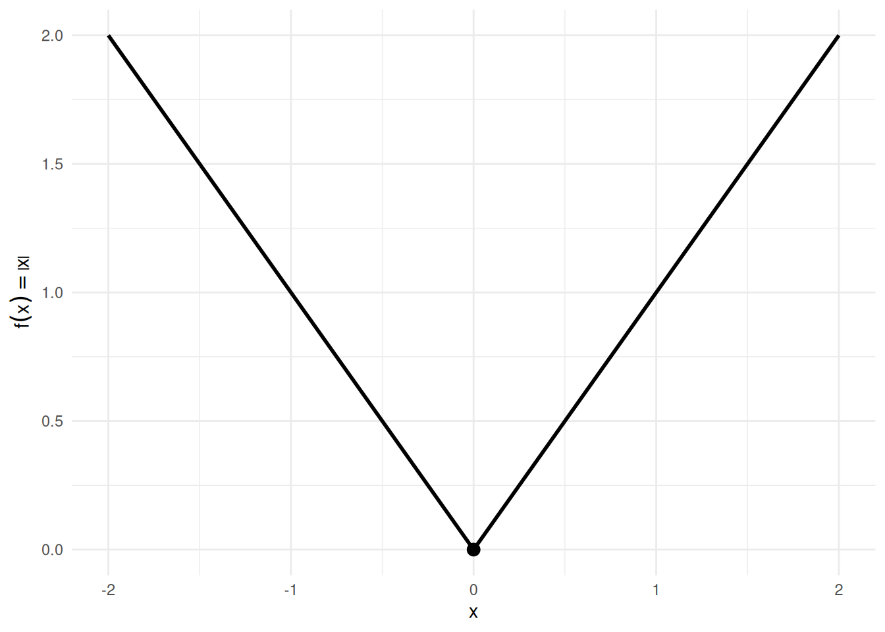
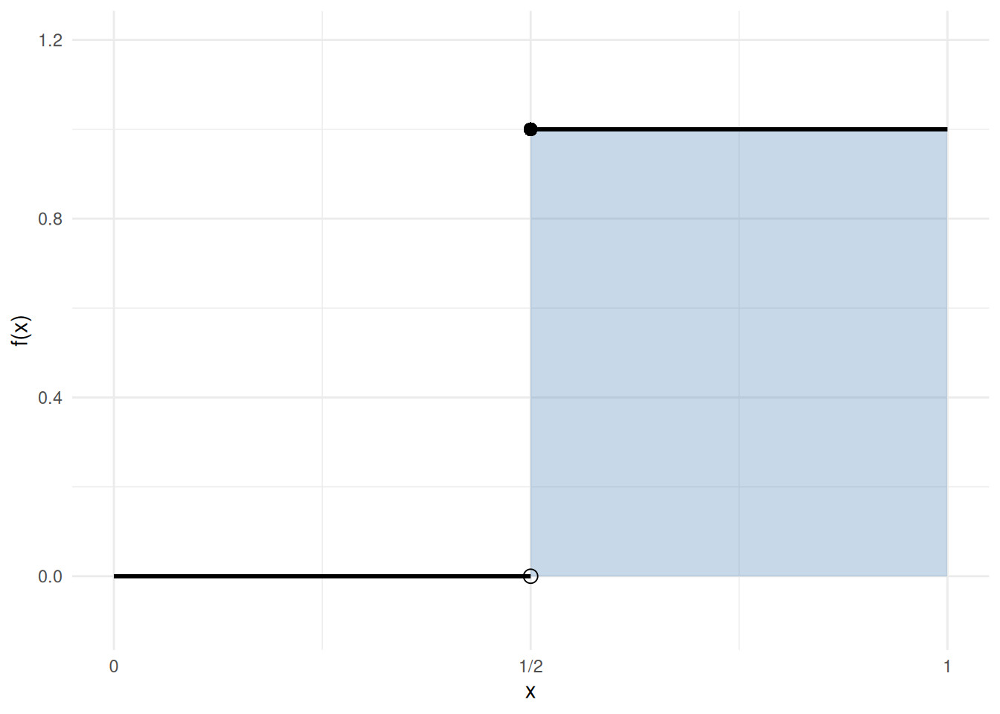
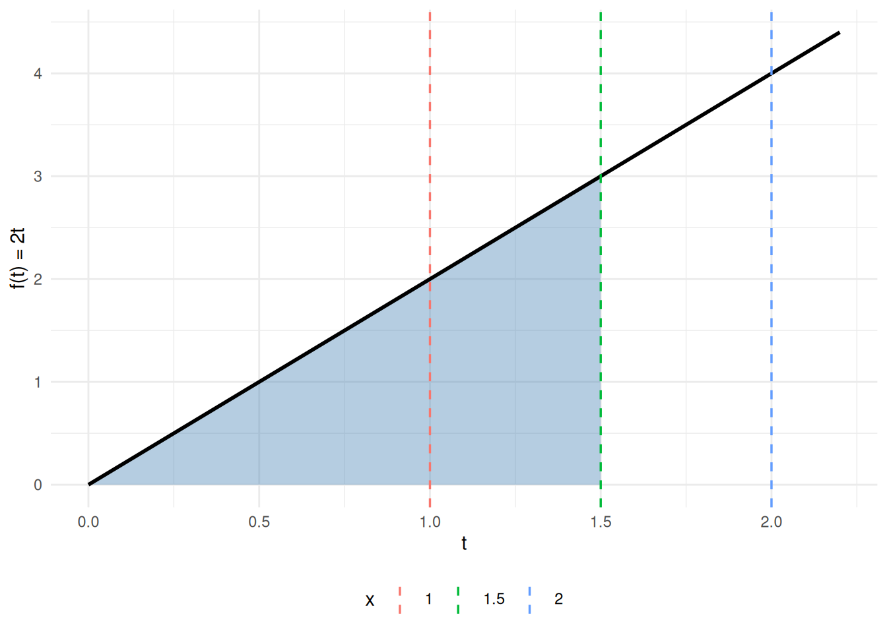

# Calculus

Code

- [Show All Code](javascript:void(0))

- [Hide All Code](javascript:void(0))

- 

  ------------------------------------------------------------------------

- [View Source](javascript:void(0))

Published

Last modified: 2026-10-06 02:04:42 (PDT)

## 1 Derivatives

### 1.1 Limits and derivatives

> **NOTE:**
>
> **Definition 1 (Limit of a function at a point)** Let \\f\\ be a [function](sets-functions.llms.md#def-function) defined at every point of an [open interval](sets-functions.llms.md#def-interval) around \\c\\, except possibly at \\c\\ itself, and let \\L\\ be a [real number](notation.llms.md#def-real-numbers). The **limit** of \\f(x)\\ as \\x\\ approaches \\c\\ is \\L\\, written \\\lim\_{x \to c} f(x) = L\\, if for every \\\epsilon \> 0\\ there is a \\\delta \> 0\\ such that
>
> \\\mathopen{}\left\|f(x) - L\right\|\mathclose{} \< \epsilon \quad \text{for every } x \text{ with } 0 \< \mathopen{}\left\|x - c\right\|\mathclose{} \< \delta.\\
>
> Here \\\mathopen{}\left\|\cdot\right\|\mathclose{}\\ is the [absolute value](algebra.llms.md#def-absolute-value). When such a real number \\L\\ exists, the limit **exists**; otherwise, the limit does not exist. The value \\f(c)\\, if it is defined, plays no role.

> **NOTE:**
>
> **Example 1 (The limit of \\3x + 1\\ at \\2\\)** \\\lim\_{x \to 2} (3x + 1) = 7\\. Given \\\epsilon \> 0\\, take \\\delta = \epsilon / 3\\. For every \\x\\ with \\0 \< \mathopen{}\left\|x - 2\right\|\mathclose{} \< \delta\\, using the [distributive law](algebra.llms.md#def-distributive) in the second line,
>
> \\ \begin{aligned} \mathopen{}\left\|(3x + 1) - 7\right\|\mathclose{} &= \mathopen{}\left\|3x - 6\right\|\mathclose{} && \text{(subtract)} \\ &= \mathopen{}\left\|3(x - 2)\right\|\mathclose{} && \text{(distributive law)} \\ &= 3 \mathopen{}\left\|x - 2\right\|\mathclose{} && \text{(} \mathopen{}\left\|3y\right\|\mathclose{} = 3 \mathopen{}\left\|y\right\|\mathclose{} \text{, since } 3 \> 0 \text{)} \\ &\< 3 \cdot\frac{\epsilon}{3} && \text{(} \mathopen{}\left\|x - 2\right\|\mathclose{} \< \delta = \epsilon / 3 \text{)} \\ &= \epsilon && \text{(multiply)} \end{aligned} \\
>
> For example, with \\\epsilon = 0.3\\ and \\\delta = 0.1\\, the point \\x = 2.05\\ satisfies \\0 \< \mathopen{}\left\|2.05 - 2\right\|\mathclose{} \< 0.1\\, and \\\mathopen{}\left\|(3 \cdot 2.05 + 1) - 7\right\|\mathclose{} = \mathopen{}\left\|7.15 - 7\right\|\mathclose{} = 0.15 \< 0.3\\.

> **NOTE:**
>
> **Definition 2 (One-sided limits)** Let \\f\\ be a function and \\L\\ a real number.
>
> - The **right-hand limit** of \\f\\ at \\c\\ is \\L\\, written \\\lim\_{x \to c^+} f(x) = L\\, if for every \\\epsilon \> 0\\ there is a \\\delta \> 0\\ such that \\\mathopen{}\left\|f(x) - L\right\|\mathclose{} \< \epsilon\\ for every \\x\\ with \\c \< x \< c + \delta\\.
> - The **left-hand limit** of \\f\\ at \\c\\ is \\L\\, written \\\lim\_{x \to c^-} f(x) = L\\, if for every \\\epsilon \> 0\\ there is a \\\delta \> 0\\ such that \\\mathopen{}\left\|f(x) - L\right\|\mathclose{} \< \epsilon\\ for every \\x\\ with \\c - \delta \< x \< c\\.
>
> These are the **one-sided limits** of \\f\\ at \\c\\. The limit \\\lim\_{x \to c} f(x)\\ ([Definition 1](#def-limit)) exists exactly when both one-sided limits exist and are equal, and then all three are equal.

> **NOTE:**
>
> **Example 2 (One-sided limits of a step function)** Let \\H(x) = 1\\ for \\x \ge 0\\ and \\H(x) = 0\\ for \\x \< 0\\.
>
> - \\\lim\_{x \to 0^+} H(x) = 1\\, because \\H(x) = 1\\ for every \\x \> 0\\.
> - \\\lim\_{x \to 0^-} H(x) = 0\\, because \\H(x) = 0\\ for every \\x \< 0\\.
>
> The one-sided limits differ, since \\1 \ne 0\\, so \\\lim\_{x \to 0} H(x)\\ does not exist.

> **TIP:**
>
> Jon Krohn’s “Calculus for Machine Learning” YouTube playlist introduces limits and derivatives:
>
> - [Calculating Limits](https://www.youtube.com/watch?v=VUlOwf9P9Pc&list=PLRDl2inPrWQVu2OvnTvtkRpJ-wz-URMJx)
> - [Exercises on Limits](https://www.youtube.com/watch?v=_2S3V5_DqAc&list=PLRDl2inPrWQVu2OvnTvtkRpJ-wz-URMJx)
> - [Intro to Differential Calculus](https://www.youtube.com/watch?v=w1NJFmUEHWg&list=PLRDl2inPrWQVu2OvnTvtkRpJ-wz-URMJx)
> - [How Derivatives Arise from Limits](https://www.youtube.com/watch?v=9l0b37Kb030&list=PLRDl2inPrWQVu2OvnTvtkRpJ-wz-URMJx)
> - [Derivative Notation](https://www.youtube.com/watch?v=457-HLoOo6U&list=PLRDl2inPrWQVu2OvnTvtkRpJ-wz-URMJx)

> **NOTE:**
>
> **Definition 3 (Difference quotient)** Let \\f\\ be a real-valued function of one variable, defined at \\c\\ and at \\c + h\\, with \\h \ne 0\\. The **difference quotient** of \\f\\ at \\c\\ with increment \\h\\ is
>
> \\ \frac{f(c + h) - f(c)}{h}, \\
>
> the [slope](algebra.llms.md#def-affine-function) of the line through the points \\(c, f(c))\\ and \\(c + h, f(c + h))\\.

> **NOTE:**
>
> **Example 3 (The difference quotient of \\x^2\\ at \\1\\)** For \\f(x) = x^2\\, \\c = 1\\, and \\h \ne 0\\,
>
> \\ \begin{aligned} \frac{f(1 + h) - f(1)}{h} &= \frac{(1 + h)^2 - 1}{h} && \text{(substitute into } f \text{)} \\ &= \frac{1 + 2h + h^2 - 1}{h} && \text{(expand } (1 + h)^2 \text{)} \\ &= \frac{2h + h^2}{h} && \text{(} 1 - 1 = 0 \text{)} \\ &= 2 + h, && \text{(divide by } h \ne 0 \text{)} \end{aligned} \\
>
> which tends to \\2\\ as \\h \to 0\\ ([Definition 1](#def-limit)). With \\h = 0.1\\ the difference quotient is \\2 + 0.1 = 2.1\\: the line through \\(1, 1)\\ and \\(1.1, 1.21)\\ has slope \\\tfrac{1.21 - 1}{0.1} = \tfrac{0.21}{0.1} = 2.1\\.

> **NOTE:**
>
> **Definition 4 (Differentiable function)** A function \\f\\ is **differentiable at** \\x = c\\ if the limit ([Definition 1](#def-limit)) of the difference quotient ([Definition 3](#def-difference-quotient)) as \\h \to 0\\,
>
> \\f'(c) \stackrel{\text{def}}{=}\lim\_{h \to 0} \frac{f(c + h) - f(c)}{h},\\
>
> exists and is finite. The number \\f'(c)\\ is the derivative of \\f\\ at \\c\\ ([Definition 5](#def-derivative)).
>
> ([Larson and Edwards 2018, sec. 2.1](#ref-larsonCalc11e), p. 100)

> **NOTE:**
>
> **Example 4 (A differentiable function, and a limit that is not finite)**  
>
> - \\f(x) = x^2\\ is differentiable at \\c = 3\\:
>
>   \\ \begin{aligned} \frac{f(3 + h) - f(3)}{h} &= \frac{(3 + h)^2 - 3^2}{h} && \text{(substitute } f(x) = x^2 \text{)} \\ &= \frac{9 + 6h + h^2 - 9}{h} && \text{(expand } (3 + h)^2 \text{)} \\ &= \frac{6h + h^2}{h} && \text{(cancel } 9 - 9 \text{)} \\ &= 6 + h && \text{(divide by } h \ne 0 \text{)} \end{aligned} \\
>
>   which tends to the finite limit \\f'(3) = 6\\ as \\h \to 0\\.
>
> - \\g(x) = \sqrt\[3\]{x}\\ is not differentiable at \\c = 0\\: the difference quotient \\\tfrac{g(h) - g(0)}{h} = \tfrac{\sqrt\[3\]{h}}{h} = \tfrac{1}{(\sqrt\[3\]{h})^2}\\ grows without bound as \\h \to 0\\, so the limit is not finite.

> **NOTE:**
>
> **Definition 5 (Derivative)** If \\f\\ is differentiable at \\c\\ ([Definition 4](#def-differentiable)), the number \\f'(c)\\ is the **derivative** of \\f\\ at \\c\\. The **derivative** of \\f\\ is the function \\f'\\ whose value at each \\x\\ where \\f\\ is differentiable is \\f'(x)\\. Writing the derivative with a prime, as \\f'\\ or \\f'(x)\\, is **Lagrange’s notation**. The derivative of \\f\\ is also written \\\frac{d f}{d x}\\ or \\\frac{d }{d x} f(x)\\, which is **Leibniz notation**.

> **NOTE:**
>
> **Example 5 (The derivative of \\x^2\\)** For \\f(x) = x^2\\, the computation in [Example 4](#exm-differentiable), with \\3\\ replaced by any real number \\c\\, gives \\\frac{f(c + h) - f(c)}{h} = 2c + h\\, which tends to \\2c\\ as \\h \to 0\\. So the derivative of \\f\\ is \\f'(x) = 2x\\. For example, \\f'(3) = 6\\ and \\f'(-1) = -2\\.

> **NOTE:**
>
> **Definition 6 (One-sided derivatives)** Let \\f\\ be a function defined at \\c\\.
>
> - The **right-hand derivative** of \\f\\ at \\c\\ is the right-hand limit ([Definition 2](#def-one-sided-limit)) \\\lim\_{h \to 0^+} \frac{f(c + h) - f(c)}{h}\\ of the difference quotient ([Definition 3](#def-difference-quotient)), when that limit exists and is finite.
> - The **left-hand derivative** of \\f\\ at \\c\\ is the left-hand limit \\\lim\_{h \to 0^-} \frac{f(c + h) - f(c)}{h}\\, when that limit exists and is finite.
>
> These are the **one-sided derivatives** of \\f\\ at \\c\\.

> **NOTE:**
>
> **Example 6 (One-sided derivatives of \\\mathopen{}\left\|x\right\|\mathclose{}\\ at \\0\\)** Let \\f(x) = \mathopen{}\left\|x\right\|\mathclose{}\\, the [absolute value](algebra.llms.md#def-absolute-value), and \\c = 0\\.
>
> - For \\h \> 0\\, \\\mathopen{}\left\|h\right\|\mathclose{} = h\\, so \\\frac{f(0 + h) - f(0)}{h} = \frac{h - 0}{h} = 1\\. The right-hand derivative of \\f\\ at \\0\\ is \\1\\.
> - For \\h \< 0\\, \\\mathopen{}\left\|h\right\|\mathclose{} = -h\\, so \\\frac{f(0 + h) - f(0)}{h} = \frac{-h - 0}{h} = -1\\. The left-hand derivative of \\f\\ at \\0\\ is \\-1\\.
>
> For example, \\h = 0.5\\ gives \\\tfrac{0.5}{0.5} = 1\\, and \\h = -0.5\\ gives \\\tfrac{0.5}{-0.5} = -1\\. The one-sided derivatives differ, since \\1 \ne -1\\.

> **NOTE:**
>
> **Definition 7 (Second derivative)** Let \\f\\ be a real-valued function of one variable whose derivative \\f'\\ ([Definition 5](#def-derivative)) exists at every point of an [open interval](sets-functions.llms.md#def-interval) containing \\c\\. If \\f'\\ is differentiable ([Definition 4](#def-differentiable)) at \\c\\, its derivative there, written \\f''(c)\\ or \\\frac{d ^2 f}{d x^2}\\, is the **second derivative** of \\f\\ at \\c\\.

> **NOTE:**
>
> **Example 7 (The second derivative of \\x^3\\)** For \\f(x) = x^3\\, the power rule ([Theorem 3](#thm-deriv-polynomial)) gives \\f'(x) = 3x^2\\ at every \\x\\, and differentiating again, with the constant multiple rule ([Theorem 2](#thm-deriv-const-factor)), gives \\f''(x) = 3 \cdot 2x = 6x\\. So \\f''(2) = 12\\, \\f''(0) = 0\\, and \\f''(-1) = -6\\.

### 1.2 Derivative rules

> **NOTE:**
>
> **Theorem 1 (Constant rule)** If \\c\\ is constant with respect to \\x\\, then
>
> \\\frac{\partial}{\partial x}c = 0\\

> **TIP:**
>
> Jon Krohn’s “Calculus for Machine Learning” YouTube playlist has a video on this rule:
>
> - [The Derivative of a Constant](https://www.youtube.com/watch?v=GL5Rqgn7i9g&list=PLRDl2inPrWQVu2OvnTvtkRpJ-wz-URMJx)

> **NOTE:**
>
> **Theorem 2 (Constant multiple rule)** If \\a\\ is constant with respect to \\x\\ and \\y\\ is a differentiable function of \\x\\, then: \\\frac{\partial}{\partial x}ay = a \frac{\partial y}{\partial x}\\

> **TIP:**
>
> Jon Krohn’s “Calculus for Machine Learning” YouTube playlist has a video on this rule:
>
> - [The Constant Multiple Rule for Derivatives](https://www.youtube.com/watch?v=zgNEiW0JHQA&list=PLRDl2inPrWQVu2OvnTvtkRpJ-wz-URMJx)

> **NOTE:**
>
> **Theorem 3 (Power rule)** For every real number \\q\\ and every \\x \> 0\\, the derivative of the [power](algebra.llms.md#def-real-power) \\x^q\\ is:
>
> \\\frac{\partial}{\partial x}x^q = qx^{q-1}\\
>
> When \\q\\ is a positive [integer](notation.llms.md#def-integers), the same formula holds for every real \\x\\.

> **TIP:**
>
> Jon Krohn’s “Calculus for Machine Learning” YouTube playlist has videos on this rule, on the sum rule (the derivative of a sum is the sum of the derivatives), and on exercises that combine the rules so far:
>
> - [The Power Rule for Derivatives](https://www.youtube.com/watch?v=pyB2Rpcs6LQ&list=PLRDl2inPrWQVu2OvnTvtkRpJ-wz-URMJx)
> - [The Sum Rule for Derivatives](https://www.youtube.com/watch?v=WgjuA94Dj54&list=PLRDl2inPrWQVu2OvnTvtkRpJ-wz-URMJx)
> - [Exercises on Derivative Rules](https://www.youtube.com/watch?v=EANCBJiw9pE&list=PLRDl2inPrWQVu2OvnTvtkRpJ-wz-URMJx)

> **NOTE:**
>
> **Theorem 4 (Derivative of natural logarithm)** For every \\x \> 0\\, the derivative of the [natural logarithm](algebra.llms.md#def-natural-log) is:
>
> \\\operatorname{log}'\mathopen{}\left\\x\right\\\mathclose{} = \frac{1}{x} = x^{-1}\\

> **NOTE:**
>
> **Theorem 5 (derivative of exponential)** For every real \\x\\, the derivative of the [exponential function](algebra.llms.md#def-exponential-function) is:
>
> \\\operatorname{exp}'\mathopen{}\left\\x\right\\\mathclose{} = \operatorname{exp}\mathopen{}\left\\x\right\\\mathclose{}\\

> **NOTE:**
>
> **Theorem 6 (Product rule)** If \\a\\ and \\b\\ are differentiable functions of \\x\\, then
>
> \\(ab)' = ab' + ba'\\

> **TIP:**
>
> Jon Krohn’s “Calculus for Machine Learning” YouTube playlist has a video on this rule:
>
> - [The Product Rule for Derivatives](https://www.youtube.com/watch?v=-YFKJRp9Ncc&list=PLRDl2inPrWQVu2OvnTvtkRpJ-wz-URMJx)

> **NOTE:**
>
> **Theorem 7 (Quotient rule)** If \\a\\ and \\b\\ are differentiable functions of \\x\\ and \\b \neq 0\\, then
>
> \\(a/b)' = a'/b - (a/b^2)b'\\

> **TIP:**
>
> Jon Krohn’s “Calculus for Machine Learning” YouTube playlist has a video on this rule:
>
> - [The Quotient Rule for Derivatives](https://www.youtube.com/watch?v=apqvDKiWMsQ&list=PLRDl2inPrWQVu2OvnTvtkRpJ-wz-URMJx)

> **NOTE:**
>
> **Theorem 8 (Chain rule)** If \\a\\ is a differentiable function of \\b\\, and \\b\\ is a differentiable function of \\c\\, then \\a\\ is a differentiable function of \\c\\, and
>
> \\\begin{aligned} \frac{d a}{d c} &= \frac{d a}{d b} \frac{d b}{d c} \\ &= \frac{d b}{d c} \frac{d a}{d b} \end{aligned} \\
>
> or in Lagrange’s notation ([Definition 5](#def-derivative)), if \\g\\ is differentiable at \\x\\ and \\f\\ is differentiable at \\g(x)\\, then for the [composition](sets-functions.llms.md#def-composition) \\f \circ g\\, with inner function \\g\\ and outer function \\f\\:
>
> \\(f(g(x)))' = g'(x) f'(g(x))\\

> **NOTE:**
>
> **Corollary 1 (Chain rule for logarithms)** If \\f\\ is differentiable at \\x\\ and \\f(x) \> 0\\, then
>
> \\ \frac{d }{d x}\operatorname{log}\mathopen{}\left\\f(x)\right\\\mathclose{} = \frac{f'(x)}{f(x)} \\

> **NOTE:**
>
> *Proof*. Apply [Theorem 8](#thm-chain-rule) and [Theorem 4](#thm-deriv-log):
>
> \\ \begin{aligned} \frac{d }{d x}\operatorname{log}\mathopen{}\left\\f(x)\right\\\mathclose{} &= f'(x) \cdot\operatorname{log}'\mathopen{}\left\\f(x)\right\\\mathclose{} && \text{(chain rule, with } g = f \text{ and outer function } \log \text{)} \\ &= f'(x) \cdot\frac{1}{f(x)} && \text{(derivative of } \log \text{, valid because } f(x) \> 0 \text{)} \\ &= \frac{f'(x)}{f(x)} && \text{(multiply)} \end{aligned} \\

> **TIP:**
>
> Jon Krohn’s “Calculus for Machine Learning” YouTube playlist has videos on this rule and on exercises that combine it with the other rules:
>
> - [The Chain Rule for Derivatives](https://www.youtube.com/watch?v=zFOD3NR5I4Q&list=PLRDl2inPrWQVu2OvnTvtkRpJ-wz-URMJx)
> - [The Power Rule on a Function Chain](https://www.youtube.com/watch?v=JXG4g196cG0&list=PLRDl2inPrWQVu2OvnTvtkRpJ-wz-URMJx)
> - [Advanced Exercises on Derivative Rules](https://www.youtube.com/watch?v=Qkyq95jYj9w&list=PLRDl2inPrWQVu2OvnTvtkRpJ-wz-URMJx)

### 1.3 Linear approximation

For a differentiable function \\f\\ and a small step \\\epsilon\\,

\\f(w + \epsilon) \approx f(w) + \epsilon\\\frac{d }{d w}f(w) \tag{1}\\

> **NOTE:**
>
> **Definition 8 (Linear approximation)** For a function \\f\\ that is differentiable at \\w\\, the **linear approximation** of \\f\\ at \\w\\ (also called the **first-order Taylor approximation**) is the function of the step \\\epsilon\\
>
> \\\hat{f}\_w(\epsilon) = f(w) + \epsilon\\\frac{d }{d w}f(w)\\
>
> so [Equation 1](#eq-linear-approx) says \\f(w + \epsilon) \approx \hat{f}\_w(\epsilon)\\ for small \\\epsilon\\.

> **NOTE:**
>
> *Remark 1* (The “linear” approximation is affine). The linear approximation \\\hat{f}\_w\\ ([Definition 8](#def-linear-approximation)) is an [affine function](algebra.llms.md#def-affine-function) of the step \\\epsilon\\: its slope is \\\frac{d }{d w}f(w)\\ and its intercept is \\f(w)\\. It is [linear](algebra.llms.md#def-linear-function) in \\\epsilon\\ only when \\f(w) = 0\\. The name “linear approximation” uses “linear” in the looser sense of elementary algebra ([remark](algebra.llms.md#rem-linear-function-terminology)). Boyd and Vandenberghe ([2018](#ref-boyd2018vmls)), section 2.2, treats the first-order Taylor approximation as an affine function for functions of several variables as well.

> **NOTE:**
>
> **Definition 9 (Flat point)** Let \\f\\ be differentiable at \\c\\ ([Definition 4](#def-differentiable)). If \\f'(c) = 0\\, then \\c\\ is a **flat point** of \\f\\ (also called a *stationary point*).

> **NOTE:**
>
> **Example 8 (Flat points, and a point that is not one)**  
>
> - \\f(w) = w^3\\ has \\f'(w) = 3w^2\\, which is \\0\\ at \\w = 0\\, so \\0\\ is a flat point. Yet \\f(0) = 0\\ is neither the [minimum](algebra.llms.md#def-minimum) nor the [maximum](algebra.llms.md#def-maximum) of the values \\f\\ takes on any open interval around \\0\\: \\f(w) \< 0\\ for \\w \< 0\\ and \\f(w) \> 0\\ for \\w \> 0\\.
> - \\h(w) = w^2\\ has \\h'(1) = 2 \ne 0\\, so \\1\\ is not a flat point.

> **NOTE:**
>
> **Definition 10 (Critical point)** Let \\f\\ be a function defined on an [open interval](sets-functions.llms.md#def-interval) containing \\c\\. The point \\c\\ is a **critical point** of \\f\\ if either \\f'(c) = 0\\ or \\f\\ is not differentiable at \\c\\ ([Definition 4](#def-differentiable)). So every flat point ([Definition 9](#def-flat-point)) is a critical point.

> **NOTE:**
>
> **Example 9 (Critical points that are and are not flat points)**  
>
> - \\g(w) = \mathopen{}\left\|w\right\|\mathclose{}\\ has no derivative at \\w = 0\\: its one-sided derivatives there are \\1\\ and \\-1\\ ([Example 6](#exm-one-sided-derivative)), so the difference quotient \\\tfrac{\mathopen{}\left\|h\right\|\mathclose{} - 0}{h}\\ has no limit as \\h \to 0\\ ([Definition 2](#def-one-sided-limit)). So \\0\\ is a critical point of \\g\\ but not a flat point.
> - \\f(w) = w^3\\ has \\f'(0) = 3 \cdot 0^2 = 0\\, so \\0\\ is a flat point of \\f\\, and hence a critical point.
> - \\h(w) = w^2\\ is differentiable everywhere, with \\h'(w) = 2w\\, which is \\0\\ only at \\w = 0\\. So \\0\\ is the only critical point of \\h\\; for example, \\h'(1) = 2 \ne 0\\, so \\1\\ is not one.

> **NOTE:**
>
> **Definition 11 (Tangent line)** Let \\f\\ be differentiable at \\c\\ ([Definition 4](#def-differentiable)). The **tangent line** to the [graph](sets-functions.llms.md#def-graph) of \\f\\ at \\c\\ is the graph of the [affine function](algebra.llms.md#def-affine-function)
>
> \\x \mapsto f(c) + f'(c)\\(x - c),\\
>
> the line through the point \\(c, f(c))\\ with [slope](algebra.llms.md#def-affine-function) \\f'(c)\\. The slope \\f'(c)\\ is also called the **tangent slope** of \\f\\ at \\c\\.

> **NOTE:**
>
> **Example 10 (The tangent line to \\x^2\\ at \\1\\)** For \\f(x) = x^2\\ at \\c = 1\\, \\f(1) = 1\\ and \\f'(1) = 2\\ ([Example 5](#exm-derivative)), so the tangent line is the graph of
>
> \\ \begin{aligned} x &\mapsto 1 + 2\\(x - 1) && \text{(substitute } f(1) = 1 \text{ and } f'(1) = 2 \text{)} \\ &= 2x - 1 && \text{(distribute, and } 1 - 2 = -1 \text{)} \end{aligned} \\
>
> At \\x = 1.1\\ the tangent line has height \\2(1.1) - 1 = 1.2\\, close to the curve’s height \\f(1.1) = 1.21\\; the gap, \\1.21 - 1.2 = 0.01\\, is \\(1.1 - 1)^2\\.

Show R code

``` js
tanF = (w) => w * w - 4 * w + 7
tanDf = (w) => 2 * w - 4
tanPred = tanF(tanW) + tanEps * tanDf(tanW)
tanExact = tanF(tanW + tanEps)
```

Show R code

``` js
viewof tanW = Inputs.range([-1, 4], {value: 1, step: 0.05, label: "w"})
viewof tanEps = Inputs.range([0.01, 2], {value: 0.5, transform: Math.log, label: "step \u03b5", format: d3.format(".3~f")})
```

Show R code

``` js
md`At w = ${tanW.toFixed(2)}, f(w) = ${tanF(tanW).toFixed(4)} and f\u2032(w) = ${tanDf(tanW).toFixed(2)}.

A step of \u03b5 = ${tanEps.toFixed(3)}:

- predicted by the tangent line, f(w) + \u03b5 f\u2032(w) = ${tanPred.toFixed(4)};
- exact, f(w + \u03b5) = ${tanExact.toFixed(4)};
- error ${(tanExact - tanPred).toPrecision(3)}, and error / \u03b5\u00b2 = ${((tanExact - tanPred) / tanEps ** 2).toFixed(3)}.`
```

Show R code

``` js
Plot.plot({
  ariaLabel: 'The parabola f of w, ' +
    'with the tangent line at the chosen w, ' +
    'and two points above w plus epsilon: ' +
    'one on the tangent line (the prediction) and one on the curve (the exact value), ' +
    'joined by a red segment showing the error.',
  width: 460, height: 340, grid: true,
  x: {domain: [-1.5, 6.5], label: "w"},
  y: {domain: [0, 20], label: "f(w)"},
  marks: [
    Plot.line(d3.range(-1.5, 6.51, 0.05), {x: (w) => w, y: tanF, stroke: "#555", strokeWidth: 2, clip: true}),
    Plot.line([-1.5, 6.5], {x: (w) => w, y: (w) => tanF(tanW) + (w - tanW) * tanDf(tanW),
                        stroke: "#1f77b4", strokeWidth: 2, strokeDasharray: "6,4", clip: true}),
    Plot.ruleX([tanW + tanEps], {stroke: "#bbb", strokeDasharray: "2,3"}),
    Plot.link([0], {x1: tanW + tanEps, x2: tanW + tanEps, y1: tanPred, y2: tanExact,
                    stroke: "#d62728", strokeWidth: 3, clip: true}),
    Plot.dot([[tanW, tanF(tanW)]], {x: (d) => d[0], y: (d) => d[1], r: 5, fill: "#222"}),
    Plot.dot([[tanW + tanEps, tanPred]], {x: (d) => d[0], y: (d) => d[1], r: 4, fill: "#1f77b4", clip: true}),
    Plot.dot([[tanW + tanEps, tanExact]], {x: (d) => d[0], y: (d) => d[1], r: 4, fill: "#555", clip: true})
  ]
})
```

The dashed blue line is the tangent line ([Definition 11](#def-tangent-line)) at \\w\\; the red segment is the error of the prediction.

Figure 1: The linear approximation [Equation 1](#eq-linear-approx) for \\f(w) = w^2 - 4w + 7\\, at any \\w\\ and step \\\epsilon\\.

> **NOTE:**
>
> **Exercise 1 (Find the flat point, and check the approximation)** Let \\f(w) = w^2 - 4w + 7\\.
>
> 1.  Differentiate \\f\\.
> 2.  Find the flat point \\w\\ of \\f\\, and say whether \\f(w)\\ is the [minimum](algebra.llms.md#def-minimum) or the [maximum](algebra.llms.md#def-maximum) of the values of \\f\\.
> 3.  Evaluate the derivative at \\w = 1\\, use [Equation 1](#eq-linear-approx) to predict \\f(1.01)\\, and compare that prediction with the exact value.

> **NOTE:**
>
> *Solution 1*. **1.** Term by term:
>
> \\\frac{df}{dw} = 2w - 4\\
>
> **2.** Set it to zero: \\2w - 4 = 0\\ gives \\w = 2\\. \\f(2) = 4 - 8 + 7 = 3\\ is the minimum of the values of \\f\\. Completing the square, \\f(w) = (w - 2)^2 + 3\\, since \\(w - 2)^2 + 3 = w^2 - 4w + 4 + 3 = w^2 - 4w + 7\\, and \\(w - 2)^2 \ge 0\\, so \\f(w) \ge 3 = f(2)\\ for every \\w\\. Equivalently, the derivative is negative below \\w = 2\\ and positive above it, so the function falls into that point and rises out of it.
>
> **3.** At \\w = 1\\ the derivative is \\2(1) - 4 = -2\\, so \\f\\ is falling there. With \\\epsilon = 0.01\\, [Equation 1](#eq-linear-approx) predicts a change of \\(0.01)(-2) = -0.02\\, from \\f(1) = 1 - 4 + 7 = 4\\ to \\3.98\\. The exact value is
>
> \\f(1.01) = (1.01)^2 - 4(1.01) + 7 = 1.0201 - 4.04 + 7 = 3.9801\\
>
> a change of \\-0.0199\\. The prediction is off by \\0.0001\\, which is \\\epsilon^2\\: the linear approximation drops everything of that order and smaller, so halving the step quarters the error. That trade is the whole bargain of [gradient descent](vector-calculus.llms.md#def-gradient-descent), the step-by-step method of fitting models defined on the vector calculus page. We take a step in the direction the derivative recommends, and the recommendation is trustworthy only as far as the step is small.

## 2 Integration

Integration is the inverse operation of differentiation: it recovers a function from its derivative and accumulates quantities such as areas, totals, and probabilities. We begin with antiderivatives, then state basic integration rules, and conclude with the Fundamental Theorem of Calculus and a worked example from probability.

> **TIP:**
>
> Jon Krohn’s “Calculus for Machine Learning” YouTube playlist introduces integral calculus:
>
> - [Intro to Integral Calculus](https://www.youtube.com/watch?v=PNdKPsiaPhU&list=PLRDl2inPrWQVu2OvnTvtkRpJ-wz-URMJx)
> - [What Integral Calculus Is](https://www.youtube.com/watch?v=O7TuAb_jHTs&list=PLRDl2inPrWQVu2OvnTvtkRpJ-wz-URMJx)

### 2.1 Antiderivatives

> **NOTE:**
>
> **Definition 12 (Antiderivative)** A function \\F\\ is an **antiderivative** of \\f\\ on an interval \\I\\ if:
>
> \\\frac{\partial}{\partial x} F(x) = f(x), \quad \forall x \in I\\
>
> Finding an antiderivative of \\f\\ is called **antidifferentiation**, or **antidifferentiating** \\f\\.
>
> ([Larson and Edwards 2018, sec. 4.1](#ref-larsonCalc11e), pp. 248–249)

> **NOTE:**
>
> **Definition 13 (Indefinite integral)** The **indefinite integral** of \\f\\ is the family of all antiderivatives ([Definition 12](#def-antiderivative)) of \\f\\:
>
> \\\int f(x)\\dx = F(x) + C\\
>
> where \\F\\ is any one antiderivative of \\f\\ and \\C\\ is an arbitrary constant of integration.
>
> ([Larson and Edwards 2018, sec. 4.1](#ref-larsonCalc11e), pp. 248–249)

> **NOTE:**
>
> **Example 11 (Antiderivative of \\x^2\\)** For \\f(x) = x^2\\, an antiderivative is \\F(x) = \frac{x^3}{3}\\, since \\\frac{\partial}{\partial x}\frac{x^3}{3} = x^2 = f(x)\\.
>
> Adding any constant \\C\\ gives another antiderivative; for example, with \\C = 7\\, \\F(x) = \frac{x^3}{3} + 7\\ also satisfies \\F'(x) = x^2\\, since adding a constant does not change the derivative. \\G(x) = x^3\\ is not an antiderivative of \\x^2\\: \\G'(x) = 3x^2 \ne x^2\\ for \\x \ne 0\\.
>
> See [Figure 2](#fig-antiderivatives).
>
> Show R code
>
> ``` downlit
> ggplot2::ggplot() +
>   ggplot2::geom_function(fun = \(x) x^2, xlim = x_lim, linewidth = 1) +
>   ggplot2::labs(x = "x", y = expression(f(x))) +
>   ggplot2::theme_minimal()
> ```
>
> [](calculus_files/figure-html/antiderivatives-f-code-1.png "Figure 2 (a): The function f(x) = x^2.")
>
> \(a\) The function \\f(x) = x^2\\.
>
> Show R code
>
> ``` downlit
> x_seq <- seq(x_lim[1], x_lim[2], length.out = 200)
> df <- do.call(rbind, lapply(C_vals, \(C) {
>   data.frame(
>     x = x_seq,
>     y = x_seq^3 / 3 + C,
>     C = factor(C)
>   )
> }))
>
> ggplot2::ggplot(df, ggplot2::aes(x = x, y = y, color = C)) +
>   ggplot2::geom_line(linewidth = 0.8) +
>   ggplot2::labs(x = "x", y = expression(F(x)), color = "C") +
>   ggplot2::theme_minimal()
> ```
>
> [](calculus_files/figure-html/antiderivatives-F-code-1.png "Figure 2 (b): Family of antiderivatives F(x) = x^3/3 + C.")
>
> \(b\) Family of antiderivatives \\F(x) = x^3/3 + C\\.
>
> Figure 2: The function \\f(x) = x^2\\ and five antiderivatives \\F(x) = x^3/3 + C\\ for \\C \in \\-2, -1, 0, 1, 2\\\\. Each antiderivative has the same derivative \\f\\; they differ only by a vertical shift.

> **NOTE:**
>
> **Theorem 9 (Basic integration rules)** Each antiderivative in the table is defined only up to an arbitrary constant \\C\\ (see [Definition 12](#def-antiderivative)); the table omits \\+ C\\ from every row for brevity.
>
> | Function \\f(x)\\ | Antiderivative \\F(x)\\ | Condition |
> |:--:|:--:|:---|
> | \\c\\ | \\cx\\ | — |
> | \\x^n\\ | \\\dfrac{x^{n+1}}{n+1}\\ | \\n \ne -1\\ |
> | \\\dfrac{1}{x}\\ | \\\operatorname{log}\mathopen{}\left\\\mathopen{}\left\|x\right\|\mathclose{}\right\\\mathclose{}\\ | \\x \ne 0\\ |
> | \\\text{e}^{x}\\ | \\\text{e}^{x}\\ | (self-antiderivative) |
> | \\\text{e}^{cx}\\ | \\\dfrac{1}{c}\text{e}^{cx}\\ | \\c \ne 0\\ |
> | \\c \cdot f(x)\\ | \\c \cdot F(x)\\ | — |
> | \\f(x) + g(x)\\ | \\F(x) + G(x)\\ | — |
>
> The first two rows and the bottom two rows (linearity) are from ([Larson and Edwards 2018, sec. 4.1](#ref-larsonCalc11e), p. 250 “Basic Integration Rules”); \\1/x\\ is from ([Larson and Edwards 2018, sec. 5.2](#ref-larsonCalc11e), Theorem 5.5, p. 324); \\\text{e}^{x}\\ and \\\text{e}^{cx}\\ are from ([Larson and Edwards 2018, sec. 5.4](#ref-larsonCalc11e), Theorem 5.12, p. 346).

> **NOTE:**
>
> **Example 12 (Antiderivative of \\3x^2 - 1\\)** By the power rule (\\n = 2\\) and linearity from [Theorem 9](#thm-integral-rules):
>
> \\ \int \mathopen{}\left(3x^2 - 1\right)\mathclose{}\\dx = 3 \cdot\frac{x^3}{3} - x + C = x^3 - x + C. \\
>
> Verify by differentiating: \\\frac{\partial}{\partial x}\mathopen{}\left(x^3 - x + C\right)\mathclose{} = 3x^2 - 1 = f(x)\\, as required.

> **TIP:**
>
> Jon Krohn’s “Calculus for Machine Learning” YouTube playlist has videos on these rules:
>
> - [The Integral Calculus Rules](https://www.youtube.com/watch?v=d-pyobAQ0iI&list=PLRDl2inPrWQVu2OvnTvtkRpJ-wz-URMJx)
> - [Indefinite Integral Exercises](https://www.youtube.com/watch?v=PoTWa8X_EpI&list=PLRDl2inPrWQVu2OvnTvtkRpJ-wz-URMJx)

### 2.2 Regularity Conditions

> **NOTE:**
>
> **Definition 14 (Differentiable on an interval)** A function \\f\\ is **differentiable on** an interval if it is differentiable ([Definition 4](#def-differentiable)) at every point of the interval other than its [endpoints](sets-functions.llms.md#def-interval), and, at each endpoint that belongs to the interval, it has the one-sided derivative ([Definition 6](#def-one-sided-derivative)) from inside the interval: the right-hand derivative at the left endpoint and the left-hand derivative at the right endpoint.
>
> ([Larson and Edwards 2018, sec. 2.1](#ref-larsonCalc11e), p. 100)

> **NOTE:**
>
> **Example 13 (Differentiable on one interval but not another)**  
>
> - \\f(x) = x^2\\ is differentiable on \\\[0, 1\]\\: the computation of [Example 4](#exm-differentiable) with \\3\\ replaced by any \\c\\ gives \\\tfrac{f(c + h) - f(c)}{h} = 2c + h\\, which tends to \\2c\\, including the one-sided limits at the endpoints \\0\\ and \\1\\.
> - \\g(x) = \sqrt\[3\]{x}\\ is differentiable on \\\[1, 2\]\\, but not on \\\[-1, 1\]\\: the point \\0\\ is in \\\[-1, 1\]\\ and is not an endpoint, and [Example 4](#exm-differentiable) shows \\g\\ is not differentiable there.

> **NOTE:**
>
> **Definition 15 (Continuous function)** A function \\f\\ is **continuous at** \\x = c\\ if all three conditions hold:
>
> 1.  \\f(c)\\ is defined,
> 2.  \\\lim\_{x \to c} f(x)\\ exists, and
> 3.  \\\lim\_{x \to c} f(x) = f(c)\\.
>
> If any of the three conditions fails, \\f\\ is **discontinuous** at \\c\\.
>
> ([Larson and Edwards 2018, sec. 1.4](#ref-larsonCalc11e), p. 73)

> **NOTE:**
>
> **Example 14 (A continuous function, and one failure of each condition)**  
>
> - \\f(x) = x^2\\ is continuous at \\c = 1\\: \\f(1) = 1\\ is defined, and \\\lim\_{x \to 1} x^2 = 1 = f(1)\\.
> - \\g(x) = \tfrac{x^2 - 1}{x - 1}\\ fails condition 1 at \\c = 1\\: \\g(1)\\ is not defined (it would divide by zero), even though \\\lim\_{x \to 1} g(x) = \lim\_{x \to 1} (x + 1) = 2\\ exists (\\x^2 - 1 = (x - 1)(x + 1)\\, and the factor \\x - 1\\ cancels for \\x \ne 1\\).
> - The step function \\H(x) = 1\\ for \\x \ge 0\\ and \\H(x) = 0\\ for \\x \< 0\\ fails condition 2 at \\c = 0\\: values to the left are all \\0\\ and values to the right are all \\1\\, so \\\lim\_{x \to 0} H(x)\\ does not exist.
> - \\k(x) = x^2\\ for \\x \ne 1\\, with \\k(1) = 5\\, fails condition 3 at \\c = 1\\: \\\lim\_{x \to 1} k(x) = 1\\ exists but differs from \\k(1) = 5\\.

> **NOTE:**
>
> **Definition 16 (Jump discontinuity)** A function \\f\\ has a **jump discontinuity** at \\c\\ if both one-sided limits ([Definition 2](#def-one-sided-limit)) \\\lim\_{x \to c^-} f(x)\\ and \\\lim\_{x \to c^+} f(x)\\ exist but are not equal. Then \\\lim\_{x \to c} f(x)\\ does not exist, so \\f\\ is discontinuous at \\c\\ ([Definition 15](#def-continuous)).

> **NOTE:**
>
> **Example 15 (A jump discontinuity, and a discontinuity that is not a jump)**  
>
> - The step function \\H\\ of [Example 2](#exm-one-sided-limit) has a jump discontinuity at \\0\\: \\\lim\_{x \to 0^-} H(x) = 0\\ and \\\lim\_{x \to 0^+} H(x) = 1\\ both exist, and \\0 \ne 1\\. The size of the jump is \\1 - 0 = 1\\.
> - \\g(x) = \tfrac{x^2 - 1}{x - 1}\\ of [Example 14](#exm-continuous) is discontinuous at \\1\\, because \\g(1)\\ is not defined, but it does not have a jump discontinuity there: for \\x \ne 1\\, \\g(x) = x + 1\\, so both one-sided limits at \\1\\ equal \\1 + 1 = 2\\.

> **NOTE:**
>
> **Definition 17 (Continuous on a closed interval)** A function \\f\\ is **continuous on** a closed interval \\\[a, b\]\\ if all three conditions hold:
>
> 1.  \\f\\ is continuous ([Definition 15](#def-continuous)) at every point of the open interval \\(a, b)\\,
> 2.  \\\lim\_{x \to a^+} f(x) = f(a)\\, and
> 3.  \\\lim\_{x \to b^-} f(x) = f(b)\\.
>
> ([Larson and Edwards 2018, sec. 1.4](#ref-larsonCalc11e), p. 73)

> **NOTE:**
>
> **Example 16 (Continuity on \\\lbrack 0, 1\rbrack\\ uses one-sided limits at the endpoints)** Let \\f(x) = \sqrt{x}\\, the [square root](algebra.llms.md#def-square-root), defined for \\x \ge 0\\. Because \\f\\ is undefined for \\x \< 0\\, only the right-hand limit of \\f\\ at \\0\\ makes sense, and [Definition 17](#def-continuous-on) asks only for that one-sided limit at the endpoint \\0\\. Here \\f\\ is continuous at every point of \\(0, 1)\\, \\\lim\_{x \to 0^+} \sqrt{x} = 0 = f(0)\\, and \\\lim\_{x \to 1^-} \sqrt{x} = 1 = f(1)\\, so \\f\\ is continuous on \\\[0, 1\]\\ ([Definition 17](#def-continuous-on)).

> **NOTE:**
>
> **Example 17 (A function not continuous on \\\lbrack 0, 1\rbrack\\)** Let \\f(x) = 0\\ for \\0 \le x \< 1\\ and \\f(1) = 2\\. Conditions 1 and 2 of [Definition 17](#def-continuous-on) hold, but \\\lim\_{x \to 1^-} f(x) = 0 \ne 2 = f(1)\\, so condition 3 fails and \\f\\ is not continuous on \\\[0, 1\]\\.

> **NOTE:**
>
> **Definition 18 (Partition of an interval)** A **partition** \\\mathcal{P}\\ of a closed interval \\\[a, b\]\\ is a finite list of points
>
> \\a = x_0 \< x_1 \< \cdots \< x_n = b.\\
>
> It splits \\\[a, b\]\\ into the \\n\\ subintervals \\\[x\_{i-1}, x_i\]\\, of widths \\\Delta x_i \stackrel{\text{def}}{=}x_i - x\_{i-1}\\.
>
> ([Larson and Edwards 2018, sec. 4.3](#ref-larsonCalc11e))

> **NOTE:**
>
> **Example 18 (A partition of \\\lbrack 0, 1\rbrack\\)** The points \\0 \< 0.25 \< 0.5 \< 1\\ form a partition of \\\[0, 1\]\\ with \\n = 3\\ subintervals, of widths \\\Delta x_1 = 0.25\\, \\\Delta x_2 = 0.25\\, and \\\Delta x_3 = 0.5\\.

> **NOTE:**
>
> **Example 19 (Lists that are not partitions of \\\lbrack 0, 1\rbrack\\)**  
>
> - \\0, 0.5, 0.25, 1\\ is not a partition: the points are not increasing, since \\0.5 \> 0.25\\.
> - \\0 \< 0.5\\ is not a partition of \\\[0, 1\]\\: its last point is \\0.5\\, not \\b = 1\\.

> **NOTE:**
>
> **Definition 19 (Mesh of a partition)** The **mesh** of a partition \\\mathcal{P}\\ ([Definition 18](#def-partition)) is its largest subinterval width,
>
> \\\\\mathcal{P}\\ \stackrel{\text{def}}{=}\max\_{i \in \mathopen{}\left\\1, \ldots, n\right\\\mathclose{}} \Delta x_i,\\
>
> where \\n\\ is the number of subintervals of \\\mathcal{P}\\.
>
> ([Larson and Edwards 2018, sec. 4.3](#ref-larsonCalc11e))

> **NOTE:**
>
> **Example 20 (The mesh of a partition of \\\lbrack 0, 1\rbrack\\)** For the partition of \\\[0, 1\]\\ in [Example 18](#exm-partition), with widths \\\Delta x_1 = 0.25\\, \\\Delta x_2 = 0.25\\, and \\\Delta x_3 = 0.5\\, the mesh is the largest of these widths, \\\\\mathcal{P}\\ = 0.5\\.

> **NOTE:**
>
> **Definition 20 (Riemann sum)** Let \\f\\ be a function on \\\[a, b\]\\, let \\\mathcal{P}\\ be a partition \\a = x_0 \< x_1 \< \cdots \< x_n = b\\ of \\\[a, b\]\\ ([Definition 18](#def-partition)), and choose a **sample point** \\x_i^\*\\ in each subinterval \\\[x\_{i-1}, x_i\]\\. The **Riemann sum** of \\f\\ for \\\mathcal{P}\\ and these sample points is
>
> \\\sum\_{i=1}^n f(x_i^\*)\\\Delta x_i,\\
>
> where \\\Delta x_i = x_i - x\_{i-1}\\.
>
> ([Larson and Edwards 2018, sec. 4.3](#ref-larsonCalc11e))

> **NOTE:**
>
> **Example 21 (A Riemann sum for \\x^2\\ on \\\lbrack 0, 1\rbrack\\)** Let \\f(x) = x^2\\, take the partition \\0 \< 0.25 \< 0.5 \< 1\\ of [Example 18](#exm-partition), with widths \\\Delta x_1 = 0.25\\, \\\Delta x_2 = 0.25\\, and \\\Delta x_3 = 0.5\\, and take each sample point at the right end of its subinterval: \\x_1^\* = 0.25\\, \\x_2^\* = 0.5\\, and \\x_3^\* = 1\\. Then
>
> \\ \begin{aligned} \sum\_{i=1}^3 f(x_i^\*)\\\Delta x_i &= f(0.25) \cdot 0.25 + f(0.5) \cdot 0.25 + f(1) \cdot 0.5 && \text{(write out the three terms)} \\ &= 0.0625 \cdot 0.25 + 0.25 \cdot 0.25 + 1 \cdot 0.5 && \text{(evaluate } f(x) = x^2 \text{)} \\ &= 0.015625 + 0.0625 + 0.5 && \text{(multiply)} \\ &= 0.578125 && \text{(add)} \end{aligned} \\

> **NOTE:**
>
> **Definition 21 (Riemann integral)** Let \\f\\ be a [bounded](algebra.llms.md#def-bounded) function on \\\[a, b\]\\. For each partition \\\mathcal{P}\\ of \\\[a, b\]\\ ([Definition 18](#def-partition)), choose a sample point \\x_i^\*\\ in each subinterval \\\[x\_{i-1}, x_i\]\\. The **Riemann integral** of \\f\\ over \\\[a, b\]\\ (also called the **definite integral** of \\f\\ from \\a\\ to \\b\\) is the limit of the Riemann sums ([Definition 20](#def-riemann-sum)) as the mesh ([Definition 19](#def-mesh)) shrinks to zero:
>
> \\\int_a^b f(x)\\dx \stackrel{\text{def}}{=}\lim\_{\\\mathcal{P}\\ \to 0} \sum\_{i=1}^n f(x_i^\*)\\\Delta x_i,\\
>
> when that limit exists and has the same value for every choice of the partitions and of the sample points \\x_i^\*\\.
>
> ([Larson and Edwards 2018, sec. 4.3](#ref-larsonCalc11e), p. 272)

> **NOTE:**
>
> **Definition 22 (Riemann integrable)** A bounded function \\f\\ is **Riemann integrable on** \\\[a, b\]\\ if the Riemann sums ([Definition 20](#def-riemann-sum)) \\\sum\_{i=1}^n f(x_i^\*)\\\Delta x_i\\, over partitions \\\mathcal{P}\\ of \\\[a, b\]\\ ([Definition 18](#def-partition)) with a sample point \\x_i^\*\\ in each subinterval \\\[x\_{i-1}, x_i\]\\, approach a real-number limit as the mesh \\\\\mathcal{P}\\\\ ([Definition 19](#def-mesh)) shrinks to zero, and that limit is the same for every choice of the partitions and of the sample points.
>
> ([Larson and Edwards 2018, sec. 4.3](#ref-larsonCalc11e), p. 272)

> **NOTE:**
>
> **Example 22 (A constant function is integrable)** Let \\f(x) = 2\\ on \\\[0, 3\]\\. For every partition and every choice of sample points,
>
> \\ \begin{aligned} \sum\_{i=1}^n f(x_i^\*)\\\Delta x_i &= \sum\_{i=1}^n 2\\\Delta x_i && \text{(} f \text{ is } 2 \text{ everywhere)} \\ &= 2 \sum\_{i=1}^n \Delta x_i && \text{(factor out the constant)} \\ &= 2 \cdot(3 - 0) && \text{(the widths add up to the length of } \[0, 3\] \text{)} \\ &= 6, && \text{(multiply)} \end{aligned} \\
>
> so the sums have the same limit, \\6\\, for every choice: \\f\\ is Riemann integrable on \\\[0, 3\]\\ ([Definition 22](#def-integrable)), and \\\int_0^3 2\\dx = 6\\ ([Definition 21](#def-riemann-integral)).

> **NOTE:**
>
> **Definition 23 (Integrand)** In an integral such as \\\int_a^b f(x)\\dx\\ ([Definition 21](#def-riemann-integral)) or \\\int f(x)\\dx\\ ([Definition 13](#def-indefinite-integral)), the function \\f\\ being integrated is the **integrand**.

> **NOTE:**
>
> **Example 23 (Integrands)**  
>
> - In \\\int_0^3 2\\dx = 6\\ ([Example 22](#exm-integrable-constant)), the integrand is the [constant function](algebra.llms.md#def-constant-function) \\f(x) = 2\\, and the [limits of integration](notation.llms.md#def-lower-upper-limits) are \\0\\ and \\3\\.
> - In \\\int \mathopen{}\left(3x^2 - 1\right)\mathclose{}\\dx = x^3 - x + C\\ ([Example 12](#exm-integral-rules-quadratic)), the integrand is \\f(x) = 3x^2 - 1\\; its value at \\x = 2\\ is \\3 \cdot 4 - 1 = 11\\.

> **NOTE:**
>
> *Remark 2* (Riemann integrable functions and Riemann integrals). A bounded function \\f\\ is Riemann integrable on \\\[a, b\]\\ exactly when its Riemann integral \\\int_a^b f(x)\\dx\\ ([Definition 21](#def-riemann-integral)) exists; the integral is the common limit of the sums. For example, let \\g(x) = 1\\ when \\x\\ is [rational](notation.llms.md#def-rational-numbers) and \\g(x) = 0\\ when \\x\\ is [irrational](notation.llms.md#def-irrational-numbers), on \\\[0, 1\]\\. Every subinterval contains both rational and irrational points. Choosing every sample point rational gives \\\sum\_{i=1}^n 1 \cdot\Delta x_i = 1\\ for every partition, because the widths \\\Delta x_i\\ add up to the length \\1 - 0 = 1\\ of \\\[0, 1\]\\, and choosing every sample point irrational gives \\\sum\_{i=1}^n 0 \cdot\Delta x_i = 0\\. The two limits differ, so \\g\\ is not Riemann integrable on \\\[0, 1\]\\, and \\\int_0^1 g(x)\\dx\\ does not exist.

> **NOTE:**
>
> **Definition 24 (Equal-width Riemann sum)** For a bounded function \\f\\ on \\\[a, b\]\\ and a positive integer \\n\\, split \\\[a, b\]\\ into \\n\\ subintervals of equal width \\\Delta x \stackrel{\text{def}}{=}(b - a)/n\\, and let \\x_i^\*\\ be any point in the \\i\\-th subinterval. The **equal-width Riemann sum** is
>
> \\S_n \stackrel{\text{def}}{=}\sum\_{i=1}^n f(x_i^\*)\\\Delta x.\\

> **NOTE:**
>
> **Example 24 (An equal-width Riemann sum)** Let \\f(x) = x^2\\ on \\\[0, 1\]\\, with \\n = 2\\, so \\\Delta x = 1/2\\, and take each sample point at the right end of its subinterval: \\x_1^\* = \frac{1}{2}\\ and \\x_2^\* = 1\\. Then
>
> \\ \begin{aligned} S_2 &= f\mathopen{}\left(\tfrac{1}{2}\right)\mathclose{} \cdot\tfrac{1}{2} + f(1) \cdot\tfrac{1}{2} && \text{(equal-width Riemann sum with } n = 2 \text{)} \\ &= \tfrac{1}{4} \cdot\tfrac{1}{2} + 1 \cdot\tfrac{1}{2} && \text{(evaluate } f(x) = x^2 \text{)} \\ &= \tfrac{5}{8} && \text{(add)} \end{aligned} \\

> **TIP:**
>
> Jon Krohn’s “Calculus for Machine Learning” YouTube playlist has videos on approximating an area by a sum of simple pieces, as a Riemann sum does, and on computing such sums in Python:
>
> - [The Method of Exhaustion](https://www.youtube.com/watch?v=h0gPomI3h8o&list=PLRDl2inPrWQVu2OvnTvtkRpJ-wz-URMJx)
> - [Numeric Integration with Python](https://www.youtube.com/watch?v=f4nfLIkNv0A&list=PLRDl2inPrWQVu2OvnTvtkRpJ-wz-URMJx)

Before stating the Fundamental Theorem of Calculus, we record two prerequisite results. The usual statement of the Fundamental Theorem of Calculus assumes that the integrand \\f\\ is continuous on \\\[a, b\]\\; continuity is [sufficient](notation.llms.md#def-necessary-sufficient) there, though not necessary. The two results are “differentiability implies continuity”, which says where continuity comes from, and “continuity implies integrability”, which says what continuity buys us.

> **NOTE:**
>
> **Theorem 10 (Differentiability implies continuity)** If \\f\\ is differentiable at \\x = c\\, then \\f\\ is continuous at \\x = c\\.
>
> ([Larson and Edwards 2018](#ref-larsonCalc11e), Theorem 2.1, p. 106)

> **NOTE:**
>
> *Proof*. Because \\f'(c)\\ exists, \\f(c)\\ is defined, and:
>
> \\ \begin{aligned} \lim\_{h \to 0} \mathopen{}\left(f(c + h) - f(c)\right)\mathclose{} &= \lim\_{h \to 0} \mathopen{}\left(\frac{f(c + h) - f(c)}{h} \cdot h\right)\mathclose{} && \text{(multiply and divide by } h \neq 0 \text{)} \\ &= \mathopen{}\left(\lim\_{h \to 0} \frac{f(c + h) - f(c)}{h}\right)\mathclose{} \cdot\mathopen{}\left(\lim\_{h \to 0} h\right)\mathclose{} && \text{(limit of a product, both limits exist)} \\ &= f'(c) \cdot 0 && \text{(definition of } f'(c) \text{)} \\ &= 0 && \text{(multiply)} \end{aligned} \\
>
> So \\\lim\_{h \to 0} f(c + h) = f(c)\\, which is \\\lim\_{x \to c} f(x) = f(c)\\ with \\x = c + h\\; all three conditions of [Definition 15](#def-continuous) hold.

> **NOTE:**
>
> **Example 25 (Differentiable, hence continuous: \\x^3 - x\\)** \\f(x) = x^3 - x\\ is differentiable everywhere (with derivative \\f'(x) = 3x^2 - 1\\), so by [Theorem 10](#thm-diff-implies-cont) it is continuous everywhere.

> **NOTE:**
>
> **Example 26 (Continuous but not differentiable: \\\mathopen{}\left\|x\right\|\mathclose{}\\)** The absolute-value function \\f(x) = \mathopen{}\left\|x\right\|\mathclose{}\\ is continuous at \\x = 0\\ (\\\lim\_{x \to 0}\mathopen{}\left\|x\right\|\mathclose{} = 0 = \mathopen{}\left\|0\right\|\mathclose{}\\), but it is not differentiable at \\x = 0\\: its left-hand derivative there is \\-1\\ and its right-hand derivative is \\+1\\ ([Example 6](#exm-one-sided-derivative)).
>
> This [counterexample](notation.llms.md#def-counterexample) shows that the [converse](notation.llms.md#def-converse) of [Theorem 10](#thm-diff-implies-cont) fails: continuity does not imply differentiability. See [Figure 3](#fig-abs-value).
>
> Show R code
>
> ``` downlit
> ggplot2::ggplot() +
>   ggplot2::geom_function(fun = abs, xlim = c(-2, 2), linewidth = 1) +
>   ggplot2::geom_point(ggplot2::aes(x = 0, y = 0), size = 3) +
>   ggplot2::labs(x = "x", y = expression(f(x) == abs(x))) +
>   ggplot2::theme_minimal()
> ```
>
> [](calculus_files/figure-html/abs-value-code-1.png "Figure 3: f(x) = \mathopen{}\left|x\right|\mathclose{} has a sharp corner at x = 0 (not differentiable there) but is continuous everywhere: no gaps or jumps.")
>
> Figure 3: \\f(x) = \mathopen{}\left\|x\right\|\mathclose{}\\ has a sharp corner at \\x = 0\\ (not differentiable there) but is continuous everywhere: no gaps or jumps.

> **NOTE:**
>
> **Theorem 11 (Continuity implies integrability)** If \\f\\ is continuous on the closed interval \\\[a, b\]\\, then \\f\\ is integrable on \\\[a, b\]\\ (i.e., the Riemann integral \\\int_a^b f(x)\\dx\\ exists and is finite).
>
> ([Larson and Edwards 2018](#ref-larsonCalc11e), Theorem 4.4, p. 272)

> **NOTE:**
>
> **Example 27 (Continuous, hence integrable: polynomials)** Every [polynomial](algebra.llms.md#def-polynomial) is continuous on \\\mathbb{R}\\, so by [Theorem 11](#thm-cont-implies-int) every polynomial is integrable on every closed interval \\\[a, b\]\\.

> **NOTE:**
>
> **Example 28 (Integrable but not continuous: a step function)** Let \\f(x) = 0\\ for \\x \< \tfrac{1}{2}\\ and \\f(x) = 1\\ for \\x \ge \tfrac{1}{2}\\. Then \\f\\ has a jump discontinuity ([Definition 16](#def-jump-discontinuity)) at \\x = \tfrac{1}{2}\\, but it is integrable on \\\[0, 1\]\\:
>
> \\ \int_0^1 f(x)\\dx = \int_0^{1/2} 0\\dx + \int\_{1/2}^1 1\\dx = 0 + \tfrac{1}{2} = \tfrac{1}{2}. \\
>
> This counterexample shows that the converse of [Theorem 11](#thm-cont-implies-int) fails: integrability does not imply continuity. See [Figure 4](#fig-step).
>
> Show R code
>
> ``` downlit
> step_df <- data.frame(
>   x = c(0, 0.5, 0.5, 1),
>   y = c(0, 0, 1, 1),
>   segment = c("left", "left", "right", "right")
> )
>
> ggplot2::ggplot() +
>   ggplot2::geom_rect(
>     ggplot2::aes(xmin = 0.5, xmax = 1, ymin = 0, ymax = 1),
>     fill = "steelblue", alpha = 0.3
>   ) +
>   ggplot2::geom_line(
>     data = step_df,
>     ggplot2::aes(x = x, y = y, group = segment),
>     linewidth = 1
>   ) +
>   ggplot2::geom_point(ggplot2::aes(x = 0.5, y = 0), shape = 1, size = 3) +
>   ggplot2::geom_point(ggplot2::aes(x = 0.5, y = 1), shape = 16, size = 3) +
>   ggplot2::scale_x_continuous(
>     breaks = c(0, 0.5, 1),
>     labels = c("0", "1/2", "1")
>   ) +
>   ggplot2::scale_y_continuous(limits = c(-0.1, 1.2)) +
>   ggplot2::labs(x = "x", y = "f(x)") +
>   ggplot2::theme_minimal()
> ```
>
> [](calculus_files/figure-html/step-code-1.png "Figure 4: Step function: f(x) = 0 on [0, \tfrac{1}{2}) (open circle at the jump) and f(x) = 1 on [\tfrac{1}{2}, 1] (filled circle). The shaded rectangle has area \tfrac{1}{2}, matching the integral computed in Example 28.")
>
> Figure 4: Step function: \\f(x) = 0\\ on \\\[0, \tfrac{1}{2})\\ (open circle at the jump) and \\f(x) = 1\\ on \\\[\tfrac{1}{2}, 1\]\\ (filled circle). The shaded rectangle has area \\\tfrac{1}{2}\\, matching the integral computed in [Example 28](#exm-int-not-cont).

Together, [Theorem 10](#thm-diff-implies-cont) and [Theorem 11](#thm-cont-implies-int) establish the chain:

\\\text{differentiable on } \[a, b\] \\\Rightarrow\\ \text{continuous on } \[a, b\] \\\Rightarrow\\ \text{integrable on } \[a, b\]\\

[Example 26](#exm-cont-not-diff) and [Example 28](#exm-int-not-cont) show that neither implication reverses in general.

> **NOTE:**
>
> **Theorem 12 (Equal-width Riemann sums converge to the integral)** If \\f\\ is Riemann integrable on \\\[a, b\]\\ ([Definition 22](#def-integrable)), then for every choice of the sample points \\x_i^\*\\, the equal-width Riemann sums ([Definition 24](#def-riemann-sum-equal-width)) converge to the integral:
>
> \\\lim\_{n \to \infty} S_n = \int_a^b f(x)\\dx.\\

> **NOTE:**
>
> *Proof*. The \\n\\ equal-width subintervals form a partition of \\\[a, b\]\\ whose mesh ([Definition 19](#def-mesh)) is \\(b - a)/n\\, which goes to \\0\\ as \\n \to \infty\\. So \\S_n\\ is one of the sums in the limit that defines the integral ([Definition 21](#def-riemann-integral)), along a sequence of partitions whose mesh goes to \\0\\, and a limit that has the same value for every choice of partitions has that value along this sequence too.

> **NOTE:**
>
> **Example 29 (Equal-width sums for \\\int_0^1 x\\dx\\)** Let \\f(x) = x\\ on \\\[0, 1\]\\, which is continuous and so Riemann integrable ([Theorem 11](#thm-cont-implies-int)), and take each sample point at the right end of its subinterval, \\x_i^\* = i/n\\. With \\\Delta x = 1/n\\:
>
> \\ \begin{aligned} S_n &= \sum\_{i=1}^n \frac{i}{n} \cdot\frac{1}{n} && \text{(equal-width Riemann sum with } x_i^\* = i/n \text{)} \\ &= \frac{1}{n^2} \sum\_{i=1}^n i && \text{(factor out } 1/n^2 \text{)} \\ &= \frac{1}{n^2} \cdot\frac{n(n+1)}{2} && \text{(sum of the first } n \text{ integers)} \\ &= \frac{n+1}{2n} && \text{(cancel one factor of } n \text{)} \end{aligned} \\
>
> So \\S\_{10} = 0.55\\, \\S\_{100} = 0.505\\, \\S\_{1000} = 0.5005\\, and \\S_n \to \frac{1}{2}\\ as \\n \to \infty\\. By [Theorem 12](#thm-riemann-general), \\\int_0^1 x\\dx = \frac{1}{2}\\.

### 2.3 Fundamental Theorem of Calculus

> **NOTE:**
>
> **Definition 25 (Accumulation function)** Let \\f\\ be Riemann integrable on \\\[a, b\]\\ ([Definition 22](#def-integrable)). The **accumulation function** of \\f\\ from \\a\\ is the function \\F\\ on \\\[a, b\]\\ with \\F(a) \stackrel{\text{def}}{=}0\\ and
>
> \\F(x) \stackrel{\text{def}}{=}\int_a^x f(t)\\dt \quad \text{for } a \< x \le b.\\
>
> So \\F(x)\\ is the integral of \\f\\ accumulated from \\a\\ up to \\x\\. The letter \\t\\ inside the integral is a placeholder, renamed from \\x\\ so that \\x\\ can serve as the [upper limit](notation.llms.md#def-lower-upper-limits).

> **NOTE:**
>
> **Example 30 (The accumulation function of a constant)** Let \\f(t) = 2\\ on \\\[0, 3\]\\, which is Riemann integrable ([Example 22](#exm-integrable-constant)). For \\0 \< x \le 3\\, the computation of [Example 22](#exm-integrable-constant), with the interval \\\[0, 3\]\\ replaced by \\\[0, x\]\\, gives
>
> \\ \begin{aligned} F(x) &= \int_0^x 2\\dt && \text{(definition of the accumulation function)} \\ &= 2 \cdot(x - 0) && \text{(every Riemann sum is } 2 \text{ times the total width } x - 0 \text{)} \\ &= 2x && \text{(subtract)} \end{aligned} \\
>
> and \\F(0) = 0 = 2 \cdot 0\\ too. For example, \\F(1.5) = 2 \cdot 1.5 = 3\\, the area of a rectangle of height \\2\\ and width \\1.5\\.

> **NOTE:**
>
> **Theorem 13 (Fundamental Theorem of Calculus)** Let \\f\\ be a continuous function on a closed interval \\\[a, b\]\\.
>
> **Part 1 (Derivative of an integral).** Let \\F(x) = \int_a^x f(t)\\dt\\ for \\x \in \[a, b\]\\ be the accumulation function of \\f\\ from \\a\\ ([Definition 25](#def-accumulation-function)). Then \\F\\ is differentiable and:
>
> \\\frac{\partial}{\partial x}\int_a^x f(t)\\dt = f(x) \tag{2}\\
>
> > **NOTE:**
> >
> > Continuity on all of \\\[a, b\]\\ is a sufficient condition. More generally, Part 1 holds at any individual point \\x\\ where \\f\\ is integrable on \\\[a, b\]\\ (see [Definition 22](#def-integrable)) and continuous at \\x\\ (see [Definition 15](#def-continuous)), even if \\f\\ has jump discontinuities ([Definition 16](#def-jump-discontinuity)) elsewhere ([Rudin 1976](#ref-rudin1976principles), Theorem 6.20, p. 133).
>
> ([Larson and Edwards 2018](#ref-larsonCalc11e), Theorem 4.11, p. 288)
>
> **Part 2 (Evaluation theorem).** The \\F\\ here may be *any* antiderivative of \\f\\ — not just the accumulation function from Part 1. If \\F\\ is an antiderivative of \\f\\ on \\\[a, b\]\\ (i.e., \\\frac{\partial}{\partial x} F(x) = f(x)\\ for all \\x \in \[a, b\]\\), then:
>
> \\\int_a^b f(x)\\dx = F(b) - F(a) \tag{3}\\
>
> Equivalently, with \\b\\ replaced by a variable upper limit \\x\\, integrating the derivative of \\F\\ recovers the net change in \\F\\:
>
> \\\int_a^x F'(t)\\dt = F(x) - F(a) \tag{4}\\
>
> or equivalently in Leibniz notation:
>
> \\\int_a^x \frac{d F}{d t}\\dt = F(x) - F(a)\\
>
> ([Banner 2007, chap. 18](#ref-calclifesaver); [Larson and Edwards 2018](#ref-larsonCalc11e), Theorem 4.9, p. 282)

The two parts of the FTC together express that **differentiation and integration are inverse operations**:

- Part 1: differentiating the integral of \\f\\ recovers \\f\\ ([Equation 2](#eq-ftc-deriv-of-integral)).
- Part 2: the integral of \\f\\ over \\\[a, b\]\\ equals the difference of any antiderivative’s values at the endpoints ([Equation 3](#eq-ftc-part2)), which rearranges to “integrating the derivative of \\F\\ recovers the net change in \\F\\” ([Equation 4](#eq-ftc-integral-of-deriv)).

The standard form of the FTC assumes \\f\\ is continuous on \\\[a, b\]\\; continuity is *sufficient* but not strictly necessary (see the callout note inside [Theorem 13](#thm-ftc) for the more general statement). Since differentiability implies continuity ([Theorem 10](#thm-diff-implies-cont)), the FTC applies in particular whenever \\f\\ is differentiable — a common situation in applied statistics.

> **NOTE:**
>
> **Definition 26 (Evaluation bracket)** For a function \\F\\ and numbers \\a\\ and \\b\\ where \\F\\ is defined, the **evaluation bracket** is the difference
>
> \\\mathopen{}\left\[F(t)\right\]\mathclose{}\_{t=a}^{t=b} \stackrel{\text{def}}{=}F(b) - F(a).\\
>
> When the variable is clear from the context, it is written \\\mathopen{}\left\[F(t)\right\]\mathclose{}\_a^b\\. With FTC Part 2 ([Theorem 13](#thm-ftc)), \\\int_a^b f(t)\\dt = \mathopen{}\left\[F(t)\right\]\mathclose{}\_{t=a}^{t=b}\\ for any antiderivative \\F\\ of a continuous \\f\\, and computing \\F(b) - F(a)\\ from the bracket is called **evaluating at the limits** (the [limits of integration](notation.llms.md#def-lower-upper-limits) \\a\\ and \\b\\).

> **NOTE:**
>
> **Example 31 (Evaluating \\\int_1^3 2t\\dt\\ with a bracket)** \\F(t) = t^2\\ is an antiderivative of \\f(t) = 2t\\, since \\\frac{\partial}{\partial t} t^2 = 2t\\, so
>
> \\ \begin{aligned} \int_1^3 2t\\dt &= \mathopen{}\left\[t^2\right\]\mathclose{}\_{t=1}^{t=3} && \text{(FTC Part 2)} \\ &= 3^2 - 1^2 && \text{(definition of the evaluation bracket)} \\ &= 9 - 1 && \text{(square)} \\ &= 8 && \text{(subtract)} \end{aligned} \\

> **NOTE:**
>
> **Example 32 (FTC Part 1 visualized: accumulation function for \\f(t) = 2t\\)** Take \\f(t) = 2t\\ on \\\[0, 2\]\\. The accumulation function from \\0\\ is
>
> \\F(x) \\\stackrel{\text{def}}{=}\\ \int_0^x 2t\\dt \\=\\ \mathopen{}\left\[t^2\right\]\mathclose{}\_{t=0}^{t=x} \\=\\ x^2 - 0^2 \\=\\ x^2,\\
>
> so \\F(x) = x^2\\, and indeed \\F'(x) = 2x = f(x)\\, as [Theorem 13](#thm-ftc) Part 1 predicts. [Figure 5](#fig-ftc-part1) shows the integrand on the left (shaded area equals \\F(x)\\ at each \\x\\) and the accumulation function \\F(x) = x^2\\ on the right (its slope at \\x\\ equals \\f(x) = 2x\\).
>
> Show R code
>
> ``` downlit
> ggplot2::ggplot() +
>   ggplot2::geom_area(
>     data = data.frame(t = seq(0, x_focus, length.out = 200)),
>     ggplot2::aes(x = t, y = 2 * t),
>     fill = "steelblue", alpha = 0.4
>   ) +
>   ggplot2::geom_function(fun = \(t) 2 * t, xlim = c(0, 2.2), linewidth = 1) +
>   ggplot2::geom_vline(
>     data = data.frame(x = x_marks),
>     ggplot2::aes(xintercept = x, color = factor(x)),
>     linetype = "dashed", linewidth = 0.6
>   ) +
>   ggplot2::labs(x = "t", y = "f(t) = 2t", color = "x") +
>   ggplot2::theme_minimal() +
>   ggplot2::theme(legend.position = "bottom")
> ```
>
> [](calculus_files/figure-html/ftc-part1-left-code-1.png "Figure 5 (a): f(t) = 2t; shaded area equals F(1.5) = 2.25; vertical lines mark x \in \{1, 1.5, 2\}.")
>
> \(a\) \\f(t) = 2t\\; shaded area equals \\F(1.5) = 2.25\\; vertical lines mark \\x \in \\1, 1.5, 2\\\\.
>
> Show R code
>
> ``` downlit
> slope_df <- data.frame(
>   x = x_marks,
>   Fx = x_marks^2,
>   slope = 2 * x_marks
> )
>
> ggplot2::ggplot() +
>   ggplot2::geom_function(fun = \(x) x^2, xlim = c(0, 2.2), linewidth = 1) +
>   ggplot2::geom_point(
>     data = slope_df,
>     ggplot2::aes(x = x, y = Fx, color = factor(x)),
>     size = 3
>   ) +
>   ggplot2::geom_segment(
>     data = slope_df,
>     ggplot2::aes(
>       x = x - 0.3, xend = x + 0.3,
>       y = Fx - 0.3 * slope, yend = Fx + 0.3 * slope,
>       color = factor(x)
>     ),
>     linewidth = 0.8
>   ) +
>   ggplot2::labs(x = "x", y = expression(F(x) == x^2), color = "x") +
>   ggplot2::theme_minimal() +
>   ggplot2::theme(legend.position = "bottom")
> ```
>
> [](calculus_files/figure-html/ftc-part1-right-code-1.png "Figure 5 (b): F(x) = x^2; tangent slope at each marked x equals f(x) = 2x.")
>
> \(b\) \\F(x) = x^2\\; tangent slope at each marked \\x\\ equals \\f(x) = 2x\\.
>
> Figure 5: Left: \\f(t) = 2t\\; the shaded area \\\int_0^{1.5} 2t\\dt = F(1.5) = 2.25\\; vertical lines mark \\x \in \\1, 1.5, 2\\\\. Right: \\F(x) = x^2\\; for each marked \\x\\, the tangent slope equals \\f(x) = 2x\\.

> **NOTE:**
>
> **Example 33 (CDF and PDF of the exponential distribution)** In what follows, \\f\\ denotes the PDF and \\F\\ the CDF — the same letters as the antiderivative pair in [Definition 12](#def-antiderivative), because the FTC will show \\F\\ is exactly an antiderivative of \\f\\.
>
> Let \\T\\ be a [random variable](https://morrison-lab.github.io/pds/random-variables.html#def-random-variable) with the [exponential distribution](https://morrison-lab.github.io/pds/random-variables.html#def-exponential) with rate \\\lambda \> 0\\. Its [probability density function (PDF)](https://morrison-lab.github.io/pds/random-variables.html#def-pdf) is ([Kleinbaum and Klein 2012, sec. II](#ref-kleinbaum2012survival), p. 295, “Survival and Hazard Functions for Selected Distributions”):
>
> \\f(t) = \lambda \text{e}^{-\lambda t}, \quad t \ge 0\\
>
> **FTC Part 2** gives the [cumulative distribution function (CDF)](https://morrison-lab.github.io/pds/random-variables.html#def-cdf), \\F(t) = P(T \le t)\\, from the PDF. Apply the \\\text{e}^{cx}\\ rule from [Theorem 9](#thm-integral-rules) with \\c = -\lambda\\ to antidifferentiate the integrand:
>
> \\ \begin{aligned} F(t) &= \int_0^t \lambda \text{e}^{-\lambda u}\\du && \text{(the CDF integrates the PDF)} \\ &= \mathopen{}\left\[\lambda \cdot\frac{1}{-\lambda}\text{e}^{-\lambda u}\right\]\mathclose{}\_{u=0}^{u=t} && \text{(FTC Part 2, with the } \text{e}^{cx} \text{ rule)} \\ &= \mathopen{}\left\[(-1)\text{e}^{-\lambda u}\right\]\mathclose{}\_{u=0}^{u=t} && \text{(} \lambda / (-\lambda) = -1 \text{)} \\ &= \mathopen{}\left\[-\text{e}^{-\lambda u}\right\]\mathclose{}\_{u=0}^{u=t} && \text{(multiply by } -1 \text{)} \\ &= -\text{e}^{-\lambda t} - \mathopen{}\left(-\text{e}^{0}\right)\mathclose{} && \text{(evaluate at the limits)} \\ &= -\text{e}^{-\lambda t} - (-1) && \text{(} \text{e}^{0} = 1 \text{)} \\ &= 1 - \text{e}^{-\lambda t} && \text{(rearrange)} \end{aligned} \\
>
> **FTC Part 1** recovers the PDF from the CDF:
>
> \\ \begin{aligned} \frac{\partial}{\partial t} F(t) &= \frac{\partial}{\partial t}\mathopen{}\left(1 - \text{e}^{-\lambda t}\right)\mathclose{} && \text{(substitute } F \text{)} \\ &= \frac{\partial}{\partial t} 1 - \frac{\partial}{\partial t} \text{e}^{-\lambda t} && \text{(derivative of a difference)} \\ &= 0 - \frac{\partial}{\partial t} \text{e}^{-\lambda t} && \text{(constant rule)} \\ &= 0 - \text{e}^{-\lambda t} \cdot\frac{\partial}{\partial t}(-\lambda t) && \text{(chain rule, with inner function } -\lambda t \text{)} \\ &= 0 - \text{e}^{-\lambda t} \cdot(-\lambda) && \text{(constant multiple rule)} \\ &= \lambda\text{e}^{-\lambda t} && \text{(simplify)} \\ &= f(t) && \text{(definition of } f \text{)} \end{aligned} \\
>
> For a concrete instance: with \\\lambda = 1\\, the probability that \\T \le 2\\ is:
>
> \\ F(2) = 1 - \text{e}^{-1 \cdot 2} = 1 - \text{e}^{-2} \approx 1 - 0.135 = 0.865 \\
>
> See [Figure 6](#fig-exp-pdf-cdf).
>
> Show R code
>
> ``` downlit
> ggplot2::ggplot() +
>   ggplot2::geom_area(
>     data = data.frame(t = seq(0, t_focus, length.out = 300)),
>     ggplot2::aes(x = t, y = lambda * exp(-lambda * t)),
>     fill = "steelblue", alpha = 0.4
>   ) +
>   ggplot2::geom_function(
>     fun = \(t) lambda * exp(-lambda * t),
>     xlim = c(0, t_max), linewidth = 1
>   ) +
>   ggplot2::labs(x = "t", y = "f(t)") +
>   ggplot2::theme_minimal()
> ```
>
> [](calculus_files/figure-html/exp-pdf-cdf-pdf-code-1.png "Figure 6 (a): PDF with \lambda = 1; shaded area equals F(2) \approx 0.865.")
>
> \(a\) PDF with \\\lambda = 1\\; shaded area equals \\F(2) \approx 0.865\\.
>
> Show R code
>
> ``` downlit
> ggplot2::ggplot() +
>   ggplot2::geom_function(
>     fun = \(t) 1 - exp(-lambda * t),
>     xlim = c(0, t_max), linewidth = 1
>   ) +
>   ggplot2::geom_point(
>     ggplot2::aes(x = t_focus, y = F_at_focus),
>     size = 3, color = "steelblue"
>   ) +
>   ggplot2::geom_segment(
>     ggplot2::aes(x = t_focus, xend = t_focus, y = 0, yend = F_at_focus),
>     linetype = "dashed", color = "steelblue"
>   ) +
>   ggplot2::geom_segment(
>     ggplot2::aes(x = 0, xend = t_focus, y = F_at_focus, yend = F_at_focus),
>     linetype = "dashed", color = "steelblue"
>   ) +
>   ggplot2::labs(x = "t", y = "F(t)") +
>   ggplot2::theme_minimal()
> ```
>
> [](calculus_files/figure-html/exp-pdf-cdf-cdf-code-1.png "Figure 6 (b): CDF with \lambda = 1; point marks F(2) \approx 0.865.")
>
> \(b\) CDF with \\\lambda = 1\\; point marks \\F(2) \approx 0.865\\.
>
> Figure 6: Exponential distribution with \\\lambda = 1\\. Left: the PDF \\f(t) = \lambda \text{e}^{-\lambda t}\\; the shaded area under the curve from \\0\\ to \\2\\ equals \\F(2) \approx 0.865\\. Right: the CDF \\F(t) = 1 - \text{e}^{-\lambda t}\\; the dashed lines mark the value \\F(2)\\ computed via FTC Part 2.

> **TIP:**
>
> Jon Krohn’s “Calculus for Machine Learning” YouTube playlist has videos on evaluating definite integrals:
>
> - [Definite Integrals](https://www.youtube.com/watch?v=lhtoBu51N7k&list=PLRDl2inPrWQVu2OvnTvtkRpJ-wz-URMJx)
> - [Definite Integral Exercise](https://www.youtube.com/watch?v=kSZWX3j2u2U&list=PLRDl2inPrWQVu2OvnTvtkRpJ-wz-URMJx)

## 3 Double Integrals

The **Fubini–Tonelli theorem** states conditions under which the order of integration in a double integral can be exchanged. We state two versions: the Riemann version ([Theorem 14](#thm-fubini)) is what applied courses usually use for double integrals of continuous functions on simple regions; the [\\\sigma\\-finite](measures.llms.md#def-sigma-finite) measure-theoretic version ([Theorem 15](#thm-fubini-tonelli)) is included to make the [joint-distribution form](https://morrison-lab.github.io/pds/expectation.html#cor-fubini-joint) corollary in *Probability for Data Science* follow from a stated theorem rather than from an aside.

> **NOTE:**
>
> **Definition 27 (Double integral)** Let \\f\\ be a bounded function on a closed, bounded plane region \\R \subseteq \mathbb{R}^2\\. Cover \\R\\ with a grid of rectangles, keep the \\n\\ rectangles that lie entirely inside \\R\\, with areas \\\Delta A_1, \ldots, \Delta A_n\\, and choose a point \\(x_i, y_i)\\ in the \\i\\-th rectangle. The **double integral** of \\f\\ over \\R\\ is
>
> \\\iint_R f(x, y)\\dA \stackrel{\text{def}}{=}\lim\_{\\\Delta\\ \to 0} \sum\_{i=1}^n f(x_i, y_i)\\\Delta A_i,\\
>
> where \\\\\Delta\\\\ is the length of the longest diagonal among the \\n\\ rectangles, when that limit exists and has the same value for every choice of grids and of the points \\(x_i, y_i)\\. The symbol \\dA\\ stands for an element of area.
>
> ([Larson and Edwards 2018, sec. 14.2](#ref-larsonCalc11e))

> **NOTE:**
>
> **Example 34 (The double integral of \\1\\ is an area)** Let \\f(x, y) = 1\\ on the rectangle \\R = \[0, 2\] \times \[0, 3\]\\. Every sum in [Definition 27](#def-double-integral) adds up the areas of rectangles inside \\R\\, and those sums approach the area of \\R\\ as the grid gets finer, so \\\iint_R 1\\dA = 2 \cdot 3 = 6\\.

> **NOTE:**
>
> **Definition 28 (Iterated integral)** An **iterated integral** is an integral of an integral:
>
> \\ \int_a^b \int\_{g_1(x)}^{g_2(x)} f(x, y)\\dy\\dx \stackrel{\text{def}}{=}\int_a^b \mathopen{}\left(\int\_{g_1(x)}^{g_2(x)} f(x, y)\\dy\right)\mathclose{}\\dx \\
>
> That is, integrate over the inner variable (\\y\\) first, holding the outer variable (\\x\\) fixed, and then integrate the result over the outer variable. The inner limits \\g_1(x)\\ and \\g_2(x)\\ may depend on the outer variable, or be constants \\c\\ and \\d\\, as in \\\int_a^b \int_c^d f(x, y)\\dy\\dx\\. Iterated integrals in the other order, \\\int \int \cdots \\dx\\dy\\, are defined the same way with the roles of \\x\\ and \\y\\ swapped.

> **NOTE:**
>
> **Example 35 (An iterated integral)** Integrating over \\y\\ first, then \\x\\:
>
> \\ \begin{aligned} \int_0^1 \int_0^2 x y\\dy\\dx &= \int_0^1 \mathopen{}\left(\int_0^2 x y\\dy\right)\mathclose{}\\dx && \text{(definition of the iterated integral)} \\ &= \int_0^1 x \mathopen{}\left(\int_0^2 y\\dy\right)\mathclose{}\\dx && \text{(} x \text{ is constant in } y \text{)} \\ &= \int_0^1 x \mathopen{}\left\[\frac{y^2}{2}\right\]\mathclose{}\_{y=0}^{y=2}\\dx && \text{(antiderivative of } y \text{)} \\ &= \int_0^1 2x\\dx && \text{(evaluate at the limits)} \\ &= \mathopen{}\left\[x^2\right\]\mathclose{}\_{x=0}^{x=1} && \text{(antiderivative of } 2x \text{)} \\ &= 1 && \text{(evaluate at the limits)} \end{aligned} \\

> **NOTE:**
>
> **Theorem 14 (Fubini’s theorem (Riemann version))** Let \\f\\ be **continuous** on a plane region \\R \subseteq \mathbb{R}^2\\.
>
> 1.  **Vertically simple region.** If \\R\\ is defined by \\a \le x \le b\\ and \\g_1(x) \le y \le g_2(x)\\, where \\g_1\\ and \\g_2\\ are continuous on \\\[a, b\]\\, then
>
>     \\ \begin{aligned} \iint_R f(x, y)\\dA &= \int_a^b \int\_{g_1(x)}^{g_2(x)} f(x, y)\\dy\\dx. \end{aligned} \\
>
> 2.  **Horizontally simple region.** If \\R\\ is defined by \\c \le y \le d\\ and \\h_1(y) \le x \le h_2(y)\\, where \\h_1\\ and \\h_2\\ are continuous on \\\[c, d\]\\, then
>
>     \\ \begin{aligned} \iint_R f(x, y)\\dA &= \int_c^d \int\_{h_1(y)}^{h_2(y)} f(x, y)\\dx\\dy. \end{aligned} \\
>
> When \\R\\ can be described both ways, the two iterated integrals are equal — so the order of integration can be exchanged.
>
> ([Larson and Edwards 2018](#ref-larsonCalc11e), Theorem 14.2, p. 982)

> **NOTE:**
>
> **Example 36 (Changing the order of integration for a non-rectangular region)** Adapted from ([Larson and Edwards 2018, sec. 14.2](#ref-larsonCalc11e), Example 4, pp. 984–985).
>
> Let \\X\\ and \\Y\\ be [independent](https://morrison-lab.github.io/pds/independence.html#def-indpt) [\\\operatorname{Uniform}(0, 1)\\](https://morrison-lab.github.io/pds/random-variables.html#def-uniform) [random variables](https://morrison-lab.github.io/pds/random-variables.html#def-random-variable), with [joint density](https://morrison-lab.github.io/pds/random-variables.html#def-pdf) \\f(x, y) = 1\\ on the unit square \\\[0, 1\]^2\\. Define the function \\g(x, y) = \text{e}^{-x^2}\\\mathbb{1}\mathopen{}\left(y \le x\right)\mathclose{}\\, where \\e\\ is [Euler’s number](algebra.llms.md#def-euler-number), and compute its [expectation](https://morrison-lab.github.io/pds/expectation.html#def-expectation) \\\operatorname{E}\mathopen{}\left\[g(X, Y)\right\]\mathclose{}\\.
>
> Because the joint density equals \\1\\ on \\\[0, 1\]^2\\, this expectation is the double integral of \\g\\ over the unit square:
>
> \\\operatorname{E}\mathopen{}\left\[g(X, Y)\right\]\mathclose{} = \iint\_{\[0, 1\]^2} g(x, y)\\dA.\\
>
> The [indicator](notation.llms.md#def-indicator-function) factor \\\mathbb{1}\mathopen{}\left(y \le x\right)\mathclose{}\\ equals \\1\\ on the triangular region where \\y \le x\\ and \\0\\ elsewhere, so only that region, namely \\D = \\(x, y) : x \in \[0, 1\],\\ y \in \[0, x\]\\\\ ([Figure 7](#fig-fubini-nonrect-region)), contributes, and there \\g(x, y) = \text{e}^{-x^2}\\:
>
> \\\operatorname{E}\mathopen{}\left\[g(X, Y)\right\]\mathclose{} = \iint_D \text{e}^{-x^2}\\dA.\\
>
> Show R code
>
> ``` downlit
> region <- data.frame(x = c(0, 1, 1), y = c(0, 0, 1))
> ggplot2::ggplot(region, ggplot2::aes(x = x, y = y)) +
>   ggplot2::geom_polygon(
>     fill = "steelblue", alpha = 0.4, color = "black", linewidth = 0.7
>   ) +
>   ggplot2::annotate(
>     "text", x = 0.65, y = 0.28, label = "D", size = 8, fontface = "italic"
>   ) +
>   ggplot2::annotate(
>     "text", x = 0.36, y = 0.52, label = "y == x",
>     parse = TRUE, angle = 45
>   ) +
>   ggplot2::annotate(
>     "text", x = 1.08, y = 0.5, label = "x == 1",
>     parse = TRUE, angle = 90, hjust = 0.5
>   ) +
>   ggplot2::annotate(
>     "text", x = 0.5, y = -0.1, label = "y == 0", parse = TRUE
>   ) +
>   ggplot2::scale_x_continuous(breaks = c(0, 0.5, 1), limits = c(-0.1, 1.3)) +
>   ggplot2::scale_y_continuous(breaks = c(0, 0.5, 1), limits = c(-0.2, 1.2)) +
>   ggplot2::coord_equal() +
>   ggplot2::labs(x = "x", y = "y") +
>   ggplot2::theme_minimal()
> ```
>
> [](calculus_files/figure-html/unnamed-chunk-5-1.png "Figure 7: Triangular integration region D = \{(x, y) : x \in [0, 1],\; y \in [0, x]\}, bounded below by y = 0, above-left by y = x, and on the right by x = 1.")
>
> Figure 7: Triangular integration region \\D = \\(x, y) : x \in \[0, 1\],\\ y \in \[0, x\]\\\\, bounded below by \\y = 0\\, above-left by \\y = x\\, and on the right by \\x = 1\\.
>
> **Order \\dx\\dy\\ is intractable.** Re-describing \\D\\ as \\D = \\(x, y) : y \in \[0, 1\],\\ x \in \[y, 1\]\\\\, the inner integral is
>
> \\\int_y^1 \text{e}^{-x^2}\\dx,\\
>
> which cannot be computed with FTC Part 2: no antiderivative of \\\text{e}^{-x^2}\\ can be written as a finite formula built from powers, exponentials, logarithms, and trigonometric functions (an **elementary** antiderivative).
>
> **Order \\dy\\dx\\ works.** Applying [Theorem 14](#thm-fubini) Part 1 (\\\text{e}^{-x^2}\\ is continuous and \\D\\ is the vertically simple region \\x \in \[0, 1\]\\, \\y \in \[0, x\]\\):
>
> \\ \begin{aligned} \iint_D \text{e}^{-x^2}\\dA &= \int_0^1\\\int_0^x \text{e}^{-x^2}\\dy\\dx && \text{(Fubini, vertically simple region)} \\&= \int_0^1 \text{e}^{-x^2}\mathopen{}\left(\int_0^x dy\right)\mathclose{}\\dx && \text{(} \text{e}^{-x^2} \text{ is constant in } y \text{)} \\&= \int_0^1 x\\\text{e}^{-x^2}\\dx && \text{(} \textstyle\int_0^x dy = x \text{)} \end{aligned} \\
>
> To antidifferentiate \\x\\\text{e}^{-x^2}\\, let \\u = x^2\\ be the inner function. By the chain rule ([Theorem 8](#thm-chain-rule)), with \\\frac{d u}{d x} = 2x\\,
>
> \\ \begin{aligned} \frac{d }{d x}\mathopen{}\left(-\frac{1}{2}\\\text{e}^{-u}\right)\mathclose{} &= -\frac{1}{2}\\\text{e}^{-u} \cdot(-1) \cdot\frac{d u}{d x} && \text{(chain rule)} \\&= -\frac{1}{2}\\\text{e}^{-x^2} \cdot(-1) \cdot 2x && \text{(substitute } u = x^2 \text{ and } du/dx = 2x \text{)} \\&= x\\\text{e}^{-x^2} && \text{(multiply)} \end{aligned} \\
>
> so \\-\frac{1}{2}\\\text{e}^{-x^2}\\ is an antiderivative of \\x\\\text{e}^{-x^2}\\, and
>
> \\ \begin{aligned} \int_0^1 x\\\text{e}^{-x^2}\\dx &= \mathopen{}\left\[-\frac{1}{2}\\\text{e}^{-x^2}\right\]\mathclose{}\_0^1 && \text{(FTC Part 2)} \\&= -\frac{1}{2}\mathopen{}\left(\text{e}^{-1} - \text{e}^{0}\right)\mathclose{} && \text{(evaluate at the limits)} \\&= -\frac{1}{2}\mathopen{}\left(\text{e}^{-1} - 1\right)\mathclose{} && \text{(} \text{e}^{0} = 1 \text{)} \\&= \frac{1 - \text{e}^{-1}}{2} && \text{(distribute } -\tfrac{1}{2} \text{)} \\&= \frac{e - 1}{2e} && \text{(multiply numerator and denominator by } e \text{)} \\&\approx 0.316 \end{aligned} \\
>
> The solid whose volume equals this integral is shown in [Figure 8](#fig-fubini-nonrect).
>
> Show R code
>
> ``` downlit
> n_grid <- 51
> x_seq <- seq(0, 1, length.out = n_grid)
> y_seq <- seq(0, 1, length.out = n_grid)
>
> z_mat <- outer(x_seq, y_seq, function(x, y) {
>   z <- exp(-x^2)
>   z[y > x] <- NA
>   z
> })
>
> plotly::plot_ly(x = ~x_seq, y = ~y_seq, z = ~t(z_mat)) |>
>   plotly::add_surface(showscale = FALSE) |>
>   plotly::layout(scene = list(
>     xaxis = list(title = "x"),
>     yaxis = list(title = "y"),
>     zaxis = list(title = "z = exp(-x^2)"),
>     camera = list(eye = list(x = 1.6, y = -1.6, z = 0.8))
>   ))
> ```
>
> Figure 8: Surface \\z = e^{-x^2}\\ over the region \\D = \\(x, y) : x \in \[0, 1\],\\ y \in \[0, x\]\\\\. The surface depends only on \\x\\ (constant in \\y\\), so for each \\x\\ the inner integral over \\y \in \[0, x\]\\ contributes \\x \cdot e^{-x^2}\\.

> **NOTE:**
>
> **Example 37 (When conditions fail: a counterexample)** The conditions in [Theorem 14](#thm-fubini) are not merely technical — when they fail, iterated integrals can exist yet disagree.
>
> Let \\f(x, y) = \frac{x^2 - y^2}{(x^2 + y^2)^2}\\ on the unit square \\R = \[0, 1\] \times \[0, 1\]\\. Strictly, \\f\\ is defined on \\R \setminus \\(0, 0)\\\\: the denominator vanishes at the origin, so \\f\\ is undefined there (we return to this point in the condition check).
>
> **Integrating \\y\\ first, then \\x\\:**
>
> Holding \\x\\ fixed and differentiating in \\y\\ (by the quotient rule, [Theorem 7](#thm-quotient-rule)), \\\displaystyle\frac{d }{d y}\frac{y}{x^2 + y^2} = \frac{(x^2 + y^2) - y \cdot 2y}{(x^2 + y^2)^2} = \frac{x^2 - y^2}{(x^2 + y^2)^2}\\. (A derivative in one variable with the others held fixed is a [partial derivative](vector-calculus.llms.md#def-partial-derivative), defined on the vector calculus page.) The arctangent \\\arctan\\ is the inverse of the tangent function from trigonometry; all this example needs is that \\\frac{d }{d x}\arctan(x) = \frac{1}{1 + x^2}\\, \\\arctan(0) = 0\\, and \\\arctan(1) = \frac{\pi}{4}\\.
>
> \\ \begin{aligned} \int_0^1\\\int_0^1 f(x, y)\\dy\\dx &= \int_0^1 \mathopen{}\left\[\frac{y}{x^2 + y^2}\right\]\mathclose{}\_{y=0}^{y=1}\\dx \\&= \int_0^1 \frac{1}{x^2 + 1}\\dx \\&= \mathopen{}\left\[\arctan(x)\right\]\mathclose{}\_0^1 \\&= \frac{\pi}{4} \end{aligned} \\
>
> **Integrating \\x\\ first, then \\y\\:**
>
> Holding \\y\\ fixed and differentiating in \\x\\, \\\displaystyle\frac{d }{d x}\mathopen{}\left(-\frac{x}{x^2 + y^2}\right)\mathclose{} = -\frac{(x^2 + y^2) - x \cdot 2x}{(x^2 + y^2)^2} = \frac{x^2 - y^2}{(x^2 + y^2)^2}\\:
>
> \\ \begin{aligned} \int_0^1\\\int_0^1 f(x, y)\\dx\\dy &= \int_0^1 \mathopen{}\left\[-\frac{x}{x^2 + y^2}\right\]\mathclose{}\_{x=0}^{x=1}\\dy \\&= \int_0^1 \mathopen{}\left(-\frac{1}{1 + y^2}\right)\mathclose{}\\dy \\&= -\mathopen{}\left\[\arctan(y)\right\]\mathclose{}\_0^1 \\&= -\frac{\pi}{4} \end{aligned} \\
>
> **Conclusion:** \\\dfrac{\pi}{4} \neq -\dfrac{\pi}{4}\\, so the two iterated integrals are unequal. [Theorem 14](#thm-fubini) does not apply here.
>
> **Why [Theorem 14](#thm-fubini)’s condition fails:** [Theorem 14](#thm-fubini) requires \\f\\ to be **continuous** on \\R\\. The denominator \\(x^2 + y^2)^2\\ vanishes at the origin \\(0, 0) \in R\\, so \\f\\ is *not even defined* there — let alone continuous — and the theorem does not apply.
>
> ([Wikipedia contributors 2024](#ref-wp:fubini))
>
> [Figure 9](#fig-fubini-fail) shows the surface. The failure comes from the origin, where \\f\\ is undefined and unbounded.
>
> Show R code
>
> ``` downlit
> n_grid <- 81
> eps <- 0.04
> x_seq <- seq(eps, 1, length.out = n_grid)
> y_seq <- seq(eps, 1, length.out = n_grid)
>
> z_mat <- outer(x_seq, y_seq, function(x, y) (x^2 - y^2) / (x^2 + y^2)^2)
> z_clip <- 50
> z_mat[z_mat > z_clip] <- z_clip
> z_mat[z_mat < -z_clip] <- -z_clip
>
> plotly::plot_ly(x = ~x_seq, y = ~y_seq, z = ~t(z_mat)) |>
>   plotly::add_surface(
>     showscale = FALSE,
>     colorscale = list(
>       list(0, "#3b4cc0"),
>       list(0.5, "#dddddd"),
>       list(1, "#b40426")
>     )
>   ) |>
>   plotly::layout(scene = list(
>     xaxis = list(title = "x"),
>     yaxis = list(title = "y"),
>     zaxis = list(title = "f(x, y)", range = c(-z_clip, z_clip)),
>     camera = list(eye = list(x = 1.6, y = 1.6, z = 0.6))
>   ))
> ```
>
> Figure 9: Surface \\f(x, y) = (x^2 - y^2)/(x^2 + y^2)^2\\ on \\\[0, 1\]^2\\, sampled away from the origin and clipped to \\\[-50, 50\]\\ for display. Approaching the origin, the function grows without bound along the \\x\\-axis (red ridge, \\f \> 0\\ when \\\|x\| \> \|y\|\\) and falls without bound along the \\y\\-axis (blue ridge, \\f \< 0\\ when \\\|y\| \> \|x\|\\). Because \\f\\ is undefined at \\(0, 0)\\, \\f\\ is not continuous on \\R\\ and [Theorem 14](#thm-fubini) does not apply.

> **NOTE:**
>
> **Corollary 2 (Continuous functions on a rectangle (corollary of [Theorem 14](#thm-fubini)))** If \\f : \[a, b\] \times \[c, d\] \to \mathbb{R}\\ is **continuous** on the closed bounded rectangle \\\[a, b\] \times \[c, d\]\\, then:
>
> \\ \begin{aligned} \int_a^b \mathopen{}\left(\int_c^d f(x, y)\\dy\right)\mathclose{}\\dx &= \int_c^d \mathopen{}\left(\int_a^b f(x, y)\\dx\right)\mathclose{}\\dy\\ &= \iint\_{\[a,b\]\times\[c,d\]} f(x, y)\\dA. \end{aligned} \\
>
> ([Larson and Edwards 2018](#ref-larsonCalc11e), Theorem 14.2, p. 982)

> **NOTE:**
>
> *Proof*. A closed bounded rectangle \\\[a, b\] \times \[c, d\]\\ is both vertically simple (with \\g_1 \equiv c\\, \\g_2 \equiv d\\) and horizontally simple (with \\h_1 \equiv a\\, \\h_2 \equiv b\\). Applying both parts of [Theorem 14](#thm-fubini) to \\f\\ on this rectangle gives the two iterated forms shown.

> **NOTE:**
>
> **Example 38 (Evaluating a double integral on a rectangle)** Structure adapted from ([Larson and Edwards 2018, sec. 14.2](#ref-larsonCalc11e), Example 2, pp. 982–983); the integrand \\x^2 + y^2\\ is original, chosen so the integral equals \\\operatorname{E}\mathopen{}\left\[g(X, Y)\right\]\mathclose{}\\ for \\g(x, y) = x^2 + y^2\\.
>
> Let \\X\\ and \\Y\\ be [independent](https://morrison-lab.github.io/pds/independence.html#def-indpt) [\\\operatorname{Uniform}(0, 1)\\](https://morrison-lab.github.io/pds/random-variables.html#def-uniform) [random variables](https://morrison-lab.github.io/pds/random-variables.html#def-random-variable), with [joint density](https://morrison-lab.github.io/pds/random-variables.html#def-pdf) \\f(x, y) = 1\\ on the unit square \\R = \\(x, y) : x \in \[0, 1\],\\ y \in \[0, 1\]\\\\ ([Figure 10](#fig-fubini-rect-region)). Define the function \\g(x, y) = x^2 + y^2\\, and compute its [expectation](https://morrison-lab.github.io/pds/expectation.html#def-expectation) \\\operatorname{E}\mathopen{}\left\[g(X, Y)\right\]\mathclose{}\\.
>
> Because the joint density equals \\1\\ on \\R\\, this expectation is the double integral of \\g\\ over \\R\\:
>
> \\\operatorname{E}\mathopen{}\left\[g(X, Y)\right\]\mathclose{} = \iint_R \mathopen{}\left(x^2 + y^2\right)\mathclose{}\\dA.\\
>
> Show R code
>
> ``` downlit
> ggplot2::ggplot() +
>   ggplot2::annotate(
>     "rect", xmin = 0, xmax = 1, ymin = 0, ymax = 1,
>     fill = "steelblue", alpha = 0.4, color = "black", linewidth = 0.7
>   ) +
>   ggplot2::annotate(
>     "text", x = 0.5, y = 0.5, label = "R", size = 8, fontface = "italic"
>   ) +
>   ggplot2::scale_x_continuous(breaks = c(0, 1), limits = c(-0.15, 1.25)) +
>   ggplot2::scale_y_continuous(breaks = c(0, 1), limits = c(-0.15, 1.25)) +
>   ggplot2::coord_equal() +
>   ggplot2::labs(x = "x", y = "y") +
>   ggplot2::theme_minimal()
> ```
>
> [](calculus_files/figure-html/unnamed-chunk-10-1.png "Figure 10: Integration region R = [0, 1]^2, the unit square.")
>
> Figure 10: Integration region \\R = \[0, 1\]^2\\, the unit square.
>
> The integrand is continuous on \\R\\, so [Corollary 2](#cor-fubini-rect) applies and either order of integration yields the same value.
>
> **Integrating \\y\\ first, then \\x\\:**
>
> \\ \begin{aligned} \operatorname{E}\mathopen{}\left\[g(X, Y)\right\]\mathclose{} &= \int_0^1\\\int_0^1 \mathopen{}\left(x^2 + y^2\right)\mathclose{}\\dy\\dx \\&= \int_0^1 \mathopen{}\left\[x^2 y + \frac{y^3}{3}\right\]\mathclose{}\_0^1\\dx \\&= \int_0^1 \mathopen{}\left(x^2 + \frac{1}{3}\right)\mathclose{}\\dx \\&= \mathopen{}\left\[\frac{x^3}{3} + \frac{x}{3}\right\]\mathclose{}\_0^1 \\&= \frac{2}{3} \end{aligned} \\
>
> **Integrating \\x\\ first, then \\y\\** (verifying the order can be swapped):
>
> \\ \begin{aligned} \int_0^1\\\int_0^1 \mathopen{}\left(x^2 + y^2\right)\mathclose{}\\dx\\dy &= \int_0^1 \mathopen{}\left\[\frac{x^3}{3} + y^2 x\right\]\mathclose{}\_0^1\\dy \\&= \int_0^1 \mathopen{}\left(\frac{1}{3} + y^2\right)\mathclose{}\\dy \\&= \mathopen{}\left\[\frac{y}{3} + \frac{y^3}{3}\right\]\mathclose{}\_0^1 \\&= \frac{2}{3} \end{aligned} \\
>
> Both orders give \\\frac{2}{3}\\, as [Corollary 2](#cor-fubini-rect) guarantees.
>
> As a cross-check, linearity of expectation gives the same value: since \\\operatorname{E}\mathopen{}\left\[X^2\right\]\mathclose{} = \int_0^1 x^2\\dx = \frac{1}{3}\\ for \\X \sim \operatorname{Uniform}(0, 1)\\ (and likewise for \\Y\\),
>
> \\\operatorname{E}\mathopen{}\left\[g(X, Y)\right\]\mathclose{} = \operatorname{E}\mathopen{}\left\[X^2 + Y^2\right\]\mathclose{} = \operatorname{E}\mathopen{}\left\[X^2\right\]\mathclose{} + \operatorname{E}\mathopen{}\left\[Y^2\right\]\mathclose{} = \frac{1}{3} + \frac{1}{3} = \frac{2}{3}.\\
>
> The solid whose volume equals this integral is shown in [Figure 11](#fig-fubini-rect).
>
> Show R code
>
> ``` downlit
> n_grid <- 41
> x_seq <- seq(0, 1, length.out = n_grid)
> y_seq <- seq(0, 1, length.out = n_grid)
> z_mat <- outer(x_seq, y_seq, function(x, y) x^2 + y^2)
>
> plotly::plot_ly(x = ~x_seq, y = ~y_seq, z = ~t(z_mat)) |>
>   plotly::add_surface(showscale = FALSE) |>
>   plotly::layout(scene = list(
>     xaxis = list(title = "x"),
>     yaxis = list(title = "y"),
>     zaxis = list(title = "z", range = c(0, 2))
>   ))
> ```
>
> Figure 11: Surface \\z = x^2 + y^2\\ over the unit square \\\[0, 1\]^2\\. The double integral \\\tfrac{2}{3}\\ is the volume between this surface and the \\xy\\-plane, and equals \\\operatorname{E}\mathopen{}\left\[X^2 + Y^2\right\]\mathclose{}\\.

> **NOTE:**
>
> **Theorem 15 (Fubini–Tonelli theorem (measure-theoretic form))** Let \\(\Omega_1, \mathcal F_1, \mu_1)\\ and \\(\Omega_2, \mathcal F_2, \mu_2)\\ be [measure spaces](measures.llms.md#def-measure-space) with [\\\sigma\\-finite](measures.llms.md#def-sigma-finite) measures, and let \\f : \Omega_1 \times \Omega_2 \to \mathbb{R}\\ be [measurable](measures.llms.md#def-measurable-function) with respect to the [product \\\sigma\\-algebra](measures.llms.md#def-product-sigma-algebra) \\\mathcal F_1 \otimes \mathcal F_2\\. If either
>
> 1.  \\f \ge 0\\ [almost everywhere](measures.llms.md#def-almost-everywhere) with respect to the [product measure](measures.llms.md#def-product-measure) \\\mu_1 \otimes \mu_2\\ (**Tonelli’s theorem**), or
>
> 2.  \\\int\_{\Omega_1 \times \Omega_2} \mathopen{}\left\|f\right\|\mathclose{}\\d(\mu_1 \otimes \mu_2) \< \infty\\, that is, \\f\\ is [absolutely integrable](measures.llms.md#def-absolutely-integrable) (**Fubini’s theorem**),
>
> then both iterated [integrals](measures.llms.md#def-integral) exist, agree with the double integral, and equal each other:
>
> \\ \begin{aligned} \int\_{\Omega_1 \times \Omega_2} f\\d(\mu_1 \otimes \mu_2) &= \int\_{\Omega_1} \mathopen{}\left(\int\_{\Omega_2} f(\omega_1, \omega_2)\\d\mu_2(\omega_2)\right)\mathclose{}\\d\mu_1(\omega_1)\\ &= \int\_{\Omega_2} \mathopen{}\left(\int\_{\Omega_1} f(\omega_1, \omega_2)\\d\mu_1(\omega_1)\right)\mathclose{}\\d\mu_2(\omega_2). \end{aligned} \\
>
> ([Billingsley 1995](#ref-billingsley1995probability), Theorem 18.3; [Gut 2013](#ref-gut2013), Theorem 9.1, p. 65; [Fubini 1907](#ref-fubini1907); [Wikipedia contributors 2024](#ref-wp:fubini))

> **NOTE:**
>
> *Remark 3* (Fubini–Tonelli for probability measures). Applied courses rarely need the measure-theoretic generalization itself, but it is what justifies the [joint-distribution form](https://morrison-lab.github.io/pds/expectation.html#cor-fubini-joint) corollary in *Probability for Data Science*. A [probability measure](measures.llms.md#def-probability-measure) \\P\\ on \\\Omega\\ has \\P(\Omega) = 1 \< \infty\\, so it is [finite](measures.llms.md#def-sigma-finite), and hence \\\sigma\\-finite ([finite and \\\sigma\\-finite measures](measures.llms.md#exm-sigma-finite)); for probability measures, the \\\sigma\\-finiteness condition is automatic.
>
> The integrability conditions (nonnegativity or [absolute integrability](measures.llms.md#def-absolutely-integrable)) still need to be verified in each application. For example, [Lebesgue measure](measures.llms.md#def-lebesgue-measure) (ordinary length) on \\\[0, 1\]\\ is a probability measure, so the \\\sigma\\-finiteness condition holds for both factors \\\[0, 1\]\\, yet the two iterated integrals in [Example 37](#exm-fubini-fail) are \\\pi/4\\ and \\-\pi/4\\. So \\\sigma\\-finiteness alone does not make the iterated integrals agree.

> **NOTE:**
>
> **Example 39 (Positive application of [Theorem 15](#thm-fubini-tonelli))** Let \\X\\ and \\Y\\ be [independent](https://morrison-lab.github.io/pds/independence.html#def-indpt) [\\\operatorname{Exponential}(1)\\](https://morrison-lab.github.io/pds/random-variables.html#def-exponential) [random variables](https://morrison-lab.github.io/pds/random-variables.html#def-random-variable), with [joint density](https://morrison-lab.github.io/pds/random-variables.html#def-pdf) \\f(x, y) = e^{-(x+y)}\\ for \\x, y \ge 0\\.
>
> The probability \\P(X \le 1,\\ Y \le 1)\\ is the integral of \\f\\ over \\\[0, 1\]^2\\ with respect to Lebesgue measure (ordinary length) in each coordinate. Lebesgue measure on \\\[0, \infty)\\ is \\\sigma\\-finite, because \\\[0, \infty)\\ is the union of the intervals \\\[0, n\]\\, \\n \in \mathbb{N}\\, each of finite length \\n\\; so the \\\sigma\\-finiteness condition of [Theorem 15](#thm-fubini-tonelli) holds. Since \\f(x,y) = e^{-(x+y)} \ge 0\\, condition (a) (Tonelli’s theorem, nonnegativity) is also satisfied.
>
> By [Theorem 15](#thm-fubini-tonelli), both iterated integrals exist and agree. Integrating \\y\\ first, then \\x\\:
>
> \\ \begin{aligned} P(X \le 1,\\ Y \le 1) &= \int_0^1\\\int_0^1 e^{-(x+y)}\\dy\\dx \\&= \int_0^1\\\int_0^1 e^{-x} e^{-y}\\dy\\dx && \text{(exponential of a sum)} \\&= \int_0^1 e^{-x}\mathopen{}\left(\int_0^1 e^{-y}\\dy\right)\mathclose{}\\dx && \text{(} e^{-x} \text{ is constant in } y \text{)} \\&= \int_0^1 e^{-x}\mathopen{}\left\[-e^{-y}\right\]\mathclose{}\_{y=0}^{y=1}\\dx && \text{(antiderivative of } e^{-y} \text{)} \\&= \int_0^1 e^{-x}(1 - e^{-1})\\dx && \text{(evaluate at the limits)} \\&= (1 - e^{-1})\int_0^1 e^{-x}\\dx && \text{(} 1 - e^{-1} \text{ is constant in } x \text{)} \\&= (1 - e^{-1})\mathopen{}\left\[-e^{-x}\right\]\mathclose{}\_{x=0}^{x=1} && \text{(antiderivative of } e^{-x} \text{)} \\&= (1 - e^{-1})^2 && \text{(evaluate at the limits)} \end{aligned} \\
>
> Integrating \\x\\ first, then \\y\\:
>
> \\ \begin{aligned} P(X \le 1,\\ Y \le 1) &= \int_0^1\\\int_0^1 e^{-(x+y)}\\dx\\dy \\&= \int_0^1\\\int_0^1 e^{-y} e^{-x}\\dx\\dy && \text{(exponential of a sum)} \\&= \int_0^1 e^{-y}\mathopen{}\left(\int_0^1 e^{-x}\\dx\right)\mathclose{}\\dy && \text{(} e^{-y} \text{ is constant in } x \text{)} \\&= \int_0^1 e^{-y}\mathopen{}\left\[-e^{-x}\right\]\mathclose{}\_{x=0}^{x=1}\\dy && \text{(antiderivative of } e^{-x} \text{)} \\&= \int_0^1 e^{-y}(1 - e^{-1})\\dy && \text{(evaluate at the limits)} \\&= (1 - e^{-1})\int_0^1 e^{-y}\\dy && \text{(} 1 - e^{-1} \text{ is constant in } y \text{)} \\&= (1 - e^{-1})\mathopen{}\left\[-e^{-y}\right\]\mathclose{}\_{y=0}^{y=1} && \text{(antiderivative of } e^{-y} \text{)} \\&= (1 - e^{-1})^2 && \text{(evaluate at the limits)} \end{aligned} \\
>
> Both iterated integrals equal \\(1 - e^{-1})^2 \approx 0.400\\, as [Theorem 15](#thm-fubini-tonelli) guarantees when condition (a) holds.

> **NOTE:**
>
> **Example 40 (When neither Fubini–Tonelli condition is satisfied)** The same function \\f(x, y) = (x^2 - y^2)/(x^2 + y^2)^2\\ from [Example 37](#exm-fubini-fail) illustrates a case where neither condition of [Theorem 15](#thm-fubini-tonelli) is satisfied.
>
> **Why [Theorem 15](#thm-fubini-tonelli)’s conditions fail:** \\\iint_R \|f\|\\dA = \infty\\, which violates condition (b). Switching to polar coordinates \\(r, \theta)\\ near the origin, the integrand satisfies \\\|f(x, y)\| = \mathopen{}\left\|x^2 - y^2\right\|\mathclose{}/(x^2 + y^2)^2 = \mathopen{}\left\|\cos 2\theta\right\|\mathclose{}/r^2\\, so
>
> \\ \begin{aligned} \iint_R \|f\|\\dA &\ge \int_0^{\pi/2}\\\int_0^{\epsilon} \frac{\mathopen{}\left\|\cos 2\theta\right\|\mathclose{}}{r^2}\\ r\\dr\\d\theta\\ &= \mathopen{}\left(\int_0^{\pi/2}\mathopen{}\left\|\cos 2\theta\right\|\mathclose{}\\d\theta\right)\mathclose{} \int_0^{\epsilon} \frac{dr}{r}\\ &= +\infty, \end{aligned} \\
>
> since \\\int_0^{\epsilon} dr/r\\ diverges. Therefore \\\iint_R \|f\|\\dA = \infty\\, and condition (b) of [Theorem 15](#thm-fubini-tonelli) is not satisfied. (Condition (a) also fails: \\f\\ takes both positive and negative values, so it is not nonnegative a.e.) The unequal iterated integrals from [Example 37](#exm-fubini-fail) are thus consistent with [Theorem 15](#thm-fubini-tonelli): the theorem simply does not apply.
>
> ([Wikipedia contributors 2024](#ref-wp:fubini))

## 4 Further reading

- Kaplan ([2022](#ref-mosaiccalc))
- Khuri ([2003](#ref-khuri2003advanced))
- Banner ([2007](#ref-calclifesaver))
- Larson and Edwards ([2018](#ref-larsonCalc11e))
- Miller ([2016](#ref-problifesavercalc))
  - <http://www.youtube.com/watch?v=xYzQL0TUtBA>
  - <http://www.youtube.com/watch?v=Ps2SBo_WjoE>
- Grinberg ([2017](#ref-realanalysislifesaver)) (the rigorous foundations behind these results)

## References

Banner, Adrian D. 2007. *The Calculus Lifesaver : All the Tools You Need to Excel at Calculus*. A Princeton Lifesaver Study Guide. Princeton University Press. <https://press.princeton.edu/books/paperback/9780691130880/the-calculus-lifesaver>.

Billingsley, Patrick. 1995. *Probability and Measure*. 3rd ed. Wiley Series in Probability and Mathematical Statistics. Wiley.

Boyd, Stephen, and Lieven Vandenberghe. 2018. *Introduction to Applied Linear Algebra: Vectors, Matrices, and Least Squares*. Cambridge University Press. <https://doi.org/10.1017/9781108583664>.

Fubini, Guido. 1907. “Sugli Integrali Multipli.” *Rendiconti Della Reale Accademia Dei Lincei. Classe Di Scienze Fisiche, Matematiche e Naturali* 16: 608–14.

Grinberg, Raffi. 2017. *The Real Analysis Lifesaver: All the Tools You Need to Understand Proofs*. 1st ed. Princeton Lifesaver Study Guides. Princeton University Press. <https://press.princeton.edu/books/paperback/9780691172934/the-real-analysis-lifesaver>.

Gut, Allan. 2013. *Probability: A Graduate Course*. 2nd ed. Springer Texts in Statistics. Springer. <https://doi.org/10.1007/978-1-4614-4708-5>.

Kaplan, Daniel. 2022. *MOSAIC Calculus*. Www.mosaic-web.org. [www.mosaic-web.org](https://www.mosaic-web.org).

Khuri, André I. 2003. *Advanced Calculus with Applications in Statistics*. John Wiley & Sons. <https://doi.org/10.1002/0471394882>.

Kleinbaum, David G, and Mitchel Klein. 2012. *Survival Analysis: A Self-Learning Text*. 3rd ed. Springer. <https://doi.org/10.1007/978-1-4419-6646-9>.

Larson, Ron, and Bruce H. Edwards. 2018. *Calculus*. 11th ed. Cengage Learning. <https://www.cengage.com/c/calculus-11e-larson/>.

Miller, Steven J. 2016. *The Probability Lifesaver: Calculus Review Problems*. <https://web.williams.edu/Mathematics/sjmiller/public_html/probabilitylifesaver/index.htm#:~:text=http%3A//web.williams.edu/Mathematics/sjmiller/public_html/probabilitylifesaver/supplementalchap_calcreview.pdf>.

Rudin, Walter. 1976. *Principles of Mathematical Analysis*. 3rd ed. International Series in Pure and Applied Mathematics. McGraw-Hill.

Wikipedia contributors. 2024. *Fubini’s Theorem — Wikipedia, the Free Encyclopedia*. <https://en.wikipedia.org/wiki/Fubini%27s_theorem>.

Back to top
