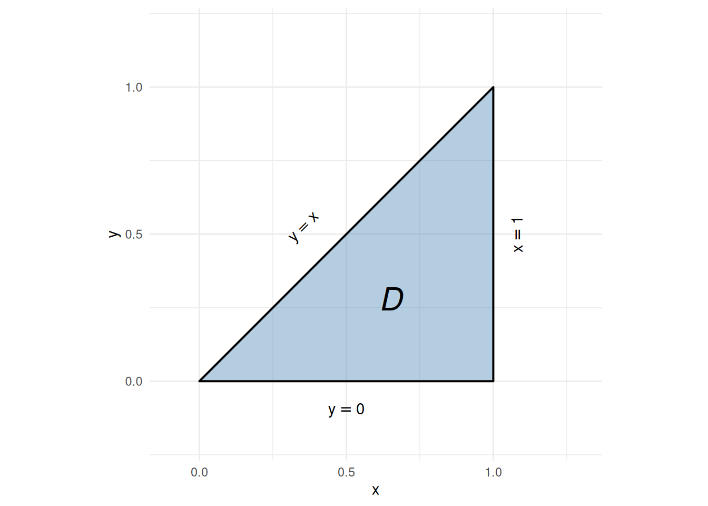

# Double Integrals and Fubini’s Theorem

Code

Published

Last modified: 2026-10-10 19:10:49 (PDT)

## 1 Double Integrals

The **Fubini–Tonelli theorem** states conditions under which the order of integration in a double integral can be exchanged. We state two versions: the Riemann version ([Theorem 1](#thm-fubini)) is what applied courses usually use for double integrals of continuous functions on simple regions; the [\\\sigma\\-finite](measures.llms.md#def-sigma-finite) measure-theoretic version ([Theorem 2](#thm-fubini-tonelli)) is included to make the [joint-distribution form](https://morrison-lab.github.io/pds/expectation.html#cor-fubini-joint) corollary in *Probability for Data Science* follow from a stated theorem rather than from an aside.

> **NOTE:**
>
> **Definition 1 (Double integral)** Let \\f\\ be a bounded function on a closed, bounded plane region \\R \subseteq \mathbb{R}^2\\. Cover \\R\\ with a grid of rectangles, keep the \\n\\ rectangles that lie entirely inside \\R\\, with areas \\\Delta A_1, \ldots, \Delta A_n\\, and choose a point \\(x_i, y_i)\\ in the \\i\\-th rectangle. The **double integral** of \\f\\ over \\R\\ is
>
> \\\iint_R f(x, y)\\dA \stackrel{\text{def}}{=}\lim\_{\mathopen{}\left\lVert\Delta\right\rVert\mathclose{} \to 0} \sum\_{i=1}^nf(x_i, y_i)\\\Delta A_i,\\
>
> where \\\mathopen{}\left\lVert\Delta\right\rVert\mathclose{}\\ is the length of the longest diagonal among the \\n\\ rectangles, when that limit exists and has the same value for every choice of grids and of the points \\(x_i, y_i)\\. The symbol \\dA\\ stands for an element of area.
>
> ([Larson and Edwards 2018, sec. 14.2](#ref-larsonCalc11e))

> **NOTE:**
>
> **Example 1 (The double integral of \\1\\ is an area)** Let \\f(x, y) = 1\\ on the rectangle \\R = \[0, 2\] \times \[0, 3\]\\. Every sum in [Definition 1](#def-double-integral) adds up the areas of rectangles inside \\R\\, and those sums approach the area of \\R\\ as the grid gets finer, so
>
> \\ \begin{aligned} \iint_R 1\\dA &= 2 \cdot 3 \\ &= 6. \end{aligned} \\

> **NOTE:**
>
> **Definition 2 (Iterated integral)** An **iterated integral** is an integral of an integral:
>
> \\ \int_a^b \int\_{g_1(x)}^{g_2(x)} f(x, y)\\dy\\dx \stackrel{\text{def}}{=}\int_a^b \mathopen{}\left(\int\_{g_1(x)}^{g_2(x)} f(x, y)\\dy\right)\mathclose{}\\dx \\
>
> That is, integrate over the inner variable (\\y\\) first, holding the outer variable (\\x\\) fixed, and then integrate the result over the outer variable. The inner limits \\g_1(x)\\ and \\g_2(x)\\ may depend on the outer variable, or be constants \\c\\ and \\d\\, as in \\\int_a^b \int_c^d f(x, y)\\dy\\dx\\. Iterated integrals in the other order, \\\int \int \cdots \\dx\\dy\\, are defined the same way with the roles of \\x\\ and \\y\\ swapped.

> **NOTE:**
>
> **Example 2 (An iterated integral)** Integrating over \\y\\ first, then \\x\\:
>
> \\ \begin{aligned} \int_0^1 \int_0^2 x y\\dy\\dx &= \int_0^1 \mathopen{}\left(\int_0^2 x y\\dy\right)\mathclose{}\\dx && \text{(definition of the iterated integral)} \\ &= \int_0^1 x \mathopen{}\left(\int_0^2 y\\dy\right)\mathclose{}\\dx && \text{(} x \text{ is constant in } y \text{)} \\ &= \int_0^1 x \mathopen{}\left\[\frac{y^2}{2}\right\]\mathclose{}\_{y=0}^{y=2}\\dx && \text{(antiderivative of } y \text{)} \\ &= \int_0^1 2x\\dx && \text{(evaluate at the limits)} \\ &= \mathopen{}\left\[x^2\right\]\mathclose{}\_{x=0}^{x=1} && \text{(antiderivative of } 2x \text{)} \\ &= 1 && \text{(evaluate at the limits)} \end{aligned} \\

> **NOTE:**
>
> **Theorem 1 (Fubini’s theorem (Riemann version))** Let \\f\\ be **continuous** on a plane region \\R \subseteq \mathbb{R}^2\\.
>
> 1.  **Vertically simple region.** If \\R\\ is defined by \\a \le x \le b\\ and \\g_1(x) \le y \le g_2(x)\\, where \\g_1\\ and \\g_2\\ are continuous on \\\[a, b\]\\, then
>
>     \\ \begin{aligned} \iint_R f(x, y)\\dA &= \int_a^b \int\_{g_1(x)}^{g_2(x)} f(x, y)\\dy\\dx. \end{aligned} \\
>
> 2.  **Horizontally simple region.** If \\R\\ is defined by \\c \le y \le d\\ and \\h_1(y) \le x \le h_2(y)\\, where \\h_1\\ and \\h_2\\ are continuous on \\\[c, d\]\\, then
>
>     \\ \begin{aligned} \iint_R f(x, y)\\dA &= \int_c^d \int\_{h_1(y)}^{h_2(y)} f(x, y)\\dx\\dy. \end{aligned} \\
>
> When \\R\\ can be described both ways, the two iterated integrals are equal — so the order of integration can be exchanged.
>
> ([Larson and Edwards 2018](#ref-larsonCalc11e), Theorem 14.2, p. 982)

> **NOTE:**
>
> **Example 3 (Changing the order of integration for a non-rectangular region)** Adapted from ([Larson and Edwards 2018, sec. 14.2](#ref-larsonCalc11e), Example 4, pp. 984–985).
>
> Let \\X\\ and \\Y\\ be [independent](https://morrison-lab.github.io/pds/independence.html#def-indpt) [\\\operatorname{Uniform}(0, 1)\\](https://morrison-lab.github.io/pds/random-variables.html#def-uniform) [random variables](https://morrison-lab.github.io/pds/random-variables.html#def-random-variable), with [joint density](https://morrison-lab.github.io/pds/random-variables.html#def-pdf) \\f(x, y) = 1\\ on the unit square \\\[0, 1\]^2\\. Define the function \\g(x, y) = \text{e}^{-x^2}\\\mathbb{1}\mathopen{}\left(y \le x\right)\mathclose{}\\, where \\e\\ is [Euler’s number](algebra.llms.md#def-euler-number), and compute its [expectation](https://morrison-lab.github.io/pds/expectation.html#def-expectation) \\\operatorname{E}\mathopen{}\left\[g(X, Y)\right\]\mathclose{}\\.
>
> Because the joint density equals \\1\\ on \\\[0, 1\]^2\\, this expectation is the double integral of \\g\\ over the unit square:
>
> \\\operatorname{E}\mathopen{}\left\[g(X, Y)\right\]\mathclose{} = \iint\_{\[0, 1\]^2} g(x, y)\\dA.\\
>
> The [indicator](notation.llms.md#def-indicator-function) factor \\\mathbb{1}\mathopen{}\left(y \le x\right)\mathclose{}\\ equals \\1\\ on the triangular region where \\y \le x\\ and \\0\\ elsewhere, so only that region, namely \\D = \\(x, y) : x \in \[0, 1\],\\ y \in \[0, x\]\\\\ ([Figure 1](#fig-fubini-nonrect-region)), contributes, and there \\g(x, y) = \text{e}^{-x^2}\\:
>
> \\\operatorname{E}\mathopen{}\left\[g(X, Y)\right\]\mathclose{} = \iint_D \text{e}^{-x^2}\\dA.\\
>
> Show R code
>
> ``` downlit
> region <- tibble::tibble(x = c(0, 1, 1), y = c(0, 0, 1))
> ggplot2::ggplot(region, ggplot2::aes(x = x, y = y)) +
>   ggplot2::geom_polygon(
>     fill = "steelblue", alpha = 0.4, color = "black", linewidth = 0.7
>   ) +
>   ggplot2::annotate(
>     "text", x = 0.65, y = 0.28, label = "D", size = 8, fontface = "italic"
>   ) +
>   ggplot2::annotate(
>     "text", x = 0.36, y = 0.52, label = "y == x",
>     parse = TRUE, angle = 45
>   ) +
>   ggplot2::annotate(
>     "text", x = 1.08, y = 0.5, label = "x == 1",
>     parse = TRUE, angle = 90, hjust = 0.5
>   ) +
>   ggplot2::annotate(
>     "text", x = 0.5, y = -0.1, label = "y == 0", parse = TRUE
>   ) +
>   ggplot2::scale_x_continuous(breaks = c(0, 0.5, 1), limits = c(-0.1, 1.3)) +
>   ggplot2::scale_y_continuous(breaks = c(0, 0.5, 1), limits = c(-0.2, 1.2)) +
>   ggplot2::coord_equal() +
>   ggplot2::labs(x = "x", y = "y") +
>   ggplot2::theme_minimal()
> ```
>
> [](calculus-double-integrals_files/figure-html/unnamed-chunk-1-1.png "Figure 1: Triangular integration region D = \{(x, y) : x \in [0, 1],\; y \in [0, x]\}, bounded below by y = 0, above-left by y = x, and on the right by x = 1.")
>
> Figure 1: Triangular integration region \\D = \\(x, y) : x \in \[0, 1\],\\ y \in \[0, x\]\\\\, bounded below by \\y = 0\\, above-left by \\y = x\\, and on the right by \\x = 1\\.
>
> **Order \\dx\\dy\\ is intractable.** Re-describing \\D\\ as \\D = \\(x, y) : y \in \[0, 1\],\\ x \in \[y, 1\]\\\\, the inner integral is
>
> \\\int_y^1 \text{e}^{-x^2}\\dx,\\
>
> which cannot be computed with FTC Part 2: no antiderivative of \\\text{e}^{-x^2}\\ can be written as a finite formula built from powers, exponentials, logarithms, and trigonometric functions (an **elementary** antiderivative).
>
> **Order \\dy\\dx\\ works.** Applying [Theorem 1](#thm-fubini) Part 1 (\\\text{e}^{-x^2}\\ is continuous and \\D\\ is the vertically simple region \\x \in \[0, 1\]\\, \\y \in \[0, x\]\\):
>
> \\ \begin{aligned} \iint_D \text{e}^{-x^2}\\dA &= \int_0^1\\\int_0^x \text{e}^{-x^2}\\dy\\dx && \text{(Fubini, vertically simple region)} \\&= \int_0^1 \text{e}^{-x^2}\mathopen{}\left(\int_0^x dy\right)\mathclose{}\\dx && \text{(} \text{e}^{-x^2} \text{ is constant in } y \text{)} \\&= \int_0^1 x\\\text{e}^{-x^2}\\dx && \text{(} \textstyle\int_0^x dy = x \text{)} \end{aligned} \\
>
> To antidifferentiate \\x\\\text{e}^{-x^2}\\, let \\u = x^2\\ be the inner function. By the chain rule ([Theorem 10 in Derivatives and Taylor Series](calculus-derivatives.llms.md#thm-chain-rule)), with \\\frac{d u}{d x} = 2x\\,
>
> \\ \begin{aligned} \frac{d }{d x}\mathopen{}\left(-\frac{1}{2}\\\text{e}^{-u}\right)\mathclose{} &= -\frac{1}{2}\\\text{e}^{-u} \cdot(-1) \cdot\frac{d u}{d x} && \text{(chain rule)} \\&= -\frac{1}{2}\\\text{e}^{-x^2} \cdot(-1) \cdot 2x && \text{(substitute } u = x^2 \text{ and } du/dx = 2x \text{)} \\&= x\\\text{e}^{-x^2} && \text{(multiply)} \end{aligned} \\
>
> so \\-\frac{1}{2}\\\text{e}^{-x^2}\\ is an antiderivative of \\x\\\text{e}^{-x^2}\\, and
>
> \\ \begin{aligned} \int_0^1 x\\\text{e}^{-x^2}\\dx &= \mathopen{}\left\[-\frac{1}{2}\\\text{e}^{-x^2}\right\]\mathclose{}\_0^1 && \text{(FTC Part 2)} \\&= -\frac{1}{2}\mathopen{}\left(\text{e}^{-1} - \text{e}^{0}\right)\mathclose{} && \text{(evaluate at the limits)} \\&= -\frac{1}{2}\mathopen{}\left(\text{e}^{-1} - 1\right)\mathclose{} && \text{(} \text{e}^{0} = 1 \text{)} \\&= \frac{1 - \text{e}^{-1}}{2} && \text{(distribute } -\tfrac{1}{2} \text{)} \\&= \frac{e - 1}{2e} && \text{(multiply numerator and denominator by } e \text{)} \\&\approx 0.316 \end{aligned} \\
>
> The solid whose volume equals this integral is shown in [Figure 2](#fig-fubini-nonrect).
>
> Show R code
>
> ``` downlit
> n_grid <- 51
> x_seq <- seq(0, 1, length.out = n_grid)
> y_seq <- seq(0, 1, length.out = n_grid)
>
> z_mat <- outer(x_seq, y_seq, function(x, y) {
>   z <- exp(-x^2)
>   z[y > x] <- NA
>   z
> })
>
> plotly::plot_ly(x = ~x_seq, y = ~y_seq, z = ~t(z_mat)) |>
>   plotly::add_surface(showscale = FALSE) |>
>   plotly::layout(scene = list(
>     xaxis = list(title = "x"),
>     yaxis = list(title = "y"),
>     zaxis = list(title = "z = exp(-x^2)"),
>     camera = list(eye = list(x = 1.6, y = -1.6, z = 0.8))
>   ))
> ```
>
> Figure 2: Surface \\z = e^{-x^2}\\ over the region \\D = \\(x, y) : x \in \[0, 1\],\\ y \in \[0, x\]\\\\. The surface depends only on \\x\\ (constant in \\y\\), so for each \\x\\ the inner integral over \\y \in \[0, x\]\\ contributes \\x \cdot e^{-x^2}\\.

> **NOTE:**
>
> **Exercise 1 (Double integral over a triangular region)** Adapted from Miller ([2016](#ref-problifesavercalc)), Question 1.1.50.
>
> Evaluate the integral:
>
> \\\int_0^1 \int_0^x xy\\dy\\dx\\
>
> and confirm the result by reversing the order of integration.

> **NOTE:**
>
> *Solution 1*. **1. Given order (\\y\\ then \\x\\):**
>
> \\ \begin{aligned} \int_0^x xy\\dy &= x\mathopen{}\left\[\frac{y^2}{2}\right\]\mathclose{}\_0^x \\ &= \frac{x^3}{2} \end{aligned} \\
>
> \\ \begin{aligned} \int_0^1 \frac{x^3}{2}\\dx &= \mathopen{}\left\[\frac{x^4}{8}\right\]\mathclose{}\_0^1 \\ &= \frac{1}{8} \end{aligned} \\
>
> **2. Reversed order (\\x\\ then \\y\\):** The triangular region \\T = \\(x, y) : 0 \le x \le 1, 0 \le y \le x\\\\ is equivalently described by \\T = \\(x, y) : 0 \le y \le 1, y \le x \le 1\\\\:
>
> \\ \begin{aligned} \int_0^1 \int_y^1 xy\\dx\\dy &= \int_0^1 y\mathopen{}\left\[\frac{x^2}{2}\right\]\mathclose{}\_{x=y}^1\\dy \\ &= \int_0^1 \frac{y(1 - y^2)}{2}\\dy \end{aligned} \\
>
> \\ \begin{aligned} \int_0^1 \mathopen{}\left(\frac{y}{2} - \frac{y^3}{2}\right)\mathclose{}\\dy &= \mathopen{}\left\[\frac{y^2}{4} - \frac{y^4}{8}\right\]\mathclose{}\_0^1 \\ &= \frac{1}{4} - \frac{1}{8} \\ &= \frac{1}{8} \end{aligned} \\
>
> Both orders yield \\1/8\\.

> **NOTE:**
>
> **Exercise 2 (Switching order of integration on a non-rectangular region)** Adapted from Miller ([2016](#ref-problifesavercalc)), Question 1.1.51.
>
> Express the integral:
>
> \\\int_0^1 \int_0^x y e^{-xy}\\dy\\dx\\
>
> by reversing the order of integration.

> **NOTE:**
>
> *Solution 2*. In the given order, the inner integral \\\int_0^x y e^{-xy}\\dy\\ requires integration by parts with respect to \\y\\.
>
> Switching the order over the triangular domain \\\\(x, y) : 0 \le y \le 1, y \le x \le 1\\\\:
>
> \\\int_0^1 \int_y^1 y e^{-xy}\\dx\\dy\\
>
> Now the inner integral has the factor \\y\\ in place for direct integration with respect to \\x\\:
>
> \\ \begin{aligned} \int_y^1 y e^{-xy}\\dx &= \mathopen{}\left\[-e^{-xy}\right\]\mathclose{}\_{x=y}^1 \\ &= e^{-y^2} - e^{-y} \end{aligned} \\
>
> The double integral becomes:
>
> \\ \begin{aligned} \int_0^1 (e^{-y^2} - e^{-y})\\dy &= \int_0^1 e^{-y^2}\\dy - \mathopen{}\left\[-e^{-y}\right\]\mathclose{}\_0^1 \\ &= \int_0^1 e^{-y^2}\\dy - (1 - e^{-1}) \end{aligned} \\
>
> The term \\\int_0^1 e^{-y^2}\\dy\\ has no elementary antiderivative; it can be written using the error function \\\operatorname{erf}(z) = \frac{2}{\sqrt{\pi}}\int_0^z e^{-t^2}\\dt\\ as \\\frac{\sqrt{\pi}}{2}\operatorname{erf}(1) \approx 0.7468\\. The overall value is:
>
> \\\frac{\sqrt{\pi}}{2}\operatorname{erf}(1) + e^{-1} - 1 \approx 0.1147\\

> **NOTE:**
>
> **Example 4 (When conditions fail: a counterexample)** The conditions in [Theorem 1](#thm-fubini) are not merely technical — when they fail, iterated integrals can exist yet disagree.
>
> Let \\f(x, y) = \frac{x^2 - y^2}{(x^2 + y^2)^2}\\ on the unit square \\R = \[0, 1\] \times \[0, 1\]\\. Strictly, \\f\\ is defined on \\R \setminus \\(0, 0)\\\\: the denominator vanishes at the origin, so \\f\\ is undefined there (we return to this point in the condition check).
>
> **Integrating \\y\\ first, then \\x\\:**
>
> Holding \\x\\ fixed and differentiating in \\y\\ (by the quotient rule, [Theorem 9 in Derivatives and Taylor Series](calculus-derivatives.llms.md#thm-quotient-rule)),
>
> \\ \begin{aligned} \frac{d }{d y}\frac{y}{x^2 + y^2} &= \frac{(x^2 + y^2) - y \cdot 2y}{(x^2 + y^2)^2} \\ &= \frac{x^2 - y^2}{(x^2 + y^2)^2}. \end{aligned} \\
>
> (A derivative in one variable with the others held fixed is a [partial derivative](vector-calculus.llms.md#def-partial-derivative), defined on the vector calculus page.) The arctangent \\\arctan\\ is the inverse of the tangent function from trigonometry; all this example needs is that \\\frac{d }{d x}\arctan(x) = \frac{1}{1 + x^2}\\, \\\arctan(0) = 0\\, and \\\arctan(1) = \frac{\pi}{4}\\.
>
> \\ \begin{aligned} \int_0^1\\\int_0^1 f(x, y)\\dy\\dx &= \int_0^1 \mathopen{}\left\[\frac{y}{x^2 + y^2}\right\]\mathclose{}\_{y=0}^{y=1}\\dx \\&= \int_0^1 \frac{1}{x^2 + 1}\\dx \\&= \mathopen{}\left\[\arctan(x)\right\]\mathclose{}\_0^1 \\&= \frac{\pi}{4} \end{aligned} \\
>
> **Integrating \\x\\ first, then \\y\\:**
>
> Holding \\y\\ fixed and differentiating in \\x\\,
>
> \\ \begin{aligned} \frac{d }{d x}\mathopen{}\left(-\frac{x}{x^2 + y^2}\right)\mathclose{} &= -\frac{(x^2 + y^2) - x \cdot 2x}{(x^2 + y^2)^2} \\ &= \frac{x^2 - y^2}{(x^2 + y^2)^2}: \end{aligned} \\
>
> \\ \begin{aligned} \int_0^1\\\int_0^1 f(x, y)\\dx\\dy &= \int_0^1 \mathopen{}\left\[-\frac{x}{x^2 + y^2}\right\]\mathclose{}\_{x=0}^{x=1}\\dy \\&= \int_0^1 \mathopen{}\left(-\frac{1}{1 + y^2}\right)\mathclose{}\\dy \\&= -\mathopen{}\left\[\arctan(y)\right\]\mathclose{}\_0^1 \\&= -\frac{\pi}{4} \end{aligned} \\
>
> **Conclusion:** \\\dfrac{\pi}{4} \neq -\dfrac{\pi}{4}\\, so the two iterated integrals are unequal. [Theorem 1](#thm-fubini) does not apply here.
>
> **Why [Theorem 1](#thm-fubini)’s condition fails:** [Theorem 1](#thm-fubini) requires \\f\\ to be **continuous** on \\R\\. The denominator \\(x^2 + y^2)^2\\ vanishes at the origin \\(0, 0) \in R\\, so \\f\\ is *not even defined* there — let alone continuous — and the theorem does not apply.
>
> ([Wikipedia contributors 2024](#ref-wp:fubini))
>
> [Figure 3](#fig-fubini-fail) shows the surface. The failure comes from the origin, where \\f\\ is undefined and unbounded.
>
> Show R code
>
> ``` downlit
> n_grid <- 81
> eps <- 0.04
> x_seq <- seq(eps, 1, length.out = n_grid)
> y_seq <- seq(eps, 1, length.out = n_grid)
>
> z_mat <- outer(x_seq, y_seq, function(x, y) (x^2 - y^2) / (x^2 + y^2)^2)
> z_clip <- 50
> z_mat[z_mat > z_clip] <- z_clip
> z_mat[z_mat < -z_clip] <- -z_clip
>
> plotly::plot_ly(x = ~x_seq, y = ~y_seq, z = ~t(z_mat)) |>
>   plotly::add_surface(
>     showscale = FALSE,
>     colorscale = list(
>       list(0, "#3b4cc0"),
>       list(0.5, "#dddddd"),
>       list(1, "#b40426")
>     )
>   ) |>
>   plotly::layout(scene = list(
>     xaxis = list(title = "x"),
>     yaxis = list(title = "y"),
>     zaxis = list(title = "f(x, y)", range = c(-z_clip, z_clip)),
>     camera = list(eye = list(x = 1.6, y = 1.6, z = 0.6))
>   ))
> ```
>
> Figure 3: Surface \\f(x, y) = (x^2 - y^2)/(x^2 + y^2)^2\\ on \\\[0, 1\]^2\\, sampled away from the origin and clipped to \\\[-50, 50\]\\ for display. Approaching the origin, the function grows without bound along the \\x\\-axis (red ridge, \\f \> 0\\ when \\\|x\| \> \|y\|\\) and falls without bound along the \\y\\-axis (blue ridge, \\f \< 0\\ when \\\|y\| \> \|x\|\\). Because \\f\\ is undefined at \\(0, 0)\\, \\f\\ is not continuous on \\R\\ and [Theorem 1](#thm-fubini) does not apply.

> **NOTE:**
>
> **Corollary 1 (Continuous functions on a rectangle (corollary of [Theorem 1](#thm-fubini)))** If \\f : \[a, b\] \times \[c, d\] \to \mathbb{R}\\ is **continuous** on the closed bounded rectangle \\\[a, b\] \times \[c, d\]\\, then:
>
> \\ \begin{aligned} \int_a^b \mathopen{}\left(\int_c^d f(x, y)\\dy\right)\mathclose{}\\dx &= \int_c^d \mathopen{}\left(\int_a^b f(x, y)\\dx\right)\mathclose{}\\dy\\ &= \iint\_{\[a,b\]\times\[c,d\]} f(x, y)\\dA. \end{aligned} \\
>
> ([Larson and Edwards 2018](#ref-larsonCalc11e), Theorem 14.2, p. 982)

> **NOTE:**
>
> *Proof*. A closed bounded rectangle \\\[a, b\] \times \[c, d\]\\ is both vertically simple (with \\g_1 \equiv c\\, \\g_2 \equiv d\\) and horizontally simple (with \\h_1 \equiv a\\, \\h_2 \equiv b\\). Applying both parts of [Theorem 1](#thm-fubini) to \\f\\ on this rectangle gives the two iterated forms shown.

> **NOTE:**
>
> **Example 5 (Evaluating a double integral on a rectangle)** Structure adapted from ([Larson and Edwards 2018, sec. 14.2](#ref-larsonCalc11e), Example 2, pp. 982–983); the integrand \\x^2 + y^2\\ is original, chosen so the integral equals \\\operatorname{E}\mathopen{}\left\[g(X, Y)\right\]\mathclose{}\\ for \\g(x, y) = x^2 + y^2\\.
>
> Let \\X\\ and \\Y\\ be [independent](https://morrison-lab.github.io/pds/independence.html#def-indpt) [\\\operatorname{Uniform}(0, 1)\\](https://morrison-lab.github.io/pds/random-variables.html#def-uniform) [random variables](https://morrison-lab.github.io/pds/random-variables.html#def-random-variable), with [joint density](https://morrison-lab.github.io/pds/random-variables.html#def-pdf) \\f(x, y) = 1\\ on the unit square \\R = \\(x, y) : x \in \[0, 1\],\\ y \in \[0, 1\]\\\\ ([Figure 4](#fig-fubini-rect-region)). Define the function \\g(x, y) = x^2 + y^2\\, and compute its [expectation](https://morrison-lab.github.io/pds/expectation.html#def-expectation) \\\operatorname{E}\mathopen{}\left\[g(X, Y)\right\]\mathclose{}\\.
>
> Because the joint density equals \\1\\ on \\R\\, this expectation is the double integral of \\g\\ over \\R\\:
>
> \\\operatorname{E}\mathopen{}\left\[g(X, Y)\right\]\mathclose{} = \iint_R \mathopen{}\left(x^2 + y^2\right)\mathclose{}\\dA.\\
>
> Show R code
>
> ``` downlit
> ggplot2::ggplot() +
>   ggplot2::annotate(
>     "rect", xmin = 0, xmax = 1, ymin = 0, ymax = 1,
>     fill = "steelblue", alpha = 0.4, color = "black", linewidth = 0.7
>   ) +
>   ggplot2::annotate(
>     "text", x = 0.5, y = 0.5, label = "R", size = 8, fontface = "italic"
>   ) +
>   ggplot2::scale_x_continuous(breaks = c(0, 1), limits = c(-0.15, 1.25)) +
>   ggplot2::scale_y_continuous(breaks = c(0, 1), limits = c(-0.15, 1.25)) +
>   ggplot2::coord_equal() +
>   ggplot2::labs(x = "x", y = "y") +
>   ggplot2::theme_minimal()
> ```
>
> [](calculus-double-integrals_files/figure-html/unnamed-chunk-6-1.png "Figure 4: Integration region R = [0, 1]^2, the unit square.")
>
> Figure 4: Integration region \\R = \[0, 1\]^2\\, the unit square.
>
> The integrand is continuous on \\R\\, so [Corollary 1](#cor-fubini-rect) applies and either order of integration yields the same value.
>
> **Integrating \\y\\ first, then \\x\\:**
>
> \\ \begin{aligned} \operatorname{E}\mathopen{}\left\[g(X, Y)\right\]\mathclose{} &= \int_0^1\\\int_0^1 \mathopen{}\left(x^2 + y^2\right)\mathclose{}\\dy\\dx \\&= \int_0^1 \mathopen{}\left\[x^2 y + \frac{y^3}{3}\right\]\mathclose{}\_0^1\\dx \\&= \int_0^1 \mathopen{}\left(x^2 + \frac{1}{3}\right)\mathclose{}\\dx \\&= \mathopen{}\left\[\frac{x^3}{3} + \frac{x}{3}\right\]\mathclose{}\_0^1 \\&= \frac{2}{3} \end{aligned} \\
>
> **Integrating \\x\\ first, then \\y\\** (verifying the order can be swapped):
>
> \\ \begin{aligned} \int_0^1\\\int_0^1 \mathopen{}\left(x^2 + y^2\right)\mathclose{}\\dx\\dy &= \int_0^1 \mathopen{}\left\[\frac{x^3}{3} + y^2 x\right\]\mathclose{}\_0^1\\dy \\&= \int_0^1 \mathopen{}\left(\frac{1}{3} + y^2\right)\mathclose{}\\dy \\&= \mathopen{}\left\[\frac{y}{3} + \frac{y^3}{3}\right\]\mathclose{}\_0^1 \\&= \frac{2}{3} \end{aligned} \\
>
> Both orders give \\\frac{2}{3}\\, as [Corollary 1](#cor-fubini-rect) guarantees.
>
> As a cross-check, linearity of expectation gives the same value: since
>
> \\ \begin{aligned} \operatorname{E}\mathopen{}\left\[X^2\right\]\mathclose{} &= \int_0^1 x^2\\dx \\ &= \frac{1}{3} \end{aligned} \\
>
> for \\X \sim \operatorname{Uniform}(0, 1)\\ (and likewise for \\Y\\),
>
> \\ \begin{aligned} \operatorname{E}\mathopen{}\left\[g(X, Y)\right\]\mathclose{} &= \operatorname{E}\mathopen{}\left\[X^2 + Y^2\right\]\mathclose{} \\ &= \operatorname{E}\mathopen{}\left\[X^2\right\]\mathclose{} + \operatorname{E}\mathopen{}\left\[Y^2\right\]\mathclose{} \\ &= \frac{1}{3} + \frac{1}{3} \\ &= \frac{2}{3}. \end{aligned} \\
>
> The solid whose volume equals this integral is shown in [Figure 5](#fig-fubini-rect).
>
> Show R code
>
> ``` downlit
> n_grid <- 41
> x_seq <- seq(0, 1, length.out = n_grid)
> y_seq <- seq(0, 1, length.out = n_grid)
> z_mat <- outer(x_seq, y_seq, function(x, y) x^2 + y^2)
>
> plotly::plot_ly(x = ~x_seq, y = ~y_seq, z = ~t(z_mat)) |>
>   plotly::add_surface(showscale = FALSE) |>
>   plotly::layout(scene = list(
>     xaxis = list(title = "x"),
>     yaxis = list(title = "y"),
>     zaxis = list(title = "z", range = c(0, 2))
>   ))
> ```
>
> Figure 5: Surface \\z = x^2 + y^2\\ over the unit square \\\[0, 1\]^2\\. The double integral \\\tfrac{2}{3}\\ is the volume between this surface and the \\xy\\-plane, and equals \\\operatorname{E}\mathopen{}\left\[X^2 + Y^2\right\]\mathclose{}\\.

> **NOTE:**
>
> **Exercise 3 (Double integral of a polynomial over a rectangle)** Adapted from Miller ([2016](#ref-problifesavercalc)), Question 1.1.47.
>
> Evaluate the double integral:
>
> \\\int_0^2 \int_0^3 5(x^2 y + xy^2 + 2)\\dy\\dx\\

> **NOTE:**
>
> *Solution 3*. Integrate with respect to \\y\\ first:
>
> \\\begin{aligned} \int_0^3 (x^2 y + xy^2 + 2)\\dy &= \mathopen{}\left\[\frac{x^2 y^2}{2} + \frac{x y^3}{3} + 2y\right\]\mathclose{}\_{y=0}^3 \\ &= \frac{9}{2}x^2 + 9x + 6 \end{aligned}\\
>
> Now integrate with respect to \\x\\:
>
> \\\begin{aligned} 5\int_0^2 \mathopen{}\left(\frac{9}{2}x^2 + 9x + 6\right)\mathclose{}\\dx &= 5\mathopen{}\left\[\frac{3}{2}x^3 + \frac{9}{2}x^2 + 6x\right\]\mathclose{}\_0^2 \\ &= 5\mathopen{}\left\[\frac{3}{2}(8) + \frac{9}{2}(4) + 6(2)\right\]\mathclose{} \\ &= 5\mathopen{}\left\[12 + 18 + 12\right\]\mathclose{} \\ &= 5(42) \\ &= 210 \end{aligned}\\
>
> *(Note: The source text carried an arithmetic slip in the inner coefficient resulting in \\190\\; the exact value is \\210\\.)*

> **NOTE:**
>
> **Exercise 4 (Choosing the order of integration)** Adapted from Miller ([2016](#ref-problifesavercalc)), Question 1.1.48.
>
> Evaluate the double integral:
>
> \\\int_0^6 \int_0^5 x e^{-xy}\\dy\\dx\\

> **NOTE:**
>
> *Solution 4*. Integrating with respect to \\x\\ first requires integration by parts. Integrating with respect to \\y\\ first is much simpler because the factor of \\x\\ is already present:
>
> \\ \begin{aligned} \int_0^5 x e^{-xy}\\dy &= \mathopen{}\left\[-e^{-xy}\right\]\mathclose{}\_{y=0}^5 \\ &= 1 - e^{-5x} \end{aligned} \\
>
> Now integrate with respect to \\x\\:
>
> \\\begin{aligned} \int_0^6 (1 - e^{-5x})\\dx &= \mathopen{}\left\[x + \frac{1}{5}e^{-5x}\right\]\mathclose{}\_0^6 \\ &= \mathopen{}\left(6 + \frac{1}{5}e^{-30}\right)\mathclose{} - \mathopen{}\left(0 + \frac{1}{5}\right)\mathclose{} \\ &= \frac{29}{5} + \frac{e^{-30}}{5} \end{aligned}\\

> **NOTE:**
>
> **Exercise 5 (Product of single integrals for separable functions)** Adapted from Miller ([2016](#ref-problifesavercalc)), Question 1.1.49.
>
> Let \\m, n \> 0\\. Evaluate:
>
> \\\int_0^1 \int_0^1 x^m y^n\\dy\\dx\\

> **NOTE:**
>
> *Solution 5*. Because the region of integration is a rectangle \\\[0, 1\] \times \[0, 1\]\\ and the integrand factors as \\g(x)h(y) = x^m \cdot y^n\\, the double integral splits into the product of two single-variable integrals:
>
> \\\int_0^1 \int_0^1 x^m y^n\\dy\\dx = \mathopen{}\left(\int_0^1 x^m\\dx\right)\mathclose{}\mathopen{}\left(\int_0^1 y^n\\dy\right)\mathclose{}\\
>
> Evaluating each factor:
>
> \\\int_0^1 x^m\\dx = \frac{1}{m + 1}, \qquad \int_0^1 y^n\\dy = \frac{1}{n + 1}\\
>
> Therefore:
>
> \\\int_0^1 \int_0^1 x^m y^n\\dy\\dx = \frac{1}{(m + 1)(n + 1)}\\
>
> *Remark:* When joint random variables \\X\\ and \\Y\\ are independent, their joint density factors as \\f\_{X, Y}(x, y) = f_X(x)f_Y(y)\\, and joint probabilities over product sets factor in exactly this way.

> **NOTE:**
>
> **Exercise 6 (Double integral with polynomial and radical terms)** Adapted from Miller ([2016](#ref-problifesavercalc)), Question 1.1.52.
>
> Evaluate the double integral:
>
> \\\int_0^1 \int_0^1 (x^2 + 2xy + y\sqrt{x})\\dy\\dx\\

> **NOTE:**
>
> *Solution 6*. Integrate with respect to \\y\\ first:
>
> \\ \begin{aligned} \int_0^1 (x^2 + 2xy + y\sqrt{x})\\dy &= \mathopen{}\left\[x^2 y + x y^2 + \frac{y^2 \sqrt{x}}{2}\right\]\mathclose{}\_{y=0}^1 \\ &= x^2 + x + \frac{1}{2}x^{1/2} \end{aligned} \\
>
> Now integrate with respect to \\x\\:
>
> \\\begin{aligned} \int_0^1 \mathopen{}\left(x^2 + x + \frac{1}{2}x^{1/2}\right)\mathclose{}\\dx &= \mathopen{}\left\[\frac{x^3}{3} + \frac{x^2}{2} + \frac{1}{2}\cdot\frac{x^{3/2}}{3/2}\right\]\mathclose{}\_0^1 \\ &= \mathopen{}\left\[\frac{x^3}{3} + \frac{x^2}{2} + \frac{1}{3}x^{3/2}\right\]\mathclose{}\_0^1 \\ &= \frac{1}{3} + \frac{1}{2} + \frac{1}{3} \\ &= \frac{2}{3} + \frac{1}{2} \\ &= \frac{7}{6} \end{aligned}\\

> **NOTE:**
>
> **Exercise 7 (Double integral of an affine function)** Adapted from Miller ([2016](#ref-problifesavercalc)), Question 1.1.53.
>
> Let \\a, b, c\\ be constants. Evaluate:
>
> \\\int_0^1 \int_0^1 (ax + by + c)\\dy\\dx\\

> **NOTE:**
>
> *Solution 7*. By linearity of the integral:
>
> \\\begin{aligned} \int_0^1 \int_0^1 (ax + by + c)\\dy\\dx &= a\int_0^1 x\\dx \int_0^1 1\\dy + b\int_0^1 1\\dx \int_0^1 y\\dy + c\int_0^1 1\\dx \int_0^1 1\\dy \\ &= a\mathopen{}\left(\frac{1}{2}\right)\mathclose{}(1) + b(1)\mathopen{}\left(\frac{1}{2}\right)\mathclose{} + c(1)(1) \\ &= \frac{a}{2} + \frac{b}{2} + c \end{aligned}\\

> **NOTE:**
>
> **Exercise 8 (Harmonic numbers via double integrals)** Adapted from Miller ([2016](#ref-problifesavercalc)), Question 1.1.54.
>
> Prove that for every positive integer \\n\\:
>
> \\ \begin{aligned} \int_0^1 \int_0^1 n(1 - xy)^{n-1}\\dx\\dy &= \sum\_{k=1}^{n} \frac{1}{k} \\ &= 1 + \frac{1}{2} + \dots + \frac{1}{n} \end{aligned} \\

> **NOTE:**
>
> *Solution 8*. **Method 1 (integration then geometric series):** Integrate with respect to \\x\\ first:
>
> \\ \begin{aligned} \int_0^1 n(1 - xy)^{n-1}\\dx &= \mathopen{}\left\[-\frac{(1 - xy)^n}{y}\right\]\mathclose{}\_{x=0}^1 \\ &= \frac{1 - (1 - y)^n}{y} \end{aligned} \\
>
> Use the finite geometric series identity \\\sum\_{k=0}^{n-1} r^k = \frac{1 - r^n}{1 - r}\\ with \\r = 1 - y\\:
>
> \\\frac{1 - (1 - y)^n}{y} = \sum\_{k=0}^{n-1} (1 - y)^k\\
>
> Now integrate each term with respect to \\y\\ from \\0\\ to \\1\\:
>
> \\ \begin{aligned} \int_0^1 (1 - y)^k\\dy &= \mathopen{}\left\[-\frac{(1 - y)^{k+1}}{k+1}\right\]\mathclose{}\_0^1 \\ &= \frac{1}{k+1} \end{aligned} \\
>
> Summing over \\k = 0, 1, \dots, n-1\\:
>
> \\ \begin{aligned} \sum\_{k=0}^{n-1} \frac{1}{k+1} &= \sum\_{j=1}^n\frac{1}{j} \\ &= 1 + \frac{1}{2} + \dots + \frac{1}{n} \end{aligned} \\
>
> **Method 2 (binomial expansion):** Expand \\(1 - xy)^{n-1} = \sum\_{k=0}^{n-1} \binom{n-1}{k}(-1)^k (xy)^k\\. Integrating over \\\[0, 1\]^2\\:
>
> \\\int_0^1 \int_0^1 (xy)^k\\dx\\dy = \mathopen{}\left(\frac{1}{k+1}\right)\mathclose{}^2\\
>
> Multiplying by \\n\\ and using the identity \\\frac{n}{k+1}\binom{n-1}{k} = \binom{n}{k+1}\\:
>
> \\ \begin{aligned} \int_0^1 \int_0^1 n(1 - xy)^{n-1}\\dx\\dy &= \sum\_{k=0}^{n-1} \binom{n}{k+1}\frac{(-1)^k}{k+1} \\ &= \sum\_{j=1}^n\frac{1}{j} \end{aligned} \\
>
> *Remark:* This integral identity connects multivariable integration with harmonic numbers \\H_n = \sum\_{k=1}^{n} \frac{1}{k} \approx \log n + \gamma\\, where \\\gamma \approx 0.5772\\ is the Euler-Mascheroni constant.

> **NOTE:**
>
> **Theorem 2 (Fubini–Tonelli theorem (measure-theoretic form))** Let \\(\Omega_1, \mathcal F_1, \mu_1)\\ and \\(\Omega_2, \mathcal F_2, \mu_2)\\ be [measure spaces](measures.llms.md#def-measure-space) with [\\\sigma\\-finite](measures.llms.md#def-sigma-finite) measures, and let \\f : \Omega_1 \times \Omega_2 \to \mathbb{R}\\ be [measurable](measures.llms.md#def-measurable-function) with respect to the [product \\\sigma\\-algebra](measures.llms.md#def-product-sigma-algebra) \\\mathcal F_1 \otimes \mathcal F_2\\. If either
>
> 1.  \\f \ge 0\\ [almost everywhere](measures.llms.md#def-almost-everywhere) with respect to the [product measure](measures.llms.md#def-product-measure) \\\mu_1 \otimes \mu_2\\ (**Tonelli’s theorem**), or
>
> 2.  \\\int\_{\Omega_1 \times \Omega_2} \mathopen{}\left\|f\right\|\mathclose{}\\d(\mu_1 \otimes \mu_2) \< \infty\\, that is, \\f\\ is [absolutely integrable](measures.llms.md#def-absolutely-integrable) (**Fubini’s theorem**),
>
> then both iterated [integrals](measures.llms.md#def-integral) exist, agree with the double integral, and equal each other:
>
> \\ \begin{aligned} \int\_{\Omega_1 \times \Omega_2} f\\d(\mu_1 \otimes \mu_2) &= \int\_{\Omega_1} \mathopen{}\left(\int\_{\Omega_2} f(\omega_1, \omega_2)\\d\mu_2(\omega_2)\right)\mathclose{}\\d\mu_1(\omega_1)\\ &= \int\_{\Omega_2} \mathopen{}\left(\int\_{\Omega_1} f(\omega_1, \omega_2)\\d\mu_1(\omega_1)\right)\mathclose{}\\d\mu_2(\omega_2). \end{aligned} \\
>
> ([Billingsley 1995](#ref-billingsley1995probability), Theorem 18.3; [Gut 2013](#ref-gut2013), Theorem 9.1, p. 65; [Fubini 1907](#ref-fubini1907); [Wikipedia contributors 2024](#ref-wp:fubini))

> **NOTE:**
>
> *Remark 1* (Fubini–Tonelli for probability measures). Applied courses rarely need the measure-theoretic generalization itself, but it is what justifies the [joint-distribution form](https://morrison-lab.github.io/pds/expectation.html#cor-fubini-joint) corollary in *Probability for Data Science*. A [probability measure](measures.llms.md#def-probability-measure) \\P\\ on \\\Omega\\ has \\P(\Omega) = 1 \< \infty\\, so it is [finite](measures.llms.md#def-sigma-finite), and hence \\\sigma\\-finite ([finite and \\\sigma\\-finite measures](measures.llms.md#exm-sigma-finite)); for probability measures, the \\\sigma\\-finiteness condition is automatic.
>
> The integrability conditions (nonnegativity or [absolute integrability](measures.llms.md#def-absolutely-integrable)) still need to be verified in each application. For example, [Lebesgue measure](measures.llms.md#def-lebesgue-measure) (ordinary length) on \\\[0, 1\]\\ is a probability measure, so the \\\sigma\\-finiteness condition holds for both factors \\\[0, 1\]\\, yet the two iterated integrals in [Example 4](#exm-fubini-fail) are \\\pi/4\\ and \\-\pi/4\\. So \\\sigma\\-finiteness alone does not make the iterated integrals agree.

> **NOTE:**
>
> **Example 6 (Positive application of [Theorem 2](#thm-fubini-tonelli))** Let \\X\\ and \\Y\\ be [independent](https://morrison-lab.github.io/pds/independence.html#def-indpt) [\\\operatorname{Exponential}(1)\\](https://morrison-lab.github.io/pds/random-variables.html#def-exponential) [random variables](https://morrison-lab.github.io/pds/random-variables.html#def-random-variable), with [joint density](https://morrison-lab.github.io/pds/random-variables.html#def-pdf) \\f(x, y) = e^{-(x+y)}\\ for \\x, y \ge 0\\.
>
> The probability \\P(X \le 1,\\ Y \le 1)\\ is the integral of \\f\\ over \\\[0, 1\]^2\\ with respect to Lebesgue measure (ordinary length) in each coordinate. Lebesgue measure on \\\[0, \infty)\\ is \\\sigma\\-finite, because \\\[0, \infty)\\ is the union of the intervals \\\[0, n\]\\, \\n \in \mathbb{N}\\, each of finite length \\n\\; so the \\\sigma\\-finiteness condition of [Theorem 2](#thm-fubini-tonelli) holds. Since \\f(x,y) = e^{-(x+y)} \ge 0\\, condition (a) (Tonelli’s theorem, nonnegativity) is also satisfied.
>
> By [Theorem 2](#thm-fubini-tonelli), both iterated integrals exist and agree. Integrating \\y\\ first, then \\x\\:
>
> \\ \begin{aligned} P(X \le 1,\\ Y \le 1) &= \int_0^1\\\int_0^1 e^{-(x+y)}\\dy\\dx \\&= \int_0^1\\\int_0^1 e^{-x} e^{-y}\\dy\\dx && \text{(exponential of a sum)} \\&= \int_0^1 e^{-x}\mathopen{}\left(\int_0^1 e^{-y}\\dy\right)\mathclose{}\\dx && \text{(} e^{-x} \text{ is constant in } y \text{)} \\&= \int_0^1 e^{-x}\mathopen{}\left\[-e^{-y}\right\]\mathclose{}\_{y=0}^{y=1}\\dx && \text{(antiderivative of } e^{-y} \text{)} \\&= \int_0^1 e^{-x}(1 - e^{-1})\\dx && \text{(evaluate at the limits)} \\&= (1 - e^{-1})\int_0^1 e^{-x}\\dx && \text{(} 1 - e^{-1} \text{ is constant in } x \text{)} \\&= (1 - e^{-1})\mathopen{}\left\[-e^{-x}\right\]\mathclose{}\_{x=0}^{x=1} && \text{(antiderivative of } e^{-x} \text{)} \\&= (1 - e^{-1})^2 && \text{(evaluate at the limits)} \end{aligned} \\
>
> Integrating \\x\\ first, then \\y\\:
>
> \\ \begin{aligned} P(X \le 1,\\ Y \le 1) &= \int_0^1\\\int_0^1 e^{-(x+y)}\\dx\\dy \\&= \int_0^1\\\int_0^1 e^{-y} e^{-x}\\dx\\dy && \text{(exponential of a sum)} \\&= \int_0^1 e^{-y}\mathopen{}\left(\int_0^1 e^{-x}\\dx\right)\mathclose{}\\dy && \text{(} e^{-y} \text{ is constant in } x \text{)} \\&= \int_0^1 e^{-y}\mathopen{}\left\[-e^{-x}\right\]\mathclose{}\_{x=0}^{x=1}\\dy && \text{(antiderivative of } e^{-x} \text{)} \\&= \int_0^1 e^{-y}(1 - e^{-1})\\dy && \text{(evaluate at the limits)} \\&= (1 - e^{-1})\int_0^1 e^{-y}\\dy && \text{(} 1 - e^{-1} \text{ is constant in } y \text{)} \\&= (1 - e^{-1})\mathopen{}\left\[-e^{-y}\right\]\mathclose{}\_{y=0}^{y=1} && \text{(antiderivative of } e^{-y} \text{)} \\&= (1 - e^{-1})^2 && \text{(evaluate at the limits)} \end{aligned} \\
>
> Both iterated integrals equal \\(1 - e^{-1})^2 \approx 0.400\\, as [Theorem 2](#thm-fubini-tonelli) guarantees when condition (a) holds.

> **NOTE:**
>
> **Example 7 (When neither Fubini–Tonelli condition is satisfied)** The same function \\f(x, y) = (x^2 - y^2)/(x^2 + y^2)^2\\ from [Example 4](#exm-fubini-fail) illustrates a case where neither condition of [Theorem 2](#thm-fubini-tonelli) is satisfied.
>
> **Why [Theorem 2](#thm-fubini-tonelli)’s conditions fail:** \\\iint_R \|f\|\\dA = \infty\\, which violates condition (b). Switching to polar coordinates \\(r, \theta)\\ near the origin, the integrand satisfies
>
> \\ \begin{aligned} \|f(x, y)\| &= \mathopen{}\left\|x^2 - y^2\right\|\mathclose{}/(x^2 + y^2)^2 \\ &= \mathopen{}\left\|\cos 2\theta\right\|\mathclose{}/r^2, \end{aligned} \\
>
> so
>
> \\ \begin{aligned} \iint_R \|f\|\\dA &\ge \int_0^{\pi/2}\\\int_0^{\varepsilon} \frac{\mathopen{}\left\|\cos 2\theta\right\|\mathclose{}}{r^2}\\ r\\dr\\d\theta\\ &= \mathopen{}\left(\int_0^{\pi/2}\mathopen{}\left\|\cos 2\theta\right\|\mathclose{}\\d\theta\right)\mathclose{} \int_0^{\varepsilon} \frac{dr}{r}\\ &= +\infty, \end{aligned} \\
>
> since \\\int_0^{\varepsilon} dr/r\\ diverges. Therefore \\\iint_R \|f\|\\dA = \infty\\, and condition (b) of [Theorem 2](#thm-fubini-tonelli) is not satisfied. (Condition (a) also fails: \\f\\ takes both positive and negative values, so it is not nonnegative a.e.) The unequal iterated integrals from [Example 4](#exm-fubini-fail) are thus consistent with [Theorem 2](#thm-fubini-tonelli): the theorem simply does not apply.
>
> ([Wikipedia contributors 2024](#ref-wp:fubini))

Back to top

## References

Billingsley, Patrick. 1995. *Probability and Measure*. 3rd ed. Wiley Series in Probability and Mathematical Statistics. Wiley.

Fubini, Guido. 1907. “Sugli Integrali Multipli.” *Rendiconti Della Reale Accademia Dei Lincei. Classe Di Scienze Fisiche, Matematiche e Naturali* 16: 608–14.

Gut, Allan. 2013. *Probability: A Graduate Course*. 2nd ed. Springer Texts in Statistics. Springer. <https://doi.org/10.1007/978-1-4614-4708-5>.

Larson, Ron, and Bruce H. Edwards. 2018. *Calculus*. 11th ed. Cengage Learning. <https://www.cengage.com/c/calculus-11e-larson/>.

Miller, Steven J. 2016. *The Probability Lifesaver: Calculus Review Problems*. <https://web.williams.edu/Mathematics/sjmiller/public_html/probabilitylifesaver/index.htm#:~:text=http%3A//web.williams.edu/Mathematics/sjmiller/public_html/probabilitylifesaver/supplementalchap_calcreview.pdf>.

Wikipedia contributors. 2024. *Fubini’s Theorem — Wikipedia, the Free Encyclopedia*. <https://en.wikipedia.org/wiki/Fubini%27s_theorem>.
