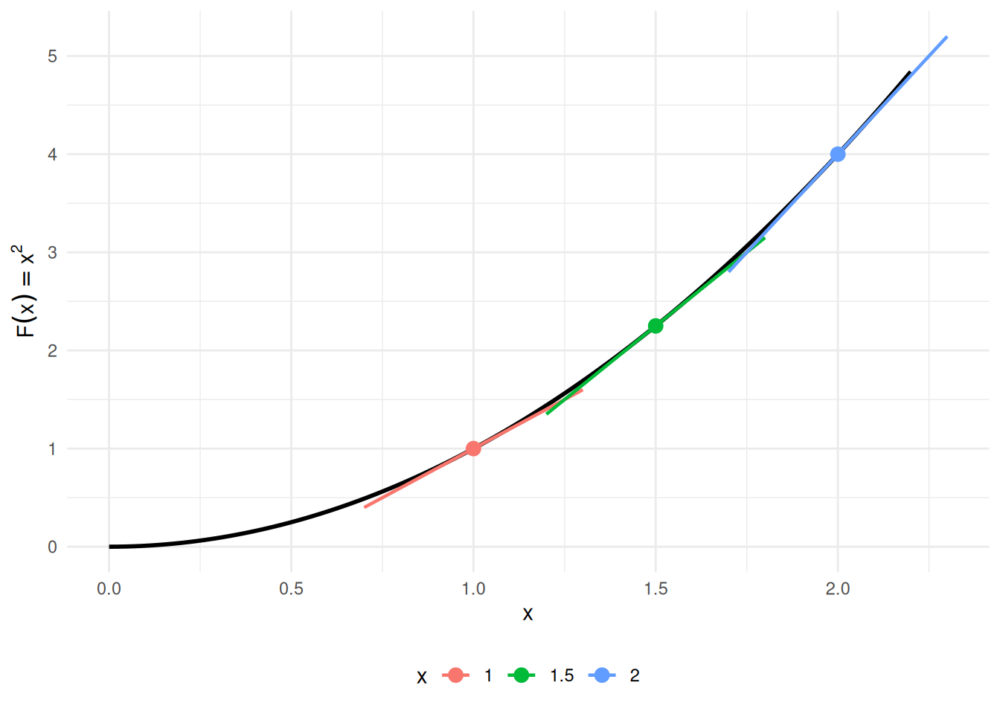

# Calculus

Code

- [Show All Code](javascript:void(0))

- [Hide All Code](javascript:void(0))

- 

  ------------------------------------------------------------------------

- [View Source](javascript:void(0))

Published

Last modified: 2026-09-29 17:42:46 (PDT)

## 1 Derivatives

> **NOTE:**
>
> **Theorem 1 (Constant rule)** If \\c\\ is constant with respect to \\x\\, then
>
> \\\frac{\partial}{\partial x}c = 0\\

> **NOTE:**
>
> **Theorem 2 (Constant multiple rule)** If \\a\\ is constant with respect to \\x\\ and \\y\\ is a differentiable function of \\x\\, then: \\\frac{\partial}{\partial x}ay = a \frac{\partial y}{\partial x}\\

> **NOTE:**
>
> **Theorem 3 (Power rule)** For every real number \\q\\ and every \\x \> 0\\:
>
> \\\frac{\partial}{\partial x}x^q = qx^{q-1}\\
>
> When \\q\\ is a positive integer, the same formula holds for every real \\x\\.

> **NOTE:**
>
> **Theorem 4 (Derivative of natural logarithm)** For every \\x \> 0\\:
>
> \\\operatorname{log}'\mathopen{}\left\\x\right\\\mathclose{} = \frac{1}{x} = x^{-1}\\

> **NOTE:**
>
> **Theorem 5 (derivative of exponential)** For every real \\x\\:
>
> \\\operatorname{exp}'\mathopen{}\left\\x\right\\\mathclose{} = \operatorname{exp}\mathopen{}\left\\x\right\\\mathclose{}\\

> **NOTE:**
>
> **Theorem 6 (Product rule)** If \\a\\ and \\b\\ are differentiable functions of \\x\\, then
>
> \\(ab)' = ab' + ba'\\

> **NOTE:**
>
> **Theorem 7 (Quotient rule)** If \\a\\ and \\b\\ are differentiable functions of \\x\\ and \\b \neq 0\\, then
>
> \\(a/b)' = a'/b - (a/b^2)b'\\

> **NOTE:**
>
> **Theorem 8 (Chain rule)** If \\a\\ is a differentiable function of \\b\\, and \\b\\ is a differentiable function of \\c\\, then \\a\\ is a differentiable function of \\c\\, and
>
> \\\begin{aligned} \frac{d a}{d c} &= \frac{d a}{d b} \frac{d b}{d c} \\ &= \frac{d b}{d c} \frac{d a}{d b} \end{aligned} \\
>
> or in [Lagrange’s notation](https://en.wikipedia.org/wiki/Notation_for_differentiation#Lagrange's_notation), if \\g\\ is differentiable at \\x\\ and \\f\\ is differentiable at \\g(x)\\:
>
> \\(f(g(x)))' = g'(x) f'(g(x))\\

> **NOTE:**
>
> **Corollary 1 (Chain rule for logarithms)** If \\f\\ is differentiable at \\x\\ and \\f(x) \> 0\\, then
>
> \\ \frac{d }{d x}\operatorname{log}\mathopen{}\left\\f(x)\right\\\mathclose{} = \frac{f'(x)}{f(x)} \\

> **NOTE:**
>
> *Proof*. Apply [Theorem 8](#thm-chain-rule) and [Theorem 4](#thm-deriv-log):
>
> \\ \begin{aligned} \frac{d }{d x}\operatorname{log}\mathopen{}\left\\f(x)\right\\\mathclose{} &= f'(x) \cdot\operatorname{log}'\mathopen{}\left\\f(x)\right\\\mathclose{} && \text{(chain rule, with } g = f \text{ and outer function } \log \text{)} \\ &= f'(x) \cdot\frac{1}{f(x)} && \text{(derivative of } \log \text{, valid because } f(x) \> 0 \text{)} \\ &= \frac{f'(x)}{f(x)} && \text{(multiply)} \end{aligned} \\

### 1.1 Linear approximation

For a differentiable function \\f\\ and a small step \\\epsilon\\,

\\f(w + \epsilon) \approx f(w) + \epsilon\\\frac{d f}{d w}(w) \tag{1}\\

> **NOTE:**
>
> **Definition 1 (Flat point)** A derivative of zero marks a **flat point** (also called a *stationary point*). A point where the derivative is zero or does not exist is a *critical point*.

Show R code

``` js
tanF = (w) => w * w - 4 * w + 7
tanDf = (w) => 2 * w - 4
tanPred = tanF(tanW) + tanEps * tanDf(tanW)
tanExact = tanF(tanW + tanEps)
```

Show R code

``` js
viewof tanW = Inputs.range([-1, 4], {value: 1, step: 0.05, label: "w"})
viewof tanEps = Inputs.range([0.01, 2], {value: 0.5, transform: Math.log, label: "step \u03b5", format: d3.format(".3~f")})
```

Show R code

``` js
md`At w = ${tanW.toFixed(2)}, f(w) = ${tanF(tanW).toFixed(4)} and f\u2032(w) = ${tanDf(tanW).toFixed(2)}.

A step of \u03b5 = ${tanEps.toFixed(3)}:

- predicted by the tangent line, f(w) + \u03b5 f\u2032(w) = ${tanPred.toFixed(4)};
- exact, f(w + \u03b5) = ${tanExact.toFixed(4)};
- error ${(tanExact - tanPred).toPrecision(3)}, and error / \u03b5\u00b2 = ${((tanExact - tanPred) / tanEps ** 2).toFixed(3)}.`
```

Show R code

``` js
Plot.plot({
  ariaLabel: 'The parabola f of w, ' +
    'with the tangent line at the chosen w, ' +
    'and two points above w plus epsilon: ' +
    'one on the tangent line (the prediction) and one on the curve (the exact value), ' +
    'joined by a red segment showing the error.',
  width: 460, height: 340, grid: true,
  x: {domain: [-1.5, 6.5], label: "w"},
  y: {domain: [0, 20], label: "f(w)"},
  marks: [
    Plot.line(d3.range(-1.5, 6.51, 0.05), {x: (w) => w, y: tanF, stroke: "#555", strokeWidth: 2, clip: true}),
    Plot.line([-1.5, 6.5], {x: (w) => w, y: (w) => tanF(tanW) + (w - tanW) * tanDf(tanW),
                        stroke: "#1f77b4", strokeWidth: 2, strokeDasharray: "6,4", clip: true}),
    Plot.ruleX([tanW + tanEps], {stroke: "#bbb", strokeDasharray: "2,3"}),
    Plot.link([0], {x1: tanW + tanEps, x2: tanW + tanEps, y1: tanPred, y2: tanExact,
                    stroke: "#d62728", strokeWidth: 3, clip: true}),
    Plot.dot([[tanW, tanF(tanW)]], {x: (d) => d[0], y: (d) => d[1], r: 5, fill: "#222"}),
    Plot.dot([[tanW + tanEps, tanPred]], {x: (d) => d[0], y: (d) => d[1], r: 4, fill: "#1f77b4", clip: true}),
    Plot.dot([[tanW + tanEps, tanExact]], {x: (d) => d[0], y: (d) => d[1], r: 4, fill: "#555", clip: true})
  ]
})
```

The dashed blue line is the tangent at \\w\\; the red segment is the error of the prediction.

Figure 1: The linear approximation [Equation 1](#eq-linear-approx) for \\f(w) = w^2 - 4w + 7\\, at any \\w\\ and step \\\epsilon\\.

> **NOTE:**
>
> **Exercise 1 (Find the flat point, and check the approximation)** Let \\f(w) = w^2 - 4w + 7\\.
>
> 1.  Differentiate \\f\\.
> 2.  Find the \\w\\ at which \\f\\ is flat, and say whether it is a minimum or a maximum.
> 3.  Evaluate the derivative at \\w = 1\\, use [Equation 1](#eq-linear-approx) to predict \\f(1.01)\\, and compare that prediction with the exact value.

> **NOTE:**
>
> *Solution 1*. **1.** Term by term:
>
> \\\frac{df}{dw} = 2w - 4\\
>
> **2.** Set it to zero: \\2w - 4 = 0\\ gives \\w = 2\\. It is a minimum. The coefficient on \\w^2\\ is positive, so the parabola opens upward; equivalently, the derivative is negative below \\w = 2\\ and positive above it, so the function falls into that point and rises out of it.
>
> **3.** At \\w = 1\\ the derivative is \\2(1) - 4 = -2\\, so \\f\\ is falling there. With \\\epsilon = 0.01\\, [Equation 1](#eq-linear-approx) predicts a change of \\(0.01)(-2) = -0.02\\, from \\f(1) = 1 - 4 + 7 = 4\\ to \\3.98\\. The exact value is
>
> \\f(1.01) = (1.01)^2 - 4(1.01) + 7 = 1.0201 - 4.04 + 7 = 3.9801\\
>
> a change of \\-0.0199\\. The prediction is off by \\0.0001\\, which is \\\epsilon^2\\: the linear approximation drops everything of that order and smaller, so halving the step quarters the error. That trade is the whole bargain of gradient-based fitting. We take a step in the direction the derivative recommends, and the recommendation is trustworthy only as far as the step is small.

## 2 Integration

Integration is the inverse operation of differentiation: it recovers a function from its derivative and accumulates quantities such as areas, totals, and probabilities. We begin with antiderivatives, then state basic integration rules, and conclude with the Fundamental Theorem of Calculus and a worked example from probability.

### 2.1 Antiderivatives

> **NOTE:**
>
> **Definition 2 (Antiderivative)** A function \\F\\ is an **antiderivative** of \\f\\ on an interval \\I\\ if:
>
> \\\frac{\partial}{\partial x} F(x) = f(x), \quad \forall x \in I\\
>
> ([Larson and Edwards 2018, sec. 4.1](#ref-larsonCalc11e), pp. 248–249)

> **NOTE:**
>
> **Definition 3 (Indefinite integral)** The **indefinite integral** of \\f\\ is the family of all antiderivatives ([Definition 2](#def-antiderivative)) of \\f\\:
>
> \\\int f(x)\\dx = F(x) + C\\
>
> where \\F\\ is any one antiderivative of \\f\\ and \\C\\ is an arbitrary constant of integration.
>
> ([Larson and Edwards 2018, sec. 4.1](#ref-larsonCalc11e), pp. 248–249)

> **NOTE:**
>
> **Example 1 (Antiderivative of a power function)** For \\f(x) = x^2\\, an antiderivative is \\F(x) = \frac{x^3}{3}\\, since \\\frac{\partial}{\partial x}\frac{x^3}{3} = x^2 = f(x)\\.
>
> Adding any constant \\C\\ gives another antiderivative; for example, with \\C = 7\\, \\F(x) = \frac{x^3}{3} + 7\\ also satisfies \\F'(x) = x^2\\, since adding a constant does not change the derivative. See [Figure 2](#fig-antiderivatives).
>
> Show R code
>
> ``` downlit
> ggplot2::ggplot() +
>   ggplot2::geom_function(fun = \(x) x^2, xlim = x_lim, linewidth = 1) +
>   ggplot2::labs(x = "x", y = expression(f(x))) +
>   ggplot2::theme_minimal()
> ```
>
> [](calculus_files/figure-html/antiderivatives-f-code-1.png "Figure 2 (a): The function f(x) = x^2.")
>
> \(a\) The function \\f(x) = x^2\\.
>
> Show R code
>
> ``` downlit
> x_seq <- seq(x_lim[1], x_lim[2], length.out = 200)
> df <- do.call(rbind, lapply(C_vals, \(C) {
>   data.frame(
>     x = x_seq,
>     y = x_seq^3 / 3 + C,
>     C = factor(C)
>   )
> }))
>
> ggplot2::ggplot(df, ggplot2::aes(x = x, y = y, color = C)) +
>   ggplot2::geom_line(linewidth = 0.8) +
>   ggplot2::labs(x = "x", y = expression(F(x)), color = "C") +
>   ggplot2::theme_minimal()
> ```
>
> [](calculus_files/figure-html/antiderivatives-F-code-1.png "Figure 2 (b): Family of antiderivatives F(x) = x^3/3 + C.")
>
> \(b\) Family of antiderivatives \\F(x) = x^3/3 + C\\.
>
> Figure 2: The function \\f(x) = x^2\\ and five antiderivatives \\F(x) = x^3/3 + C\\ for \\C \in \\-2, -1, 0, 1, 2\\\\. Each antiderivative has the same derivative \\f\\; they differ only by a vertical shift.

> **NOTE:**
>
> **Theorem 9 (Basic integration rules)** Each antiderivative in the table is defined only up to an arbitrary constant \\C\\ (see [Definition 2](#def-antiderivative)); the table omits \\+ C\\ from every row for brevity.
>
> | Function \\f(x)\\ | Antiderivative \\F(x)\\ | Condition |
> |:--:|:--:|:---|
> | \\c\\ | \\cx\\ | — |
> | \\x^n\\ | \\\dfrac{x^{n+1}}{n+1}\\ | \\n \ne -1\\ |
> | \\\dfrac{1}{x}\\ | \\\operatorname{log}\mathopen{}\left\\\mathopen{}\left\|x\right\|\mathclose{}\right\\\mathclose{}\\ | \\x \ne 0\\ |
> | \\\text{e}^{x}\\ | \\\text{e}^{x}\\ | (self-antiderivative) |
> | \\\text{e}^{cx}\\ | \\\dfrac{1}{c}\text{e}^{cx}\\ | \\c \ne 0\\ |
> | \\c \cdot f(x)\\ | \\c \cdot F(x)\\ | — |
> | \\f(x) + g(x)\\ | \\F(x) + G(x)\\ | — |
>
> The first two rows and the bottom two rows (linearity) are from ([Larson and Edwards 2018, sec. 4.1](#ref-larsonCalc11e), p. 250 “Basic Integration Rules”); \\1/x\\ is from ([Larson and Edwards 2018, sec. 5.2](#ref-larsonCalc11e), Theorem 5.5, p. 324); \\\text{e}^{x}\\ and \\\text{e}^{cx}\\ are from ([Larson and Edwards 2018, sec. 5.4](#ref-larsonCalc11e), Theorem 5.12, p. 346).

> **NOTE:**
>
> **Example 2 (Antiderivative of \\3x^2 - 1\\)** By the power rule (\\n = 2\\) and linearity from [Theorem 9](#thm-integral-rules):
>
> \\ \int \mathopen{}\left(3x^2 - 1\right)\mathclose{}\\dx = 3 \cdot\frac{x^3}{3} - x + C = x^3 - x + C. \\
>
> Verify by differentiating: \\\frac{\partial}{\partial x}\mathopen{}\left(x^3 - x + C\right)\mathclose{} = 3x^2 - 1 = f(x)\\, as required.

### 2.2 Regularity Conditions

> **NOTE:**
>
> **Definition 4 (Differentiable function)** A function \\f\\ is **differentiable at** \\x = c\\ if the limit
>
> \\f'(c) \stackrel{\text{def}}{=}\lim\_{h \to 0} \frac{f(c + h) - f(c)}{h}\\
>
> exists and is finite.
>
> ([Larson and Edwards 2018, sec. 2.1](#ref-larsonCalc11e), p. 100)

> **NOTE:**
>
> **Definition 5 (Differentiable on an interval)** A function \\f\\ is **differentiable on** an interval if it is differentiable ([Definition 4](#def-differentiable)) at every interior point of the interval; at a closed endpoint, the appropriate one-sided derivative is used.
>
> ([Larson and Edwards 2018, sec. 2.1](#ref-larsonCalc11e), p. 100)

> **NOTE:**
>
> **Definition 6 (Continuous function)** A function \\f\\ is **continuous at** \\x = c\\ if all three conditions hold:
>
> 1.  \\f(c)\\ is defined,
> 2.  \\\lim\_{x \to c} f(x)\\ exists, and
> 3.  \\\lim\_{x \to c} f(x) = f(c)\\.
>
> ([Larson and Edwards 2018, sec. 1.4](#ref-larsonCalc11e), p. 73)

> **NOTE:**
>
> **Definition 7 (Continuous on a closed interval)** A function \\f\\ is **continuous on** a closed interval \\\[a, b\]\\ if all three conditions hold:
>
> 1.  \\f\\ is continuous ([Definition 6](#def-continuous)) at every point of the open interval \\(a, b)\\,
> 2.  \\\lim\_{x \to a^+} f(x) = f(a)\\, and
> 3.  \\\lim\_{x \to b^-} f(x) = f(b)\\.
>
> ([Larson and Edwards 2018, sec. 1.4](#ref-larsonCalc11e), p. 73)

> **NOTE:**
>
> **Example 3 (Continuity on \\\lbrack 0, 1\rbrack\\ uses one-sided limits at the endpoints)** Let \\f(x) = \sqrt{x}\\, defined for \\x \ge 0\\. Because \\f\\ is undefined for \\x \< 0\\, only the right-hand limit of \\f\\ at \\0\\ makes sense, and [Definition 7](#def-continuous-on) asks only for that one-sided limit at the endpoint \\0\\. Here \\f\\ is continuous at every point of \\(0, 1)\\, \\\lim\_{x \to 0^+} \sqrt{x} = 0 = f(0)\\, and \\\lim\_{x \to 1^-} \sqrt{x} = 1 = f(1)\\, so \\f\\ is continuous on \\\[0, 1\]\\ ([Definition 7](#def-continuous-on)).

> **NOTE:**
>
> **Definition 8 (Partition of an interval)** A **partition** \\\mathcal{P}\\ of a closed interval \\\[a, b\]\\ is a finite list of points
>
> \\a = x_0 \< x_1 \< \cdots \< x_n = b.\\
>
> It splits \\\[a, b\]\\ into the \\n\\ subintervals \\\[x\_{i-1}, x_i\]\\, of widths \\\Delta x_i \stackrel{\text{def}}{=}x_i - x\_{i-1}\\.
>
> ([Larson and Edwards 2018, sec. 4.3](#ref-larsonCalc11e))

> **NOTE:**
>
> **Example 4 (A partition of \\\lbrack 0, 1\rbrack\\)** The points \\0 \< 0.25 \< 0.5 \< 1\\ form a partition of \\\[0, 1\]\\ with \\n = 3\\ subintervals, of widths \\\Delta x_1 = 0.25\\, \\\Delta x_2 = 0.25\\, and \\\Delta x_3 = 0.5\\.

> **NOTE:**
>
> **Definition 9 (Mesh of a partition)** The **mesh** of a partition \\\mathcal{P}\\ ([Definition 8](#def-partition)) is its largest subinterval width,
>
> \\\\\mathcal{P}\\ \stackrel{\text{def}}{=}\max_i \Delta x_i.\\
>
> ([Larson and Edwards 2018, sec. 4.3](#ref-larsonCalc11e))

> **NOTE:**
>
> **Example 5 (The mesh of a partition of \\\lbrack 0, 1\rbrack\\)** For the partition of \\\[0, 1\]\\ in [Example 4](#exm-partition), with widths \\\Delta x_1 = 0.25\\, \\\Delta x_2 = 0.25\\, and \\\Delta x_3 = 0.5\\, the mesh is the largest of these widths, \\\\\mathcal{P}\\ = 0.5\\.

> **NOTE:**
>
> **Definition 10 (Riemann integral)** Let \\f\\ be a bounded function on \\\[a, b\]\\. For each partition \\\mathcal{P}\\ of \\\[a, b\]\\ ([Definition 8](#def-partition)), choose a sample point \\x_i^\*\\ in each subinterval \\\[x\_{i-1}, x_i\]\\. The **Riemann integral** of \\f\\ over \\\[a, b\]\\ is the limit as the mesh ([Definition 9](#def-mesh)) shrinks to zero:
>
> \\\int_a^b f(x)\\dx \stackrel{\text{def}}{=}\lim\_{\\\mathcal{P}\\ \to 0} \sum\_{i=1}^n f(x_i^\*)\\\Delta x_i,\\
>
> when that limit exists and has the same value for every choice of the partitions and of the sample points \\x_i^\*\\.
>
> ([Larson and Edwards 2018, sec. 4.3](#ref-larsonCalc11e), p. 272)

> **NOTE:**
>
> **Definition 11 (Riemann integrable)** A bounded function \\f\\ is **Riemann integrable on** \\\[a, b\]\\ if its Riemann integral ([Definition 10](#def-riemann-integral)) over \\\[a, b\]\\ exists and is finite.
>
> ([Larson and Edwards 2018, sec. 4.3](#ref-larsonCalc11e), p. 272)

> **NOTE:**
>
> **Definition 12 (Equal-width Riemann sum)** For a bounded function \\f\\ on \\\[a, b\]\\ and a positive integer \\n\\, split \\\[a, b\]\\ into \\n\\ subintervals of equal width \\\Delta x \stackrel{\text{def}}{=}(b - a)/n\\, and let \\x_i^\*\\ be any point in the \\i\\-th subinterval. The **equal-width Riemann sum** is
>
> \\S_n \stackrel{\text{def}}{=}\sum\_{i=1}^n f(x_i^\*)\\\Delta x.\\

> **NOTE:**
>
> **Example 6 (An equal-width Riemann sum)** Let \\f(x) = x^2\\ on \\\[0, 1\]\\, with \\n = 2\\, so \\\Delta x = 1/2\\, and take each sample point at the right end of its subinterval: \\x_1^\* = \frac{1}{2}\\ and \\x_2^\* = 1\\. Then
>
> \\ \begin{aligned} S_2 &= f\mathopen{}\left(\tfrac{1}{2}\right)\mathclose{} \cdot\tfrac{1}{2} + f(1) \cdot\tfrac{1}{2} && \text{(equal-width Riemann sum with } n = 2 \text{)} \\ &= \tfrac{1}{4} \cdot\tfrac{1}{2} + 1 \cdot\tfrac{1}{2} && \text{(evaluate } f(x) = x^2 \text{)} \\ &= \tfrac{5}{8} && \text{(add)} \end{aligned} \\

Before stating the Fundamental Theorem of Calculus, we record two prerequisite results. The usual statement of the Fundamental Theorem of Calculus assumes that the integrand \\f\\ is continuous on \\\[a, b\]\\; continuity is sufficient there, though not necessary. The two results are “differentiability implies continuity”, which says where continuity comes from, and “continuity implies integrability”, which says what continuity buys us.

> **NOTE:**
>
> **Theorem 10 (Differentiability implies continuity)** If \\f\\ is differentiable at \\x = c\\, then \\f\\ is continuous at \\x = c\\.
>
> ([Larson and Edwards 2018](#ref-larsonCalc11e), Theorem 2.1, p. 106)

> **NOTE:**
>
> *Proof*. Because \\f'(c)\\ exists, \\f(c)\\ is defined, and:
>
> \\ \begin{aligned} \lim\_{h \to 0} \mathopen{}\left(f(c + h) - f(c)\right)\mathclose{} &= \lim\_{h \to 0} \mathopen{}\left(\frac{f(c + h) - f(c)}{h} \cdot h\right)\mathclose{} && \text{(multiply and divide by } h \neq 0 \text{)} \\ &= \mathopen{}\left(\lim\_{h \to 0} \frac{f(c + h) - f(c)}{h}\right)\mathclose{} \cdot\mathopen{}\left(\lim\_{h \to 0} h\right)\mathclose{} && \text{(limit of a product, both limits exist)} \\ &= f'(c) \cdot 0 && \text{(definition of } f'(c) \text{)} \\ &= 0 && \text{(multiply)} \end{aligned} \\
>
> So \\\lim\_{h \to 0} f(c + h) = f(c)\\, which is \\\lim\_{x \to c} f(x) = f(c)\\ with \\x = c + h\\; all three conditions of [Definition 6](#def-continuous) hold.

> **NOTE:**
>
> **Example 7 (Differentiable, hence continuous: \\x^3 - x\\)** \\f(x) = x^3 - x\\ is differentiable everywhere (with derivative \\f'(x) = 3x^2 - 1\\), so by [Theorem 10](#thm-diff-implies-cont) it is continuous everywhere.

> **NOTE:**
>
> **Example 8 (Continuous but not differentiable: \\\mathopen{}\left\|x\right\|\mathclose{}\\)** The absolute-value function \\f(x) = \mathopen{}\left\|x\right\|\mathclose{}\\ is continuous at \\x = 0\\ (\\\lim\_{x \to 0}\mathopen{}\left\|x\right\|\mathclose{} = 0 = \mathopen{}\left\|0\right\|\mathclose{}\\), but it is not differentiable at \\x = 0\\: the left-derivative is \\-1\\ and the right-derivative is \\+1\\.
>
> This counterexample shows that the converse of [Theorem 10](#thm-diff-implies-cont) fails: continuity does not imply differentiability. See [Figure 3](#fig-abs-value).
>
> Show R code
>
> ``` downlit
> ggplot2::ggplot() +
>   ggplot2::geom_function(fun = abs, xlim = c(-2, 2), linewidth = 1) +
>   ggplot2::geom_point(ggplot2::aes(x = 0, y = 0), size = 3) +
>   ggplot2::labs(x = "x", y = expression(f(x) == abs(x))) +
>   ggplot2::theme_minimal()
> ```
>
> [](calculus_files/figure-html/abs-value-code-1.png "Figure 3: f(x) = \mathopen{}\left|x\right|\mathclose{} has a sharp corner at x = 0 (not differentiable there) but is continuous everywhere: no gaps or jumps.")
>
> Figure 3: \\f(x) = \mathopen{}\left\|x\right\|\mathclose{}\\ has a sharp corner at \\x = 0\\ (not differentiable there) but is continuous everywhere: no gaps or jumps.

> **NOTE:**
>
> **Theorem 11 (Continuity implies integrability)** If \\f\\ is continuous on the closed interval \\\[a, b\]\\, then \\f\\ is integrable on \\\[a, b\]\\ (i.e., the Riemann integral \\\int_a^b f(x)\\dx\\ exists and is finite).
>
> ([Larson and Edwards 2018](#ref-larsonCalc11e), Theorem 4.4, p. 272)

> **NOTE:**
>
> **Example 9 (Continuous, hence integrable: polynomials)** Every polynomial is continuous on \\\mathbb{R}\\, so by [Theorem 11](#thm-cont-implies-int) every polynomial is integrable on every closed interval \\\[a, b\]\\.

> **NOTE:**
>
> **Example 10 (Integrable but not continuous: a step function)** Let \\f(x) = 0\\ for \\x \< \tfrac{1}{2}\\ and \\f(x) = 1\\ for \\x \ge \tfrac{1}{2}\\. Then \\f\\ is discontinuous at \\x = \tfrac{1}{2}\\, but it is integrable on \\\[0, 1\]\\:
>
> \\ \int_0^1 f(x)\\dx = \int_0^{1/2} 0\\dx + \int\_{1/2}^1 1\\dx = 0 + \tfrac{1}{2} = \tfrac{1}{2}. \\
>
> This counterexample shows that the converse of [Theorem 11](#thm-cont-implies-int) fails: integrability does not imply continuity. See [Figure 4](#fig-step).
>
> Show R code
>
> ``` downlit
> step_df <- data.frame(
>   x = c(0, 0.5, 0.5, 1),
>   y = c(0, 0, 1, 1),
>   segment = c("left", "left", "right", "right")
> )
>
> ggplot2::ggplot() +
>   ggplot2::geom_rect(
>     ggplot2::aes(xmin = 0.5, xmax = 1, ymin = 0, ymax = 1),
>     fill = "steelblue", alpha = 0.3
>   ) +
>   ggplot2::geom_line(
>     data = step_df,
>     ggplot2::aes(x = x, y = y, group = segment),
>     linewidth = 1
>   ) +
>   ggplot2::geom_point(ggplot2::aes(x = 0.5, y = 0), shape = 1, size = 3) +
>   ggplot2::geom_point(ggplot2::aes(x = 0.5, y = 1), shape = 16, size = 3) +
>   ggplot2::scale_x_continuous(
>     breaks = c(0, 0.5, 1),
>     labels = c("0", "1/2", "1")
>   ) +
>   ggplot2::scale_y_continuous(limits = c(-0.1, 1.2)) +
>   ggplot2::labs(x = "x", y = "f(x)") +
>   ggplot2::theme_minimal()
> ```
>
> [](calculus_files/figure-html/step-code-1.png "Figure 4: Step function: f(x) = 0 on [0, \tfrac{1}{2}) (open circle at the jump) and f(x) = 1 on [\tfrac{1}{2}, 1] (filled circle). The shaded rectangle has area \tfrac{1}{2}, matching the integral computed in Example 10.")
>
> Figure 4: Step function: \\f(x) = 0\\ on \\\[0, \tfrac{1}{2})\\ (open circle at the jump) and \\f(x) = 1\\ on \\\[\tfrac{1}{2}, 1\]\\ (filled circle). The shaded rectangle has area \\\tfrac{1}{2}\\, matching the integral computed in [Example 10](#exm-int-not-cont).

Together, [Theorem 10](#thm-diff-implies-cont) and [Theorem 11](#thm-cont-implies-int) establish the chain:

\\\text{differentiable on } \[a, b\] \\\Rightarrow\\ \text{continuous on } \[a, b\] \\\Rightarrow\\ \text{integrable on } \[a, b\]\\

[Example 8](#exm-cont-not-diff) and [Example 10](#exm-int-not-cont) show that neither implication reverses in general.

> **NOTE:**
>
> **Theorem 12 (Equal-width Riemann sums converge to the integral)** If \\f\\ is Riemann integrable on \\\[a, b\]\\ ([Definition 11](#def-integrable)), then for every choice of the sample points \\x_i^\*\\, the equal-width Riemann sums ([Definition 12](#def-riemann-sum-equal-width)) converge to the integral:
>
> \\\lim\_{n \to \infty} S_n = \int_a^b f(x)\\dx.\\

> **NOTE:**
>
> *Proof*. The \\n\\ equal-width subintervals form a partition of \\\[a, b\]\\ whose mesh ([Definition 9](#def-mesh)) is \\(b - a)/n\\, which goes to \\0\\ as \\n \to \infty\\. So \\S_n\\ is one of the sums in the limit that defines the integral ([Definition 10](#def-riemann-integral)), along a sequence of partitions whose mesh goes to \\0\\, and a limit that has the same value for every choice of partitions has that value along this sequence too.

> **NOTE:**
>
> **Example 11 (Equal-width sums for \\\int_0^1 x\\dx\\)** Let \\f(x) = x\\ on \\\[0, 1\]\\, which is continuous and so Riemann integrable ([Theorem 11](#thm-cont-implies-int)), and take each sample point at the right end of its subinterval, \\x_i^\* = i/n\\. With \\\Delta x = 1/n\\:
>
> \\ \begin{aligned} S_n &= \sum\_{i=1}^n \frac{i}{n} \cdot\frac{1}{n} && \text{(equal-width Riemann sum with } x_i^\* = i/n \text{)} \\ &= \frac{1}{n^2} \sum\_{i=1}^n i && \text{(factor out } 1/n^2 \text{)} \\ &= \frac{1}{n^2} \cdot\frac{n(n+1)}{2} && \text{(sum of the first } n \text{ integers)} \\ &= \frac{n+1}{2n} && \text{(cancel one factor of } n \text{)} \end{aligned} \\
>
> So \\S\_{10} = 0.55\\, \\S\_{100} = 0.505\\, \\S\_{1000} = 0.5005\\, and \\S_n \to \frac{1}{2}\\ as \\n \to \infty\\. By [Theorem 12](#thm-riemann-general), \\\int_0^1 x\\dx = \frac{1}{2}\\.

### 2.3 Fundamental Theorem of Calculus

> **NOTE:**
>
> **Theorem 13 (Fundamental Theorem of Calculus)** Let \\f\\ be a continuous function on a closed interval \\\[a, b\]\\.
>
> **Part 1 (Derivative of an integral).** Define \\F(x) = \int_a^x f(t)\\dt\\ for \\x \in \[a, b\]\\. Then \\F\\ is differentiable and:
>
> \\\frac{\partial}{\partial x}\int_a^x f(t)\\dt = f(x) \tag{2}\\
>
> > **NOTE:**
> >
> > Continuity on all of \\\[a, b\]\\ is a sufficient condition. More generally, Part 1 holds at any individual point \\x\\ where \\f\\ is integrable on \\\[a, b\]\\ (see [Definition 11](#def-integrable)) and continuous at \\x\\ (see [Definition 6](#def-continuous)), even if \\f\\ has jump discontinuities elsewhere ([Rudin 1976](#ref-rudin1976principles), Theorem 6.20, p. 133).
>
> ([Larson and Edwards 2018](#ref-larsonCalc11e), Theorem 4.11, p. 288)
>
> **Part 2 (Evaluation theorem).** The \\F\\ here may be *any* antiderivative of \\f\\ — not just the accumulation function from Part 1. If \\F\\ is an antiderivative of \\f\\ on \\\[a, b\]\\ (i.e., \\\frac{\partial}{\partial x} F(x) = f(x)\\ for all \\x \in \[a, b\]\\), then:
>
> \\\int_a^b f(x)\\dx = F(b) - F(a) \tag{3}\\
>
> Equivalently, with \\b\\ replaced by a variable upper limit \\x\\, integrating the derivative of \\F\\ recovers the net change in \\F\\:
>
> \\\int_a^x F'(t)\\dt = F(x) - F(a) \tag{4}\\
>
> or equivalently in Leibniz notation:
>
> \\\int_a^x \frac{d F}{d t}\\dt = F(x) - F(a)\\
>
> ([Banner 2007, chap. 18](#ref-calclifesaver); [Larson and Edwards 2018](#ref-larsonCalc11e), Theorem 4.9, p. 282)

The two parts of the FTC together express that **differentiation and integration are inverse operations**:

- Part 1: differentiating the integral of \\f\\ recovers \\f\\ ([Equation 2](#eq-ftc-deriv-of-integral)).
- Part 2: the integral of \\f\\ over \\\[a, b\]\\ equals the difference of any antiderivative’s values at the endpoints ([Equation 3](#eq-ftc-part2)), which rearranges to “integrating the derivative of \\F\\ recovers the net change in \\F\\” ([Equation 4](#eq-ftc-integral-of-deriv)).

The standard form of the FTC assumes \\f\\ is continuous on \\\[a, b\]\\; continuity is *sufficient* but not strictly necessary (see the callout note inside [Theorem 13](#thm-ftc) for the more general statement). Since differentiability implies continuity ([Theorem 10](#thm-diff-implies-cont)), the FTC applies in particular whenever \\f\\ is differentiable — a common situation in applied statistics.

> **NOTE:**
>
> **Example 12 (FTC Part 1 visualized: accumulation function for \\f(t) = 2t\\)** Take \\f(t) = 2t\\ on \\\[0, 2\]\\. The accumulation function from \\0\\ is
>
> \\F(x) \\\stackrel{\text{def}}{=}\\ \int_0^x 2t\\dt \\=\\ \mathopen{}\left\[t^2\right\]\mathclose{}\_{t=0}^{t=x} \\=\\ x^2 - 0^2 \\=\\ x^2,\\
>
> so \\F(x) = x^2\\, and indeed \\F'(x) = 2x = f(x)\\, as [Theorem 13](#thm-ftc) Part 1 predicts. [Figure 5](#fig-ftc-part1) shows the integrand on the left (shaded area equals \\F(x)\\ at each \\x\\) and the accumulation function \\F(x) = x^2\\ on the right (its slope at \\x\\ equals \\f(x) = 2x\\).
>
> Show R code
>
> ``` downlit
> ggplot2::ggplot() +
>   ggplot2::geom_area(
>     data = data.frame(t = seq(0, x_focus, length.out = 200)),
>     ggplot2::aes(x = t, y = 2 * t),
>     fill = "steelblue", alpha = 0.4
>   ) +
>   ggplot2::geom_function(fun = \(t) 2 * t, xlim = c(0, 2.2), linewidth = 1) +
>   ggplot2::geom_vline(
>     data = data.frame(x = x_marks),
>     ggplot2::aes(xintercept = x, color = factor(x)),
>     linetype = "dashed", linewidth = 0.6
>   ) +
>   ggplot2::labs(x = "t", y = "f(t) = 2t", color = "x") +
>   ggplot2::theme_minimal() +
>   ggplot2::theme(legend.position = "bottom")
> ```
>
> [](calculus_files/figure-html/ftc-part1-left-code-1.png "Figure 5 (a): f(t) = 2t; shaded area equals F(1.5) = 2.25; vertical lines mark x \in \{1, 1.5, 2\}.")
>
> \(a\) \\f(t) = 2t\\; shaded area equals \\F(1.5) = 2.25\\; vertical lines mark \\x \in \\1, 1.5, 2\\\\.
>
> Show R code
>
> ``` downlit
> slope_df <- data.frame(
>   x = x_marks,
>   Fx = x_marks^2,
>   slope = 2 * x_marks
> )
>
> ggplot2::ggplot() +
>   ggplot2::geom_function(fun = \(x) x^2, xlim = c(0, 2.2), linewidth = 1) +
>   ggplot2::geom_point(
>     data = slope_df,
>     ggplot2::aes(x = x, y = Fx, color = factor(x)),
>     size = 3
>   ) +
>   ggplot2::geom_segment(
>     data = slope_df,
>     ggplot2::aes(
>       x = x - 0.3, xend = x + 0.3,
>       y = Fx - 0.3 * slope, yend = Fx + 0.3 * slope,
>       color = factor(x)
>     ),
>     linewidth = 0.8
>   ) +
>   ggplot2::labs(x = "x", y = expression(F(x) == x^2), color = "x") +
>   ggplot2::theme_minimal() +
>   ggplot2::theme(legend.position = "bottom")
> ```
>
> [](calculus_files/figure-html/ftc-part1-right-code-1.png "Figure 5 (b): F(x) = x^2; tangent slope at each marked x equals f(x) = 2x.")
>
> \(b\) \\F(x) = x^2\\; tangent slope at each marked \\x\\ equals \\f(x) = 2x\\.
>
> Figure 5: Left: \\f(t) = 2t\\; the shaded area \\\int_0^{1.5} 2t\\dt = F(1.5) = 2.25\\; vertical lines mark \\x \in \\1, 1.5, 2\\\\. Right: \\F(x) = x^2\\; for each marked \\x\\, the tangent slope equals \\f(x) = 2x\\.

> **NOTE:**
>
> **Example 13 (CDF and PDF of the exponential distribution)** In what follows, \\f\\ denotes the PDF and \\F\\ the CDF — the same letters as the antiderivative pair in [Definition 2](#def-antiderivative), because the FTC will show \\F\\ is exactly an antiderivative of \\f\\.
>
> Let \\T\\ be a [random variable](https://morrison-lab.github.io/rme/chapters/probability.html) with the exponential distribution with rate parameter \\\lambda \> 0\\. Its [probability density function (PDF)](https://morrison-lab.github.io/rme/chapters/probability.html#def-pdf) is ([Kleinbaum and Klein 2012, sec. II](#ref-kleinbaum2012survival), p. 295, “Survival and Hazard Functions for Selected Distributions”):
>
> \\f(t) = \lambda \text{e}^{-\lambda t}, \quad t \ge 0\\
>
> **FTC Part 2** gives the [cumulative distribution function (CDF)](https://morrison-lab.github.io/rme/chapters/probability.html#def-cdf), \\F(t) = P(T \le t)\\, from the PDF. Apply the \\\text{e}^{cx}\\ rule from [Theorem 9](#thm-integral-rules) with \\c = -\lambda\\ to antidifferentiate the integrand:
>
> \\ \begin{aligned} F(t) &= \int_0^t \lambda \text{e}^{-\lambda u}\\du && \text{(the CDF integrates the PDF)} \\ &= \mathopen{}\left\[\lambda \cdot\frac{1}{-\lambda}\text{e}^{-\lambda u}\right\]\mathclose{}\_{u=0}^{u=t} && \text{(FTC Part 2, with the } \text{e}^{cx} \text{ rule)} \\ &= \mathopen{}\left\[(-1)\text{e}^{-\lambda u}\right\]\mathclose{}\_{u=0}^{u=t} && \text{(} \lambda / (-\lambda) = -1 \text{)} \\ &= \mathopen{}\left\[-\text{e}^{-\lambda u}\right\]\mathclose{}\_{u=0}^{u=t} && \text{(multiply by } -1 \text{)} \\ &= -\text{e}^{-\lambda t} - \mathopen{}\left(-\text{e}^{0}\right)\mathclose{} && \text{(evaluate at the limits)} \\ &= -\text{e}^{-\lambda t} - (-1) && \text{(} \text{e}^{0} = 1 \text{)} \\ &= 1 - \text{e}^{-\lambda t} && \text{(rearrange)} \end{aligned} \\
>
> **FTC Part 1** recovers the PDF from the CDF:
>
> \\ \begin{aligned} \frac{\partial}{\partial t} F(t) &= \frac{\partial}{\partial t}\mathopen{}\left(1 - \text{e}^{-\lambda t}\right)\mathclose{} && \text{(substitute } F \text{)} \\ &= \frac{\partial}{\partial t} 1 - \frac{\partial}{\partial t} \text{e}^{-\lambda t} && \text{(derivative of a difference)} \\ &= 0 - \frac{\partial}{\partial t} \text{e}^{-\lambda t} && \text{(constant rule)} \\ &= 0 - \text{e}^{-\lambda t} \cdot\frac{\partial}{\partial t}(-\lambda t) && \text{(chain rule, with inner function } -\lambda t \text{)} \\ &= 0 - \text{e}^{-\lambda t} \cdot(-\lambda) && \text{(constant multiple rule)} \\ &= \lambda\text{e}^{-\lambda t} && \text{(simplify)} \\ &= f(t) && \text{(definition of } f \text{)} \end{aligned} \\
>
> For a concrete instance: with \\\lambda = 1\\ (standard exponential), the probability that \\T \le 2\\ is:
>
> \\ F(2) = 1 - \text{e}^{-1 \cdot 2} = 1 - \text{e}^{-2} \approx 1 - 0.135 = 0.865 \\
>
> See [Figure 6](#fig-exp-pdf-cdf).
>
> Show R code
>
> ``` downlit
> ggplot2::ggplot() +
>   ggplot2::geom_area(
>     data = data.frame(t = seq(0, t_focus, length.out = 300)),
>     ggplot2::aes(x = t, y = lambda * exp(-lambda * t)),
>     fill = "steelblue", alpha = 0.4
>   ) +
>   ggplot2::geom_function(
>     fun = \(t) lambda * exp(-lambda * t),
>     xlim = c(0, t_max), linewidth = 1
>   ) +
>   ggplot2::labs(x = "t", y = "f(t)") +
>   ggplot2::theme_minimal()
> ```
>
> [](calculus_files/figure-html/exp-pdf-cdf-pdf-code-1.png "Figure 6 (a): PDF with \lambda = 1; shaded area equals F(2) \approx 0.865.")
>
> \(a\) PDF with \\\lambda = 1\\; shaded area equals \\F(2) \approx 0.865\\.
>
> Show R code
>
> ``` downlit
> ggplot2::ggplot() +
>   ggplot2::geom_function(
>     fun = \(t) 1 - exp(-lambda * t),
>     xlim = c(0, t_max), linewidth = 1
>   ) +
>   ggplot2::geom_point(
>     ggplot2::aes(x = t_focus, y = F_at_focus),
>     size = 3, color = "steelblue"
>   ) +
>   ggplot2::geom_segment(
>     ggplot2::aes(x = t_focus, xend = t_focus, y = 0, yend = F_at_focus),
>     linetype = "dashed", color = "steelblue"
>   ) +
>   ggplot2::geom_segment(
>     ggplot2::aes(x = 0, xend = t_focus, y = F_at_focus, yend = F_at_focus),
>     linetype = "dashed", color = "steelblue"
>   ) +
>   ggplot2::labs(x = "t", y = "F(t)") +
>   ggplot2::theme_minimal()
> ```
>
> [](calculus_files/figure-html/exp-pdf-cdf-cdf-code-1.png "Figure 6 (b): CDF with \lambda = 1; point marks F(2) \approx 0.865.")
>
> \(b\) CDF with \\\lambda = 1\\; point marks \\F(2) \approx 0.865\\.
>
> Figure 6: Exponential distribution with \\\lambda = 1\\. Left: the PDF \\f(t) = \lambda \text{e}^{-\lambda t}\\; the shaded area under the curve from \\0\\ to \\2\\ equals \\F(2) \approx 0.865\\. Right: the CDF \\F(t) = 1 - \text{e}^{-\lambda t}\\; the dashed lines mark the value \\F(2)\\ computed via FTC Part 2.

## 3 Double Integrals

The **Fubini–Tonelli theorem** states conditions under which the order of integration in a double integral can be exchanged. We state two versions: the Riemann version ([Theorem 14](#thm-fubini)) is what applied courses usually use for double integrals of continuous functions on simple regions; the \\\sigma\\-finite measure-theoretic version ([Theorem 15](#thm-fubini-tonelli)) is included to make the [joint-distribution form](https://morrison-lab.github.io/rme/chapters/probability.html#cor-fubini-joint) corollary in the probability chapter of *Regression Models for Epidemiology* follow from a stated theorem rather than from an aside.

> **NOTE:**
>
> **Definition 13 (Double integral)** Let \\f\\ be a bounded function on a closed, bounded plane region \\R \subseteq \mathbb{R}^2\\. Cover \\R\\ with a grid of rectangles, keep the \\n\\ rectangles that lie entirely inside \\R\\, with areas \\\Delta A_1, \ldots, \Delta A_n\\, and choose a point \\(x_i, y_i)\\ in the \\i\\-th rectangle. The **double integral** of \\f\\ over \\R\\ is
>
> \\\iint_R f(x, y)\\dA \stackrel{\text{def}}{=}\lim\_{\\\Delta\\ \to 0} \sum\_{i=1}^n f(x_i, y_i)\\\Delta A_i,\\
>
> where \\\\\Delta\\\\ is the length of the longest diagonal among the \\n\\ rectangles, when that limit exists and has the same value for every choice of grids and of the points \\(x_i, y_i)\\.
>
> ([Larson and Edwards 2018, sec. 14.2](#ref-larsonCalc11e))

The symbol \\dA\\ stands for an element of area. An *iterated integral* such as \\\int_a^b \int_c^d f(x, y)\\dy\\dx\\ means \\\int_a^b \mathopen{}\left(\int_c^d f(x, y)\\dy\right)\mathclose{}\\dx\\: integrate over the inner variable (\\y\\) first, holding the outer variable (\\x\\) fixed.

> **NOTE:**
>
> **Example 14 (The double integral of \\1\\ is an area)** Let \\f(x, y) = 1\\ on the rectangle \\R = \[0, 2\] \times \[0, 3\]\\. Every sum in [Definition 13](#def-double-integral) adds up the areas of rectangles inside \\R\\, and those sums approach the area of \\R\\ as the grid gets finer, so \\\iint_R 1\\dA = 2 \cdot 3 = 6\\.

> **NOTE:**
>
> **Theorem 14 (Fubini’s theorem (Riemann version))** Let \\f\\ be **continuous** on a plane region \\R \subseteq \mathbb{R}^2\\.
>
> 1.  **Vertically simple region.** If \\R\\ is defined by \\a \le x \le b\\ and \\g_1(x) \le y \le g_2(x)\\, where \\g_1\\ and \\g_2\\ are continuous on \\\[a, b\]\\, then
>
>     \\ \begin{aligned} \iint_R f(x, y)\\dA &= \int_a^b \int\_{g_1(x)}^{g_2(x)} f(x, y)\\dy\\dx. \end{aligned} \\
>
> 2.  **Horizontally simple region.** If \\R\\ is defined by \\c \le y \le d\\ and \\h_1(y) \le x \le h_2(y)\\, where \\h_1\\ and \\h_2\\ are continuous on \\\[c, d\]\\, then
>
>     \\ \begin{aligned} \iint_R f(x, y)\\dA &= \int_c^d \int\_{h_1(y)}^{h_2(y)} f(x, y)\\dx\\dy. \end{aligned} \\
>
> When \\R\\ can be described both ways, the two iterated integrals are equal — so the order of integration can be exchanged.
>
> ([Larson and Edwards 2018](#ref-larsonCalc11e), Theorem 14.2, p. 982)

> **NOTE:**
>
> **Example 15 (Changing the order of integration for a non-rectangular region)** Adapted from ([Larson and Edwards 2018, sec. 14.2](#ref-larsonCalc11e), Example 4, pp. 984–985).
>
> Let \\X\\ and \\Y\\ be independent \\\operatorname{Uniform}(0, 1)\\ [random variables](https://morrison-lab.github.io/rme/chapters/probability.html), with [joint density](https://morrison-lab.github.io/rme/chapters/probability.html#def-pdf) \\f(x, y) = 1\\ on the unit square \\\[0, 1\]^2\\. Define the function \\g(x, y) = \text{e}^{-x^2}\\\mathbb{1}\mathopen{}\left(y \le x\right)\mathclose{}\\, and compute its [expectation](https://morrison-lab.github.io/rme/chapters/probability.html#def-expectation) \\\operatorname{E}\mathopen{}\left\[g(X, Y)\right\]\mathclose{}\\.
>
> Because the joint density equals \\1\\ on \\\[0, 1\]^2\\, this expectation is the double integral of \\g\\ over the unit square:
>
> \\\operatorname{E}\mathopen{}\left\[g(X, Y)\right\]\mathclose{} = \iint\_{\[0, 1\]^2} g(x, y)\\dA.\\
>
> The indicator factor \\\mathbb{1}\mathopen{}\left(y \le x\right)\mathclose{}\\ equals \\1\\ on the triangular region where \\y \le x\\ and \\0\\ elsewhere, so only that region, namely \\D = \\(x, y) : x \in \[0, 1\],\\ y \in \[0, x\]\\\\ ([Figure 7](#fig-fubini-nonrect-region)), contributes, and there \\g(x, y) = \text{e}^{-x^2}\\:
>
> \\\operatorname{E}\mathopen{}\left\[g(X, Y)\right\]\mathclose{} = \iint_D \text{e}^{-x^2}\\dA.\\
>
> Show R code
>
> ``` downlit
> region <- data.frame(x = c(0, 1, 1), y = c(0, 0, 1))
> ggplot2::ggplot(region, ggplot2::aes(x = x, y = y)) +
>   ggplot2::geom_polygon(
>     fill = "steelblue", alpha = 0.4, color = "black", linewidth = 0.7
>   ) +
>   ggplot2::annotate(
>     "text", x = 0.65, y = 0.28, label = "D", size = 8, fontface = "italic"
>   ) +
>   ggplot2::annotate(
>     "text", x = 0.36, y = 0.52, label = "y == x",
>     parse = TRUE, angle = 45
>   ) +
>   ggplot2::annotate(
>     "text", x = 1.08, y = 0.5, label = "x == 1",
>     parse = TRUE, angle = 90, hjust = 0.5
>   ) +
>   ggplot2::annotate(
>     "text", x = 0.5, y = -0.1, label = "y == 0", parse = TRUE
>   ) +
>   ggplot2::scale_x_continuous(breaks = c(0, 0.5, 1), limits = c(-0.1, 1.3)) +
>   ggplot2::scale_y_continuous(breaks = c(0, 0.5, 1), limits = c(-0.2, 1.2)) +
>   ggplot2::coord_equal() +
>   ggplot2::labs(x = "x", y = "y") +
>   ggplot2::theme_minimal()
> ```
>
> [](calculus_files/figure-html/unnamed-chunk-5-1.png "Figure 7: Triangular integration region D = \{(x, y) : x \in [0, 1],\; y \in [0, x]\}, bounded below by y = 0, above-left by y = x, and on the right by x = 1.")
>
> Figure 7: Triangular integration region \\D = \\(x, y) : x \in \[0, 1\],\\ y \in \[0, x\]\\\\, bounded below by \\y = 0\\, above-left by \\y = x\\, and on the right by \\x = 1\\.
>
> **Order \\dx\\dy\\ is intractable.** Re-describing \\D\\ as \\D = \\(x, y) : y \in \[0, 1\],\\ x \in \[y, 1\]\\\\, the inner integral is
>
> \\\int_y^1 \text{e}^{-x^2}\\dx,\\
>
> which has no elementary antiderivative.
>
> **Order \\dy\\dx\\ works.** Applying [Theorem 14](#thm-fubini) Part 1 (\\\text{e}^{-x^2}\\ is continuous and \\D\\ is the vertically simple region \\x \in \[0, 1\]\\, \\y \in \[0, x\]\\):
>
> \\ \begin{aligned} \iint_D \text{e}^{-x^2}\\dA &= \int_0^1\\\int_0^x \text{e}^{-x^2}\\dy\\dx && \text{(Fubini, vertically simple region)} \\&= \int_0^1 \text{e}^{-x^2}\mathopen{}\left(\int_0^x dy\right)\mathclose{}\\dx && \text{(} \text{e}^{-x^2} \text{ is constant in } y \text{)} \\&= \int_0^1 x\\\text{e}^{-x^2}\\dx && \text{(} \textstyle\int_0^x dy = x \text{)} \end{aligned} \\
>
> To antidifferentiate \\x\\\text{e}^{-x^2}\\, let \\u = x^2\\ be the inner function. By the chain rule ([Theorem 8](#thm-chain-rule)), with \\\frac{d u}{d x} = 2x\\,
>
> \\ \begin{aligned} \frac{d }{d x}\mathopen{}\left(-\frac{1}{2}\\\text{e}^{-u}\right)\mathclose{} &= -\frac{1}{2}\\\text{e}^{-u} \cdot(-1) \cdot\frac{d u}{d x} && \text{(chain rule)} \\&= -\frac{1}{2}\\\text{e}^{-x^2} \cdot(-1) \cdot 2x && \text{(substitute } u = x^2 \text{ and } du/dx = 2x \text{)} \\&= x\\\text{e}^{-x^2} && \text{(multiply)} \end{aligned} \\
>
> so \\-\frac{1}{2}\\\text{e}^{-x^2}\\ is an antiderivative of \\x\\\text{e}^{-x^2}\\, and
>
> \\ \begin{aligned} \int_0^1 x\\\text{e}^{-x^2}\\dx &= \mathopen{}\left\[-\frac{1}{2}\\\text{e}^{-x^2}\right\]\mathclose{}\_0^1 && \text{(FTC Part 2)} \\&= -\frac{1}{2}\mathopen{}\left(\text{e}^{-1} - \text{e}^{0}\right)\mathclose{} && \text{(evaluate at the limits)} \\&= -\frac{1}{2}\mathopen{}\left(\text{e}^{-1} - 1\right)\mathclose{} && \text{(} \text{e}^{0} = 1 \text{)} \\&= \frac{1 - \text{e}^{-1}}{2} && \text{(distribute } -\tfrac{1}{2} \text{)} \\&= \frac{e - 1}{2e} && \text{(multiply numerator and denominator by } e \text{)} \\&\approx 0.316 \end{aligned} \\
>
> The solid whose volume equals this integral is shown in [Figure 8](#fig-fubini-nonrect).
>
> Show R code
>
> ``` downlit
> n_grid <- 51
> x_seq <- seq(0, 1, length.out = n_grid)
> y_seq <- seq(0, 1, length.out = n_grid)
>
> z_mat <- outer(x_seq, y_seq, function(x, y) {
>   z <- exp(-x^2)
>   z[y > x] <- NA
>   z
> })
>
> plotly::plot_ly(x = ~x_seq, y = ~y_seq, z = ~t(z_mat)) |>
>   plotly::add_surface(showscale = FALSE) |>
>   plotly::layout(scene = list(
>     xaxis = list(title = "x"),
>     yaxis = list(title = "y"),
>     zaxis = list(title = "z = exp(-x^2)"),
>     camera = list(eye = list(x = 1.6, y = -1.6, z = 0.8))
>   ))
> ```
>
> Figure 8: Surface \\z = e^{-x^2}\\ over the region \\D = \\(x, y) : x \in \[0, 1\],\\ y \in \[0, x\]\\\\. The surface depends only on \\x\\ (constant in \\y\\), so for each \\x\\ the inner integral over \\y \in \[0, x\]\\ contributes \\x \cdot e^{-x^2}\\.

> **NOTE:**
>
> **Example 16 (When conditions fail: a counterexample)** The conditions in [Theorem 14](#thm-fubini) are not merely technical — when they fail, iterated integrals can exist yet disagree.
>
> Let \\f(x, y) = \frac{x^2 - y^2}{(x^2 + y^2)^2}\\ on the unit square \\R = \[0, 1\] \times \[0, 1\]\\. Strictly, \\f\\ is defined on \\R \setminus \\(0, 0)\\\\: the denominator vanishes at the origin, so \\f\\ is undefined there (we return to this point in the condition check).
>
> **Integrating \\y\\ first, then \\x\\:**
>
> Using \\\displaystyle\frac{\partial}{\partial y}\frac{y}{x^2 + y^2} = \frac{x^2 - y^2}{(x^2 + y^2)^2}\\:
>
> \\ \begin{aligned} \int_0^1\\\int_0^1 f(x, y)\\dy\\dx &= \int_0^1 \mathopen{}\left\[\frac{y}{x^2 + y^2}\right\]\mathclose{}\_{y=0}^{y=1}\\dx \\&= \int_0^1 \frac{1}{x^2 + 1}\\dx \\&= \mathopen{}\left\[\arctan(x)\right\]\mathclose{}\_0^1 \\&= \frac{\pi}{4} \end{aligned} \\
>
> **Integrating \\x\\ first, then \\y\\:**
>
> Using \\\displaystyle\frac{\partial}{\partial x}\mathopen{}\left(-\frac{x}{x^2 + y^2}\right)\mathclose{} = \frac{x^2 - y^2}{(x^2 + y^2)^2}\\:
>
> \\ \begin{aligned} \int_0^1\\\int_0^1 f(x, y)\\dx\\dy &= \int_0^1 \mathopen{}\left\[-\frac{x}{x^2 + y^2}\right\]\mathclose{}\_{x=0}^{x=1}\\dy \\&= \int_0^1 \mathopen{}\left(-\frac{1}{1 + y^2}\right)\mathclose{}\\dy \\&= -\mathopen{}\left\[\arctan(y)\right\]\mathclose{}\_0^1 \\&= -\frac{\pi}{4} \end{aligned} \\
>
> **Conclusion:** \\\dfrac{\pi}{4} \neq -\dfrac{\pi}{4}\\, so the two iterated integrals are unequal. [Theorem 14](#thm-fubini) does not apply here.
>
> **Why [Theorem 14](#thm-fubini)’s condition fails:** [Theorem 14](#thm-fubini) requires \\f\\ to be **continuous** on \\R\\. The denominator \\(x^2 + y^2)^2\\ vanishes at the origin \\(0, 0) \in R\\, so \\f\\ is *not even defined* there — let alone continuous — and the theorem does not apply.
>
> ([Wikipedia contributors 2024](#ref-wp:fubini))
>
> The surface, and the singularity at the origin responsible for the failure, are shown in [Figure 9](#fig-fubini-fail).
>
> Show R code
>
> ``` downlit
> n_grid <- 81
> eps <- 0.04
> x_seq <- seq(eps, 1, length.out = n_grid)
> y_seq <- seq(eps, 1, length.out = n_grid)
>
> z_mat <- outer(x_seq, y_seq, function(x, y) (x^2 - y^2) / (x^2 + y^2)^2)
> z_clip <- 50
> z_mat[z_mat > z_clip] <- z_clip
> z_mat[z_mat < -z_clip] <- -z_clip
>
> plotly::plot_ly(x = ~x_seq, y = ~y_seq, z = ~t(z_mat)) |>
>   plotly::add_surface(
>     showscale = FALSE,
>     colorscale = list(
>       list(0, "#3b4cc0"),
>       list(0.5, "#dddddd"),
>       list(1, "#b40426")
>     )
>   ) |>
>   plotly::layout(scene = list(
>     xaxis = list(title = "x"),
>     yaxis = list(title = "y"),
>     zaxis = list(title = "f(x, y)", range = c(-z_clip, z_clip)),
>     camera = list(eye = list(x = 1.6, y = 1.6, z = 0.6))
>   ))
> ```
>
> Figure 9: Surface \\f(x, y) = (x^2 - y^2)/(x^2 + y^2)^2\\ on \\\[0, 1\]^2\\, sampled away from the origin and clipped to \\\[-50, 50\]\\ for display. The function diverges to \\+\infty\\ along the \\x\\-axis (red ridge, \\f \> 0\\ when \\\|x\| \> \|y\|\\) and to \\-\infty\\ along the \\y\\-axis (blue ridge, \\f \< 0\\ when \\\|y\| \> \|x\|\\). The singularity at \\(0, 0)\\ is why \\f\\ is not continuous on \\R\\ and [Theorem 14](#thm-fubini) does not apply.

> **NOTE:**
>
> **Corollary 2 (Continuous functions on a rectangle (corollary of [Theorem 14](#thm-fubini)))** If \\f : \[a, b\] \times \[c, d\] \to \mathbb{R}\\ is **continuous** on the closed bounded rectangle \\\[a, b\] \times \[c, d\]\\, then:
>
> \\ \begin{aligned} \int_a^b \mathopen{}\left(\int_c^d f(x, y)\\dy\right)\mathclose{}\\dx &= \int_c^d \mathopen{}\left(\int_a^b f(x, y)\\dx\right)\mathclose{}\\dy\\ &= \iint\_{\[a,b\]\times\[c,d\]} f(x, y)\\dA. \end{aligned} \\
>
> ([Larson and Edwards 2018](#ref-larsonCalc11e), Theorem 14.2, p. 982)

> **NOTE:**
>
> *Proof*. A closed bounded rectangle \\\[a, b\] \times \[c, d\]\\ is both vertically simple (with \\g_1 \equiv c\\, \\g_2 \equiv d\\) and horizontally simple (with \\h_1 \equiv a\\, \\h_2 \equiv b\\). Applying both parts of [Theorem 14](#thm-fubini) to \\f\\ on this rectangle gives the two iterated forms shown.

> **NOTE:**
>
> **Example 17 (Evaluating a double integral on a rectangle)** Structure adapted from ([Larson and Edwards 2018, sec. 14.2](#ref-larsonCalc11e), Example 2, pp. 982–983); the integrand \\x^2 + y^2\\ is original, chosen so the integral equals \\\operatorname{E}\mathopen{}\left\[g(X, Y)\right\]\mathclose{}\\ for \\g(x, y) = x^2 + y^2\\.
>
> Let \\X\\ and \\Y\\ be independent \\\operatorname{Uniform}(0, 1)\\ [random variables](https://morrison-lab.github.io/rme/chapters/probability.html), with [joint density](https://morrison-lab.github.io/rme/chapters/probability.html#def-pdf) \\f(x, y) = 1\\ on the unit square \\R = \\(x, y) : x \in \[0, 1\],\\ y \in \[0, 1\]\\\\ ([Figure 10](#fig-fubini-rect-region)). Define the function \\g(x, y) = x^2 + y^2\\, and compute its [expectation](https://morrison-lab.github.io/rme/chapters/probability.html#def-expectation) \\\operatorname{E}\mathopen{}\left\[g(X, Y)\right\]\mathclose{}\\.
>
> Because the joint density equals \\1\\ on \\R\\, this expectation is the double integral of \\g\\ over \\R\\:
>
> \\\operatorname{E}\mathopen{}\left\[g(X, Y)\right\]\mathclose{} = \iint_R \mathopen{}\left(x^2 + y^2\right)\mathclose{}\\dA.\\
>
> Show R code
>
> ``` downlit
> ggplot2::ggplot() +
>   ggplot2::annotate(
>     "rect", xmin = 0, xmax = 1, ymin = 0, ymax = 1,
>     fill = "steelblue", alpha = 0.4, color = "black", linewidth = 0.7
>   ) +
>   ggplot2::annotate(
>     "text", x = 0.5, y = 0.5, label = "R", size = 8, fontface = "italic"
>   ) +
>   ggplot2::scale_x_continuous(breaks = c(0, 1), limits = c(-0.15, 1.25)) +
>   ggplot2::scale_y_continuous(breaks = c(0, 1), limits = c(-0.15, 1.25)) +
>   ggplot2::coord_equal() +
>   ggplot2::labs(x = "x", y = "y") +
>   ggplot2::theme_minimal()
> ```
>
> [](calculus_files/figure-html/unnamed-chunk-10-1.png "Figure 10: Integration region R = [0, 1]^2, the unit square.")
>
> Figure 10: Integration region \\R = \[0, 1\]^2\\, the unit square.
>
> The integrand is continuous on \\R\\, so [Corollary 2](#cor-fubini-rect) applies and either order of integration yields the same value.
>
> **Integrating \\y\\ first, then \\x\\:**
>
> \\ \begin{aligned} \operatorname{E}\mathopen{}\left\[g(X, Y)\right\]\mathclose{} &= \int_0^1\\\int_0^1 \mathopen{}\left(x^2 + y^2\right)\mathclose{}\\dy\\dx \\&= \int_0^1 \mathopen{}\left\[x^2 y + \frac{y^3}{3}\right\]\mathclose{}\_0^1\\dx \\&= \int_0^1 \mathopen{}\left(x^2 + \frac{1}{3}\right)\mathclose{}\\dx \\&= \mathopen{}\left\[\frac{x^3}{3} + \frac{x}{3}\right\]\mathclose{}\_0^1 \\&= \frac{2}{3} \end{aligned} \\
>
> **Integrating \\x\\ first, then \\y\\** (verifying the order can be swapped):
>
> \\ \begin{aligned} \int_0^1\\\int_0^1 \mathopen{}\left(x^2 + y^2\right)\mathclose{}\\dx\\dy &= \int_0^1 \mathopen{}\left\[\frac{x^3}{3} + y^2 x\right\]\mathclose{}\_0^1\\dy \\&= \int_0^1 \mathopen{}\left(\frac{1}{3} + y^2\right)\mathclose{}\\dy \\&= \mathopen{}\left\[\frac{y}{3} + \frac{y^3}{3}\right\]\mathclose{}\_0^1 \\&= \frac{2}{3} \end{aligned} \\
>
> Both orders give \\\frac{2}{3}\\, as [Corollary 2](#cor-fubini-rect) guarantees.
>
> As a cross-check, linearity of expectation gives the same value: since \\\operatorname{E}\mathopen{}\left\[X^2\right\]\mathclose{} = \int_0^1 x^2\\dx = \frac{1}{3}\\ for \\X \sim \operatorname{Uniform}(0, 1)\\ (and likewise for \\Y\\),
>
> \\\operatorname{E}\mathopen{}\left\[g(X, Y)\right\]\mathclose{} = \operatorname{E}\mathopen{}\left\[X^2 + Y^2\right\]\mathclose{} = \operatorname{E}\mathopen{}\left\[X^2\right\]\mathclose{} + \operatorname{E}\mathopen{}\left\[Y^2\right\]\mathclose{} = \frac{1}{3} + \frac{1}{3} = \frac{2}{3}.\\
>
> The solid whose volume equals this integral is shown in [Figure 11](#fig-fubini-rect).
>
> Show R code
>
> ``` downlit
> n_grid <- 41
> x_seq <- seq(0, 1, length.out = n_grid)
> y_seq <- seq(0, 1, length.out = n_grid)
> z_mat <- outer(x_seq, y_seq, function(x, y) x^2 + y^2)
>
> plotly::plot_ly(x = ~x_seq, y = ~y_seq, z = ~t(z_mat)) |>
>   plotly::add_surface(showscale = FALSE) |>
>   plotly::layout(scene = list(
>     xaxis = list(title = "x"),
>     yaxis = list(title = "y"),
>     zaxis = list(title = "z", range = c(0, 2))
>   ))
> ```
>
> Figure 11: Surface \\z = x^2 + y^2\\ over the unit square \\\[0, 1\]^2\\. The double integral \\\tfrac{2}{3}\\ is the volume between this surface and the \\xy\\-plane, and equals \\\operatorname{E}\mathopen{}\left\[X^2 + Y^2\right\]\mathclose{}\\.

> **NOTE:**
>
> **Theorem 15 (Fubini–Tonelli theorem (measure-theoretic form))** Let \\(\Omega_1, \mathcal F_1, \mu_1)\\ and \\(\Omega_2, \mathcal F_2, \mu_2)\\ be **\\\sigma\\-finite** measure spaces, and let \\f : \Omega_1 \times \Omega_2 \to \mathbb{R}\\ be measurable with respect to the product \\\sigma\\-algebra \\\mathcal F_1 \otimes \mathcal F_2\\. If either
>
> 1.  \\f \ge 0\\ almost everywhere with respect to \\\mu_1 \otimes \mu_2\\ (**Tonelli’s theorem**), or
>
> 2.  \\\int\_{\Omega_1 \times \Omega_2} \mathopen{}\left\|f\right\|\mathclose{}\\d(\mu_1 \otimes \mu_2) \< \infty\\ (**Fubini’s theorem**),
>
> then both iterated integrals exist, agree with the double integral, and equal each other:
>
> \\ \begin{aligned} \int\_{\Omega_1 \times \Omega_2} f\\d(\mu_1 \otimes \mu_2) &= \int\_{\Omega_1} \mathopen{}\left(\int\_{\Omega_2} f(\omega_1, \omega_2)\\d\mu_2(\omega_2)\right)\mathclose{}\\d\mu_1(\omega_1)\\ &= \int\_{\Omega_2} \mathopen{}\left(\int\_{\Omega_1} f(\omega_1, \omega_2)\\d\mu_1(\omega_1)\right)\mathclose{}\\d\mu_2(\omega_2). \end{aligned} \\
>
> ([Billingsley 1995](#ref-billingsley1995probability), Theorem 18.3; [Gut 2013](#ref-gut2013), Theorem 9.1, p. 65; [Fubini 1907](#ref-fubini1907); [Wikipedia contributors 2024](#ref-wp:fubini))

Applied courses rarely need the measure-theoretic generalization itself, but it is what justifies the [joint-distribution form](https://morrison-lab.github.io/rme/chapters/probability.html#cor-fubini-joint) corollary in the probability chapter of *Regression Models for Epidemiology*: probability measures are finite (hence \\\sigma\\-finite), so the \\\sigma\\-finiteness condition is automatic. The integrability conditions (nonnegativity or absolute integrability) still need to be verified in each application.

> **NOTE:**
>
> **Example 18 (Positive application of [Theorem 15](#thm-fubini-tonelli))** Let \\X\\ and \\Y\\ be independent \\\operatorname{Exponential}(1)\\ [random variables](https://morrison-lab.github.io/rme/chapters/probability.html), with [joint density](https://morrison-lab.github.io/rme/chapters/probability.html#def-pdf) \\f(x, y) = e^{-(x+y)}\\ for \\x, y \ge 0\\.
>
> The probability \\P(X \le 1,\\ Y \le 1)\\ is the integral of \\f\\ over \\\[0, 1\]^2\\ with respect to Lebesgue measure (ordinary length) in each coordinate. Lebesgue measure on \\\[0, \infty)\\ is \\\sigma\\-finite, because \\\[0, \infty)\\ is the union of the intervals \\\[0, n\]\\, \\n \in \mathbb{N}\\, each of finite length \\n\\; so the \\\sigma\\-finiteness condition of [Theorem 15](#thm-fubini-tonelli) holds. Since \\f(x,y) = e^{-(x+y)} \ge 0\\, condition (a) (Tonelli’s theorem, nonnegativity) is also satisfied.
>
> By [Theorem 15](#thm-fubini-tonelli), both iterated integrals exist and agree. Integrating \\y\\ first, then \\x\\:
>
> \\ \begin{aligned} P(X \le 1,\\ Y \le 1) &= \int_0^1\\\int_0^1 e^{-(x+y)}\\dy\\dx \\&= \int_0^1\\\int_0^1 e^{-x} e^{-y}\\dy\\dx && \text{(exponential of a sum)} \\&= \int_0^1 e^{-x}\mathopen{}\left(\int_0^1 e^{-y}\\dy\right)\mathclose{}\\dx && \text{(} e^{-x} \text{ is constant in } y \text{)} \\&= \int_0^1 e^{-x}\mathopen{}\left\[-e^{-y}\right\]\mathclose{}\_{y=0}^{y=1}\\dx && \text{(antiderivative of } e^{-y} \text{)} \\&= \int_0^1 e^{-x}(1 - e^{-1})\\dx && \text{(evaluate at the limits)} \\&= (1 - e^{-1})\int_0^1 e^{-x}\\dx && \text{(} 1 - e^{-1} \text{ is constant in } x \text{)} \\&= (1 - e^{-1})\mathopen{}\left\[-e^{-x}\right\]\mathclose{}\_{x=0}^{x=1} && \text{(antiderivative of } e^{-x} \text{)} \\&= (1 - e^{-1})^2 && \text{(evaluate at the limits)} \end{aligned} \\
>
> Integrating \\x\\ first, then \\y\\:
>
> \\ \begin{aligned} P(X \le 1,\\ Y \le 1) &= \int_0^1\\\int_0^1 e^{-(x+y)}\\dx\\dy \\&= \int_0^1\\\int_0^1 e^{-y} e^{-x}\\dx\\dy && \text{(exponential of a sum)} \\&= \int_0^1 e^{-y}\mathopen{}\left(\int_0^1 e^{-x}\\dx\right)\mathclose{}\\dy && \text{(} e^{-y} \text{ is constant in } x \text{)} \\&= \int_0^1 e^{-y}\mathopen{}\left\[-e^{-x}\right\]\mathclose{}\_{x=0}^{x=1}\\dy && \text{(antiderivative of } e^{-x} \text{)} \\&= \int_0^1 e^{-y}(1 - e^{-1})\\dy && \text{(evaluate at the limits)} \\&= (1 - e^{-1})\int_0^1 e^{-y}\\dy && \text{(} 1 - e^{-1} \text{ is constant in } y \text{)} \\&= (1 - e^{-1})\mathopen{}\left\[-e^{-y}\right\]\mathclose{}\_{y=0}^{y=1} && \text{(antiderivative of } e^{-y} \text{)} \\&= (1 - e^{-1})^2 && \text{(evaluate at the limits)} \end{aligned} \\
>
> Both iterated integrals equal \\(1 - e^{-1})^2 \approx 0.400\\, as [Theorem 15](#thm-fubini-tonelli) guarantees when condition (a) holds.

> **NOTE:**
>
> **Example 19 (When neither Fubini–Tonelli condition is satisfied)** The same function \\f(x, y) = (x^2 - y^2)/(x^2 + y^2)^2\\ from [Example 16](#exm-fubini-fail) illustrates a case where neither condition of [Theorem 15](#thm-fubini-tonelli) is satisfied.
>
> **Why [Theorem 15](#thm-fubini-tonelli)’s conditions fail:** \\\iint_R \|f\|\\dA = \infty\\, which violates condition (b). Switching to polar coordinates \\(r, \theta)\\ near the origin, the integrand satisfies \\\|f(x, y)\| = \mathopen{}\left\|x^2 - y^2\right\|\mathclose{}/(x^2 + y^2)^2 = \mathopen{}\left\|\cos 2\theta\right\|\mathclose{}/r^2\\, so
>
> \\ \begin{aligned} \iint_R \|f\|\\dA &\ge \int_0^{\pi/2}\\\int_0^{\epsilon} \frac{\mathopen{}\left\|\cos 2\theta\right\|\mathclose{}}{r^2}\\ r\\dr\\d\theta\\ &= \mathopen{}\left(\int_0^{\pi/2}\mathopen{}\left\|\cos 2\theta\right\|\mathclose{}\\d\theta\right)\mathclose{} \int_0^{\epsilon} \frac{dr}{r}\\ &= +\infty, \end{aligned} \\
>
> since \\\int_0^{\epsilon} dr/r\\ diverges. Therefore \\\iint_R \|f\|\\dA = \infty\\, and condition (b) of [Theorem 15](#thm-fubini-tonelli) is not satisfied. (Condition (a) also fails: \\f\\ takes both positive and negative values, so it is not nonnegative a.e.) The unequal iterated integrals from [Example 16](#exm-fubini-fail) are thus consistent with [Theorem 15](#thm-fubini-tonelli): the theorem simply does not apply.
>
> ([Wikipedia contributors 2024](#ref-wp:fubini))

## 4 Additional resources

- Kaplan ([2022](#ref-mosaiccalc))
- Khuri ([2003](#ref-khuri2003advanced))
- Banner ([2007](#ref-calclifesaver))
- Larson and Edwards ([2018](#ref-larsonCalc11e))
- Miller ([2016](#ref-problifesavercalc))
  - <http://www.youtube.com/watch?v=xYzQL0TUtBA>
  - <http://www.youtube.com/watch?v=Ps2SBo_WjoE>
- Grinberg ([2017](#ref-realanalysislifesaver)) (the rigorous foundations behind these results)

## References

Banner, Adrian D. 2007. *The Calculus Lifesaver : All the Tools You Need to Excel at Calculus*. A Princeton Lifesaver Study Guide. Princeton University Press. <https://press.princeton.edu/books/paperback/9780691130880/the-calculus-lifesaver>.

Billingsley, Patrick. 1995. *Probability and Measure*. 3rd ed. Wiley Series in Probability and Mathematical Statistics. Wiley.

Fubini, Guido. 1907. “Sugli Integrali Multipli.” *Rendiconti Della Reale Accademia Dei Lincei. Classe Di Scienze Fisiche, Matematiche e Naturali* 16: 608–14.

Grinberg, Raffi. 2017. *The Real Analysis Lifesaver: All the Tools You Need to Understand Proofs*. 1st ed. Princeton Lifesaver Study Guides. Princeton University Press. <https://press.princeton.edu/books/paperback/9780691172934/the-real-analysis-lifesaver>.

Gut, Allan. 2013. *Probability: A Graduate Course*. 2nd ed. Springer Texts in Statistics. Springer. <https://doi.org/10.1007/978-1-4614-4708-5>.

Kaplan, Daniel. 2022. *MOSAIC Calculus*. Www.mosaic-web.org. [www.mosaic-web.org](https://www.mosaic-web.org).

Khuri, André I. 2003. *Advanced Calculus with Applications in Statistics*. John Wiley & Sons. <https://doi.org/10.1002/0471394882>.

Kleinbaum, David G, and Mitchel Klein. 2012. *Survival Analysis: A Self-Learning Text*. 3rd ed. Springer. <https://doi.org/10.1007/978-1-4419-6646-9>.

Larson, Ron, and Bruce H. Edwards. 2018. *Calculus*. 11th ed. Cengage Learning. <https://www.cengage.com/c/calculus-11e-larson/>.

Miller, Steven J. 2016. *The Probability Lifesaver: Calculus Review Problems*. <https://web.williams.edu/Mathematics/sjmiller/public_html/probabilitylifesaver/index.htm#:~:text=http%3A//web.williams.edu/Mathematics/sjmiller/public_html/probabilitylifesaver/supplementalchap_calcreview.pdf>.

Rudin, Walter. 1976. *Principles of Mathematical Analysis*. 3rd ed. International Series in Pure and Applied Mathematics. McGraw-Hill.

Wikipedia contributors. 2024. *Fubini’s Theorem — Wikipedia, the Free Encyclopedia*. <https://en.wikipedia.org/wiki/Fubini%27s_theorem>.

Back to top
