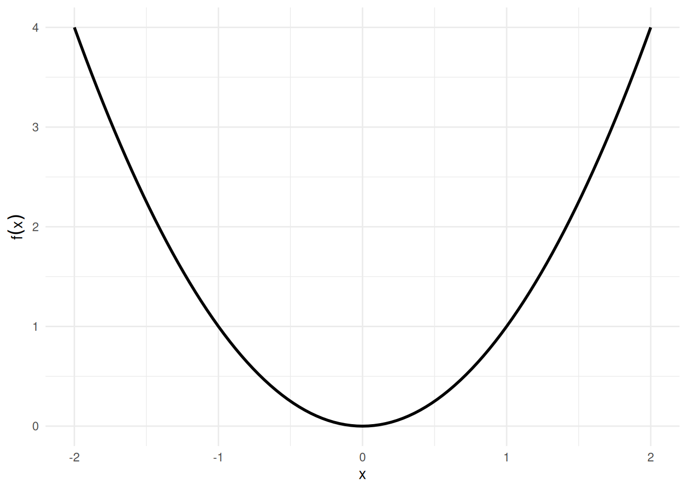
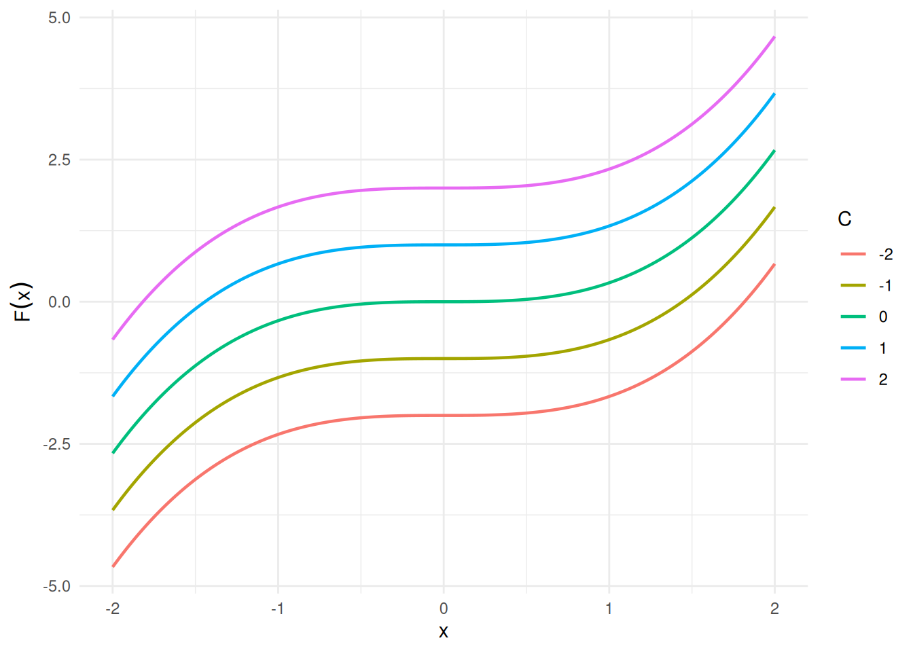
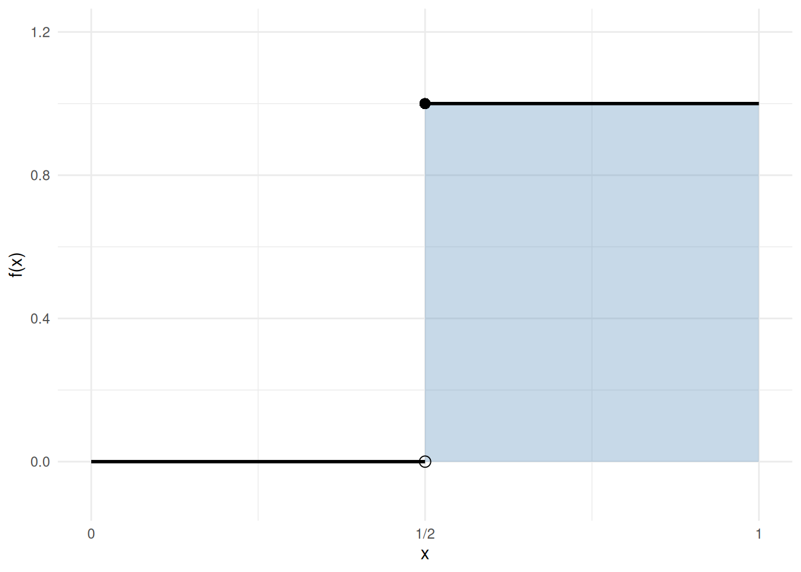
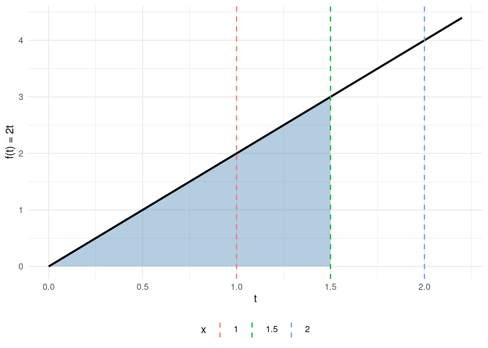
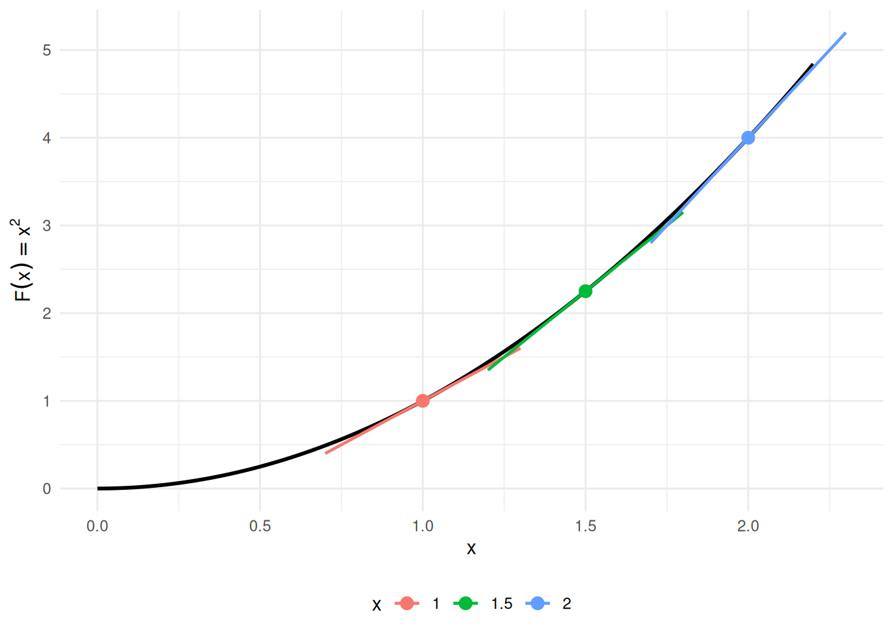
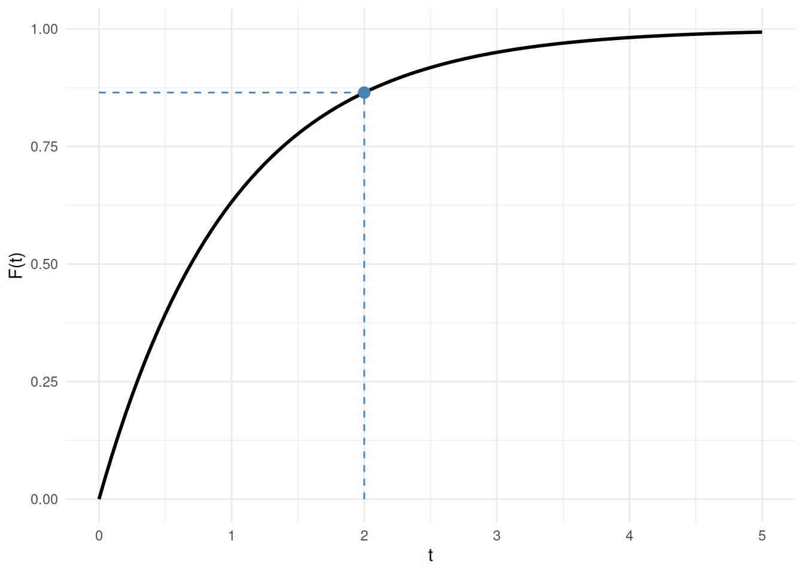

# Calculus

Code

Published

Last modified: 2026-09-26 12:42:19 (PDT)

# 1 Derivatives

> **NOTE:**
>
> **Theorem 1 (Constant rule)** \\\frac{\partial}{\partial x}c = 0\\

> **NOTE:**
>
> **Theorem 2 (Power rule)** If \\a\\ is constant with respect to \\x\\, then: \\\frac{\partial}{\partial x}ay = a \frac{\partial x}{\partial y}\\

> **NOTE:**
>
> **Theorem 3 (Power rule)** \\\frac{\partial}{\partial x}x^q = qx^{q-1}\\

> **NOTE:**
>
> **Theorem 4 (Derivative of natural logarithm)** \\\operatorname{log}'\mathopen{}\left\\x\right\\\mathclose{} = \frac{1}{x} = x^{-1}\\

> **NOTE:**
>
> **Theorem 5 (derivative of exponential)** \\\operatorname{exp}'\mathopen{}\left\\x\right\\\mathclose{} = \operatorname{exp}\mathopen{}\left\\x\right\\\mathclose{}\\

> **NOTE:**
>
> **Theorem 6 (Product rule)** \\(ab)' = ab' + ba'\\

> **NOTE:**
>
> **Theorem 7 (Quotient rule)** \\(a/b)' = a'/b - (a/b^2)b'\\

> **NOTE:**
>
> **Theorem 8 (Chain rule)** \\\begin{aligned} \frac{\partial a}{\partial c} &= \frac{\partial a}{\partial b} \frac{\partial b}{\partial c} \\ &= \frac{\partial b}{\partial c} \frac{\partial a}{\partial b} \end{aligned} \\
>
> or in [Euler/Lagrange notation](https://en.wikipedia.org/wiki/Notation_for_differentiation#Lagrange's_notation):
>
> \\(f(g(x)))' = g'(x) f'(g(x))\\

> **NOTE:**
>
> **Corollary 1 (Chain rule for logarithms)** \\ \frac{\partial}{\partial x}\log{f(x)} = \frac{f'(x)}{f(x)} \\

> **NOTE:**
>
> *Proof*. Apply [Theorem 8](#thm-chain-rule) and [Theorem 4](#thm-deriv-log).

------------------------------------------------------------------------

# 2 Integration

Integration is the inverse operation of differentiation: it recovers a function from its derivative and accumulates quantities such as areas, totals, and probabilities. We begin with antiderivatives, then state basic integration rules, and conclude with the Fundamental Theorem of Calculus and a worked example from probability.

## 2.1 Antiderivatives

> **NOTE:**
>
> **Definition 1 (Antiderivative)** A function \\F\\ is an **antiderivative** of \\f\\ on an interval \\I\\ if:
>
> \\\frac{\partial}{\partial x} F(x) = f(x), \quad \forall x \in I\\
>
> ([Larson and Edwards 2018, sec. 4.1](#ref-larsonCalc11e), pp. 248–249)

> **NOTE:**
>
> **Definition 2 (Indefinite integral)** The **indefinite integral** of \\f\\ is the family of all antiderivatives ([Definition 1](#def-antiderivative)) of \\f\\:
>
> \\\int f(x)\\dx = F(x) + C\\
>
> where \\F\\ is any one antiderivative of \\f\\ and \\C\\ is an arbitrary constant of integration.
>
> ([Larson and Edwards 2018, sec. 4.1](#ref-larsonCalc11e), pp. 248–249)

> **NOTE:**
>
> **Example 1 (Antiderivative of a power function)** For \\f(x) = x^2\\, an antiderivative is \\F(x) = \frac{x^3}{3}\\, since \\\frac{\partial}{\partial x}\frac{x^3}{3} = x^2 = f(x)\\.
>
> Adding any constant \\C\\ gives another antiderivative; for example, with \\C = 7\\, \\F(x) = \frac{x^3}{3} + 7\\ also satisfies \\F'(x) = x^2\\, since adding a constant does not change the derivative. See [Figure 1](#fig-antiderivatives).
>
> Code
>
> ``` downlit
> ggplot2::ggplot() +
>   ggplot2::geom_function(fun = \(x) x^2, xlim = x_lim, linewidth = 1) +
>   ggplot2::labs(x = "x", y = expression(f(x))) +
>   ggplot2::theme_minimal()
> ```
>
> [](calculus_files/figure-html/fig-antiderivatives-f-code-1.png "Figure 1 (b): The function f(x) = x^2.")
>
> \(a\)
>
> \(b\) The function \\f(x) = x^2\\.
>
> Code
>
> ``` downlit
> x_seq <- seq(x_lim[1], x_lim[2], length.out = 200)
> df <- do.call(rbind, lapply(C_vals, \(C) {
>   data.frame(
>     x = x_seq,
>     y = x_seq^3 / 3 + C,
>     C = factor(C)
>   )
> }))
>
> ggplot2::ggplot(df, ggplot2::aes(x = x, y = y, color = C)) +
>   ggplot2::geom_line(linewidth = 0.8) +
>   ggplot2::labs(x = "x", y = expression(F(x)), color = "C") +
>   ggplot2::theme_minimal()
> ```
>
> [](calculus_files/figure-html/fig-antiderivatives-F-code-1.png "Figure 1 (d): Family of antiderivatives F(x) = x^3/3 + C.")
>
> \(c\)
>
> \(d\) Family of antiderivatives \\F(x) = x^3/3 + C\\.
>
> Figure 1: The function \\f(x) = x^2\\ and five antiderivatives \\F(x) = x^3/3 + C\\ for \\C \in \\-2, -1, 0, 1, 2\\\\. Each antiderivative has the same derivative \\f\\; they differ only by a vertical shift.

> **NOTE:**
>
> **Theorem 9 (Basic integration rules)** Each antiderivative in the table is defined only up to an arbitrary constant \\C\\ (see [Definition 1](#def-antiderivative)); the table omits \\+ C\\ from every row for brevity.
>
> | Function \\f(x)\\ | Antiderivative \\F(x)\\ | Condition |
> |:--:|:--:|:---|
> | \\c\\ | \\cx\\ | — |
> | \\x^n\\ | \\\dfrac{x^{n+1}}{n+1}\\ | \\n \ne -1\\ |
> | \\\dfrac{1}{x}\\ | \\\ln\mathopen{}\left\|x\right\|\mathclose{}\\ | \\x \ne 0\\ |
> | \\\text{e}^{x}\\ | \\\text{e}^{x}\\ | (self-antiderivative) |
> | \\\text{e}^{cx}\\ | \\\dfrac{1}{c}\text{e}^{cx}\\ | \\c \ne 0\\ |
> | \\c \cdot f(x)\\ | \\c \cdot F(x)\\ | — |
> | \\f(x) + g(x)\\ | \\F(x) + G(x)\\ | — |
>
> The first two rows and the bottom two rows (linearity) are from ([Larson and Edwards 2018, sec. 4.1](#ref-larsonCalc11e), p. 250 “Basic Integration Rules”); \\1/x\\ is from ([Larson and Edwards 2018, sec. 5.2](#ref-larsonCalc11e), Theorem 5.5, p. 324); \\\text{e}^{x}\\ and \\\text{e}^{cx}\\ are from ([Larson and Edwards 2018, sec. 5.4](#ref-larsonCalc11e), Theorem 5.12, p. 346).

> **NOTE:**
>
> **Example 2 (Antiderivative of \\3x^2 - 1\\)** By the power rule (\\n = 2\\) and linearity from [Theorem 9](#thm-integral-rules):
>
> \\ \int \mathopen{}\left(3x^2 - 1\right)\mathclose{}\\dx = 3 \cdot\frac{x^3}{3} - x + C = x^3 - x + C. \\
>
> Verify by differentiating: \\\frac{\partial}{\partial x}\mathopen{}\left(x^3 - x + C\right)\mathclose{} = 3x^2 - 1 = f(x)\\, as required.

## 2.2 Regularity Conditions

> **NOTE:**
>
> **Definition 3 (Differentiable function)** A function \\f\\ is **differentiable at** \\x = c\\ if the limit
>
> \\f'(c) \stackrel{\text{def}}{=}\lim\_{h \to 0} \frac{f(c + h) - f(c)}{h}\\
>
> exists and is finite.
>
> ([Larson and Edwards 2018, sec. 2.1](#ref-larsonCalc11e), p. 100)

> **NOTE:**
>
> **Definition 4 (Differentiable on an interval)** A function \\f\\ is **differentiable on** an interval if it is differentiable ([Definition 3](#def-differentiable)) at every interior point of the interval; at a closed endpoint, the appropriate one-sided derivative is used.
>
> ([Larson and Edwards 2018, sec. 2.1](#ref-larsonCalc11e), p. 100)

> **NOTE:**
>
> **Definition 5 (Continuous function)** A function \\f\\ is **continuous at** \\x = c\\ if all three conditions hold:
>
> 1.  \\f(c)\\ is defined,
> 2.  \\\lim\_{x \to c} f(x)\\ exists, and
> 3.  \\\lim\_{x \to c} f(x) = f(c)\\.
>
> ([Larson and Edwards 2018, sec. 1.4](#ref-larsonCalc11e), p. 73)

> **NOTE:**
>
> **Definition 6 (Continuous on a closed interval)** A function \\f\\ is **continuous on** a closed interval \\\[a, b\]\\ if it is continuous ([Definition 5](#def-continuous)) at every point of \\\[a, b\]\\.
>
> ([Larson and Edwards 2018, sec. 1.4](#ref-larsonCalc11e), p. 73)

> **NOTE:**
>
> **Definition 7 (Riemann integral)** For a bounded function \\f\\ on \\\[a, b\]\\, split \\\[a, b\]\\ into \\n\\ equal-width subintervals of width \\\Delta x \stackrel{\text{def}}{=}(b - a)/n\\, and let \\x_i^\*\\ be any point in the \\i\\-th subinterval. The **Riemann integral** of \\f\\ over \\\[a, b\]\\ is the limit
>
> \\\int_a^b f(x)\\dx \stackrel{\text{def}}{=}\lim\_{n \to \infty} \sum\_{i=1}^n f(x_i^\*)\\\Delta x,\\
>
> when that limit exists.
>
> ([Larson and Edwards 2018, sec. 4.3](#ref-larsonCalc11e), p. 272)

> **NOTE:**
>
> **Definition 8 (Riemann integrable)** A bounded function \\f\\ is **Riemann integrable on** \\\[a, b\]\\ if its Riemann integral ([Definition 7](#def-riemann-integral)) over \\\[a, b\]\\ exists and is finite.
>
> ([Larson and Edwards 2018, sec. 4.3](#ref-larsonCalc11e), p. 272)

> **NOTE:**
>
> **Definition 9 (General Riemann integrability)** More generally, using partitions \\\mathcal{P}\\ of arbitrary mesh — subintervals of varying widths \\\Delta x_i\\ — a bounded function \\f\\ is **Riemann integrable in the general sense** on \\\[a, b\]\\ if
>
> \\\int_a^b f(x)\\dx \stackrel{\text{def}}{=}\lim\_{\\\mathcal{P}\\ \to 0} \sum\_{i=1}^n f(x_i^\*)\\\Delta x_i\\
>
> exists and is finite, where \\\\\mathcal{P}\\ = \max_i \Delta x_i\\ is the mesh of the partition.

> **NOTE:**
>
> **Theorem 10 (Equivalence of Riemann sum formulations)** For continuous \\f\\ on a closed interval \\\[a, b\]\\, the equal-width Riemann sum ([Definition 8](#def-integrable)) and the arbitrary-mesh Riemann sum ([Definition 9](#def-integrable-general)) give the same value ([Rudin 1976, chap. 6](#ref-rudin1976principles)). Applied statistics courses mostly use the equal-width form in [Definition 8](#def-integrable).

Before stating the Fundamental Theorem of Calculus, we record two prerequisite results. The FTC requires the integrand \\f\\ to be continuous, and the following two theorems establish where continuity comes from (differentiability \\\Rightarrow\\ continuity) and what it buys us (continuity \\\Rightarrow\\ integrability).

> **NOTE:**
>
> **Theorem 11 (Differentiability implies continuity)** If \\f\\ is differentiable at \\x = c\\, then \\f\\ is continuous at \\x = c\\.
>
> ([Larson and Edwards 2018](#ref-larsonCalc11e), Theorem 2.1, p. 106)

> **NOTE:**
>
> **Example 3 (Differentiable, hence continuous: \\x^3 - x\\)** \\f(x) = x^3 - x\\ is differentiable everywhere (with derivative \\f'(x) = 3x^2 - 1\\), so by [Theorem 11](#thm-diff-implies-cont) it is continuous everywhere.

> **NOTE:**
>
> **Example 4 (Continuous but not differentiable: \\\mathopen{}\left\|x\right\|\mathclose{}\\)** The absolute-value function \\f(x) = \mathopen{}\left\|x\right\|\mathclose{}\\ is continuous at \\x = 0\\ (\\\lim\_{x \to 0}\mathopen{}\left\|x\right\|\mathclose{} = 0 = \mathopen{}\left\|0\right\|\mathclose{}\\), but it is not differentiable at \\x = 0\\: the left-derivative is \\-1\\ and the right-derivative is \\+1\\.
>
> This counterexample shows that the converse of [Theorem 11](#thm-diff-implies-cont) fails: continuity does not imply differentiability. See [Figure 2](#fig-abs-value).
>
> Code
>
> ``` downlit
> ggplot2::ggplot() +
>   ggplot2::geom_function(fun = abs, xlim = c(-2, 2), linewidth = 1) +
>   ggplot2::geom_point(ggplot2::aes(x = 0, y = 0), size = 3) +
>   ggplot2::labs(x = "x", y = expression(f(x) == abs(x))) +
>   ggplot2::theme_minimal()
> ```
>
> [](calculus_files/figure-html/fig-abs-value-code-1.png "Figure 2 (a): ")
>
> \(a\)
>
> Figure 2: \\f(x) = \mathopen{}\left\|x\right\|\mathclose{}\\ has a sharp corner at \\x = 0\\ (not differentiable there) but is continuous everywhere: no gaps or jumps.

> **NOTE:**
>
> **Theorem 12 (Continuity implies integrability)** If \\f\\ is continuous on the closed interval \\\[a, b\]\\, then \\f\\ is integrable on \\\[a, b\]\\ (i.e., the Riemann integral \\\int_a^b f(x)\\dx\\ exists and is finite).
>
> ([Larson and Edwards 2018](#ref-larsonCalc11e), Theorem 4.4, p. 272)

> **NOTE:**
>
> **Example 5 (Continuous, hence integrable: polynomials)** Every polynomial is continuous on \\\mathbb{R}\\, so by [Theorem 12](#thm-cont-implies-int) every polynomial is integrable on every closed interval \\\[a, b\]\\.

> **NOTE:**
>
> **Example 6 (Integrable but not continuous: a step function)** Let \\f(x) = 0\\ for \\x \< \tfrac{1}{2}\\ and \\f(x) = 1\\ for \\x \ge \tfrac{1}{2}\\. Then \\f\\ is discontinuous at \\x = \tfrac{1}{2}\\, but it is integrable on \\\[0, 1\]\\:
>
> \\ \int_0^1 f(x)\\dx = \int_0^{1/2} 0\\dx + \int\_{1/2}^1 1\\dx = 0 + \tfrac{1}{2} = \tfrac{1}{2}. \\
>
> This counterexample shows that the converse of [Theorem 12](#thm-cont-implies-int) fails: integrability does not imply continuity. See [Figure 3](#fig-step).
>
> Code
>
> ``` downlit
> step_df <- data.frame(
>   x = c(0, 0.5, 0.5, 1),
>   y = c(0, 0, 1, 1),
>   segment = c("left", "left", "right", "right")
> )
>
> ggplot2::ggplot() +
>   ggplot2::geom_rect(
>     ggplot2::aes(xmin = 0.5, xmax = 1, ymin = 0, ymax = 1),
>     fill = "steelblue", alpha = 0.3
>   ) +
>   ggplot2::geom_line(
>     data = step_df,
>     ggplot2::aes(x = x, y = y, group = segment),
>     linewidth = 1
>   ) +
>   ggplot2::geom_point(ggplot2::aes(x = 0.5, y = 0), shape = 1, size = 3) +
>   ggplot2::geom_point(ggplot2::aes(x = 0.5, y = 1), shape = 16, size = 3) +
>   ggplot2::scale_x_continuous(
>     breaks = c(0, 0.5, 1),
>     labels = c("0", "1/2", "1")
>   ) +
>   ggplot2::scale_y_continuous(limits = c(-0.1, 1.2)) +
>   ggplot2::labs(x = "x", y = "f(x)") +
>   ggplot2::theme_minimal()
> ```
>
> [](calculus_files/figure-html/fig-step-code-1.png "Figure 3 (a): ")
>
> \(a\)
>
> Figure 3: Step function: \\f(x) = 0\\ on \\\[0, \tfrac{1}{2})\\ (open circle at the jump) and \\f(x) = 1\\ on \\\[\tfrac{1}{2}, 1\]\\ (filled circle). The shaded rectangle has area \\\tfrac{1}{2}\\, matching the integral computed in [Example 6](#exm-int-not-cont).

Together, [Theorem 11](#thm-diff-implies-cont) and [Theorem 12](#thm-cont-implies-int) establish the chain:

\\\text{differentiable} \\\Rightarrow\\ \text{continuous} \\\Rightarrow\\ \text{integrable}\\

[Example 4](#exm-cont-not-diff) and [Example 6](#exm-int-not-cont) show that neither implication reverses in general.

## 2.3 Fundamental Theorem of Calculus

> **NOTE:**
>
> **Theorem 13 (Fundamental Theorem of Calculus)** Let \\f\\ be a continuous function on a closed interval \\\[a, b\]\\.
>
> **Part 1 (Derivative of an integral).** Define \\F(x) = \int_a^x f(t)\\dt\\ for \\x \in \[a, b\]\\. Then \\F\\ is differentiable and:
>
> \\\frac{\partial}{\partial x}\int_a^x f(t)\\dt = f(x) \tag{1}\\
>
> > **NOTE:**
> >
> > Continuity on all of \\\[a, b\]\\ is a sufficient condition. More generally, Part 1 holds at any individual point \\x\\ where \\f\\ is integrable on \\\[a, b\]\\ (see [Definition 8](#def-integrable)) and continuous at \\x\\ (see [Definition 5](#def-continuous)), even if \\f\\ has jump discontinuities elsewhere ([Rudin 1976](#ref-rudin1976principles), Theorem 6.20, p. 133).
>
> ([Larson and Edwards 2018](#ref-larsonCalc11e), Theorem 4.11, p. 288)
>
> **Part 2 (Evaluation theorem).** The \\F\\ here may be *any* antiderivative of \\f\\ — not just the accumulation function from Part 1. If \\F\\ is an antiderivative of \\f\\ on \\\[a, b\]\\ (i.e., \\\frac{\partial}{\partial x} F(x) = f(x)\\ for all \\x \in \[a, b\]\\), then:
>
> \\\int_a^b f(x)\\dx = F(b) - F(a) \tag{2}\\
>
> Equivalently, with \\b\\ replaced by a variable upper limit \\x\\, integrating the derivative of \\F\\ recovers the net change in \\F\\:
>
> \\\int_a^x F'(t)\\dt = F(x) - F(a) \tag{3}\\
>
> or equivalently in Leibniz notation:
>
> \\\int_a^x \frac{d F}{d t}\\dt = F(x) - F(a)\\
>
> ([Banner 2007, chap. 18](#ref-calclifesaver); [Larson and Edwards 2018](#ref-larsonCalc11e), Theorem 4.9, p. 282)

The two parts of the FTC together express that **differentiation and integration are inverse operations**:

- Part 1: differentiating the integral of \\f\\ recovers \\f\\ ([Equation 1](#eq-ftc-deriv-of-integral)).
- Part 2: the integral of \\f\\ over \\\[a, b\]\\ equals the difference of any antiderivative’s values at the endpoints ([Equation 2](#eq-ftc-part2)), which rearranges to “integrating the derivative of \\F\\ recovers the net change in \\F\\” ([Equation 3](#eq-ftc-integral-of-deriv)).

The standard form of the FTC assumes \\f\\ is continuous on \\\[a, b\]\\; continuity is *sufficient* but not strictly necessary (see the callout note inside [Theorem 13](#thm-ftc) for the more general statement). Since differentiability implies continuity ([Theorem 11](#thm-diff-implies-cont)), the FTC applies in particular whenever \\f\\ is differentiable — a common situation in applied statistics.

> **NOTE:**
>
> **Example 7 (FTC Part 1 visualized: accumulation function for \\f(t) = 2t\\)** Take \\f(t) = 2t\\ on \\\[0, 2\]\\. The accumulation function from \\0\\ is
>
> \\F(x) \\\stackrel{\text{def}}{=}\\ \int_0^x 2t\\dt \\=\\ \mathopen{}\left\[t^2\right\]\mathclose{}\_{t=0}^{t=x} \\=\\ x^2 - 0^2 \\=\\ x^2,\\
>
> so \\F(x) = x^2\\, and indeed \\F'(x) = 2x = f(x)\\, as [Theorem 13](#thm-ftc) Part 1 predicts. [Figure 4](#fig-ftc-part1) shows the integrand on the left (shaded area equals \\F(x)\\ at each \\x\\) and the accumulation function \\F(x) = x^2\\ on the right (its slope at \\x\\ equals \\f(x) = 2x\\).
>
> Code
>
> ``` downlit
> ggplot2::ggplot() +
>   ggplot2::geom_area(
>     data = data.frame(t = seq(0, x_focus, length.out = 200)),
>     ggplot2::aes(x = t, y = 2 * t),
>     fill = "steelblue", alpha = 0.4
>   ) +
>   ggplot2::geom_function(fun = \(t) 2 * t, xlim = c(0, 2.2), linewidth = 1) +
>   ggplot2::geom_vline(
>     data = data.frame(x = x_marks),
>     ggplot2::aes(xintercept = x, color = factor(x)),
>     linetype = "dashed", linewidth = 0.6
>   ) +
>   ggplot2::labs(x = "t", y = "f(t) = 2t", color = "x") +
>   ggplot2::theme_minimal() +
>   ggplot2::theme(legend.position = "bottom")
> ```
>
> [](calculus_files/figure-html/fig-ftc-part1-left-code-1.png "Figure 4 (b): f(t) = 2t; shaded area equals F(1.5) = 2.25; vertical lines mark x \in \{1, 1.5, 2\}.")
>
> \(a\)
>
> \(b\) \\f(t) = 2t\\; shaded area equals \\F(1.5) = 2.25\\; vertical lines mark \\x \in \\1, 1.5, 2\\\\.
>
> Code
>
> ``` downlit
> slope_df <- data.frame(
>   x = x_marks,
>   Fx = x_marks^2,
>   slope = 2 * x_marks
> )
>
> ggplot2::ggplot() +
>   ggplot2::geom_function(fun = \(x) x^2, xlim = c(0, 2.2), linewidth = 1) +
>   ggplot2::geom_point(
>     data = slope_df,
>     ggplot2::aes(x = x, y = Fx, color = factor(x)),
>     size = 3
>   ) +
>   ggplot2::geom_segment(
>     data = slope_df,
>     ggplot2::aes(
>       x = x - 0.3, xend = x + 0.3,
>       y = Fx - 0.3 * slope, yend = Fx + 0.3 * slope,
>       color = factor(x)
>     ),
>     linewidth = 0.8
>   ) +
>   ggplot2::labs(x = "x", y = expression(F(x) == x^2), color = "x") +
>   ggplot2::theme_minimal() +
>   ggplot2::theme(legend.position = "bottom")
> ```
>
> [](calculus_files/figure-html/fig-ftc-part1-right-code-1.png "Figure 4 (d): F(x) = x^2; tangent slope at each marked x equals f(x) = 2x.")
>
> \(c\)
>
> \(d\) \\F(x) = x^2\\; tangent slope at each marked \\x\\ equals \\f(x) = 2x\\.
>
> Figure 4: Left: \\f(t) = 2t\\; the shaded area \\\int_0^{1.5} 2t\\dt = F(1.5) = 2.25\\; vertical lines mark \\x \in \\1, 1.5, 2\\\\. Right: \\F(x) = x^2\\; for each marked \\x\\, the tangent slope equals \\f(x) = 2x\\.

> **NOTE:**
>
> **Example 8 (CDF and PDF of the exponential distribution)** In what follows, \\f\\ denotes the PDF and \\F\\ the CDF — the same letters as the antiderivative pair in [Definition 1](#def-antiderivative), because the FTC will show \\F\\ is exactly an antiderivative of \\f\\.
>
> For the exponential distribution with rate parameter \\\lambda \> 0\\, the probability density function (PDF) is ([Kleinbaum and Klein 2012, sec. II](#ref-kleinbaum2012survival), p. 295, “Survival and Hazard Functions for Selected Distributions”):
>
> \\f(t) = \lambda \text{e}^{-\lambda t}, \quad t \ge 0\\
>
> **FTC Part 2** gives the cumulative distribution function (CDF) from the PDF. Apply the \\\text{e}^{cx}\\ rule from [Theorem 9](#thm-integral-rules) with \\c = -\lambda\\ to antidifferentiate the integrand:
>
> \\ \begin{aligned} F(t) &= \int_0^t \lambda \text{e}^{-\lambda u}\\du \\ &= \mathopen{}\left\[\lambda \cdot\frac{1}{-\lambda}\text{e}^{-\lambda u}\right\]\mathclose{}\_{u=0}^{u=t} \\ &= \mathopen{}\left\[(-1)\text{e}^{-\lambda u}\right\]\mathclose{}\_{u=0}^{u=t} \\ &= \mathopen{}\left\[-\text{e}^{-\lambda u}\right\]\mathclose{}\_{u=0}^{u=t} \\ &= -\text{e}^{-\lambda t} - \mathopen{}\left(-\text{e}^{0}\right)\mathclose{} \\ &= -\text{e}^{-\lambda t} - (-1) \\ &= 1 - \text{e}^{-\lambda t} \end{aligned} \\
>
> **FTC Part 1** recovers the PDF from the CDF:
>
> \\ \begin{aligned} \frac{\partial}{\partial t} F(t) &= \frac{\partial}{\partial t}\mathopen{}\left(1 - \text{e}^{-\lambda t}\right)\mathclose{} \\ &= 0 - (-\lambda)\text{e}^{-\lambda t} \\ &= \lambda\text{e}^{-\lambda t} \\ &= f(t) \end{aligned} \\
>
> For a concrete instance: with \\\lambda = 1\\ (standard exponential), the probability that \\T \le 2\\ is:
>
> \\ F(2) = 1 - \text{e}^{-1 \cdot 2} = 1 - \text{e}^{-2} \approx 1 - 0.135 = 0.865 \\
>
> See [Figure 5](#fig-exp-pdf-cdf).
>
> Code
>
> ``` downlit
> ggplot2::ggplot() +
>   ggplot2::geom_area(
>     data = data.frame(t = seq(0, t_focus, length.out = 300)),
>     ggplot2::aes(x = t, y = lambda * exp(-lambda * t)),
>     fill = "steelblue", alpha = 0.4
>   ) +
>   ggplot2::geom_function(
>     fun = \(t) lambda * exp(-lambda * t),
>     xlim = c(0, t_max), linewidth = 1
>   ) +
>   ggplot2::labs(x = "t", y = "f(t)") +
>   ggplot2::theme_minimal()
> ```
>
> [](calculus_files/figure-html/fig-exp-pdf-cdf-pdf-code-1.png "Figure 5 (b): PDF with \lambda = 1; shaded area equals F(2) \approx 0.865.")
>
> \(a\)
>
> \(b\) PDF with \\\lambda = 1\\; shaded area equals \\F(2) \approx 0.865\\.
>
> Code
>
> ``` downlit
> ggplot2::ggplot() +
>   ggplot2::geom_function(
>     fun = \(t) 1 - exp(-lambda * t),
>     xlim = c(0, t_max), linewidth = 1
>   ) +
>   ggplot2::geom_point(
>     ggplot2::aes(x = t_focus, y = F_at_focus),
>     size = 3, color = "steelblue"
>   ) +
>   ggplot2::geom_segment(
>     ggplot2::aes(x = t_focus, xend = t_focus, y = 0, yend = F_at_focus),
>     linetype = "dashed", color = "steelblue"
>   ) +
>   ggplot2::geom_segment(
>     ggplot2::aes(x = 0, xend = t_focus, y = F_at_focus, yend = F_at_focus),
>     linetype = "dashed", color = "steelblue"
>   ) +
>   ggplot2::labs(x = "t", y = "F(t)") +
>   ggplot2::theme_minimal()
> ```
>
> [](calculus_files/figure-html/fig-exp-pdf-cdf-cdf-code-1.png "Figure 5 (d): CDF with \lambda = 1; point marks F(2) \approx 0.865.")
>
> \(c\)
>
> \(d\) CDF with \\\lambda = 1\\; point marks \\F(2) \approx 0.865\\.
>
> Figure 5: Exponential distribution with \\\lambda = 1\\. Left: the PDF \\f(t) = \lambda \text{e}^{-\lambda t}\\; the shaded area under the curve from \\0\\ to \\2\\ equals \\F(2) \approx 0.865\\. Right: the CDF \\F(t) = 1 - \text{e}^{-\lambda t}\\; the dashed lines mark the value \\F(2)\\ computed via FTC Part 2.

# 3 Double Integrals

The **Fubini–Tonelli theorem** states conditions under which the order of integration in a double integral can be exchanged. We state two versions: the Riemann version ([Theorem 14](#thm-fubini)) is what applied courses usually use for double integrals of continuous functions on simple regions; the σ-finite measure-theoretic version ([Theorem 15](#thm-fubini-tonelli)) is included to make the [joint-distribution form](https://morrison-lab.github.io/rme/chapters/probability.html#cor-fubini-joint) corollary in the probability chapter of *Regression Models for Epidemiology* follow from a stated theorem rather than from an aside.

> **NOTE:**
>
> **Theorem 14 (Fubini’s theorem (Riemann version))** Let \\f\\ be **continuous** on a plane region \\R \subseteq \mathbb{R}^2\\.
>
> 1.  **Vertically simple region.** If \\R\\ is defined by \\a \le x \le b\\ and \\g_1(x) \le y \le g_2(x)\\, where \\g_1\\ and \\g_2\\ are continuous on \\\[a, b\]\\, then
>
>     \\ \begin{aligned} \iint_R f(x, y)\\dA &= \int_a^b \int\_{g_1(x)}^{g_2(x)} f(x, y)\\dy\\dx. \end{aligned} \\
>
> 2.  **Horizontally simple region.** If \\R\\ is defined by \\c \le y \le d\\ and \\h_1(y) \le x \le h_2(y)\\, where \\h_1\\ and \\h_2\\ are continuous on \\\[c, d\]\\, then
>
>     \\ \begin{aligned} \iint_R f(x, y)\\dA &= \int_c^d \int\_{h_1(y)}^{h_2(y)} f(x, y)\\dx\\dy. \end{aligned} \\
>
> When \\R\\ can be described both ways, the two iterated integrals are equal — so the order of integration can be exchanged.
>
> ([Larson and Edwards 2018](#ref-larsonCalc11e), Theorem 14.2, p. 982)

> **NOTE:**
>
> **Example 9 (Changing the order of integration for a non-rectangular region)** Adapted from ([Larson and Edwards 2018, sec. 14.2](#ref-larsonCalc11e), Example 4, pp. 984–985).
>
> Let \\X\\ and \\Y\\ be independent \\\operatorname{Uniform}(0, 1)\\ random variables, with joint density \\f(x, y) = 1\\ on the unit square \\\[0, 1\]^2\\. Define the function \\g(x, y) = \text{e}^{-x^2}\\\mathbb{1}\mathopen{}\left(y \le x\right)\mathclose{}\\, and compute its expectation \\\operatorname{E}\mathopen{}\left\[g(X, Y)\right\]\mathclose{}\\.
>
> Because the joint density equals \\1\\ on \\\[0, 1\]^2\\, this expectation is the double integral of \\g\\ over the unit square:
>
> \\\operatorname{E}\mathopen{}\left\[g(X, Y)\right\]\mathclose{} = \iint\_{\[0, 1\]^2} g(x, y)\\dA.\\
>
> The indicator factor \\\mathbb{1}\mathopen{}\left(y \le x\right)\mathclose{}\\ equals \\1\\ on the triangular region where \\y \le x\\ and \\0\\ elsewhere, so only that region, namely \\D = \\(x, y) : x \in \[0, 1\],\\ y \in \[0, x\]\\\\ ([Figure 6](#fig-fubini-nonrect-region)), contributes, and there \\g(x, y) = \text{e}^{-x^2}\\:
>
> \\\operatorname{E}\mathopen{}\left\[g(X, Y)\right\]\mathclose{} = \iint_D \text{e}^{-x^2}\\dA.\\
>
> Code
>
> ``` downlit
> region <- data.frame(x = c(0, 1, 1), y = c(0, 0, 1))
> ggplot2::ggplot(region, ggplot2::aes(x = x, y = y)) +
>   ggplot2::geom_polygon(
>     fill = "steelblue", alpha = 0.4, color = "black", linewidth = 0.7
>   ) +
>   ggplot2::annotate(
>     "text", x = 0.65, y = 0.28, label = "D", size = 8, fontface = "italic"
>   ) +
>   ggplot2::annotate(
>     "text", x = 0.36, y = 0.52, label = "y == x",
>     parse = TRUE, angle = 45
>   ) +
>   ggplot2::annotate(
>     "text", x = 1.08, y = 0.5, label = "x == 1",
>     parse = TRUE, angle = 90, hjust = 0.5
>   ) +
>   ggplot2::annotate(
>     "text", x = 0.5, y = -0.1, label = "y == 0", parse = TRUE
>   ) +
>   ggplot2::scale_x_continuous(breaks = c(0, 0.5, 1), limits = c(-0.1, 1.3)) +
>   ggplot2::scale_y_continuous(breaks = c(0, 0.5, 1), limits = c(-0.2, 1.2)) +
>   ggplot2::coord_equal() +
>   ggplot2::labs(x = "x", y = "y") +
>   ggplot2::theme_minimal()
> ```
>
> [](calculus_files/figure-html/unnamed-chunk-1-1.png "Figure 6: Triangular integration region D = \{(x, y) : x \in [0, 1],\; y \in [0, x]\}, bounded below by y = 0, above-left by y = x, and on the right by x = 1.")
>
> Figure 6: Triangular integration region \\D = \\(x, y) : x \in \[0, 1\],\\ y \in \[0, x\]\\\\, bounded below by \\y = 0\\, above-left by \\y = x\\, and on the right by \\x = 1\\.
>
> **Order \\dx\\dy\\ is intractable.** Re-describing \\D\\ as \\D = \\(x, y) : y \in \[0, 1\],\\ x \in \[y, 1\]\\\\, the inner integral is
>
> \\\int_y^1 \text{e}^{-x^2}\\dx,\\
>
> which has no elementary antiderivative.
>
> **Order \\dy\\dx\\ works.** Applying [Theorem 14](#thm-fubini) Part 1 (\\\text{e}^{-x^2}\\ is continuous and \\D\\ is the vertically simple region \\x \in \[0, 1\]\\, \\y \in \[0, x\]\\):
>
> \\ \begin{aligned} \iint_D \text{e}^{-x^2}\\dA &= \int_0^1\\\int_0^x \text{e}^{-x^2}\\dy\\dx \\&= \int_0^1 \text{e}^{-x^2}\mathopen{}\left(\int_0^x dy\right)\mathclose{}\\dx \\&= \int_0^1 x\\\text{e}^{-x^2}\\dx \\&= \mathopen{}\left\[-\frac{1}{2}\\\text{e}^{-x^2}\right\]\mathclose{}\_0^1 \\&= -\frac{1}{2}\mathopen{}\left(\text{e}^{-1} - 1\right)\mathclose{} \\&= \frac{e - 1}{2e} \\&\approx 0.316 \end{aligned} \\
>
> The solid whose volume equals this integral is shown in [Figure 7](#fig-fubini-nonrect).
>
> Code
>
> ``` downlit
> n_grid <- 51
> x_seq <- seq(0, 1, length.out = n_grid)
> y_seq <- seq(0, 1, length.out = n_grid)
>
> z_mat <- outer(x_seq, y_seq, function(x, y) {
>   z <- exp(-x^2)
>   z[y > x] <- NA
>   z
> })
>
> plotly::plot_ly(x = ~x_seq, y = ~y_seq, z = ~t(z_mat)) |>
>   plotly::add_surface(showscale = FALSE) |>
>   plotly::layout(scene = list(
>     xaxis = list(title = "x"),
>     yaxis = list(title = "y"),
>     zaxis = list(title = "z = exp(-x^2)"),
>     camera = list(eye = list(x = 1.6, y = -1.6, z = 0.8))
>   ))
> ```
>
> Figure 7: Surface \\z = e^{-x^2}\\ over the region \\D = \\(x, y) : x \in \[0, 1\],\\ y \in \[0, x\]\\\\. The surface depends only on \\x\\ (constant in \\y\\), so for each \\x\\ the inner integral over \\y \in \[0, x\]\\ contributes \\x \cdot e^{-x^2}\\.

> **NOTE:**
>
> **Example 10 (When conditions fail: a counterexample)** The conditions in [Theorem 14](#thm-fubini) are not merely technical — when they fail, iterated integrals can exist yet disagree.
>
> Let \\f(x, y) = \frac{x^2 - y^2}{(x^2 + y^2)^2}\\ on the unit square \\R = \[0, 1\] \times \[0, 1\]\\. Strictly, \\f\\ is defined on \\R \setminus \\(0, 0)\\\\: the denominator vanishes at the origin, so \\f\\ is undefined there (we return to this point in the condition check).
>
> **Integrating \\y\\ first, then \\x\\:**
>
> Using \\\displaystyle\frac{\partial}{\partial y}\frac{y}{x^2 + y^2} = \frac{x^2 - y^2}{(x^2 + y^2)^2}\\:
>
> \\ \begin{aligned} \int_0^1\\\int_0^1 f(x, y)\\dy\\dx &= \int_0^1 \mathopen{}\left\[\frac{y}{x^2 + y^2}\right\]\mathclose{}\_{y=0}^{y=1}\\dx \\&= \int_0^1 \frac{1}{x^2 + 1}\\dx \\&= \mathopen{}\left\[\arctan(x)\right\]\mathclose{}\_0^1 \\&= \frac{\pi}{4} \end{aligned} \\
>
> **Integrating \\x\\ first, then \\y\\:**
>
> Using \\\displaystyle\frac{\partial}{\partial x}\mathopen{}\left(-\frac{x}{x^2 + y^2}\right)\mathclose{} = \frac{x^2 - y^2}{(x^2 + y^2)^2}\\:
>
> \\ \begin{aligned} \int_0^1\\\int_0^1 f(x, y)\\dx\\dy &= \int_0^1 \mathopen{}\left\[-\frac{x}{x^2 + y^2}\right\]\mathclose{}\_{x=0}^{x=1}\\dy \\&= \int_0^1 \mathopen{}\left(-\frac{1}{1 + y^2}\right)\mathclose{}\\dy \\&= -\mathopen{}\left\[\arctan(y)\right\]\mathclose{}\_0^1 \\&= -\frac{\pi}{4} \end{aligned} \\
>
> **Conclusion:** \\\dfrac{\pi}{4} \neq -\dfrac{\pi}{4}\\, so the two iterated integrals are unequal. [Theorem 14](#thm-fubini) does not apply here.
>
> **Why [Theorem 14](#thm-fubini)’s condition fails:** [Theorem 14](#thm-fubini) requires \\f\\ to be **continuous** on \\R\\. The denominator \\(x^2 + y^2)^2\\ vanishes at the origin \\(0, 0) \in R\\, so \\f\\ is *not even defined* there — let alone continuous — and the theorem does not apply.
>
> ([Wikipedia contributors 2024](#ref-wp:fubini))
>
> The surface, and the singularity at the origin responsible for the failure, are shown in [Figure 8](#fig-fubini-fail).
>
> Code
>
> ``` downlit
> n_grid <- 81
> eps <- 0.04
> x_seq <- seq(eps, 1, length.out = n_grid)
> y_seq <- seq(eps, 1, length.out = n_grid)
>
> z_mat <- outer(x_seq, y_seq, function(x, y) (x^2 - y^2) / (x^2 + y^2)^2)
> z_clip <- 50
> z_mat[z_mat > z_clip] <- z_clip
> z_mat[z_mat < -z_clip] <- -z_clip
>
> plotly::plot_ly(x = ~x_seq, y = ~y_seq, z = ~t(z_mat)) |>
>   plotly::add_surface(
>     showscale = FALSE,
>     colorscale = list(
>       list(0, "#3b4cc0"),
>       list(0.5, "#dddddd"),
>       list(1, "#b40426")
>     )
>   ) |>
>   plotly::layout(scene = list(
>     xaxis = list(title = "x"),
>     yaxis = list(title = "y"),
>     zaxis = list(title = "f(x, y)", range = c(-z_clip, z_clip)),
>     camera = list(eye = list(x = 1.6, y = 1.6, z = 0.6))
>   ))
> ```
>
> Figure 8: Surface \\f(x, y) = (x^2 - y^2)/(x^2 + y^2)^2\\ on \\\[0, 1\]^2\\, sampled away from the origin and clipped to \\\[-50, 50\]\\ for display. The function diverges to \\+\infty\\ along the \\x\\-axis (red ridge, \\f \> 0\\ when \\\|x\| \> \|y\|\\) and to \\-\infty\\ along the \\y\\-axis (blue ridge, \\f \< 0\\ when \\\|y\| \> \|x\|\\). The singularity at \\(0, 0)\\ is why \\f\\ is not continuous on \\R\\ and [Theorem 14](#thm-fubini) does not apply.

> **NOTE:**
>
> **Corollary 2 (Continuous functions on a rectangle (corollary of [Theorem 14](#thm-fubini)))** If \\f : \[a, b\] \times \[c, d\] \to \mathbb{R}\\ is **continuous** on the closed bounded rectangle \\\[a, b\] \times \[c, d\]\\, then:
>
> \\ \begin{aligned} \int_a^b \mathopen{}\left(\int_c^d f(x, y)\\dy\right)\mathclose{}\\dx &= \int_c^d \mathopen{}\left(\int_a^b f(x, y)\\dx\right)\mathclose{}\\dy\\ &= \iint\_{\[a,b\]\times\[c,d\]} f(x, y)\\dx\\dy. \end{aligned} \\
>
> ([Larson and Edwards 2018](#ref-larsonCalc11e), Theorem 14.2, p. 982)

> **NOTE:**
>
> *Proof*. A closed bounded rectangle \\\[a, b\] \times \[c, d\]\\ is both vertically simple (with \\g_1 \equiv c\\, \\g_2 \equiv d\\) and horizontally simple (with \\h_1 \equiv a\\, \\h_2 \equiv b\\). Applying both parts of [Theorem 14](#thm-fubini) to \\f\\ on this rectangle gives the two iterated forms shown.

> **NOTE:**
>
> **Example 11 (Evaluating a double integral on a rectangle)** Structure adapted from ([Larson and Edwards 2018, sec. 14.2](#ref-larsonCalc11e), Example 2, pp. 982–983); the integrand \\x^2 + y^2\\ is original, chosen so the integral equals \\\operatorname{E}\mathopen{}\left\[g(X, Y)\right\]\mathclose{}\\ for \\g(x, y) = x^2 + y^2\\.
>
> Let \\X\\ and \\Y\\ be independent \\\operatorname{Uniform}(0, 1)\\ random variables, with joint density \\f(x, y) = 1\\ on the unit square \\R = \\(x, y) : x \in \[0, 1\],\\ y \in \[0, 1\]\\\\ ([Figure 9](#fig-fubini-rect-region)). Define the function \\g(x, y) = x^2 + y^2\\, and compute its expectation \\\operatorname{E}\mathopen{}\left\[g(X, Y)\right\]\mathclose{}\\.
>
> Because the joint density equals \\1\\ on \\R\\, this expectation is the double integral of \\g\\ over \\R\\:
>
> \\\operatorname{E}\mathopen{}\left\[g(X, Y)\right\]\mathclose{} = \iint_R \mathopen{}\left(x^2 + y^2\right)\mathclose{}\\dA.\\
>
> Code
>
> ``` downlit
> ggplot2::ggplot() +
>   ggplot2::annotate(
>     "rect", xmin = 0, xmax = 1, ymin = 0, ymax = 1,
>     fill = "steelblue", alpha = 0.4, color = "black", linewidth = 0.7
>   ) +
>   ggplot2::annotate(
>     "text", x = 0.5, y = 0.5, label = "R", size = 8, fontface = "italic"
>   ) +
>   ggplot2::scale_x_continuous(breaks = c(0, 1), limits = c(-0.15, 1.25)) +
>   ggplot2::scale_y_continuous(breaks = c(0, 1), limits = c(-0.15, 1.25)) +
>   ggplot2::coord_equal() +
>   ggplot2::labs(x = "x", y = "y") +
>   ggplot2::theme_minimal()
> ```
>
> [](calculus_files/figure-html/unnamed-chunk-6-1.png "Figure 9: Integration region R = [0, 1]^2, the unit square.")
>
> Figure 9: Integration region \\R = \[0, 1\]^2\\, the unit square.
>
> The integrand is continuous on \\R\\, so [Corollary 2](#cor-fubini-rect) applies and either order of integration yields the same value.
>
> **Integrating \\y\\ first, then \\x\\:**
>
> \\ \begin{aligned} \operatorname{E}\mathopen{}\left\[g(X, Y)\right\]\mathclose{} &= \int_0^1\\\int_0^1 \mathopen{}\left(x^2 + y^2\right)\mathclose{}\\dy\\dx \\&= \int_0^1 \mathopen{}\left\[x^2 y + \frac{y^3}{3}\right\]\mathclose{}\_0^1\\dx \\&= \int_0^1 \mathopen{}\left(x^2 + \frac{1}{3}\right)\mathclose{}\\dx \\&= \mathopen{}\left\[\frac{x^3}{3} + \frac{x}{3}\right\]\mathclose{}\_0^1 \\&= \frac{2}{3} \end{aligned} \\
>
> **Integrating \\x\\ first, then \\y\\** (verifying the order can be swapped):
>
> \\ \begin{aligned} \int_0^1\\\int_0^1 \mathopen{}\left(x^2 + y^2\right)\mathclose{}\\dx\\dy &= \int_0^1 \mathopen{}\left\[\frac{x^3}{3} + y^2 x\right\]\mathclose{}\_0^1\\dy \\&= \int_0^1 \mathopen{}\left(\frac{1}{3} + y^2\right)\mathclose{}\\dy \\&= \mathopen{}\left\[\frac{y}{3} + \frac{y^3}{3}\right\]\mathclose{}\_0^1 \\&= \frac{2}{3} \end{aligned} \\
>
> Both orders give \\\frac{2}{3}\\, as [Corollary 2](#cor-fubini-rect) guarantees.
>
> As a cross-check, linearity of expectation gives the same value: since \\\operatorname{E}\mathopen{}\left\[X^2\right\]\mathclose{} = \int_0^1 x^2\\dx = \frac{1}{3}\\ for \\X \sim \operatorname{Uniform}(0, 1)\\ (and likewise for \\Y\\),
>
> \\\operatorname{E}\mathopen{}\left\[g(X, Y)\right\]\mathclose{} = \operatorname{E}\mathopen{}\left\[X^2 + Y^2\right\]\mathclose{} = \operatorname{E}\mathopen{}\left\[X^2\right\]\mathclose{} + \operatorname{E}\mathopen{}\left\[Y^2\right\]\mathclose{} = \frac{1}{3} + \frac{1}{3} = \frac{2}{3}.\\
>
> The solid whose volume equals this integral is shown in [Figure 10](#fig-fubini-rect).
>
> Code
>
> ``` downlit
> n_grid <- 41
> x_seq <- seq(0, 1, length.out = n_grid)
> y_seq <- seq(0, 1, length.out = n_grid)
> z_mat <- outer(x_seq, y_seq, function(x, y) x^2 + y^2)
>
> plotly::plot_ly(x = ~x_seq, y = ~y_seq, z = ~t(z_mat)) |>
>   plotly::add_surface(showscale = FALSE) |>
>   plotly::layout(scene = list(
>     xaxis = list(title = "x"),
>     yaxis = list(title = "y"),
>     zaxis = list(title = "z", range = c(0, 2))
>   ))
> ```
>
> Figure 10: Surface \\z = x^2 + y^2\\ over the unit square \\\[0, 1\]^2\\. The double integral \\\tfrac{2}{3}\\ is the volume between this surface and the \\xy\\-plane, and equals \\\operatorname{E}\mathopen{}\left\[X^2 + Y^2\right\]\mathclose{}\\.

> **NOTE:**
>
> **Theorem 15 (Fubini–Tonelli theorem (measure-theoretic form))** Let \\(\Omega_1, \mathcal F_1, \mu_1)\\ and \\(\Omega_2, \mathcal F_2, \mu_2)\\ be **σ-finite** measure spaces, and let \\f : \Omega_1 \times \Omega_2 \to \mathbb{R}\\ be measurable with respect to the product σ-algebra \\\mathcal F_1 \otimes \mathcal F_2\\. If either
>
> 1.  \\f \ge 0\\ almost everywhere with respect to \\\mu_1 \otimes \mu_2\\ (**Tonelli’s theorem**), or
>
> 2.  \\\int\_{\Omega_1 \times \Omega_2} \mathopen{}\left\|f\right\|\mathclose{}\\d(\mu_1 \otimes \mu_2) \< \infty\\ (**Fubini’s theorem**),
>
> then both iterated integrals exist, agree with the double integral, and equal each other:
>
> \\ \begin{aligned} \int\_{\Omega_1 \times \Omega_2} f\\d(\mu_1 \otimes \mu_2) &= \int\_{\Omega_1} \mathopen{}\left(\int\_{\Omega_2} f(\omega_1, \omega_2)\\d\mu_2(\omega_2)\right)\mathclose{}\\d\mu_1(\omega_1)\\ &= \int\_{\Omega_2} \mathopen{}\left(\int\_{\Omega_1} f(\omega_1, \omega_2)\\d\mu_1(\omega_1)\right)\mathclose{}\\d\mu_2(\omega_2). \end{aligned} \\
>
> ([Billingsley 1995](#ref-billingsley1995probability), Theorem 18.3; [Gut 2013](#ref-gut2013), Theorem 9.1, p. 65; [Fubini 1907](#ref-fubini1907); [Wikipedia contributors 2024](#ref-wp:fubini))

Applied courses rarely need the measure-theoretic generalization itself, but it is what justifies the [joint-distribution form](https://morrison-lab.github.io/rme/chapters/probability.html#cor-fubini-joint) corollary in the probability chapter of *Regression Models for Epidemiology*: probability measures are finite (hence σ-finite), so the σ-finiteness condition is automatic. The integrability conditions (nonnegativity or absolute integrability) still need to be verified in each application.

> **NOTE:**
>
> **Example 12 (Positive application of [Theorem 15](#thm-fubini-tonelli))** Let \\X\\ and \\Y\\ be independent \\\operatorname{Exponential}(1)\\ random variables, with joint density \\f(x, y) = e^{-(x+y)}\\ for \\x, y \ge 0\\. Their distributions are probability measures on \\\[0,\infty)\\, and probability measures are finite (hence \\\sigma\\-finite), so the product measure on \\\[0,\infty)^2\\ satisfies the \\\sigma\\-finiteness condition of [Theorem 15](#thm-fubini-tonelli). Since \\f(x,y) = e^{-(x+y)} \ge 0\\, condition (a) (Tonelli theorem, nonnegativity) is also satisfied.
>
> By [Theorem 15](#thm-fubini-tonelli), both iterated integrals exist and agree:
>
> \\ \begin{aligned} P(X \le 1,\\ Y \le 1) &= \int_0^1\\\int_0^1 e^{-(x+y)}\\dy\\dx \\&= \int_0^1 e^{-x}\mathopen{}\left(\int_0^1 e^{-y}\\dy\right)\mathclose{}\\dx \\&= \int_0^1 e^{-x}(1 - e^{-1})\\dx \\&= (1 - e^{-1})\mathopen{}\left\[-e^{-x}\right\]\mathclose{}\_0^1 \\&= (1 - e^{-1})^2. \end{aligned} \\
>
> The joint probability calculation also equals \\\left(\int_0^1 e^{-x}\\dx\right)^2 = (1 - e^{-1})^2\\, since \\f(x,y) = e^{-x} \cdot e^{-y}\\ factors as a product of independent densities. Both iterated integrals agree, as [Theorem 15](#thm-fubini-tonelli) guarantees when condition (a) holds.

> **NOTE:**
>
> **Example 13 (When neither Fubini–Tonelli condition is satisfied)** The same function \\f(x, y) = (x^2 - y^2)/(x^2 + y^2)^2\\ from [Example 10](#exm-fubini-fail) illustrates a case where neither condition of [Theorem 15](#thm-fubini-tonelli) is satisfied.
>
> **Why [Theorem 15](#thm-fubini-tonelli)’s conditions fail:** \\\iint_R \|f\|\\dA = \infty\\, which violates condition (b). Switching to polar coordinates \\(r, \theta)\\ near the origin, the integrand satisfies \\\|f(x, y)\| = \mathopen{}\left\|x^2 - y^2\right\|\mathclose{}/(x^2 + y^2)^2 = \mathopen{}\left\|\cos 2\theta\right\|\mathclose{}/r^2\\, so
>
> \\ \begin{aligned} \iint_R \|f\|\\dA &\ge \int_0^{\pi/2}\\\int_0^{\epsilon} \frac{\mathopen{}\left\|\cos 2\theta\right\|\mathclose{}}{r^2}\\ r\\dr\\d\theta\\ &= \mathopen{}\left(\int_0^{\pi/2}\mathopen{}\left\|\cos 2\theta\right\|\mathclose{}\\d\theta\right)\mathclose{} \int_0^{\epsilon} \frac{dr}{r}\\ &= +\infty, \end{aligned} \\
>
> since \\\int_0^{\epsilon} dr/r\\ diverges. Therefore \\\iint_R \|f\|\\dA = \infty\\, and condition (b) of [Theorem 15](#thm-fubini-tonelli) is not satisfied. (Condition (a) also fails: \\f\\ takes both positive and negative values, so it is not nonnegative a.e.) The unequal iterated integrals from [Example 10](#exm-fubini-fail) are thus consistent with [Theorem 15](#thm-fubini-tonelli): the theorem simply does not apply.
>
> ([Wikipedia contributors 2024](#ref-wp:fubini))

# 4 Additional resources

- Kaplan ([2022](#ref-mosaiccalc))
- Khuri ([2003](#ref-khuri2003advanced))
- Banner ([2007](#ref-calclifesaver))
- Larson and Edwards ([2018](#ref-larsonCalc11e))
- Miller ([2016](#ref-problifesavercalc))
  - <http://www.youtube.com/watch?v=xYzQL0TUtBA>
  - <http://www.youtube.com/watch?v=Ps2SBo_WjoE>
- Grinberg ([2017](#ref-realanalysislifesaver)) (the rigorous foundations behind these results)

# References

Banner, Adrian D. 2007. *The Calculus Lifesaver : All the Tools You Need to Excel at Calculus*. A Princeton Lifesaver Study Guide. Princeton University Press. <https://press.princeton.edu/books/paperback/9780691130880/the-calculus-lifesaver>.

Billingsley, Patrick. 1995. *Probability and Measure*. 3rd ed. Wiley Series in Probability and Mathematical Statistics. Wiley.

Fubini, Guido. 1907. “Sugli Integrali Multipli.” *Rendiconti Della Reale Accademia Dei Lincei. Classe Di Scienze Fisiche, Matematiche e Naturali* 16: 608–14.

Grinberg, Raffi. 2017. *The Real Analysis Lifesaver: All the Tools You Need to Understand Proofs*. 1st ed. Princeton Lifesaver Study Guides. Princeton University Press. <https://press.princeton.edu/books/paperback/9780691172934/the-real-analysis-lifesaver>.

Gut, Allan. 2013. *Probability: A Graduate Course*. 2nd ed. Springer Texts in Statistics. Springer. <https://doi.org/10.1007/978-1-4614-4708-5>.

Kaplan, Daniel. 2022. *MOSAIC Calculus*. Www.mosaic-web.org. [www.mosaic-web.org](https://www.mosaic-web.org).

Khuri, André I. 2003. *Advanced Calculus with Applications in Statistics*. John Wiley & Sons. <https://doi.org/10.1002/0471394882>.

Kleinbaum, David G, and Mitchel Klein. 2012. *Survival Analysis: A Self-Learning Text*. 3rd ed. Springer. <https://doi.org/10.1007/978-1-4419-6646-9>.

Larson, Ron, and Bruce H. Edwards. 2018. *Calculus*. 11th ed. Cengage Learning. <https://www.cengage.com/c/calculus-11e-larson/>.

Miller, Steven J. 2016. *The Probability Lifesaver: Calculus Review Problems*. <https://web.williams.edu/Mathematics/sjmiller/public_html/probabilitylifesaver/index.htm#:~:text=http%3A//web.williams.edu/Mathematics/sjmiller/public_html/probabilitylifesaver/supplementalchap_calcreview.pdf>.

Rudin, Walter. 1976. *Principles of Mathematical Analysis*. 3rd ed. International Series in Pure and Applied Mathematics. McGraw-Hill.

Wikipedia contributors. 2024. *Fubini’s Theorem — Wikipedia, the Free Encyclopedia*. <https://en.wikipedia.org/wiki/Fubini%27s_theorem>.

Back to top
